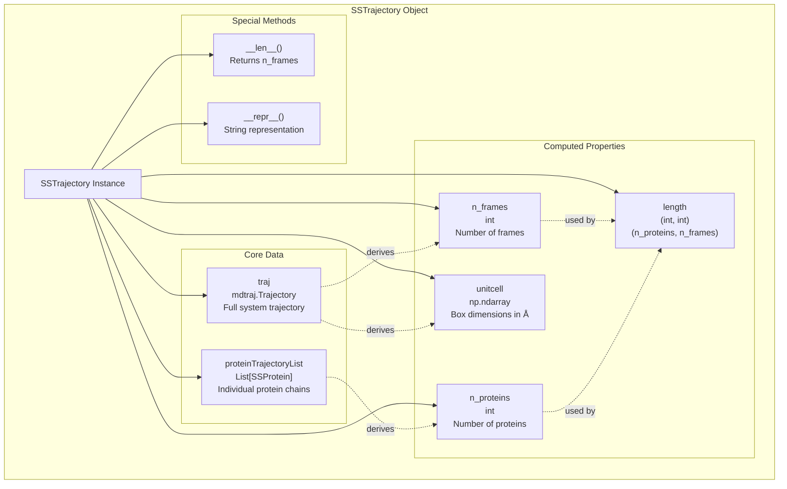
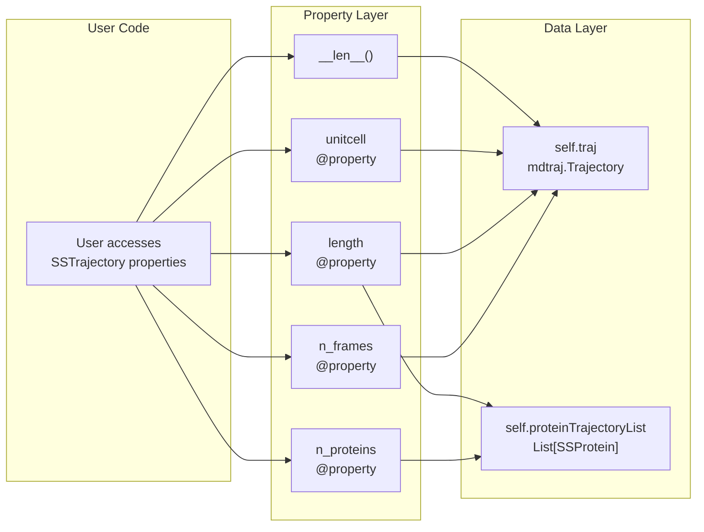
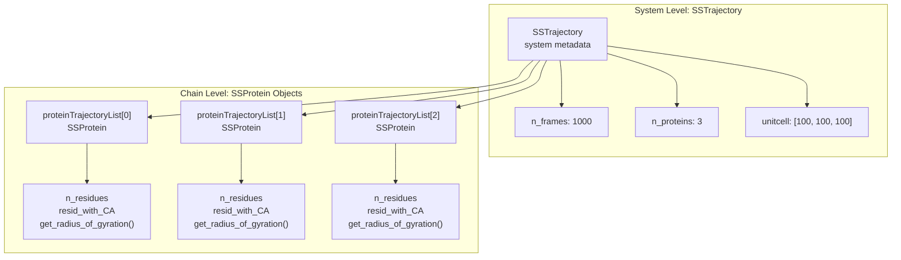

# Properties and Basic Operations

<details>
<summary>Relevant source files</summary>

The following files were used as context for generating this wiki page:

- [docs/modules/sstrajectory.rst](docs/modules/sstrajectory.rst)
- [soursop/sssampling.py](soursop/sssampling.py)
- [soursop/sstrajectory.py](soursop/sstrajectory.py)
- [soursop/tests/test_sssampling.py](soursop/tests/test_sssampling.py)

</details>


This page documents the basic properties and operations available on `SSTrajectory` objects after trajectory loading. These properties provide essential metadata about the loaded trajectory system, including frame counts, protein counts, and unit cell dimensions. For information about loading trajectories initially, see [Loading Trajectories](#3.1). For multi-chain analysis methods that operate on these trajectories, see [Multi-Chain Analysis Methods](#3.3).

## Overview of SSTrajectory Object Structure

After initialization, an `SSTrajectory` object contains two primary class variables and several computed properties that provide information about the loaded system.



**Sources:** [soursop/sstrajectory.py:238-277]()

## Class Variables

### proteinTrajectoryList

`proteinTrajectoryList` is a list of `SSProtein` objects, where each element represents an individual protein chain extracted from the simulation. This is the primary interface for accessing single-chain analysis functions.

```python
# Example access pattern
TrajOb = SSTrajectory('traj.xtc', 'start.pdb')

# Access first protein
protein_0 = TrajOb.proteinTrajectoryList[0]

# Access all proteins
for protein in TrajOb.proteinTrajectoryList:
    rg = protein.get_radius_of_gyration()
```

| Attribute | Type | Description |
|-----------|------|-------------|
| `proteinTrajectoryList` | `List[SSProtein]` | List of protein chain objects extracted during initialization |

The population of this list occurs during `__init__` through either `__get_proteins()` or `__get_proteins_by_residue()` methods, depending on whether manual protein grouping was specified.

**Sources:** [soursop/sstrajectory.py:108-109](), [soursop/sstrajectory.py:228-231]()

### traj

`traj` is the underlying `mdtraj.Trajectory` object containing the full system (all atoms, including non-protein components if present). This enables direct access to any MDTraj functionality.

```python
# Direct mdtraj operations
import mdtraj as md

TrajOb = SSTrajectory('traj.xtc', 'start.pdb')

# Access topology
topology = TrajOb.traj.topology

# Use mdtraj functions directly
sasa = md.shrake_rupley(TrajOb.traj)
```

| Attribute | Type | Description |
|-----------|------|-------------|
| `traj` | `mdtraj.Trajectory` | The complete system trajectory with all atoms and topology information |

**Sources:** [soursop/sstrajectory.py:111-113](), [soursop/sstrajectory.py:215-223]()

## Properties

Properties are dynamically computed attributes that do not require parentheses when accessed. They provide metadata derived from the underlying trajectory data.

### n_frames

Returns the number of frames in the trajectory.

```python
TrajOb = SSTrajectory('traj.xtc', 'start.pdb')
num_frames = TrajOb.n_frames  # No parentheses
```

| Property | Return Type | Description |
|----------|-------------|-------------|
| `n_frames` | `int` | Total number of trajectory frames |

**Implementation:** Returns `len(self.traj)`, directly querying the MDTraj trajectory object.

**Sources:** [soursop/sstrajectory.py:247-253]()

### n_proteins

Returns the number of individual protein chains identified and extracted from the system.

```python
TrajOb = SSTrajectory('traj.xtc', 'start.pdb')
num_proteins = TrajOb.n_proteins  # No parentheses
```

| Property | Return Type | Description |
|----------|-------------|-------------|
| `n_proteins` | `int` | Number of protein chains in `proteinTrajectoryList` |

**Implementation:** Returns `len(self.proteinTrajectoryList)`, counting the extracted protein objects.

**Sources:** [soursop/sstrajectory.py:255-260]()

### length

Returns a tuple containing both the number of proteins and the number of frames. This property encapsulates the two primary dimensions of the trajectory system.

```python
TrajOb = SSTrajectory('traj.xtc', 'start.pdb')
n_proteins, n_frames = TrajOb.length
```

| Property | Return Type | Description |
|----------|-------------|-------------|
| `length` | `Tuple[int, int]` | `(n_proteins, n_frames)` tuple |

**Note:** This differs from the behavior of `__len__()`, which returns only `n_frames` to mimic MDTraj trajectory objects.

**Sources:** [soursop/sstrajectory.py:262-268]()

### unitcell

Returns the unit cell dimensions in Angstroms. The base trajectory stores dimensions in nanometers, so this property converts by multiplying by 10.

```python
TrajOb = SSTrajectory('traj.xtc', 'start.pdb')
box_dimensions = TrajOb.unitcell  # Returns [Lx, Ly, Lz] in Angstroms
```

| Property | Return Type | Description |
|----------|-------------|-------------|
| `unitcell` | `np.ndarray` | Unit cell lengths `[Lx, Ly, Lz]` in Angstroms |

**Implementation:** Returns `self.traj.unitcell_lengths[0] * 10`, extracting the first frame's unit cell and converting from nm to Å.

**Edge Cases:** For trajectories lacking proper unit cell information (common with older CAMPARI simulations or PDB files without CRYST1 records), this may return zero or undefined values. Warnings about this are printed during trajectory loading if `print_warnings=True`.

**Sources:** [soursop/sstrajectory.py:270-277](), [soursop/sstrajectory.py:333-343]()

## Special Methods

### __len__()

The built-in Python `len()` function returns the number of frames, mimicking the behavior of MDTraj trajectory objects.

```python
TrajOb = SSTrajectory('traj.xtc', 'start.pdb')
num_frames = len(TrajOb)  # Same as TrajOb.n_frames
```

| Method | Return Type | Description |
|--------|-------------|-------------|
| `__len__()` | `int` | Returns `n_frames` for compatibility with MDTraj |

**Design Note:** Originally returned `(n_proteins, n_frames)` in early versions, but was changed to return only `n_frames` for consistency with MDTraj trajectory objects. The original behavior is preserved in the `length` property.

**Sources:** [soursop/sstrajectory.py:242-245]()

### __repr__()

Returns a string representation of the `SSTrajectory` object useful for debugging and interactive work.

```python
TrajOb = SSTrajectory('traj.xtc', 'start.pdb')
print(TrajOb)
# Output: SSTrajectory (0x7f8b3c4d5e10): 2 proteins and 1000 frames
```

| Method | Return Type | Description |
|--------|-------------|-------------|
| `__repr__()` | `str` | Human-readable string with memory address, protein count, and frame count |

**Format:** `"SSTrajectory (memory_address): N proteins and M frames"`

**Sources:** [soursop/sstrajectory.py:238-239]()

## Property Usage Patterns

The following diagram illustrates common access patterns for SSTrajectory properties and their relationships to underlying data structures:



**Sources:** [soursop/sstrajectory.py:247-277]()

## Relationship to SSProtein Objects

Each element in `proteinTrajectoryList` is an `SSProtein` object that provides access to 50+ single-protein analysis methods. The `SSTrajectory` properties provide system-level metadata, while `SSProtein` objects provide chain-level analysis.



For detailed information about SSProtein properties and methods, see [Initialization and Properties](#4.1) and subsequent sections in the SSProtein documentation.

**Sources:** [soursop/sstrajectory.py:108-109](), [soursop/sstrajectory.py:228-231]()

## Property Comparison Table

| Property/Method | Return Type | Access Pattern | Description |
|----------------|-------------|----------------|-------------|
| `n_frames` | `int` | `TrajOb.n_frames` | Number of trajectory frames |
| `n_proteins` | `int` | `TrajOb.n_proteins` | Number of extracted protein chains |
| `length` | `Tuple[int, int]` | `TrajOb.length` | `(n_proteins, n_frames)` tuple |
| `unitcell` | `np.ndarray` | `TrajOb.unitcell` | Box dimensions in Angstroms `[Lx, Ly, Lz]` |
| `__len__()` | `int` | `len(TrajOb)` | Returns `n_frames` (MDTraj compatibility) |
| `__repr__()` | `str` | `str(TrajOb)` or `print(TrajOb)` | String representation with metadata |

**Sources:** [soursop/sstrajectory.py:238-277]()

## Unit Conversion Note

SOURSOP follows a consistent unit convention:

- **Internal MDTraj storage:** nanometers
- **SSTrajectory.unitcell property:** Angstroms (multiplied by 10)
- **Distance calculations:** Typically returned in Angstroms

This conversion ensures consistency with common molecular dynamics conventions where distances are reported in Angstroms while maintaining compatibility with MDTraj's internal nanometer representation.

**Sources:** [soursop/sstrajectory.py:271-277]()

---