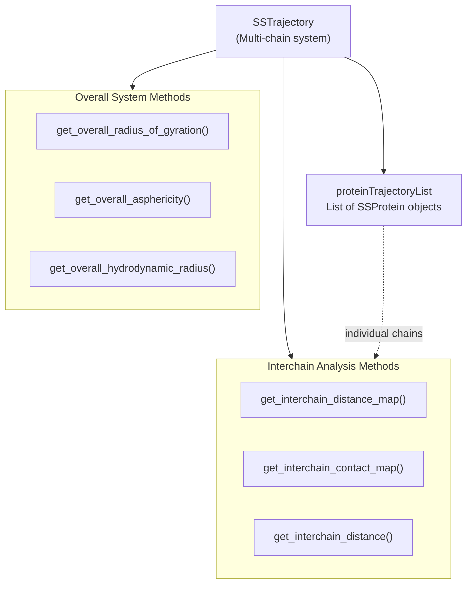
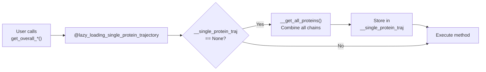
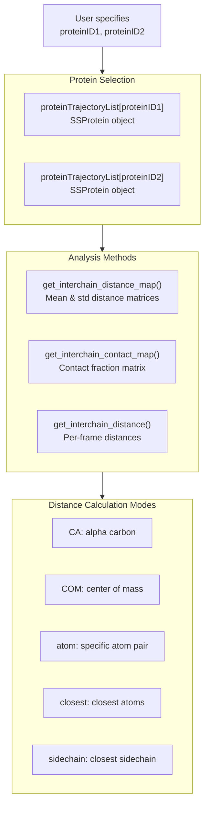
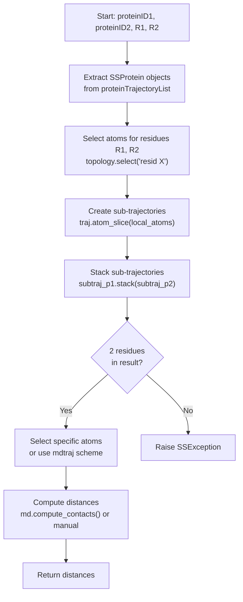
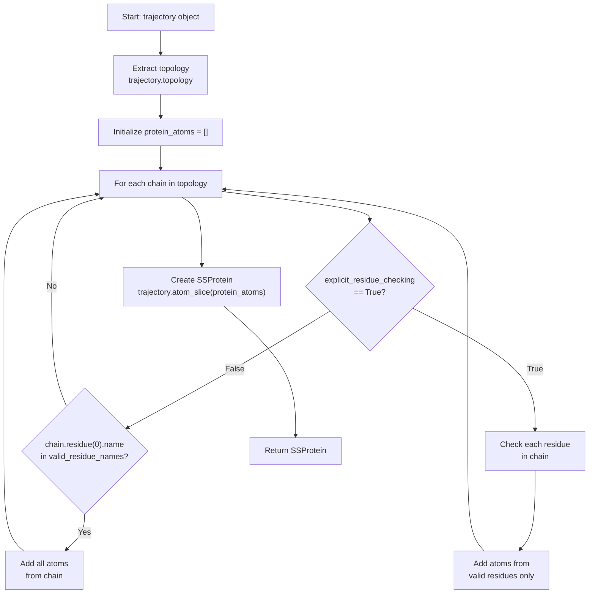
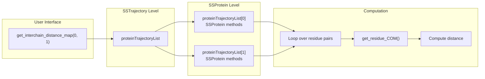

# Multi-Chain Analysis Methods

<details>
<summary>Relevant source files</summary>

The following files were used as context for generating this wiki page:

- [soursop/sssampling.py](soursop/sssampling.py)
- [soursop/sstrajectory.py](soursop/sstrajectory.py)
- [soursop/tests/test_sssampling.py](soursop/tests/test_sssampling.py)

</details>


This page documents the multi-chain analysis capabilities of the `SSTrajectory` class. These methods enable analysis of systems containing multiple protein chains, either by treating all chains as a single system or by analyzing interactions between specific chain pairs.

For analysis of individual protein chains, see [SSProtein: Single Protein Analysis](#4). For loading trajectories with multiple chains, see [Loading Trajectories](#3.1).

## Overview

The `SSTrajectory` class provides two categories of multi-chain analysis:

1. **Overall System Properties**: Methods that combine all protein chains into a single entity for analysis
2. **Interchain Analysis**: Methods that analyze interactions between two specific protein chains



**Diagram: SSTrajectory Multi-Chain Analysis Architecture**

Sources: [soursop/sstrajectory.py:62-277]()

## Overall System Properties

Overall system property methods treat all protein chains in the trajectory as a single combined system. These methods use lazy loading to create a unified protein trajectory only when first needed.

### Lazy Loading Mechanism

The `SSTrajectory` class uses a decorator pattern to lazily load a combined single-protein trajectory:



**Diagram: Lazy Loading Flow for Overall System Methods**

The lazy loading decorator is implemented at [soursop/sstrajectory.py:34-58]() and ensures the combined trajectory is created only once when first needed.

Sources: [soursop/sstrajectory.py:34-58](), [soursop/sstrajectory.py:233-235]()

### Available Overall Methods

| Method | Description | Returns | Warning |
|--------|-------------|---------|---------|
| `get_overall_radius_of_gyration()` | Per-frame radius of gyration for all chains combined | `np.ndarray` of shape `(n_frames,)` | Does not perform PBC correction |
| `get_overall_asphericity()` | Per-frame asphericity for all chains combined | `np.ndarray` of shape `(n_frames,)` | Does not perform PBC correction |
| `get_overall_hydrodynamic_radius()` | Per-frame hydrodynamic radius for all chains combined | `np.ndarray` of shape `(n_frames,)` | - |

#### Example Usage

```python
from soursop.sstrajectory import SSTrajectory

# Load trajectory with multiple protein chains
traj = SSTrajectory('trajectory.xtc', 'topology.pdb')

# Get overall properties (all chains combined)
rg = traj.get_overall_radius_of_gyration()
asphericity = traj.get_overall_asphericity()
rh = traj.get_overall_hydrodynamic_radius()
```

Sources: [soursop/sstrajectory.py:665-742]()

## Interchain Analysis Methods

Interchain analysis methods examine interactions between two specific protein chains, identified by their indices in the `proteinTrajectoryList`. These methods are essential for studying protein-protein interactions, oligomerization, and complex formation.

### Method Architecture



**Diagram: Interchain Analysis Architecture**

Sources: [soursop/sstrajectory.py:748-1146]()

### get_interchain_distance_map()

Computes the mean and standard deviation of distances between all residue pairs from two protein chains.

**Function Signature:**
```python
get_interchain_distance_map(proteinID1, proteinID2, mode='CA', periodic=False)
```

**Parameters:**

| Parameter | Type | Default | Description |
|-----------|------|---------|-------------|
| `proteinID1` | `int` | - | Index of first protein in `proteinTrajectoryList` |
| `proteinID2` | `int` | - | Index of second protein in `proteinTrajectoryList` |
| `mode` | `str` | `'CA'` | Distance calculation mode: `'CA'` or `'COM'` |
| `periodic` | `bool` | `False` | Use minimum image convention for periodic boundaries |

**Returns:**
- Tuple of two `np.ndarray` matrices with shape `(n_residues_p1, n_residues_p2)`
  - `distanceMap`: Mean distances between residue pairs
  - `stdMap`: Standard deviations of distances

**Example:**
```python
# Analyze distance between protein chains 0 and 1
mean_dist, std_dist = traj.get_interchain_distance_map(0, 1, mode='CA')

# Same protein (intrachain distance map)
mean_dist, std_dist = traj.get_interchain_distance_map(0, 0)
```

Sources: [soursop/sstrajectory.py:748-857]()

### get_interchain_contact_map()

Computes contact fractions between residue pairs from two chains. A contact is defined when the inter-residue distance falls below a specified threshold.

**Function Signature:**
```python
get_interchain_contact_map(proteinID1, proteinID2, threshold=5.0, 
                           mode='atom', A1='CA', A2='CA', 
                           periodic=False, verbose=False)
```

**Parameters:**

| Parameter | Type | Default | Description |
|-----------|------|---------|-------------|
| `proteinID1` | `int` | - | Index of first protein |
| `proteinID2` | `int` | - | Index of second protein |
| `threshold` | `float` | `5.0` | Distance cutoff for contact (Angstroms) |
| `mode` | `str` | `'atom'` | Distance calculation mode (see table below) |
| `A1` | `str` | `'CA'` | Atom name for protein 1 (used when `mode='atom'`) |
| `A2` | `str` | `'CA'` | Atom name for protein 2 (used when `mode='atom'`) |
| `periodic` | `bool` | `False` | Use periodic boundary conditions |
| `verbose` | `bool` | `False` | Print progress information |

**Distance Calculation Modes:**

| Mode | Description |
|------|-------------|
| `'atom'` | Distance between specific atoms (defined by `A1` and `A2`) |
| `'ca'` | Distance between CA atoms (equivalent to `mode='atom'` with `A1='CA'`, `A2='CA'`) |
| `'closest'` | Distance between closest atoms of each residue |
| `'closest-heavy'` | Distance between closest heavy atoms (non-hydrogen) |
| `'sidechain'` | Distance between closest sidechain atoms |
| `'sidechain-heavy'` | Distance between closest heavy sidechain atoms |

**Returns:**
- `np.ndarray` with shape `(n_residues_p1, n_residues_p2)` containing contact fractions (values between 0 and 1)

**Example:**
```python
# CA-CA contact map with 5 Angstrom cutoff
contact_map = traj.get_interchain_contact_map(0, 1, threshold=5.0, mode='ca')

# Closest heavy atom contact map with verbose output
contact_map = traj.get_interchain_contact_map(0, 1, threshold=6.0, 
                                               mode='closest-heavy', 
                                               verbose=True)
```

Sources: [soursop/sstrajectory.py:863-981]()

### get_interchain_distance()

Computes per-frame distances between specific residues from two protein chains. This is the low-level method used by `get_interchain_contact_map()`.

**Function Signature:**
```python
get_interchain_distance(proteinID1, proteinID2, R1, R2, 
                        A1='CA', A2='CA', mode='atom', periodic=False)
```

**Parameters:**

| Parameter | Type | Default | Description |
|-----------|------|---------|-------------|
| `proteinID1` | `int` | - | Index of first protein |
| `proteinID2` | `int` | - | Index of second protein |
| `R1` | `int` | - | Residue index in protein 1 |
| `R2` | `int` | - | Residue index in protein 2 |
| `A1` | `str` | `'CA'` | Atom name in residue R1 |
| `A2` | `str` | `'CA'` | Atom name in residue R2 |
| `mode` | `str` | `'atom'` | Distance calculation mode (same options as `get_interchain_contact_map()`) |
| `periodic` | `bool` | `False` | Use periodic boundary conditions |

**Returns:**
- `np.ndarray` with shape `(n_frames,)` containing per-frame distances in Angstroms

**Example:**
```python
# Distance between residue 10 of protein 0 and residue 25 of protein 1
distances = traj.get_interchain_distance(0, 1, 10, 25, A1='CA', A2='CA')

# Distance using closest heavy atoms
distances = traj.get_interchain_distance(0, 1, 10, 25, mode='closest-heavy')
```

Sources: [soursop/sstrajectory.py:988-1146]()

## Implementation Details

### Residue Selection and Atom Slicing

The interchain methods use a multi-step process to compute distances:



**Diagram: Interchain Distance Calculation Process**

Sources: [soursop/sstrajectory.py:1091-1146]()

### Periodic Boundary Conditions

When `periodic=True`, the minimum image convention is applied using the unit cell dimensions from the trajectory. This requires:

1. Valid unit cell dimensions in the trajectory file
2. The `sstools.get_distance_periodic()` utility function

**Distance Calculation with PBC:**
```python
# Without PBC (default)
distances = np.linalg.norm(COM_1 - COM_2, axis=1)

# With PBC (when periodic=True)
distances = sstools.get_distance_periodic(COM_1, COM_2, 
                                          self.unitcell[0], 'cube')
```

Sources: [soursop/sstrajectory.py:844-847](), [soursop/sstrajectory.py:1128-1134]()

### Internal Protein Extraction

The `__get_all_proteins()` method combines all protein chains into a single trajectory:



**Diagram: Combined Protein Extraction Process**

This method is called lazily when overall system methods are first invoked. The `explicit_residue_checking` parameter determines whether all residues are checked (slower but safer for mixed topologies) or only the first residue per chain is checked (faster but assumes homogeneous chains).

Sources: [soursop/sstrajectory.py:370-433]()

## Performance Considerations

| Consideration | Impact | Recommendation |
|---------------|--------|----------------|
| **Lazy Loading** | First call to `get_overall_*()` methods incurs initialization cost | Acceptable for most use cases; overhead is one-time |
| **Contact Map Computation** | Nested loops over all residue pairs can be slow for large systems | Set `verbose=True` to monitor progress; consider parallelization for multiple systems |
| **Distance Mode** | `mode='atom'` is faster than geometry-based modes | Use `mode='atom'` or `mode='ca'` when possible |
| **Periodic Boundaries** | Adds computational overhead | Only enable when necessary for periodic systems |

### Typical Performance

For a system with two proteins of 100 residues each:
- `get_interchain_distance_map()`: ~1-2 seconds
- `get_interchain_contact_map()`: ~10-30 seconds (10,000 residue pair calculations)
- `get_interchain_distance()`: <0.1 seconds per residue pair

Sources: [soursop/sstrajectory.py:863-981]()

## Error Handling

The interchain methods include extensive error checking:

**Common Error Scenarios:**

| Error | Cause | Solution |
|-------|-------|----------|
| `IndexError` in protein selection | Invalid `proteinID` | Check `len(traj.proteinTrajectoryList)` |
| `SSException`: No atoms found | Invalid residue index | Verify residue indices with `SSProtein.resid_with_CA` |
| `SSException`: Multiple residues found | Topology parsing issue | Check input PDB/topology file |
| Invalid atom name | Atom doesn't exist in residue | Use valid atom names like `'CA'`, `'CB'`, `'N'` |

Sources: [soursop/sstrajectory.py:1087-1109]()

## Relationship to SSProtein

The interchain methods bridge between the system-level `SSTrajectory` and chain-level `SSProtein`:



**Diagram: Integration Between SSTrajectory and SSProtein**

The interchain methods extract `SSProtein` objects from `proteinTrajectoryList` and use their methods (like `get_residue_COM()`) to perform calculations.

Sources: [soursop/sstrajectory.py:812-855]()

---