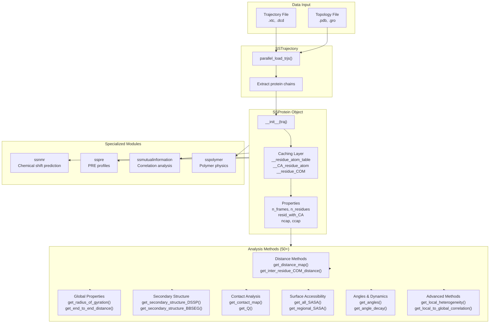
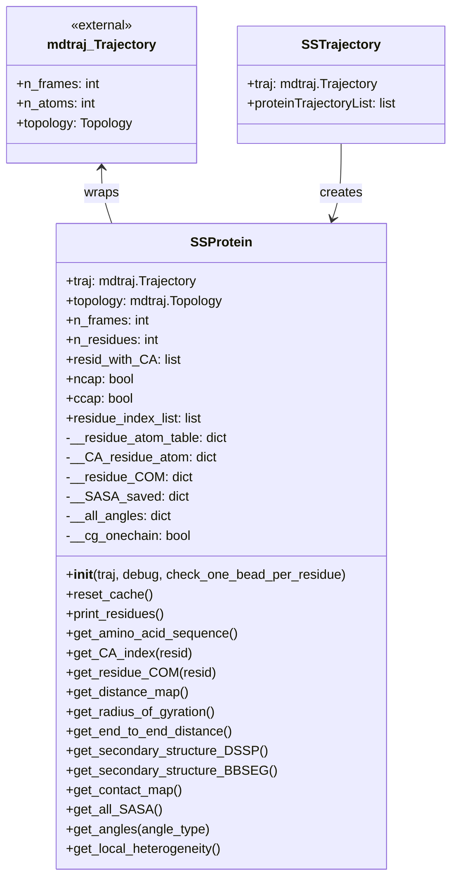
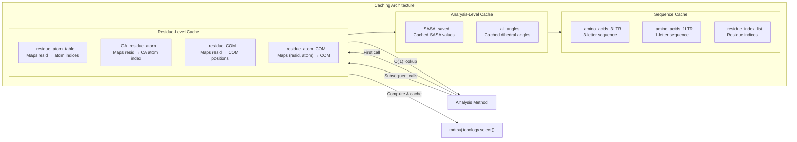
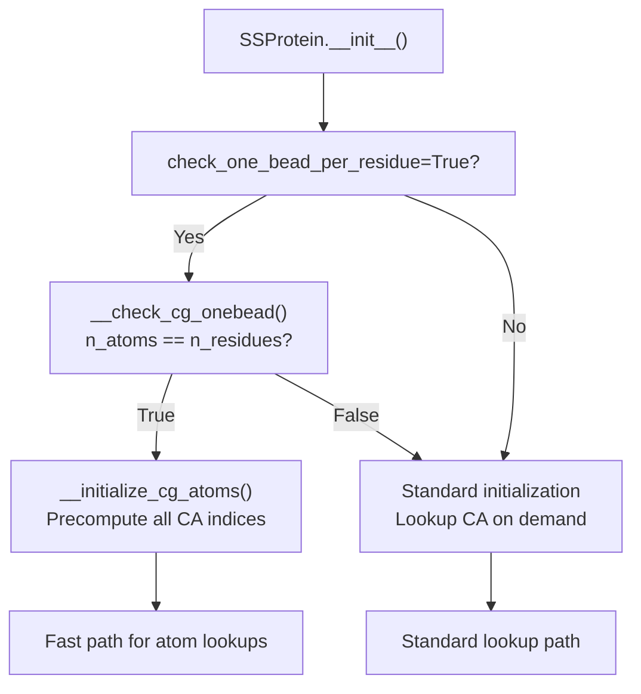
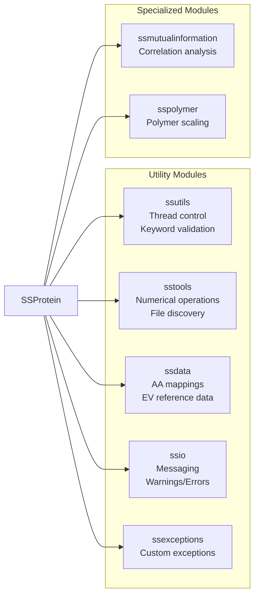

# SSProtein: Single Protein Analysis

<details>
<summary>Relevant source files</summary>

The following files were used as context for generating this wiki page:

- [soursop/data/test_data/gs6_distance_map_mean.npy](soursop/data/test_data/gs6_distance_map_mean.npy)
- [soursop/data/test_data/gs6_distance_map_std.npy](soursop/data/test_data/gs6_distance_map_std.npy)
- [soursop/ssprotein.py](soursop/ssprotein.py)
- [soursop/tests/test_ssproteins.py](soursop/tests/test_ssproteins.py)

</details>


The `SSProtein` class provides comprehensive analysis capabilities for individual protein chains extracted from molecular dynamics trajectories. This page documents the overall architecture, initialization, and core concepts of the `SSProtein` class. For detailed documentation of specific analysis methods, see the subsection pages:

- **[Initialization and Properties](#4.1)** - Object creation, caching, and basic properties
- **[Distance Calculations](#4.2)** - Distance maps and inter-residue distances
- **[Global Structural Properties](#4.3)** - Radius of gyration, end-to-end distance, etc.
- **[Secondary Structure Analysis](#4.4)** - DSSP and BBSEG methods
- **[Contact Maps and Clustering](#4.5)** - Contact analysis and conformational clustering
- **[Surface Accessibility](#4.6)** - SASA calculations
- **[Angles and Dynamics](#4.7)** - Dihedral angles and angle decay
- **[Advanced Analysis Methods](#4.8)** - Local heterogeneity, mutual information, etc.

For trajectory loading and multi-chain analysis, see **[SSTrajectory](#3)**. For sampling quality assessment, see **[SamplingQuality](#5)**.

---

## Overview

`SSProtein` is one of the three core analysis classes in SOURSOP (alongside `SSTrajectory` and `SamplingQuality`). It wraps a single protein chain and provides over 50 analysis methods for computing structural properties, dynamics, and conformational characteristics. Each `SSProtein` object represents a single protein chain with indexed residues starting from 0.

**Key characteristics:**
- Provides 50+ analysis methods for single-chain properties
- Implements aggressive caching/memoization for performance
- Works with both all-atom and coarse-grained (1-bead-per-residue) representations
- Integrates with specialized modules (`ssnmr`, `sspre`, `ssmutualinformation`, `sspolymer`)
- Supports weighted analysis for reweighting ensembles
- Handles peptide caps (ACE/NME) automatically

Sources: [soursop/ssprotein.py:1-100]()

---

## System Context

The following diagram shows how `SSProtein` fits into the SOURSOP analysis pipeline:



Sources: [soursop/ssprotein.py:41-154](), [soursop/sstrajectory.py]()

---

## Core Architecture

### Class Structure

The `SSProtein` class is defined in [soursop/ssprotein.py:41-2698]() and contains approximately 2000+ lines of code implementing the analysis functionality.



Sources: [soursop/ssprotein.py:41-218]()

---

## Initialization and Residue Indexing

### Residue Indexing Convention

**Important:** All residues in an `SSProtein` object are indexed starting from 0, regardless of the original PDB numbering. This is enforced as of version 0.1.3 using MDTraj 1.9.5+.

| Concept | Description |
|---------|-------------|
| **Residue Index (resid)** | Zero-indexed position (0, 1, 2, ..., n-1) used by SOURSOP |
| **Residue Number** | Original numbering from PDB file (may start at any value) |
| **Caps** | ACE/NME terminal caps are included in indexing but may lack CA atoms |

The `print_residues()` method displays the mapping between residue indices and PDB residue identifiers:

```python
protein.print_residues()
# Output:
# 0 --> ACE-1
# 1 --> GLY-2
# 2 --> SER-3
# ...
```

Sources: [soursop/ssprotein.py:59-83](), [soursop/ssprotein.py:830-861]()

---

## Caching and Memoization

`SSProtein` implements aggressive caching to avoid redundant computations. Several internal dictionaries store precomputed values:



### Cache Management

The `reset_cache()` method clears all cached data and forces recomputation. This is rarely needed but available for edge cases:

```python
protein.reset_cache()  # Clear all cached data
```

Sources: [soursop/ssprotein.py:130-203](), [soursop/ssprotein.py:176-218](), [soursop/ssprotein.py:684-749]()

---

## Internal Helper Functions

The class implements several key internal methods for validation and data retrieval:

| Method | Purpose |
|--------|---------|
| `__check_weights(weights, stride, etol)` | Validates frame weights sum to 1.0 within tolerance |
| `__check_stride(stride)` | Ensures stride is valid (>0, ≤n_frames) |
| `__check_single_residue(R1)` | Validates residue index is within bounds |
| `__check_contains_CA(R1)` | Verifies residue has a C-alpha atom |
| `__get_first_and_last(R1, R2, withCA)` | Resolves region boundaries, handling caps |
| `__get_subtrajectory(traj, stride)` | Creates strided trajectory slice |
| `__get_resid_with_CA()` | Identifies all residues containing CA atoms |
| `__residue_atom_lookup(resid, atom_name)` | Memoized atom index lookup |
| `__get_selection_atoms(region, backbone, heavy)` | Atom selection with various filters |

Sources: [soursop/ssprotein.py:350-822]()

---

## Coarse-Grained Support

`SSProtein` automatically detects coarse-grained (1-bead-per-residue) systems by checking if the number of atoms equals the number of residues:



For coarse-grained systems, the `__cg_onechain` flag is set to `True` and all atoms are initialized as both 'CA' and 'all_atoms' for each residue, dramatically speeding up subsequent lookups.

Sources: [soursop/ssprotein.py:531-548](), [soursop/ssprotein.py:665-679](), [soursop/ssprotein.py:720-744]()

---

## Method Categories Overview

The following table summarizes the major categories of analysis methods available in `SSProtein`:

| Category | Key Methods | Count | Purpose |
|----------|-------------|-------|---------|
| **Distance Calculations** | `get_distance_map()`, `get_inter_residue_COM_distance()`, `get_polymer_scaled_distance_map()` | ~8 | Inter-residue distances and distance maps |
| **Global Properties** | `get_radius_of_gyration()`, `get_end_to_end_distance()`, `get_hydrodynamic_radius()`, `get_asphericity()`, `get_t()` | ~10 | Whole-chain structural descriptors |
| **Secondary Structure** | `get_secondary_structure_DSSP()`, `get_secondary_structure_BBSEG()` | 2 | Helix/sheet/coil assignments |
| **Contact Maps** | `get_contact_map()`, `get_Q()`, `get_clusters()` | ~5 | Residue-residue contacts and clustering |
| **Surface Accessibility** | `get_all_SASA()`, `get_regional_SASA()`, `get_site_accessibility()` | ~4 | Solvent-accessible surface area |
| **Angles & Dynamics** | `get_angles()`, `get_angle_decay()`, `get_D_vector()` | ~5 | Dihedral angles and backbone dynamics |
| **Advanced Analysis** | `get_local_heterogeneity()`, `get_local_to_global_correlation()`, `get_local_collapse()` | ~8 | Statistical and correlation analyses |
| **Clustering & RMSD** | `get_RMSD()`, `get_clusters()` | ~3 | Conformational similarity |
| **Molecular Properties** | `get_molecular_volume()`, `get_center_of_mass()` | ~3 | Physical properties |

Detailed documentation for each category is available in the corresponding subsection pages.

Sources: [soursop/ssprotein.py]()

---

## Common Parameters

Many `SSProtein` methods share common parameter conventions:

| Parameter | Type | Default | Description |
|-----------|------|---------|-------------|
| `stride` | int | 1 | Step size for frame iteration (1 = all frames) |
| `weights` | array-like | False | Per-frame weights for ensemble reweighting (must sum to 1.0) |
| `verbose` | bool | True | Whether to print progress/status messages |
| `R1`, `R2` | int or None | None | Residue indices defining a region (None = use full chain) |
| `mode` | str | varies | Analysis mode (e.g., 'CA' vs 'COM' for distance calculations) |
| `region` | tuple/list | None | Two-element [R1, R2] defining a residue range |
| `backbone` | bool | True | Whether to include only backbone atoms |
| `heavy` | bool | False | Whether to exclude hydrogen atoms |

### Weights Parameter

The `weights` parameter enables reweighting of conformational ensembles. Weights must:
- Have length equal to `n_frames` (or `n_frames//stride` if stride is used)
- Sum to 1.0 within a tolerance (default: `etol=1e-7`)
- Be numerical values convertible to `np.float64`

Sources: [soursop/ssprotein.py:350-404](), [soursop/tests/test_ssproteins.py:363-438]()

---

## Working with Properties

`SSProtein` exposes several properties for inspecting the protein:

```python
protein.n_frames          # Number of trajectory frames
protein.n_residues        # Total residues including caps
protein.resid_with_CA     # List of residues with C-alpha atoms
protein.ncap              # True if N-terminal cap (ACE) present
protein.ccap              # True if C-terminal cap (NME) present
protein.residue_index_list # Explicit list [0, 1, 2, ..., n-1]
protein.unitcell          # Unit cell dimensions in Angstroms
```

### Residue Information

```python
# Get amino acid sequence
seq_1letter = protein.get_amino_acid_sequence(oneletter=True)   # String
seq_3letter = protein.get_amino_acid_sequence(oneletter=False)  # List

# Get CA atom indices
ca_index = protein.get_CA_index(resid=5)                    # Single residue
ca_indices = protein.get_multiple_CA_index([3, 4, 5])       # Multiple residues
all_ca_indices = protein.get_multiple_CA_index()            # All residues with CA

# Get residue center of mass (returns 3×n_frames array)
com_positions = protein.get_residue_COM(resid=5)
```

Sources: [soursop/ssprotein.py:226-327](), [soursop/ssprotein.py:957-1007](), [soursop/ssprotein.py:1013-1124]()

---

## Performance Considerations

### Optimization Strategies

1. **Use stride for preliminary analysis**: Set `stride=10` or higher to quickly explore data before computing full results
2. **Leverage caching**: Repeated calls to the same method with same parameters are nearly free
3. **Parallel analysis**: Use `SSTrajectory.proteinTrajectoryList` to analyze multiple chains in parallel
4. **Coarse-grain when possible**: 1-bead-per-residue representations are significantly faster

### Memory Management

Large trajectories can consume significant memory. Consider:
- Processing subsets of frames using `stride`
- Computing properties incrementally rather than storing all instantaneous values
- Using the `return_instantaneous_maps=False` option when only ensemble averages are needed

Sources: [soursop/ssprotein.py:150-154](), [soursop/ssprotein.py:665-679]()

---

## Integration with Utilities

`SSProtein` integrates with several utility modules:



Sources: [soursop/ssprotein.py:13-29]()

---

## Error Handling

`SSProtein` raises `SSException` for validation errors and invalid operations. Common error scenarios:

| Error Type | Trigger | Example |
|------------|---------|---------|
| Invalid residue index | Resid < 0 or ≥ n_residues | `get_CA_index(-1)` |
| Missing CA atom | Requesting CA from ACE/NME cap | `get_CA_index(0)` when ncap=True |
| Invalid stride | stride < 1 or > n_frames | `get_distance_map(stride=1000)` |
| Invalid weights | Length mismatch or sum ≠ 1.0 | `get_distance_map(weights=[0.5])` |
| Invalid mode | Unknown analysis mode | `get_distance_map(mode='invalid')` |
| Invalid region | R2 < R1 or out of bounds | `get_radius_of_gyration(R1=50, R2=10)` |

Sources: [soursop/ssprotein.py:478-578](), [soursop/ssexceptions.py]()

---

## Code Organization

The `SSProtein` class methods are organized as follows in [soursop/ssprotein.py]():

| Line Range | Content |
|------------|---------|
| 59-154 | Initialization and cache setup |
| 176-218 | `reset_cache()` method |
| 226-327 | Properties (n_frames, n_residues, etc.) |
| 350-822 | Internal validation and helper methods |
| 830-1124 | Residue information methods |
| 1129-1246 | Distance calculation methods |
| 1251-1698 | Distance map methods |
| 1703-2022 | Global structural properties |
| 2027-2320 | Secondary structure methods |
| 2325-2698 | Contact map and clustering methods |

Sources: [soursop/ssprotein.py:1-2698]()

---

## Next Steps

For detailed documentation of specific analysis capabilities:

- **[Initialization and Properties](#4.1)** - Object creation and basic properties
- **[Distance Calculations](#4.2)** - Distance maps and scaling analysis
- **[Global Structural Properties](#4.3)** - Rg, Ree, hydrodynamic radius, etc.
- **[Secondary Structure Analysis](#4.4)** - DSSP and BBSEG methods
- **[Contact Maps and Clustering](#4.5)** - Contact analysis and conformational clustering
- **[Surface Accessibility](#4.6)** - SASA calculations
- **[Angles and Dynamics](#4.7)** - Dihedral angles and angle decay
- **[Advanced Analysis Methods](#4.8)** - Local heterogeneity, mutual information, etc.

For working with multiple proteins or trajectory loading, see **[SSTrajectory](#3)**.

Sources: [soursop/ssprotein.py:1-2698](), [soursop/tests/test_ssproteins.py:1-1083]()

---