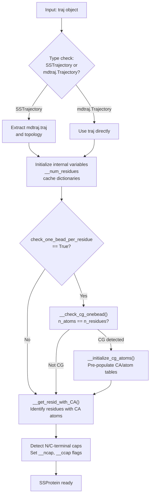
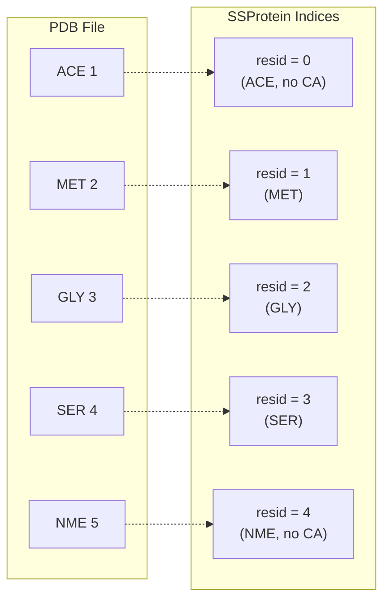
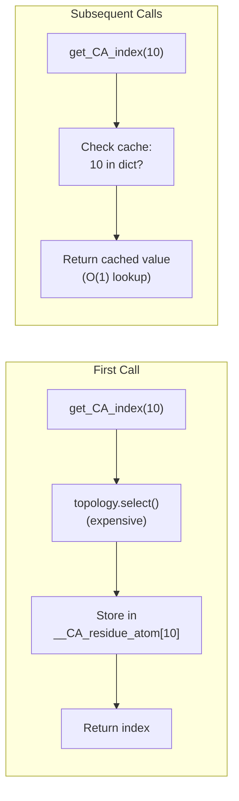
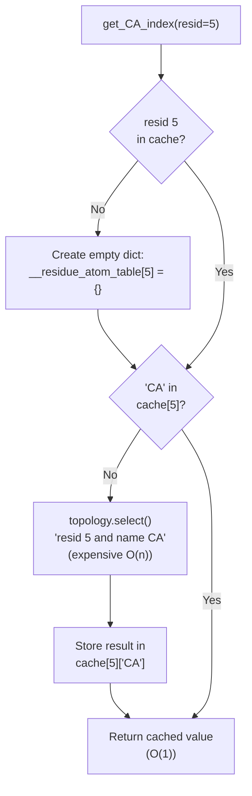
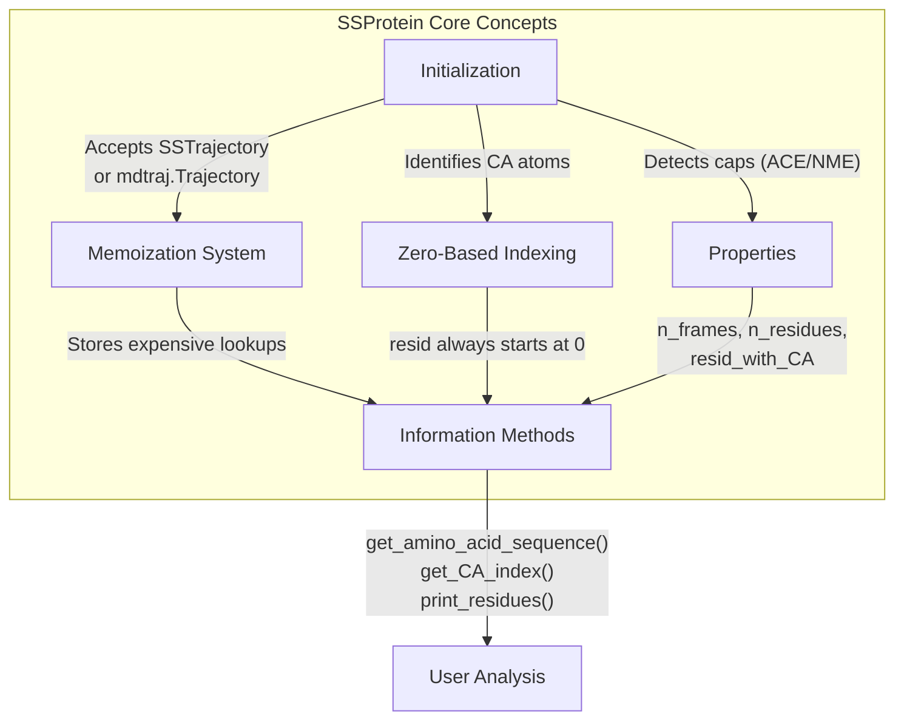

# Initialization and Properties

<details>
<summary>Relevant source files</summary>

The following files were used as context for generating this wiki page:

- [soursop/data/test_data/gs6_distance_map_mean.npy](soursop/data/test_data/gs6_distance_map_mean.npy)
- [soursop/data/test_data/gs6_distance_map_std.npy](soursop/data/test_data/gs6_distance_map_std.npy)
- [soursop/ssprotein.py](soursop/ssprotein.py)
- [soursop/tests/test_ssproteins.py](soursop/tests/test_ssproteins.py)

</details>


This page documents how to create and configure `SSProtein` objects, the fundamental unit for single-protein analysis in SOURSOP. It covers initialization parameters, the caching mechanism, basic properties, and utility methods for accessing residue information.

For analysis methods (distance calculations, radius of gyration, secondary structure, etc.), see sections [4.2](#4.2) through [4.8](#4.8).

---

## Creating an SSProtein Object

### Initialization Syntax

`SSProtein` objects can be initialized from either an `SSTrajectory` or an `mdtraj.Trajectory` object:

```python
from soursop import SSTrajectory, SSProtein

# Method 1: From SSTrajectory (recommended)
traj = SSTrajectory('protein.pdb', 'trajectory.xtc')
protein = traj.proteinTrajectoryList[0]

# Method 2: Direct initialization from SSTrajectory
protein = SSProtein(traj)

# Method 3: Direct initialization from mdtraj.Trajectory
import mdtraj as md
md_traj = md.load('trajectory.xtc', top='protein.pdb')
protein = SSProtein(md_traj)
```

**Sources:** [soursop/ssprotein.py:59-116](), [soursop/tests/test_ssproteins.py:298-311]()

---

### Initialization Parameters

| Parameter | Type | Default | Description |
|-----------|------|---------|-------------|
| `traj` | `SSTrajectory` or `mdtraj.Trajectory` | *required* | Trajectory object containing single protein chain |
| `debug` | `bool` | `False` | Enables debug output during initialization |
| `check_one_bead_per_residue` | `bool` | `True` | Optimizes initialization for coarse-grained (1 bead/residue) systems |

**Debug Mode Example:**
```python
protein = SSProtein(traj, debug=True)
# Prints residue chain information during initialization
```

**Sources:** [soursop/ssprotein.py:59-101](), [soursop/tests/test_ssproteins.py:320-332]()

---

### Initialization Process

**Diagram: SSProtein Initialization Flow**



**Key Steps:**

1. **Type Validation**: Accepts `SSTrajectory` or `mdtraj.Trajectory` objects [soursop/ssprotein.py:107-116]()
2. **Variable Initialization**: Initializes caching dictionaries (lines 138-146)
3. **Coarse-Grained Detection**: Optimizes for 1-bead-per-residue systems [soursop/ssprotein.py:531-547]()
4. **CA Atom Identification**: Builds list of residues containing C-alpha atoms [soursop/ssprotein.py:613-663]()
5. **Cap Detection**: Determines presence of ACE/NME terminal caps [soursop/ssprotein.py:159-168]()

**Sources:** [soursop/ssprotein.py:59-171](), [soursop/ssprotein.py:531-547](), [soursop/ssprotein.py:613-663]()

---

## Residue Indexing Convention

**Critical Concept**: SSProtein uses **zero-based residue indexing** starting from 0, regardless of PDB residue numbering.



**Use `print_residues()` to see the mapping:**

```python
protein.print_residues()
# Output:
# 0 --> ACE-1
# 1 --> MET-2
# 2 --> GLY-3
# 3 --> SER-4
# 4 --> NME-5
```

**Sources:** [soursop/ssprotein.py:43-54](), [soursop/ssprotein.py:830-861](), [soursop/tests/test_ssproteins.py:524-540]()

---

## Caching Mechanism

SSProtein implements extensive **memoization** to avoid recomputing expensive operations. Cached data includes:

| Cache Variable | Stores | Populated By |
|----------------|--------|--------------|
| `__amino_acids_3LTR` | 3-letter sequence | `get_amino_acid_sequence()` |
| `__amino_acids_1LTR` | 1-letter sequence | `get_amino_acid_sequence()` |
| `__residue_index_list` | List of resids | `residue_index_list` property |
| `__CA_residue_atom` | CA atom indices | `get_CA_index()` |
| `__residue_atom_table` | All atom lookups | `__residue_atom_lookup()` |
| `__residue_COM` | Residue centers of mass | `get_residue_COM()` |
| `__residue_atom_COM` | Atom-specific COMs | `get_residue_COM()` |
| `__SASA_saved` | SASA calculations | SASA methods |
| `__all_angles` | Dihedral angles | Angle methods |

**Diagram: Memoization System**



### Manual Cache Reset

```python
# Reset all cached data (rarely needed)
protein.reset_cache()
```

The `reset_cache()` method clears all memoized data and re-identifies residues with CA atoms. Use this if the underlying trajectory has been modified externally.

**Sources:** [soursop/ssprotein.py:134-146](), [soursop/ssprotein.py:176-218](), [soursop/ssprotein.py:684-749]()

---

## Properties

### Basic Trajectory Properties

**`n_frames`**: Number of trajectory frames
```python
num_frames = protein.n_frames  # int
```

**`n_residues`**: Total residue count (including caps)
```python
total_residues = protein.n_residues  # int
```

**`unitcell`**: Unit cell dimensions in Ångströms
```python
box_dimensions = protein.unitcell  # [length_a, length_b, length_c]
```

**Sources:** [soursop/ssprotein.py:271-327]()

---

### Residue Lists and Caps

**`resid_with_CA`**: List of residue indices containing C-alpha atoms
```python
ca_residues = protein.resid_with_CA  # list of int
# Excludes ACE/NME caps and non-standard residues
```

**`residue_index_list`**: Complete list of all residue indices (0 to n_residues-1)
```python
all_resids = protein.residue_index_list  # [0, 1, 2, ..., n-1]
```

**`ncap`**: N-terminal cap presence (ACE)
```python
has_ncap = protein.ncap  # True if ACE present at resid=0
```

**`ccap`**: C-terminal cap presence (NME)
```python
has_ccap = protein.ccap  # True if NME present at resid=n_residues-1
```

**Cap Detection Logic:**
- `ncap = True` if resid 0 lacks a CA atom
- `ccap = True` if resid `n_residues-1` lacks a CA atom

**Sources:** [soursop/ssprotein.py:226-269](), [soursop/ssprotein.py:295-316](), [soursop/tests/test_ssproteins.py:335-344]()

---

### Special Methods

**`__repr__()`**: String representation
```python
print(protein)
# SSProtein (0x7f8a3c4b2d90): 56 res and 100 frames
```

**`__len__()`**: Returns number of frames (mimics mdtraj behavior)
```python
len(protein)  # 100
```

**`length()`**: Returns tuple of (n_residues, n_frames)
```python
protein.length()  # (56, 100)
```

**Sources:** [soursop/ssprotein.py:331-343](), [soursop/tests/test_ssproteins.py:346-360]()

---

## Residue Information Methods

### Sequence Access

**`get_amino_acid_sequence()`**: Retrieve protein sequence

| Parameter | Type | Default | Description |
|-----------|------|---------|-------------|
| `oneletter` | `bool` | `False` | Return 1-letter codes (e.g., "MGSY") vs 3-letter |
| `numbered` | `bool` | `True` | Include PDB residue numbers |

```python
# 3-letter with numbers (default)
seq = protein.get_amino_acid_sequence()
# ['MET-1', 'GLY-2', 'SER-3', ...]

# 1-letter without numbers
seq = protein.get_amino_acid_sequence(oneletter=True, numbered=False)
# 'MGSY...'
```

**Sources:** [soursop/ssprotein.py:957-1007](), [soursop/tests/test_ssproteins.py:524-540]()

---

### Residue-PDB Mapping

**`print_residues()`**: Display index-to-PDB mapping

```python
mapping = protein.print_residues(verbose=True)
# Prints:
# 0 --> ACE-1
# 1 --> MET-2
# 2 --> GLY-3
# ...
# Returns: [[0, 'ACE-1'], [1, 'MET-2'], ...]
```

| Parameter | Type | Default | Description |
|-----------|------|---------|-------------|
| `verbose` | `bool` | `True` | Print to screen (False = silent) |

**Sources:** [soursop/ssprotein.py:830-861](), [soursop/tests/test_ssproteins.py:26-39]()

---

### Atom Index Lookup

**`get_CA_index(resid)`**: Get C-alpha atom index for a residue

```python
ca_atom_idx = protein.get_CA_index(10)  # int
```

**`get_multiple_CA_index(resID_list=None)`**: Get CA indices for multiple residues

```python
# All residues with CA
all_ca = protein.get_multiple_CA_index()

# Specific residues
ca_indices = protein.get_multiple_CA_index([5, 10, 15])  # list of int

# Single residue (returns list)
single_ca = protein.get_multiple_CA_index(10)  # [ca_atom_idx]
```

**`get_all_atomic_indices(resid)`**: Get all atom indices for a residue

```python
all_atoms = protein.get_all_atomic_indices(5)  # np.array([atom1, atom2, ...])
```

**`get_residue_atom_indices(resid, atom_name=None)`**: Get specific atom indices

```python
# All atoms in residue 5
atoms = protein.get_residue_atom_indices(5)

# Specific atom (e.g., CB)
cb_atom = protein.get_residue_atom_indices(5, 'CB')
```

**Sources:** [soursop/ssprotein.py:1013-1124](), [soursop/tests/test_ssproteins.py:543-574]()

---

### Center of Mass Calculation

**`get_residue_COM(resid, atom_name=None)`**: Get residue center of mass trajectory

```python
# COM for entire residue across all frames
com_trajectory = protein.get_residue_COM(10)  # shape: (n_frames, 3)

# COM for specific atom
ca_com = protein.get_residue_COM(10, 'CA')  # shape: (n_frames, 3)
```

Returns positions in **Ångströms** as `(n_frames, 3)` array with x, y, z coordinates.

**Caching**: COM values are computed once and stored in `__residue_COM` or `__residue_atom_COM` dictionaries.

**Sources:** [soursop/ssprotein.py:901-950](), [soursop/tests/test_ssproteins.py:1067-1082]()

---

## Internal Architecture

### Residue Atom Lookup System

The `__residue_atom_lookup()` method implements **O(1) memoized lookups** for atom selection:

**Diagram: Atom Lookup Memoization**



**Key Features:**
- First access: Calls `topology.select()` (expensive)
- Subsequent access: Dictionary lookup (fast)
- Stores both full residue atoms (`'all_atoms'`) and individual atoms by name

**Sources:** [soursop/ssprotein.py:684-749]()

---

### Coarse-Grained System Detection

For 1-bead-per-residue systems, initialization is optimized:

**`__check_cg_onebead()`** detects if `n_atoms == n_residues` (line 531-547)

If detected:
1. `__initialize_cg_atoms()` pre-populates atom tables (line 665-679)
2. Each residue's single atom is assigned as both CA and all_atoms
3. Skips expensive topology selection during initialization

```python
# Internal structure for CG systems:
__residue_atom_table[i]['CA'] = np.array([i])
__residue_atom_table[i]['all_atoms'] = np.array([i])
```

**Sources:** [soursop/ssprotein.py:531-547](), [soursop/ssprotein.py:665-679]()

---

### Selection and Validation Helpers

**Internal validation methods** (not user-facing):

| Method | Purpose |
|--------|---------|
| `__check_stride(stride)` | Validates stride is 1 ≤ stride ≤ n_frames |
| `__check_single_residue(R1)` | Validates 0 ≤ R1 < n_residues |
| `__check_contains_CA(R1)` | Validates residue has CA atom |
| `__check_weights(weights)` | Validates weight array sums to 1.0 |
| `__get_first_and_last(R1, R2)` | Normalizes residue range, handles caps |
| `__get_selection_atoms(region, backbone, heavy)` | Builds atom selection strings |

These methods enforce invariants and provide helpful error messages via `SSException`.

**Sources:** [soursop/ssprotein.py:350-822]()

---

## Summary of Key Concepts



**Key Takeaways:**
1. **Zero-based indexing**: Always starts at 0, use `print_residues()` to map to PDB
2. **Automatic caching**: First call computes, subsequent calls retrieve
3. **Cap handling**: `ncap`/`ccap` flags and `resid_with_CA` exclude non-CA residues
4. **Flexible input**: Accepts SSTrajectory or mdtraj.Trajectory objects
5. **Optimized for CG**: Detects and accelerates 1-bead-per-residue systems

**Sources:** [soursop/ssprotein.py:41-1124](), [soursop/tests/test_ssproteins.py:1-1083]()

---