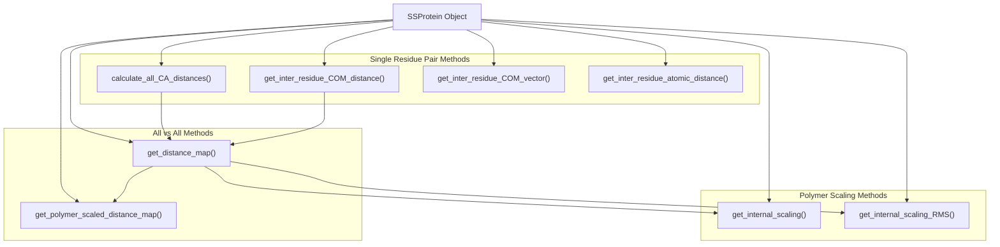
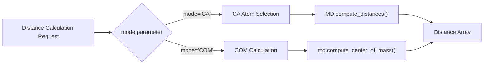
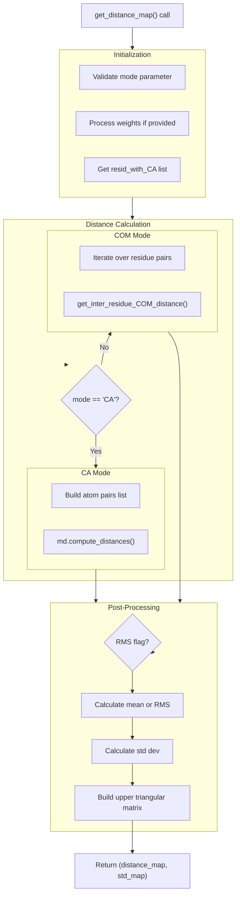
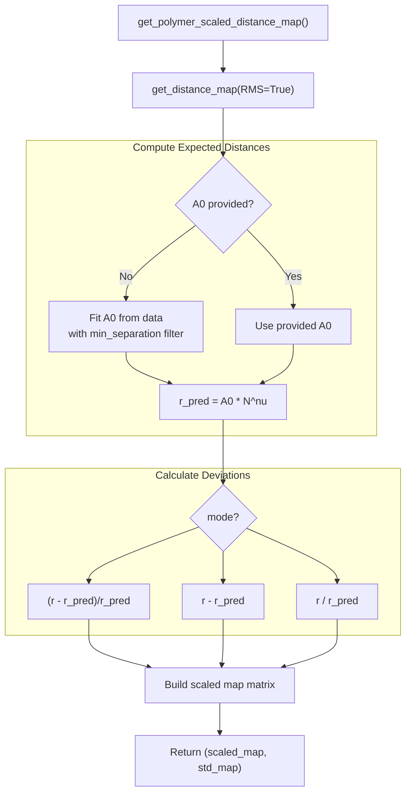
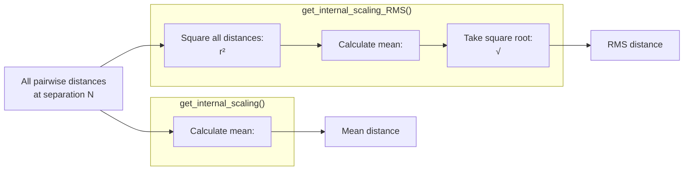
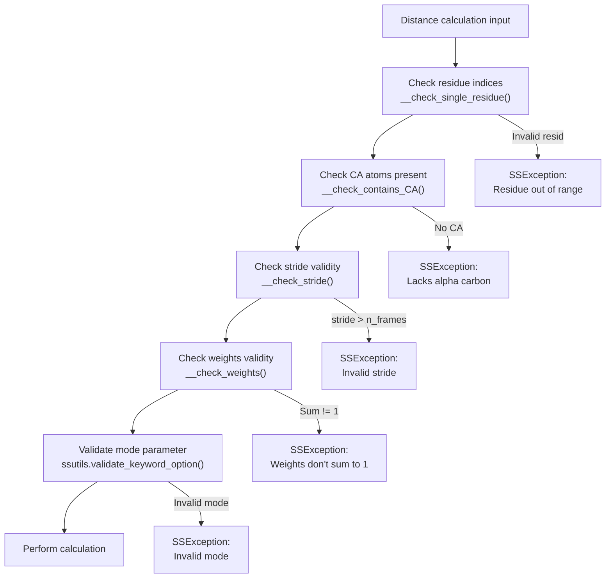

# Distance Calculations

<details>
<summary>Relevant source files</summary>

The following files were used as context for generating this wiki page:

- [soursop/data/test_data/gs6_distance_map_mean.npy](soursop/data/test_data/gs6_distance_map_mean.npy)
- [soursop/data/test_data/gs6_distance_map_std.npy](soursop/data/test_data/gs6_distance_map_std.npy)
- [soursop/ssprotein.py](soursop/ssprotein.py)
- [soursop/tests/test_ssproteins.py](soursop/tests/test_ssproteins.py)

</details>


This page documents the distance calculation methods available in the `SSProtein` class. These methods enable computation of inter-residue distances, distance maps, and polymer scaling profiles essential for analyzing protein conformational ensembles.

For global structural properties like radius of gyration and end-to-end distance, see [Global Structural Properties](#4.3). For contact-based analysis, see [Contact Maps and Clustering](#4.5).

## Overview

SOURSOP provides multiple methods for calculating distances between residues in a protein trajectory. Distance calculations can be performed using either **C-alpha (CA) atoms** or **center of mass (COM)** positions, depending on the desired level of detail and the analysis objectives.



**Sources:** [soursop/ssprotein.py:1129-2023]()

## Distance Calculation Modes

All distance calculation methods support two primary modes that determine which atoms are used for computing distances:

| Mode | Description | Use Case |
|------|-------------|----------|
| `'CA'` | C-alpha atom positions | Faster, standard for coarse-grained analysis |
| `'COM'` | Center of mass of entire residue | More accurate representation of residue position |

### Mode Selection



**Sources:** [soursop/ssprotein.py:1149-1246](), [soursop/ssprotein.py:1251-1410]()

## Single Residue Pair Distances

### `calculate_all_CA_distances()`

Calculates distances from a single residue to all other residues in the protein. By default, only C-terminal residues are included to avoid redundancy when computing full distance maps.

**Method Signature:**
```python
calculate_all_CA_distances(residueIndex, mode='CA', only_C_terminal_residues=True, stride=1)
```

**Parameters:**
- `residueIndex` (int): The reference residue index
- `mode` (str): Either `'CA'` or `'COM'`
- `only_C_terminal_residues` (bool): If True, only computes distances to residues with index > residueIndex
- `stride` (int): Frame stride for subsampling

**Returns:**
- `numpy.array`: Distance array with shape (n_frames, n_distances) in Angstroms
- Returns `-1` if the residue lacks a CA atom

**Sources:** [soursop/ssprotein.py:1129-1246](), [soursop/tests/test_ssproteins.py:577-586]()

### `get_inter_residue_COM_distance()`

Computes the center of mass distance between two specific residues across all frames. This method uses memoization to cache COM positions for efficiency.

**Method Signature:**
```python
get_inter_residue_COM_distance(R1, R2, stride=1)
```

**Parameters:**
- `R1` (int): First residue index
- `R2` (int): Second residue index  
- `stride` (int): Frame stride

**Returns:**
- `numpy.array`: 1D array of distances (in Angstroms) for each frame

**Implementation Details:**
- Uses cached COM positions via `get_residue_COM()` method
- Computes Euclidean distance using numpy: `np.sqrt(np.sum(np.square(vector), axis=1))`
- All distances returned in Angstroms (multiplied by 10 from mdtraj's nanometer units)

**Sources:** [soursop/ssprotein.py:1570-1607](), [soursop/tests/test_ssproteins.py:110-115]()

### `get_inter_residue_COM_vector()`

Returns the 3D vector (x, y, z components) between the centers of mass of two residues.

**Method Signature:**
```python
get_inter_residue_COM_vector(R1, R2, stride=1)
```

**Returns:**
- `numpy.array`: Shape (n_frames, 3) containing [x, y, z] displacement vectors in Angstroms

**Relationship to Distance:**
The distance can be computed from the vector as: `distance = np.sqrt(np.sum(np.square(vector), axis=1))`

**Sources:** [soursop/ssprotein.py:1610-1645](), [soursop/tests/test_ssproteins.py:1048-1064]()

### `get_inter_residue_atomic_distance()`

Computes distances between specific atoms of two residues, providing fine-grained control over which atoms are used.

**Method Signature:**
```python
get_inter_residue_atomic_distance(R1, R2, A1='CA', A2='CA', stride=1)
```

**Parameters:**
- `R1`, `R2` (int): Residue indices
- `A1`, `A2` (str): Atom names (e.g., 'CA', 'CB', 'N', 'C')
- `stride` (int): Frame stride

**Sources:** [soursop/ssprotein.py:1648-1711](), [soursop/tests/test_ssproteins.py:118-120]()

## Distance Maps

### `get_distance_map()`

Computes the full all-vs-all distance matrix between residues, providing both mean distances and standard deviations across the ensemble.



**Method Signature:**
```python
get_distance_map(mode='CA', RMS=False, stride=1, return_instantaneous_maps=False, 
                 weights=False, verbose=True)
```

**Parameters:**
- `mode` (str): `'CA'` or `'COM'`
- `RMS` (bool): If True, returns root mean squared distances (√<r²>) instead of mean (<r>)
- `stride` (int): Frame subsampling
- `return_instantaneous_maps` (bool): If True, returns per-frame distance maps
- `weights` (array-like): Frame-specific weights for ensemble averaging
- `verbose` (bool): Enable progress messages

**Returns:**

When `return_instantaneous_maps=False` (default):
- `distance_map` (numpy.array): Upper triangular matrix of mean/RMS distances
- `std_map` (numpy.array): Standard deviations

When `return_instantaneous_maps=True`:
- `instantaneous_maps` (numpy.array): Shape (n_frames, n_residues, n_residues)
- `std_map` (numpy.array): Standard deviations

**Matrix Properties:**
- Shape: (n_residues_with_CA, n_residues_with_CA)
- Upper triangular format (lower triangle is zero)
- Diagonal is zero (distance from residue to itself)
- All distances in Angstroms

**Sources:** [soursop/ssprotein.py:1251-1410](), [soursop/tests/test_ssproteins.py:202-249]()

### RMS vs Mean Distances

The `RMS` parameter controls whether distances are averaged as arithmetic mean or root-mean-square:

| RMS=False | RMS=True |
|-----------|----------|
| `<r_ij>` = mean distance | `√<r_ij²>` = RMS distance |
| Standard ensemble average | Proper polymer physics order parameter |
| Faster to compute | Recommended for scaling analysis |

For polymer physics applications, `RMS=True` is recommended as it provides the correct order parameter for Flory scaling analysis.

**Sources:** [soursop/ssprotein.py:1270-1277]()

### Weighted Distance Maps

Distance maps can be computed with frame-specific weights to account for reweighting schemes or biased sampling:

```python
# Example: exponentially weighted recent frames
weights = np.exp(-np.arange(n_frames) * 0.1)
weights = weights / np.sum(weights)  # normalize to sum to 1

distance_map, std_map = protein.get_distance_map(weights=weights)
```

**Weight Requirements:**
- Must sum to 1.0 (within tolerance `etol=0.0000001`)
- Length must equal `n_frames`
- Automatically subsampled if stride > 1

**Sources:** [soursop/ssprotein.py:1289-1291](), [soursop/tests/test_ssproteins.py:612-634]()

## Polymer-Scaled Distance Maps

### `get_polymer_scaled_distance_map()`

Compares the observed distance map to predicted polymer scaling behavior (Flory scaling: r ~ N^ν), revealing regions of the protein that deviate from ideal polymer behavior.

**Method Signature:**
```python
get_polymer_scaled_distance_map(nu=0.5, A0=None, min_separation=10, 
                                 mode='fractional-change', stride=1, 
                                 weights=False, verbose=True)
```

**Parameters:**
- `nu` (float): Flory exponent (0.5 for ideal, ~0.588 for excluded volume)
- `A0` (float): Prefactor for scaling law. If None, computed from data
- `min_separation` (int): Minimum sequence separation to consider
- `mode` (str): How to report deviations (see table below)
- `stride` (int): Frame subsampling
- `weights` (array-like): Frame-specific weights

**Scaling Modes:**

| Mode | Formula | Description |
|------|---------|-------------|
| `'fractional-change'` | `(r_obs - r_pred) / r_pred` | Fractional deviation (default) |
| `'signed-fractional-change'` | Sign preserved fractional change | Distinguishes expansion/compaction |
| `'signed-absolute-change'` | `r_obs - r_pred` | Absolute deviation in Angstroms |
| `'scaled'` | `r_obs / r_pred` | Direct ratio |

**Returns:**
- `scaled_map` (numpy.array): Upper triangular matrix of scaled deviations
- `std_map` (numpy.array): Standard deviations

**Physical Interpretation:**
- Positive values: Residue pairs are **more expanded** than polymer prediction
- Negative values: Residue pairs are **more compact** than polymer prediction
- Near zero: Behavior consistent with ideal polymer



**Sources:** [soursop/ssprotein.py:1415-1567](), [soursop/tests/test_ssproteins.py:68-74]()

## Internal Scaling Profiles

### `get_internal_scaling()`

Computes the average distance as a function of sequence separation |i - j|, providing a 1D polymer scaling profile.

**Method Signature:**
```python
get_internal_scaling(R1=None, R2=None, mode='CA', stride=1, weights=False, verbose=True)
```

**Parameters:**
- `R1`, `R2` (int or None): Region boundaries (None = full protein excluding caps)
- `mode` (str): `'CA'` or `'COM'`
- `stride` (int): Frame subsampling
- `weights` (array-like): Frame-specific weights

**Returns:**
- `bin_values` (list): Sequence separation values [1, 2, 3, ..., max_separation]
- `distance_dict` (dict): Keys are separations, values are arrays of all distances at that separation

**Example Usage:**
```python
separations, dist_dict = protein.get_internal_scaling()

# Access distances for pairs separated by 10 residues
distances_sep_10 = dist_dict[10]
mean_distance = np.mean(distances_sep_10)
```

**Sources:** [soursop/ssprotein.py:1714-1868](), [soursop/tests/test_ssproteins.py:137-143]()

### `get_internal_scaling_RMS()`

Identical to `get_internal_scaling()` but computes RMS distances (√<r²>) instead of mean distances (<r>), which is the correct order parameter for polymer scaling analysis.

**Method Signature:**
```python
get_internal_scaling_RMS(R1=None, R2=None, mode='CA', stride=1, weights=False, verbose=True)
```

**When to Use RMS:**
- Fitting Flory scaling exponents (ν)
- Comparing to polymer theory predictions
- Any polymer physics analysis

**When to Use Mean:**
- Simple distance reporting
- Qualitative comparisons



**Sources:** [soursop/ssprotein.py:1871-2023](), [soursop/tests/test_ssproteins.py:145-151]()

## Performance Considerations

### Memoization and Caching

The `SSProtein` class employs extensive memoization to optimize distance calculations:

| Cached Data | Property/Method | Purpose |
|-------------|-----------------|---------|
| CA atom indices | `__CA_residue_atom` | Avoid repeated topology lookups |
| Residue COM positions | `__residue_COM` | Cache per-residue center of mass |
| Residue atom lookups | `__residue_atom_table` | O(1) atom index retrieval |

The first distance calculation for a residue pair will be slower as positions are computed and cached. Subsequent calculations reuse cached data.

**Cache Management:**
```python
# Reset all cached data if needed
protein.reset_cache()
```

**Sources:** [soursop/ssprotein.py:138-146](), [soursop/ssprotein.py:176-218]()

### Computational Complexity

| Method | Complexity | Notes |
|--------|------------|-------|
| `calculate_all_CA_distances()` | O(N) per frame | N = number of residues |
| `get_distance_map()` mode='CA' | O(N²) per frame | Vectorized via mdtraj |
| `get_distance_map()` mode='COM' | O(N²) per frame | Iterative COM distances |
| `get_internal_scaling()` | O(N²) per frame | Plus binning overhead |

**Optimization Strategies:**
1. Use `stride` to subsample frames when full temporal resolution isn't needed
2. Use `mode='CA'` for faster computation (CA mode is vectorized)
3. Specify `R1` and `R2` to limit analysis to regions of interest
4. For repeated analyses, compute once and save results

**Sources:** [soursop/ssprotein.py:1221-1225](), [soursop/ssprotein.py:1338-1359]()

## Error Handling

Distance calculation methods include defensive checks and raise `SSException` for invalid inputs:



**Common Error Cases:**
- **Residue out of range**: Requested residue index >= n_residues
- **Missing CA**: Residue lacks alpha carbon (e.g., ACE/NME caps)
- **Invalid weights**: Weights don't sum to 1.0 within tolerance
- **Invalid mode**: Mode not in ['CA', 'COM']
- **Stride too large**: stride > n_frames

**Sources:** [soursop/ssprotein.py:505-528](), [soursop/ssprotein.py:557-577](), [soursop/ssprotein.py:350-404]()

---