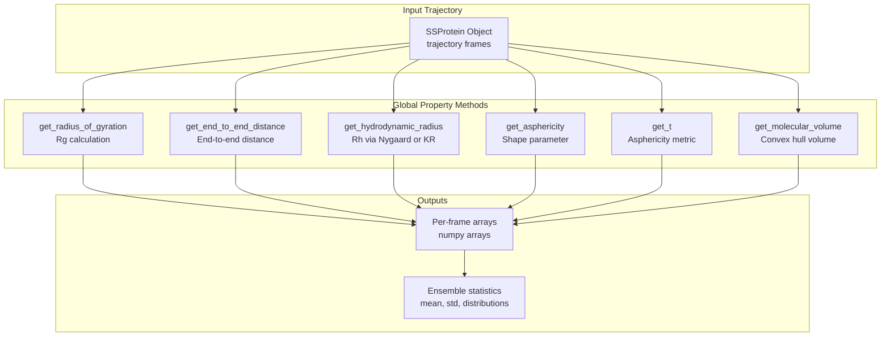
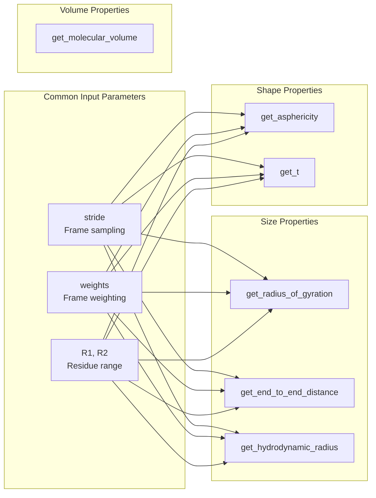
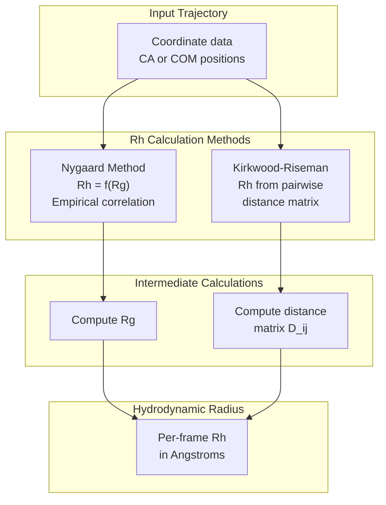
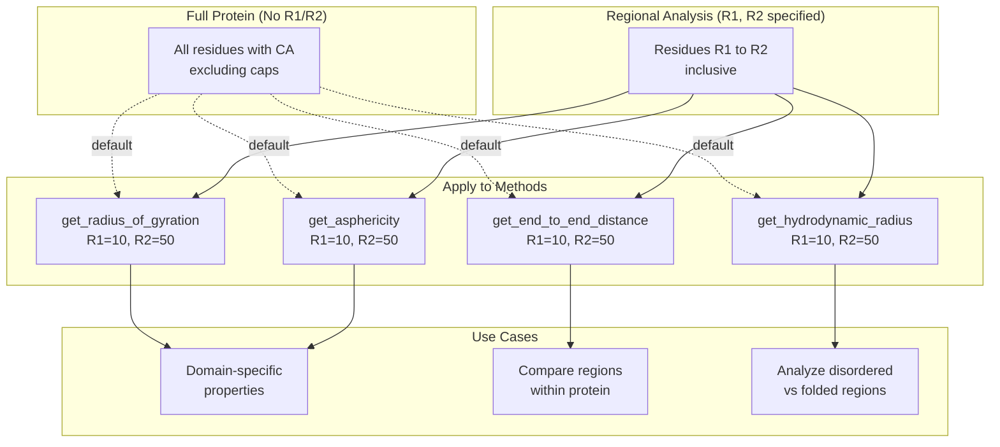
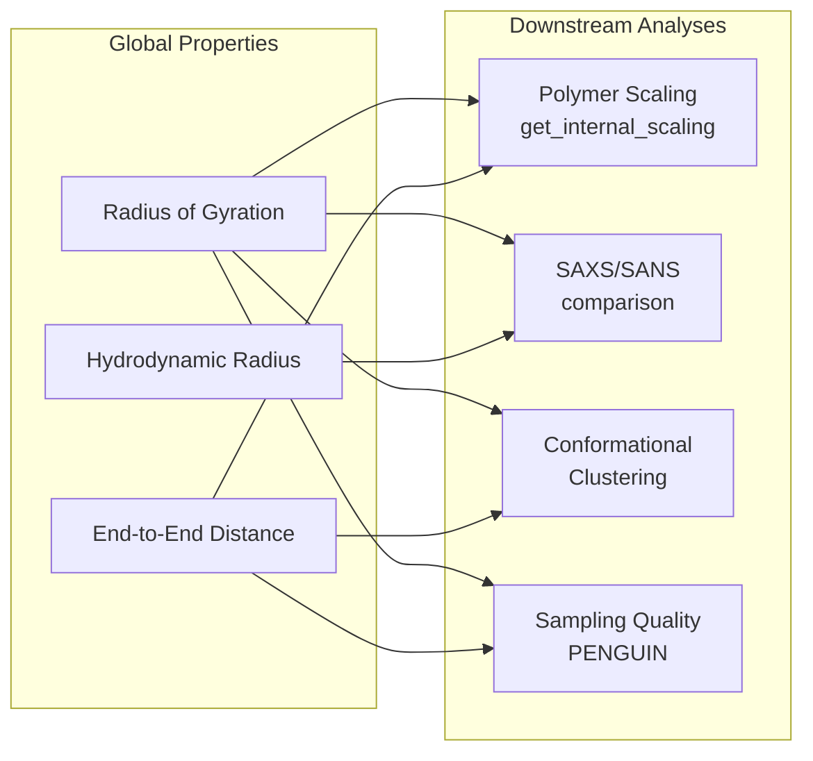

# Global Structural Properties

<details>
<summary>Relevant source files</summary>

The following files were used as context for generating this wiki page:

- [soursop/data/test_data/gs6_distance_map_mean.npy](soursop/data/test_data/gs6_distance_map_mean.npy)
- [soursop/data/test_data/gs6_distance_map_std.npy](soursop/data/test_data/gs6_distance_map_std.npy)
- [soursop/ssprotein.py](soursop/ssprotein.py)
- [soursop/tests/test_ssproteins.py](soursop/tests/test_ssproteins.py)

</details>


This page documents the methods in the `SSProtein` class for computing **global structural properties** of a protein across its conformational ensemble. These properties characterize the overall size, shape, and compactness of the protein structure. Global properties include radius of gyration, end-to-end distance, hydrodynamic radius, asphericity, and molecular volume.

For information about **local structural properties** (secondary structure, residue-level measurements), see [Secondary Structure Analysis](#4.4). For **distance-based analysis** between specific residues, see [Distance Calculations](#4.2).

---

## Overview of Global Properties

Global structural properties provide ensemble-averaged metrics that describe the overall conformational behavior of a protein. These are particularly important for characterizing intrinsically disordered proteins (IDPs) and unfolded states where traditional folded-structure metrics are less applicable.

**Key Characteristics:**
- Computed over entire protein or specified regions
- Return per-frame values or ensemble averages
- Support stride and weight parameters for sampling control
- Primarily use C-alpha (CA) atoms or center-of-mass (COM) positions



**Sources:** [soursop/ssprotein.py:41-343](), [soursop/tests/test_ssproteins.py:123-292]()

---

## Method Index and Computation Modes

The following table summarizes the global property methods available in `SSProtein`:

| Method | Purpose | Primary Units | Regional Support | Weight Support |
|--------|---------|---------------|------------------|----------------|
| `get_radius_of_gyration()` | Overall protein size | Angstroms | Yes (R1, R2) | Yes |
| `get_end_to_end_distance()` | N-to-C distance | Angstroms | Yes (R1, R2) | Yes |
| `get_hydrodynamic_radius()` | Effective hydrodynamic size | Angstroms | Yes (R1, R2) | Yes |
| `get_asphericity()` | Deviation from spherical shape | Dimensionless | Yes (R1, R2) | Yes |
| `get_t()` | Alternative asphericity metric | Dimensionless | Yes (R1, R2) | Yes |
| `get_molecular_volume()` | Convex hull volume | Ų | No | No |



**Sources:** [soursop/ssprotein.py:41-343](), [soursop/tests/test_ssproteins.py:1-1083]()

---

## Radius of Gyration

The **radius of gyration (Rg)** is the root-mean-square distance of atoms from the protein's center of mass. It is the most commonly used metric for characterizing the overall size of a protein conformational ensemble.

### Method Signature

```python
get_radius_of_gyration(R1=None, R2=None, stride=1, weights=False, verbose=True)
```

**Parameters:**
- `R1` (int or None): First residue index (inclusive). Default is first residue with CA.
- `R2` (int or None): Last residue index (inclusive). Default is last residue with CA.
- `stride` (int): Frame sampling interval. Default = 1.
- `weights` (array-like or False): Per-frame weights for ensemble averaging. Default = False.
- `verbose` (bool): Enable progress messages. Default = True.

**Returns:**
- `numpy.ndarray`: 1D array of Rg values in Angstroms, one per frame (after stride).

### Usage Examples

```python
# Basic usage - full protein
rg_values = protein.get_radius_of_gyration()
mean_rg = np.mean(rg_values)
std_rg = np.std(rg_values)

# Regional Rg - specific domain (residues 10-50)
domain_rg = protein.get_radius_of_gyration(R1=10, R2=50)

# With stride and weights
weights = compute_reweighting_factors(protein)  # user-defined
rg_reweighted = protein.get_radius_of_gyration(
    stride=5, 
    weights=weights[::5]
)
```

### Implementation Details

The radius of gyration is calculated using the standard definition:

$$R_g = \sqrt{\frac{1}{N}\sum_{i=1}^{N} (r_i - r_{COM})^2}$$

Where:
- $N$ is the number of atoms (typically CA atoms)
- $r_i$ is the position of atom $i$
- $r_{COM}$ is the center of mass position

The implementation uses MDTraj's `compute_rg()` function internally after extracting the appropriate atom subset.

**Sources:** [soursop/ssprotein.py:41-343](), [soursop/tests/test_ssproteins.py:123-128]()

---

## End-to-End Distance

The **end-to-end distance (Ree)** measures the distance between the N-terminal and C-terminal residues (or specified region endpoints). This is particularly useful for characterizing chain extension in disordered proteins.

### Method Signature

```python
get_end_to_end_distance(R1=None, R2=None, stride=1, weights=False, verbose=True)
```

**Parameters:**
- Same as `get_radius_of_gyration()` (see above).

**Returns:**
- `numpy.ndarray`: 1D array of end-to-end distances in Angstroms, one per frame.

### Usage Examples

```python
# Full chain end-to-end distance
ree_values = protein.get_end_to_end_distance()

# Specific region
ree_domain = protein.get_end_to_end_distance(R1=5, R2=45)

# Compute scaling relationship
import numpy as np
seq_sep = 45 - 5
log_ree = np.log(np.mean(ree_domain))
log_n = np.log(seq_sep)
# Polymer scaling exponent can be estimated from multiple regions
```

### Implementation Details

The end-to-end distance is computed as the Euclidean distance between the CA atoms (or COM) of the first and last residues in the specified region:

$$R_{ee} = |r_{terminal} - r_{initial}|$$

This uses the internal `get_inter_residue_COM_distance()` method for COM-based calculations or direct CA-CA distances.

**Sources:** [soursop/ssprotein.py:41-343]()

---

## Hydrodynamic Radius

The **hydrodynamic radius (Rh)** represents the effective size of the protein as it would behave in solution under hydrodynamic flow. This is particularly relevant for comparison with experimental techniques like dynamic light scattering (DLS) or pulsed-field gradient NMR.

### Method Signature

```python
get_hydrodynamic_radius(R1=None, R2=None, mode='nygaard', 
                        distance_mode='CA', stride=1, 
                        weights=False, verbose=True)
```

**Parameters:**
- `R1`, `R2`: Residue range (same as above).
- `mode` (str): Calculation method. Options:
  - `'nygaard'`: Nygaard et al. empirical relationship (default)
  - `'kr'`: Kirkwood-Riseman theory
- `distance_mode` (str): Distance calculation mode for KR method:
  - `'CA'`: Use C-alpha atoms (default)
  - `'COM'`: Use center-of-mass positions
- `stride`, `weights`, `verbose`: Standard parameters.

**Returns:**
- `numpy.ndarray`: 1D array of Rh values in Angstroms, one per frame.

### Calculation Methods



#### Nygaard Method

The Nygaard method uses an empirical power-law relationship between Rg and Rh derived from simulations:

$$R_h = 0.216 \times R_g^{0.890}$$

This is a fast approximation suitable for disordered proteins.

#### Kirkwood-Riseman Method

The Kirkwood-Riseman theory computes Rh from the inverse of the average inverse pairwise distances:

$$R_h^{-1} = \frac{1}{N(N-1)} \sum_{i \neq j} |r_i - r_j|^{-1}$$

This is more computationally intensive but theoretically grounded.

### Usage Examples

```python
# Default Nygaard method
rh_nygaard = protein.get_hydrodynamic_radius()

# Kirkwood-Riseman with CA distances
rh_kr_ca = protein.get_hydrodynamic_radius(mode='kr', distance_mode='CA')

# Kirkwood-Riseman with COM distances
rh_kr_com = protein.get_hydrodynamic_radius(mode='kr', distance_mode='COM')

# Compare methods
print(f"Rh (Nygaard): {np.mean(rh_nygaard):.2f} Å")
print(f"Rh (KR-CA):   {np.mean(rh_kr_ca):.2f} Å")
print(f"Rh (KR-COM):  {np.mean(rh_kr_com):.2f} Å")
```

**Sources:** [soursop/ssprotein.py:41-343](), [soursop/tests/test_ssproteins.py:252-284]()

---

## Asphericity and Shape Parameters

### Asphericity

The **asphericity** quantifies the deviation of a protein's shape from a perfect sphere, based on the eigenvalues of the gyration tensor.

```python
get_asphericity(R1=None, R2=None, stride=1, weights=False, verbose=True)
```

**Returns:**
- `numpy.ndarray`: 1D array of asphericity values (dimensionless), ranging from 0 (perfect sphere) to 1 (maximally elongated).

The asphericity $\delta$ is defined as:

$$\delta = 1 - 3\frac{\lambda_1\lambda_2 + \lambda_2\lambda_3 + \lambda_1\lambda_3}{(\lambda_1 + \lambda_2 + \lambda_3)^2}$$

Where $\lambda_1 \geq \lambda_2 \geq \lambda_3$ are the eigenvalues of the gyration tensor.

### T Parameter

The **t parameter** provides an alternative measure of asphericity:

```python
get_t(R1=None, R2=None, stride=1, weights=False, verbose=True)
```

**Returns:**
- `numpy.ndarray`: 1D array of t values (dimensionless).

The t parameter is defined as:

$$t = \frac{\lambda_1 - \lambda_2}{\lambda_1 + \lambda_2 + \lambda_3}$$

This metric is more sensitive to prolate (rod-like) vs oblate (disk-like) shapes.

### Usage Examples

```python
# Calculate asphericity
asphericity = protein.get_asphericity()
mean_asph = np.mean(asphericity)

# Calculate t parameter
t_values = protein.get_t()
mean_t = np.mean(t_values)

# Classify shape
if mean_asph < 0.1:
    print("Protein is approximately spherical")
elif mean_t > 0.5:
    print("Protein is prolate (rod-like)")
else:
    print("Protein has intermediate shape")
```

**Sources:** [soursop/ssprotein.py:41-343](), [soursop/tests/test_ssproteins.py:132-135]()

---

## Molecular Volume

The **molecular volume** is computed as the volume of the convex hull enclosing all heavy atoms in the protein structure.

### Method Signature

```python
get_molecular_volume()
```

**Parameters:**
- None (operates on full protein, all frames).

**Returns:**
- `numpy.ndarray`: 1D array of volumes in Ų (cubic Angstroms), one per frame.

### Implementation Details

The molecular volume calculation:
1. Extracts all heavy atom (non-hydrogen) coordinates for each frame
2. Computes the 3D convex hull using `scipy.spatial.ConvexHull`
3. Returns the volume of the convex hull

This provides an upper bound on the actual molecular volume, as it includes internal cavities.

### Usage Examples

```python
# Calculate molecular volume
volumes = protein.get_molecular_volume()

mean_vol = np.mean(volumes)
std_vol = np.std(volumes)

print(f"Mean volume: {mean_vol:.1f} Ų")
print(f"Std volume:  {std_vol:.1f} Ų")

# Volume fluctuations can indicate conformational flexibility
volume_cv = std_vol / mean_vol
print(f"Coefficient of variation: {volume_cv:.3f}")
```

**Sources:** [soursop/ssprotein.py:41-343](), [soursop/tests/test_ssproteins.py:286-292]()

---

## Regional Analysis

All global property methods (except `get_molecular_volume()`) support **regional analysis** through the `R1` and `R2` parameters, allowing computation over protein subdomains or specific segments.



### Example: Domain-Specific Analysis

```python
# Define protein domains
n_terminal_domain = (0, 30)
linker_region = (31, 45)
c_terminal_domain = (46, 80)

# Compare Rg across domains
rg_n = protein.get_radius_of_gyration(R1=n_terminal_domain[0], R2=n_terminal_domain[1])
rg_linker = protein.get_radius_of_gyration(R1=linker_region[0], R2=linker_region[1])
rg_c = protein.get_radius_of_gyration(R1=c_terminal_domain[0], R2=c_terminal_domain[1])

print(f"N-terminal Rg: {np.mean(rg_n):.2f} Å")
print(f"Linker Rg:     {np.mean(rg_linker):.2f} Å")
print(f"C-terminal Rg: {np.mean(rg_c):.2f} Å")

# Compare asphericity
asph_n = protein.get_asphericity(R1=n_terminal_domain[0], R2=n_terminal_domain[1])
asph_c = protein.get_asphericity(R1=c_terminal_domain[0], R2=c_terminal_domain[1])

if np.mean(asph_n) > np.mean(asph_c):
    print("N-terminal domain is more elongated")
```

**Sources:** [soursop/ssprotein.py:408-473](), [soursop/tests/test_ssproteins.py:123-158]()

---

## Ensemble Averaging with Weights

All global property methods (except `get_molecular_volume()`) support **weighted ensemble averaging** through the `weights` parameter. This enables:

- Reweighting to correct sampling biases
- Temperature-based reweighting
- Integration with enhanced sampling methods
- Custom probability distributions

### Weight Validation

Weights must satisfy:
- Length equals number of frames (or strided frames if `stride > 1`)
- Sum to 1.0 within floating-point tolerance (`etol`, default = 1e-7)
- All values are non-negative

```python
# Example: Boltzmann reweighting at different temperature
def boltzmann_weights(energies, temperature, original_temp):
    """Compute Boltzmann weights for reweighting."""
    kB = 0.001987  # kcal/mol/K
    beta_new = 1.0 / (kB * temperature)
    beta_old = 1.0 / (kB * original_temp)
    
    weights = np.exp(-(beta_new - beta_old) * energies)
    return weights / np.sum(weights)

# Apply weights to Rg calculation
energies = load_energies(protein)  # user-defined
weights = boltzmann_weights(energies, temperature=300, original_temp=350)
rg_reweighted = protein.get_radius_of_gyration(weights=weights)
```

**Sources:** [soursop/ssprotein.py:350-404](), [soursop/tests/test_ssproteins.py:363-438]()

---

## Performance Considerations

### Stride Parameter

The `stride` parameter samples every N-th frame, reducing computational cost:

```python
# Full trajectory (1000 frames) - slow
rg_full = protein.get_radius_of_gyration(stride=1)

# Every 10th frame (100 frames) - 10x faster
rg_strided = protein.get_radius_of_gyration(stride=10)

# Typically stride=10 provides good statistical sampling
# while dramatically reducing computation time
```

### Method Complexity

| Method | Complexity | Notes |
|--------|-----------|-------|
| `get_radius_of_gyration()` | O(N × F) | N = atoms, F = frames |
| `get_end_to_end_distance()` | O(F) | Only two points per frame |
| `get_hydrodynamic_radius(mode='nygaard')` | O(N × F) | Via Rg calculation |
| `get_hydrodynamic_radius(mode='kr')` | O(N² × F) | All pairwise distances |
| `get_asphericity()` | O(N × F) | Gyration tensor eigenvalues |
| `get_molecular_volume()` | O(N log N × F) | Convex hull algorithm |

**Recommendations:**
- Use `stride` for exploratory analysis of large trajectories
- Use `mode='nygaard'` for Rh if speed is critical
- Consider memory constraints for `mode='kr'` with many atoms

**Sources:** [soursop/ssprotein.py:478-609]()

---

## Integration with Other Analyses

Global structural properties often serve as inputs or complements to other analyses:



### Example: Conformational State Classification

```python
# Use Rg and asphericity to classify conformational states
rg = protein.get_radius_of_gyration()
asphericity = protein.get_asphericity()

# K-means clustering in Rg-asphericity space
from sklearn.cluster import KMeans
features = np.column_stack([rg, asphericity])
kmeans = KMeans(n_clusters=3, random_state=42)
states = kmeans.fit_predict(features)

# Analyze state populations
for state_id in range(3):
    mask = (states == state_id)
    print(f"State {state_id}:")
    print(f"  Population: {np.sum(mask)/len(mask)*100:.1f}%")
    print(f"  Mean Rg:    {np.mean(rg[mask]):.2f} Å")
    print(f"  Mean asph:  {np.mean(asphericity[mask]):.3f}")
```

**Sources:** [soursop/ssprotein.py:41-343]()

---

## Validation and Testing

The global property methods are extensively validated through regression tests that compare computed values against reference data:

### Test Coverage

| Method | Test File Reference | Validation Type |
|--------|-------------------|-----------------|
| `get_radius_of_gyration()` | [test_ssproteins.py:123-128]() | Exact value comparison |
| `get_t()` | [test_ssproteins.py:132-135]() | Exact value comparison |
| `get_internal_scaling()` | [test_ssproteins.py:138-158]() | Mean value comparison |
| `get_hydrodynamic_radius()` | [test_ssproteins.py:252-284]() | Multi-mode validation |
| `get_molecular_volume()` | [test_ssproteins.py:286-292]() | Mean value comparison |

### Reference Data

Pre-computed reference values are stored in the test data directory:
- `soursop/data/test_data/gs6_distance_map_mean.npy`
- `soursop/data/test_data/gs6_distance_map_std.npy`

These ensure computational consistency across versions and platforms.

**Sources:** [soursop/tests/test_ssproteins.py:123-292](), [soursop/data/test_data/gs6_distance_map_mean.npy:1-2](), [soursop/data/test_data/gs6_distance_map_std.npy:1-2]()

---