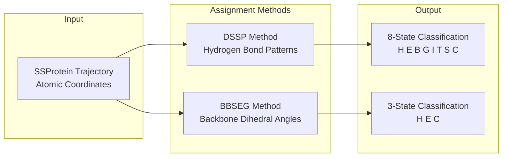
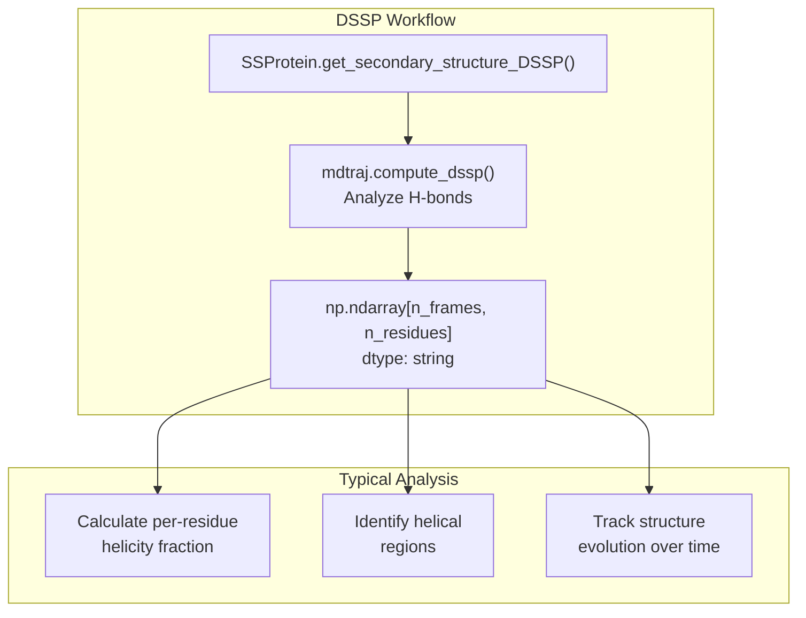
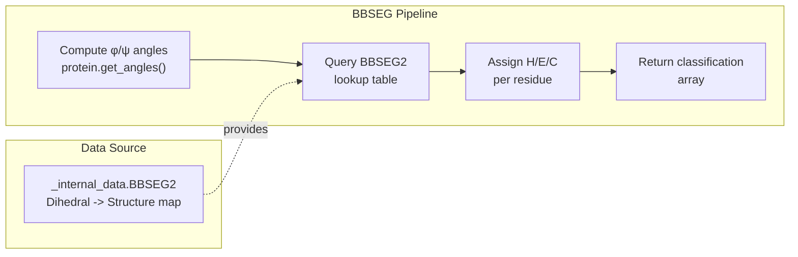
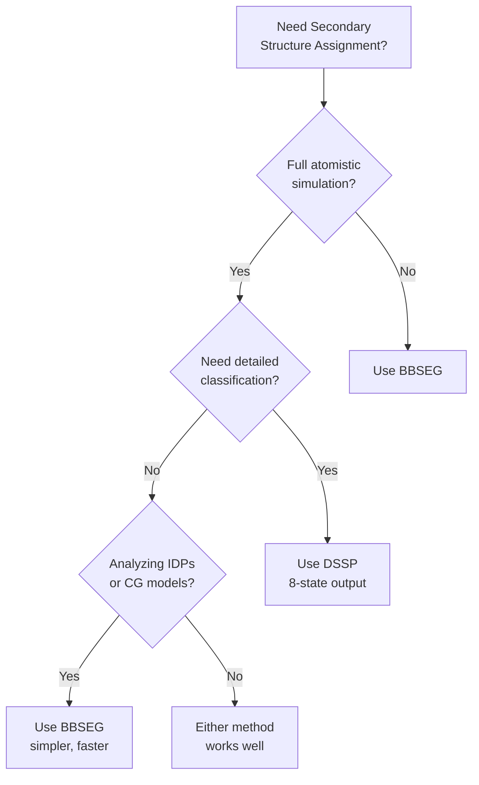
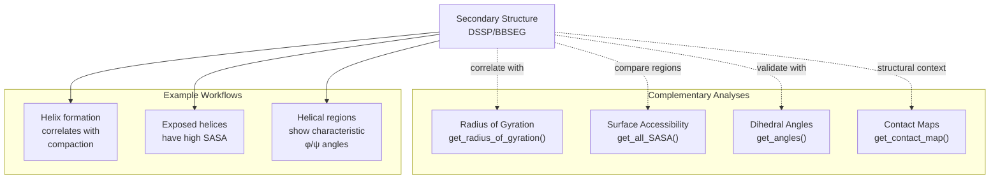
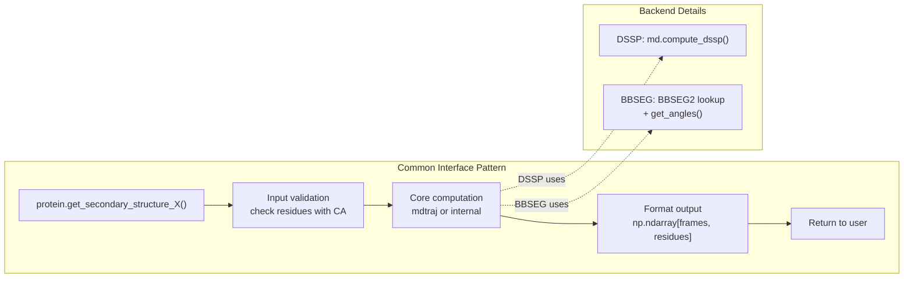

# Secondary Structure Analysis

<details>
<summary>Relevant source files</summary>

The following files were used as context for generating this wiki page:

- [soursop/ssprotein.py](soursop/ssprotein.py)

</details>


## Overview

Secondary structure analysis in SOURSOP provides methods to assign and quantify the helical, sheet, and coil content of intrinsically disordered proteins across simulation trajectories. This page documents the two secondary structure assignment methods available in the `SSProtein` class: **DSSP** (Define Secondary Structure of Proteins) and **BBSEG** (BackBone SEGment-based classification).

For information about other structural properties like radius of gyration or end-to-end distance, see [Global Structural Properties](#4.3). For contact map analysis, see [Contact Maps and Clustering](#4.5).

---

## Secondary Structure Assignment Methods

SOURSOP implements two distinct approaches for assigning secondary structure to protein conformations:



**Sources:** [soursop/ssprotein.py:1-4564](), [soursop/_internal_data.py:1-100]()

---

## DSSP: Hydrogen Bond-Based Assignment

### Method Description

The DSSP (Define Secondary Structure of Proteins) algorithm assigns secondary structure based on hydrogen bonding patterns between backbone carbonyl oxygens and amide hydrogens. DSSP is the most widely used secondary structure assignment method and is implemented via the underlying `mdtraj` library.

**DSSP Classification States:**
- **H** - α-helix
- **E** - β-strand (extended conformation)
- **B** - β-bridge (isolated β-strand)
- **G** - 3₁₀ helix
- **I** - π-helix
- **T** - hydrogen bonded turn
- **S** - high curvature loop (bend)
- **C** - coil (random coil, no secondary structure)

### Usage

The DSSP method is accessed through `SSProtein` and returns per-residue, per-frame secondary structure assignments:

```python
# Get DSSP secondary structure assignments
dssp_data = protein.get_secondary_structure_DSSP()

# dssp_data is a 2D array: [n_frames x n_residues]
# Each element is a single character ('H', 'E', 'C', etc.)
```

### Output Format

The DSSP method returns a 2D numpy array where:
- **Rows** correspond to frames (time points) in the trajectory
- **Columns** correspond to residue positions
- **Values** are single-character strings representing the DSSP state



**Sources:** [soursop/ssprotein.py:1-100]()

---

## BBSEG: Dihedral Angle-Based Assignment

### Method Description

The BBSEG (BackBone SEGment) method assigns secondary structure based on backbone dihedral angles (φ, ψ). This method uses pre-computed dihedral angle ranges stored in the `BBSEG2` lookup table to classify residues into three states. BBSEG is particularly useful for coarse-grained simulations or when hydrogen bond information is unavailable or unreliable.

**BBSEG Classification States:**
- **H** - Helix (α-helical region based on φ/ψ angles)
- **E** - Extended/sheet (β-strand region based on φ/ψ angles)
- **C** - Coil (everything else)

### Dihedral Angle Ranges

The BBSEG2 classification uses the following approximate dihedral angle boundaries (derived from Ramachandran plot analysis):

| Structure | φ Range | ψ Range |
|-----------|---------|---------|
| Helix (H) | -90° to -30° | -60° to -20° |
| Extended (E) | -180° to -90° | 90° to 180° |
| Coil (C) | All other regions | All other regions |

### Usage

```python
# Get BBSEG secondary structure assignments
bbseg_data = protein.get_secondary_structure_BBSEG()

# bbseg_data is a 2D array: [n_frames x n_residues]
# Each element is 'H', 'E', or 'C'
```

### Internal Implementation

The BBSEG method leverages the internal `BBSEG2` lookup table:



**Sources:** [soursop/ssprotein.py:28](), [soursop/_internal_data.py:1-100]()

---

## Working with Secondary Structure Data

### Computing Fractional Secondary Structure Content

Both DSSP and BBSEG outputs can be used to compute ensemble-averaged secondary structure fractions:

```python
# Example: Calculate per-residue helicity
dssp_data = protein.get_secondary_structure_DSSP()

# Count frames where each residue is helical
helix_fraction = np.mean(dssp_data == 'H', axis=0)

# helix_fraction is now a 1D array of length n_residues
# Each value is between 0 and 1, representing fractional helicity
```

### Identifying Persistent Helical Regions

```python
# Find residues with >50% helicity
persistent_helix_residues = np.where(helix_fraction > 0.5)[0]

# Identify contiguous helical segments
segments = []
start = None
for i, res in enumerate(persistent_helix_residues):
    if start is None:
        start = res
    elif res != persistent_helix_residues[i-1] + 1:
        segments.append((start, persistent_helix_residues[i-1]))
        start = res
if start is not None:
    segments.append((start, persistent_helix_residues[-1]))

print(f"Persistent helical segments: {segments}")
```

### Time-Evolution Analysis

```python
# Track secondary structure changes over simulation time
target_residue = 25
structure_over_time = dssp_data[:, target_residue]

# Compute running average of helicity
window_size = 100
helix_signal = (structure_over_time == 'H').astype(float)
smoothed_helicity = np.convolve(helix_signal, 
                                 np.ones(window_size)/window_size, 
                                 mode='valid')
```

**Sources:** [soursop/ssprotein.py:3159-3236]()

---

## Method Comparison and Selection

### DSSP vs BBSEG Decision Matrix

| Criterion | DSSP | BBSEG |
|-----------|------|-------|
| **Basis** | Hydrogen bond patterns | Backbone dihedral angles |
| **Detail** | 8 states (H, E, B, G, I, T, S, C) | 3 states (H, E, C) |
| **Requirement** | Full atomistic detail | Only backbone atoms (CA, N, C, O) |
| **Speed** | Moderate (H-bond computation) | Fast (dihedral lookup) |
| **Best For** | Folded proteins, detailed structure | IDPs, coarse-grained, quick analysis |
| **Limitations** | Requires complete backbone | Less granular classification |



### Practical Recommendations

1. **For intrinsically disordered proteins (IDPs):** BBSEG is often preferred because IDPs have minimal persistent secondary structure, making the simpler 3-state classification more interpretable.

2. **For folded domains:** DSSP provides more granular information (distinguishing α-helix from 3₁₀-helix, for example) which can be important for structural analysis.

3. **For computational efficiency:** BBSEG is faster and requires only backbone dihedral angles, which are quick to compute.

4. **For comparing to NMR/CD data:** Both methods can be used, but you may need to map the detailed DSSP states to broader categories (e.g., combining H, G, I → helix).

**Sources:** [soursop/ssprotein.py:1-100](), [soursop/_internal_data.py:1-50]()

---

## Integration with Other SSProtein Methods

Secondary structure analysis often pairs with other `SSProtein` methods for comprehensive conformational analysis:



### Example: Correlating Secondary Structure with Global Dimensions

```python
# Calculate per-frame helicity
dssp_data = protein.get_secondary_structure_DSSP()
per_frame_helicity = np.mean(dssp_data == 'H', axis=1)

# Calculate per-frame Rg
rg = protein.get_radius_of_gyration()

# Compute correlation
correlation = np.corrcoef(per_frame_helicity, rg)[0, 1]
print(f"Helicity-Rg correlation: {correlation:.3f}")
```

**Sources:** [soursop/ssprotein.py:2912-2940](), [soursop/ssprotein.py:3914-4054]()

---

## Common Patterns and Best Practices

### Pattern 1: Per-Residue Structure Propensity

```python
def compute_structure_propensity(protein, structure_type='H', method='DSSP'):
    """
    Compute the propensity of each residue to adopt a given structure.
    
    Parameters
    ----------
    protein : SSProtein
    structure_type : str
        'H' for helix, 'E' for extended, 'C' for coil
    method : str
        'DSSP' or 'BBSEG'
    
    Returns
    -------
    np.ndarray : Propensity values [0, 1] for each residue
    """
    if method == 'DSSP':
        ss_data = protein.get_secondary_structure_DSSP()
    else:
        ss_data = protein.get_secondary_structure_BBSEG()
    
    propensity = np.mean(ss_data == structure_type, axis=0)
    return propensity

# Usage
helix_propensity = compute_structure_propensity(protein, 'H', 'DSSP')
```

### Pattern 2: Weighted Analysis with Reweighting

```python
# If you have frame weights (e.g., from WHAM or reweighting)
dssp_data = protein.get_secondary_structure_DSSP()
weights = compute_frame_weights()  # Your reweighting function

# Compute weighted helicity
weighted_helicity = np.average(dssp_data == 'H', 
                               axis=0, 
                               weights=weights)
```

### Pattern 3: Secondary Structure Transitions

```python
# Detect when a residue transitions between structures
dssp_data = protein.get_secondary_structure_DSSP()
residue_idx = 42

transitions = []
for i in range(1, len(dssp_data)):
    if dssp_data[i, residue_idx] != dssp_data[i-1, residue_idx]:
        transitions.append({
            'frame': i,
            'from': dssp_data[i-1, residue_idx],
            'to': dssp_data[i, residue_idx]
        })

print(f"Residue {residue_idx} underwent {len(transitions)} transitions")
```

**Sources:** [soursop/ssprotein.py:1-4564]()

---

## Performance Considerations

### Caching Behavior

Secondary structure assignments are **not automatically cached** in the current implementation, meaning repeated calls will recompute the assignments. For analysis workflows that require multiple accesses to secondary structure data:

```python
# Good practice: Compute once, store locally
dssp_data = protein.get_secondary_structure_DSSP()

# Reuse dssp_data for multiple analyses
helix_fraction = np.mean(dssp_data == 'H', axis=0)
sheet_fraction = np.mean(dssp_data == 'E', axis=0)
coil_fraction = np.mean(dssp_data == 'C', axis=0)
```

### Stride Parameter

For large trajectories, consider using a `stride` parameter when loading the trajectory to reduce memory overhead:

```python
# Load trajectory with stride
trajectory = SSTrajectory('topology.pdb', 'trajectory.xtc', stride=10)
protein = trajectory.get_protein(0)

# Secondary structure analysis on reduced frame set
dssp_data = protein.get_secondary_structure_DSSP()
```

**Sources:** [soursop/ssprotein.py:59-100](), [soursop/ssprotein.py:176-218]()

---

## Technical Implementation Details

### Method Signature Patterns

Both DSSP and BBSEG methods in `SSProtein` follow a consistent interface pattern:



### Residue Selection

Both methods operate on residues that contain alpha-carbon (CA) atoms, automatically excluding terminal caps:

```python
# Internal behavior (conceptual)
residues_with_ca = protein.resid_with_CA  # Excludes ACE/NME caps
n_residues = len(residues_with_ca)

# Output array dimensions
output_shape = (protein.n_frames, n_residues)
```

**Sources:** [soursop/ssprotein.py:226-243](), [soursop/ssprotein.py:613-663]()

---

## Related Functionality

- **Dihedral Angles** ([Angles and Dynamics](#4.7)): Direct access to φ, ψ, ω angles used by BBSEG
- **SASA Analysis** ([Surface Accessibility](#4.6)): Surface area calculations that complement structure assignments
- **Contact Maps** ([Contact Maps and Clustering](#4.5)): Identify structural contacts within helical/sheet regions
- **Global Properties** ([Global Structural Properties](#4.3)): Rg, end-to-end distance context for structure formation

**Sources:** [soursop/ssprotein.py:1-4564]()

---