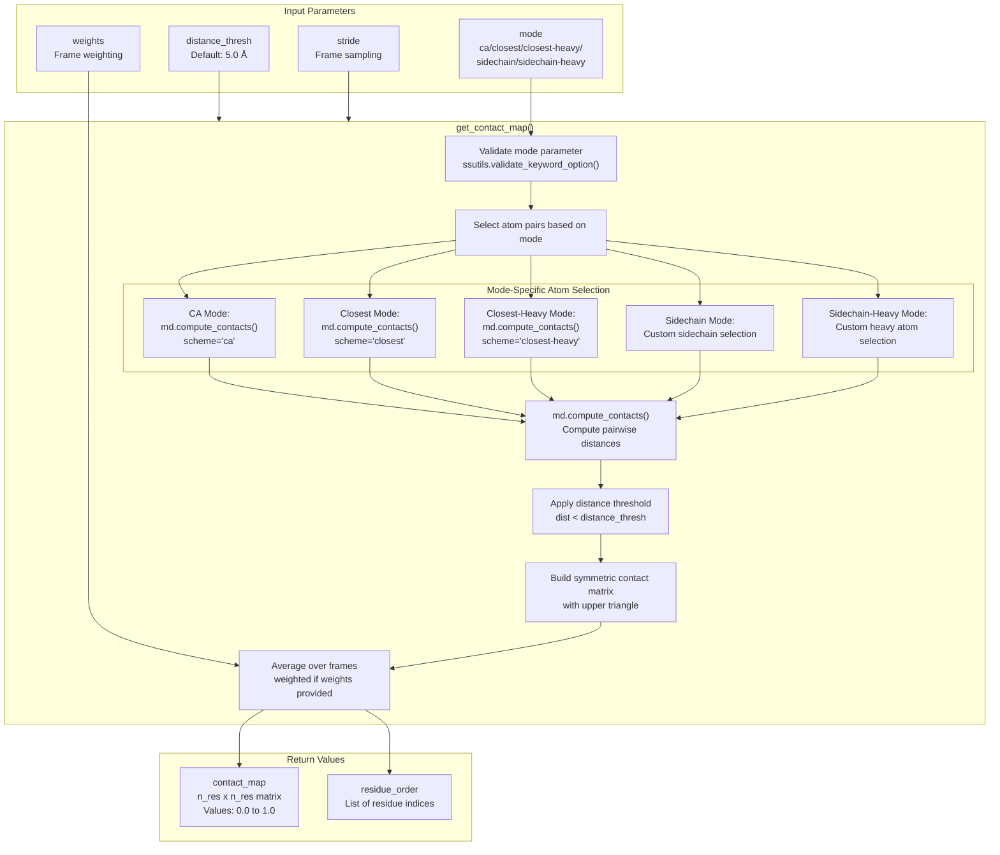
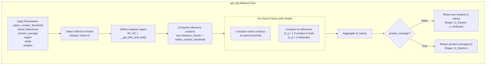
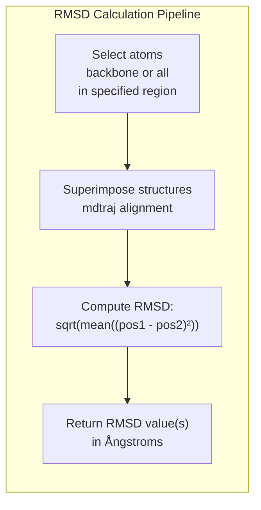
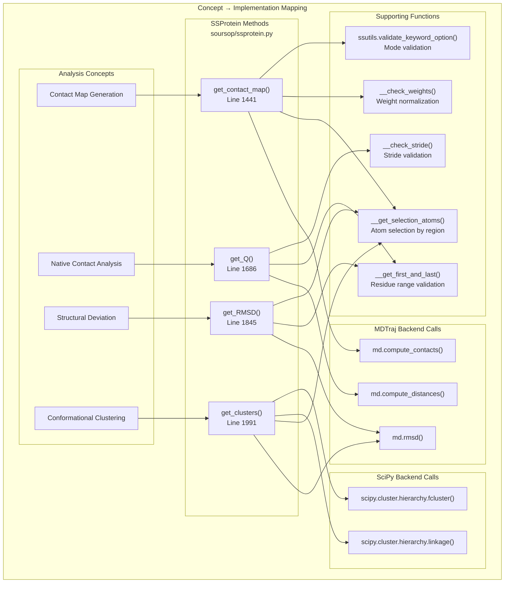

# Contact Maps and Clustering

<details>
<summary>Relevant source files</summary>

The following files were used as context for generating this wiki page:

- [soursop/data/test_data/gs6_distance_map_mean.npy](soursop/data/test_data/gs6_distance_map_mean.npy)
- [soursop/data/test_data/gs6_distance_map_std.npy](soursop/data/test_data/gs6_distance_map_std.npy)
- [soursop/ssprotein.py](soursop/ssprotein.py)
- [soursop/tests/test_ssproteins.py](soursop/tests/test_ssproteins.py)

</details>


## Purpose and Scope

This page documents the `SSProtein` methods for analyzing conformational relationships between protein structures through contact maps, structural similarity metrics (RMSD, Q-values), and clustering algorithms. These methods enable quantitative comparison of protein conformations and identification of distinct structural states within an ensemble.

For general distance calculations between residues, see [Distance Calculations](#4.2). For ensemble-averaged global structural properties, see [Global Structural Properties](#4.3).

**Sources:** [soursop/ssprotein.py:1-100]()

---

## Overview of Contact and Structural Analysis Methods

The following table summarizes the four primary methods for conformational analysis:

| Method | Primary Purpose | Key Output | Typical Use Case |
|--------|----------------|------------|------------------|
| `get_contact_map()` | Identify residue-residue contacts | Contact probability matrix | Determining residue interaction patterns |
| `get_Q()` | Measure native contact formation | Fraction of native contacts (0-1) | Assessing folding progress |
| `get_RMSD()` | Quantify structural deviation | Distance in Ångstroms | Comparing conformational similarity |
| `get_clusters()` | Group similar conformations | Cluster assignments | Identifying distinct structural states |

**Sources:** [soursop/ssprotein.py:1441-1900](), [soursop/tests/test_ssproteins.py:88-108]()

---

## Contact Map Architecture



**Sources:** [soursop/ssprotein.py:1441-1685](), [soursop/tests/test_ssproteins.py:94-104]()

---

## Contact Map Generation

The `get_contact_map()` method calculates the probability that two residues are within a specified distance threshold across the trajectory ensemble. The result is a symmetric matrix where each element represents the fraction of frames in which residues i and j are in contact.

### Method Signature

```python
get_contact_map(self, distance_thresh=None, mode='ca', stride=1, weights=False, verbose=True)
```

### Parameters

| Parameter | Type | Default | Description |
|-----------|------|---------|-------------|
| `distance_thresh` | float or None | None | Distance cutoff in Ångstroms. If None, defaults to 5.0 Å for 'ca' mode, 4.5 Å for others |
| `mode` | str | 'ca' | Contact definition mode (see below) |
| `stride` | int | 1 | Frame sampling interval |
| `weights` | array-like or False | False | Per-frame weights (must sum to 1.0) |
| `verbose` | bool | True | Enable progress output |

### Contact Definition Modes

The `mode` parameter determines how inter-residue contacts are defined:

| Mode | Atom Selection | Description | Use Case |
|------|----------------|-------------|----------|
| `'ca'` | C-alpha atoms | Fastest, backbone-only | General structural analysis, coarse-grained |
| `'closest'` | Any atom pair | All-atom closest approach | Detailed interaction mapping |
| `'closest-heavy'` | Heavy atoms only | Excludes hydrogen | Experimentally relevant contacts |
| `'sidechain'` | Sidechain atoms | Sidechain-sidechain only | Functional interaction analysis |
| `'sidechain-heavy'` | Heavy sidechain atoms | Sidechain without hydrogen | High-resolution sidechain contacts |

**Note:** For `'sidechain'` and `'sidechain-heavy'` modes, glycine residues (which lack sidechains) will have no contacts computed. The `'sidechain-heavy'` mode may raise exceptions for GLY residues in some MDTraj versions.

### Return Values

Returns a 2-tuple:

1. **`contact_map`** (numpy.ndarray): An N×N symmetric matrix where N is the number of residues with CA atoms. Values range from 0.0 (never in contact) to 1.0 (always in contact). The matrix is upper-triangular with zeros in the lower triangle.

2. **`residue_order`** (numpy.ndarray): 1D array of length N containing the residue indices (resids) corresponding to the rows/columns of the contact map.

### Example Usage Patterns

```python
# Basic contact map with default CA mode
contact_map, residue_indices = protein.get_contact_map()

# High-resolution sidechain contact map
contact_map, residues = protein.get_contact_map(
    distance_thresh=4.0,
    mode='sidechain',
    stride=5
)

# Weighted contact map (e.g., from reweighting analysis)
weights = compute_frame_weights(trajectory)  # User-defined weights
contact_map, residues = protein.get_contact_map(
    weights=weights,
    verbose=False
)
```

**Sources:** [soursop/ssprotein.py:1441-1685](), [soursop/tests/test_ssproteins.py:94-104](), [soursop/tests/test_ssproteins.py:735-777]()

---

## Q-Value Calculation (Fraction of Native Contacts)



**Sources:** [soursop/ssprotein.py:1686-1844]()

### Method Signature

```python
get_Q(self, native_contact_threshold=5.0, frame=0, protein_average=True, 
      stride=1, region=None, weights=False, verbose=True)
```

The Q-value (also called fraction of native contacts) measures how well the current conformation preserves the contact pattern of a reference structure. A Q-value of 1.0 indicates all native contacts are present; 0.0 indicates none are present.

### Parameters

| Parameter | Type | Default | Description |
|-----------|------|---------|-------------|
| `native_contact_threshold` | float | 5.0 | Distance cutoff (Å) for defining contacts |
| `frame` | int | 0 | Reference frame index for "native" contacts |
| `protein_average` | bool | True | If True, return single Q per frame; if False, return per-residue Q |
| `stride` | int | 1 | Frame sampling interval |
| `region` | tuple/list or None | None | [R1, R2] residue range to analyze |
| `weights` | array-like or False | False | Per-frame weights |
| `verbose` | bool | True | Enable progress messages |

### Return Values

- **If `protein_average=True`**: Returns a 1D numpy array of length `n_frames` containing the overall Q-value for each frame
- **If `protein_average=False`**: Returns a 2D numpy array of shape `(n_frames, n_residues)` containing per-residue Q-values

### Interpretation

Q-values are commonly used to:
- Track protein folding/unfolding progress
- Assess conformational similarity to a reference state
- Identify partially folded intermediates
- Validate simulation convergence to native-like structures

**Sources:** [soursop/ssprotein.py:1686-1844](), [soursop/tests/test_ssproteins.py:88-92]()

---

## RMSD Calculations

The `get_RMSD()` method computes the root mean square deviation (RMSD) between atomic positions in different frames, quantifying structural similarity in Ångstroms.

### Method Signature

```python
get_RMSD(self, frame1, frame2=None, stride=1, region=None, 
         backbone=True, weights=False, verbose=True)
```

### Parameters

| Parameter | Type | Default | Description |
|-----------|------|---------|-------------|
| `frame1` | int | Required | Reference frame index |
| `frame2` | int or None | None | Target frame index. If None, compute RMSD to all frames |
| `stride` | int | 1 | Frame sampling interval when `frame2=None` |
| `region` | tuple/list or None | None | [R1, R2] residue range for RMSD calculation |
| `backbone` | bool | True | If True, use backbone atoms only; if False, use all atoms |
| `weights` | array-like or False | False | Per-frame weights (affects averaging if applicable) |
| `verbose` | bool | True | Enable progress output |

### Return Values

- **If `frame2` is specified**: Returns a single float value representing the RMSD between `frame1` and `frame2`
- **If `frame2=None`**: Returns a 1D numpy array containing RMSD values between `frame1` and every stride-th frame in the trajectory

### RMSD Calculation Details



The RMSD is calculated after optimal structural superposition (alignment) to remove translational and rotational differences. This focuses the metric on conformational differences rather than rigid-body motions.

**Sources:** [soursop/ssprotein.py:1845-1990](), [soursop/tests/test_ssproteins.py:81-86]()

---

## Conformational Clustering

The `get_clusters()` method performs hierarchical clustering on protein conformations to identify distinct structural states within the trajectory ensemble.

### Clustering Workflow

```mermaid
graph TB
    subgraph ClusteringPipeline["get_clusters() Pipeline"]
        Input["Input Parameters:<br/>n_clusters<br/>stride<br/>backbone<br/>region"]
        
        SelectFrames["Select frames with stride<br/>traj.slice(range(0, n_frames, stride))"]
        SelectAtoms["Select atoms for clustering<br/>__get_selection_atoms(region, backbone)"]
        
        SliceTrajectory["Create sub-trajectory<br/>atom_slice(selection_atoms)"]
        
        ComputePairwiseRMSD["Compute all-vs-all RMSD<br/>md.rmsd() with pairwise"]
        
        BuildDistMatrix["Build distance matrix<br/>Symmetric N×N matrix"]
        
        HierarchicalCluster["Hierarchical clustering<br/>scipy.cluster.hierarchy.linkage()<br/>method='ward'"]
        
        CutDendrogram["Cut dendrogram<br/>scipy.cluster.hierarchy.fcluster()<br/>k=n_clusters"]
        
        AssignLabels["Assign cluster labels<br/>to trajectory frames"]
        
        Output["Return cluster assignments<br/>array of length n_frames"]
    end
    
    Input --> SelectFrames
    SelectFrames --> SelectAtoms
    SelectAtoms --> SliceTrajectory
    SliceTrajectory --> ComputePairwiseRMSD
    ComputePairwiseRMSD --> BuildDistMatrix
    BuildDistMatrix --> HierarchicalCluster
    HierarchicalCluster --> CutDendrogram
    CutDendrogram --> AssignLabels
    AssignLabels --> Output
```



**Sources:** [soursop/ssprotein.py:1991-2101]()

### Method Signature

```python
get_clusters(self, n_clusters=5, stride=1, backbone=True, 
             region=None, verbose=True)
```

### Parameters

| Parameter | Type | Default | Description |
|-----------|------|---------|-------------|
| `n_clusters` | int | 5 | Number of clusters to identify |
| `stride` | int | 1 | Frame sampling interval for clustering |
| `backbone` | bool | True | If True, cluster based on backbone atoms; if False, use all atoms |
| `region` | tuple/list or None | None | [R1, R2] residue range for clustering |
| `verbose` | bool | True | Enable progress messages |

### Clustering Algorithm

The method uses **Ward's hierarchical clustering** algorithm via `scipy.cluster.hierarchy`:

1. **Distance Matrix Construction**: Computes pairwise RMSD between all selected frames
2. **Linkage**: Builds a hierarchical tree using Ward's minimum variance method
3. **Cluster Assignment**: Cuts the dendrogram at the level that produces exactly `n_clusters` groups

Ward's method minimizes the variance within each cluster, producing compact, well-separated clusters.

### Return Values

Returns a 1D numpy array of length `n_frames` (after stride) where each element is an integer cluster label (1 to `n_clusters`). Frames with the same label belong to the same conformational cluster.

### Example Usage

```python
# Identify 3 major conformational states
cluster_labels = protein.get_clusters(n_clusters=3, stride=10)

# Count frames in each cluster
unique, counts = np.unique(cluster_labels, return_counts=True)
for cluster_id, count in zip(unique, counts):
    print(f"Cluster {cluster_id}: {count} frames")

# Extract representative frame from cluster 1
cluster_1_frames = np.where(cluster_labels == 1)[0]
representative_frame = cluster_1_frames[len(cluster_1_frames)//2]
```

**Sources:** [soursop/ssprotein.py:1991-2101](), [soursop/tests/test_ssproteins.py:105-108]()

---

## Code Entity Reference Map

The following diagram maps the natural language concepts to their implementations in the codebase:



**Sources:** [soursop/ssprotein.py:1441-2101](), [soursop/ssutils.py:1-200]()

---

## Method Comparison Table

| Aspect | get_contact_map() | get_Q() | get_RMSD() | get_clusters() |
|--------|-------------------|---------|------------|----------------|
| **Output Type** | 2D matrix (N×N) | 1D or 2D array | Float or 1D array | 1D integer array |
| **Typical Dimensions** | (n_res, n_res) | (n_frames,) or (n_frames, n_res) | (n_frames,) | (n_frames,) |
| **Primary Backend** | mdtraj.compute_contacts() | mdtraj.compute_distances() | mdtraj.rmsd() | scipy.cluster.hierarchy |
| **Supports stride** | Yes | Yes | Yes | Yes |
| **Supports weights** | Yes | Yes | Yes | No |
| **Supports region** | No | Yes | Yes | Yes |
| **Reference frame** | Ensemble average | User-specified | User-specified | Self-referential |
| **Typical runtime** | Fast | Fast | Fast | Moderate (O(n²)) |

**Sources:** [soursop/ssprotein.py:1441-2101]()

---

## Performance Considerations

### Contact Map Computation

- **Mode Selection**: The `'ca'` mode is fastest; `'sidechain'` and `'sidechain-heavy'` modes are slower due to atom selection overhead
- **Memory Usage**: Contact maps require O(n_res²) memory. For large proteins, consider using stride or region parameters
- **Stride Recommendation**: For trajectories >10,000 frames, use `stride=10` or higher unless fine temporal resolution is needed

### RMSD and Clustering

- **Clustering Complexity**: The `get_clusters()` method has O(n²) complexity in the number of frames due to all-vs-all RMSD computation
- **Large Trajectories**: For trajectories with >5,000 frames, aggressive stride values (stride ≥ 20) are recommended for clustering
- **Region Selection**: Using the `region` parameter can dramatically speed up calculations by reducing the number of atoms

### Weight Handling

When using `weights` parameter:
- Weights must sum to 1.0 (within tolerance `etol=0.0000001`)
- Weights are checked via `__check_weights()` which validates length and normalization
- Using weights with stride requires careful consideration; weights should be pre-computed for the strided frames

**Sources:** [soursop/ssprotein.py:350-405](), [soursop/ssprotein.py:1441-2101]()

---

## Common Usage Patterns

### Pattern 1: Contact Map Analysis

```python
# Generate contact map with default parameters
contact_map, residues = protein.get_contact_map()

# Identify highly contacted residues
contact_frequency = np.sum(contact_map, axis=0)
hub_residues = residues[contact_frequency > np.percentile(contact_frequency, 90)]

# Visualize contact map
import matplotlib.pyplot as plt
plt.imshow(contact_map, cmap='hot', origin='lower')
plt.xlabel('Residue Index')
plt.ylabel('Residue Index')
plt.title('Contact Probability Map')
plt.colorbar(label='Contact Probability')
```

### Pattern 2: Folding Analysis with Q-values

```python
# Track folding progress relative to final frame
n_frames = protein.n_frames
Q_values = protein.get_Q(frame=n_frames-1, native_contact_threshold=5.0)

# Identify when protein reaches 80% native contacts
folding_threshold = 0.8
folded_frames = np.where(Q_values > folding_threshold)[0]
if len(folded_frames) > 0:
    folding_time = folded_frames[0]
    print(f"Protein reaches 80% native contacts at frame {folding_time}")
```

### Pattern 3: Conformational State Identification

```python
# Cluster trajectory into 5 states
cluster_labels = protein.get_clusters(n_clusters=5, stride=10)

# Find representative structure for each cluster
representatives = {}
for cluster_id in np.unique(cluster_labels):
    cluster_frames = np.where(cluster_labels == cluster_id)[0]
    # Use centroid (frame with minimum average RMSD to other cluster members)
    center_idx = cluster_frames[len(cluster_frames)//2]
    representatives[cluster_id] = center_idx * 10  # Account for stride

# Calculate inter-cluster RMSD
for i in range(1, 6):
    for j in range(i+1, 6):
        rmsd = protein.get_RMSD(representatives[i], representatives[j])
        print(f"Cluster {i} vs Cluster {j}: RMSD = {rmsd:.2f} Å")
```

**Sources:** [soursop/tests/test_ssproteins.py:81-108]()

---

## Error Handling

### Common Exceptions

| Exception | Cause | Resolution |
|-----------|-------|------------|
| `SSException` from `validate_keyword_option` | Invalid `mode` parameter in `get_contact_map()` | Use one of: 'ca', 'closest', 'closest-heavy', 'sidechain', 'sidechain-heavy' |
| `SSException` from `__check_weights` | Weights don't sum to 1.0 or have wrong length | Ensure `len(weights) == n_frames` and `sum(weights) == 1.0` |
| `SSException` from `__check_stride` | Stride > n_frames or stride < 1 | Use `1 <= stride <= n_frames` |
| `SSException` from sidechain modes | GLY residues lack sidechain atoms | Use 'ca' or 'closest' modes, or exclude GLY from analysis region |

### Debugging Tips

1. **Test on small subset first**: Use `stride=100` for initial testing on large trajectories
2. **Check residue indices**: Use `protein.print_residues()` to verify residue numbering
3. **Validate contact map**: Check that `np.allclose(contact_map, np.triu(contact_map))` returns True (upper triangular)
4. **Monitor memory**: For large systems, monitor memory usage during contact map calculations

**Sources:** [soursop/ssprotein.py:350-405](), [soursop/ssprotein.py:478-500](), [soursop/ssprotein.py:1441-1685](), [soursop/tests/test_ssproteins.py:19-25]()

---