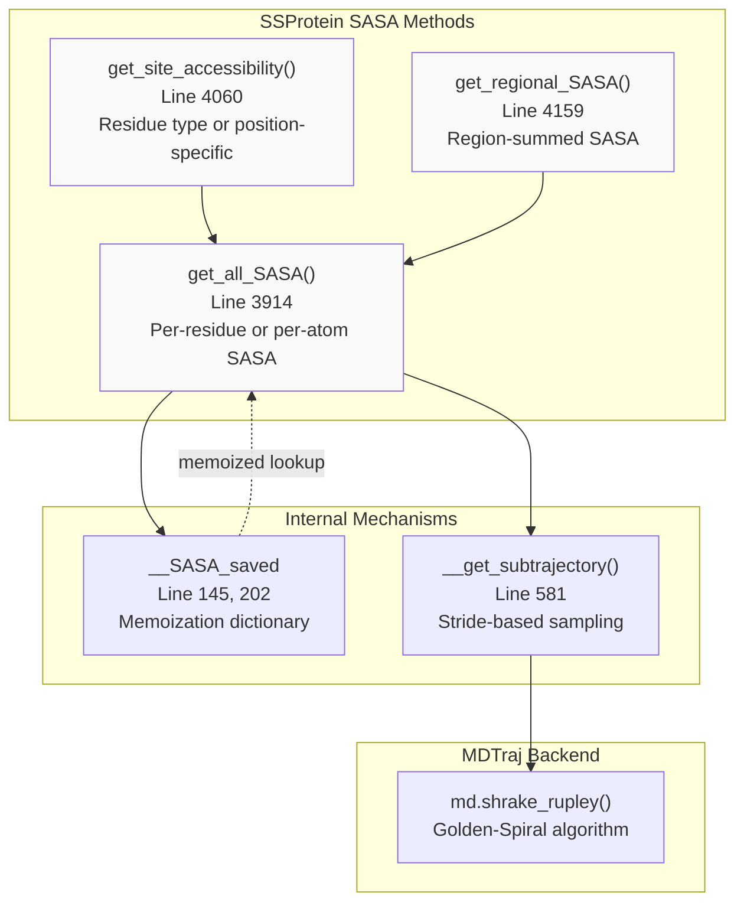
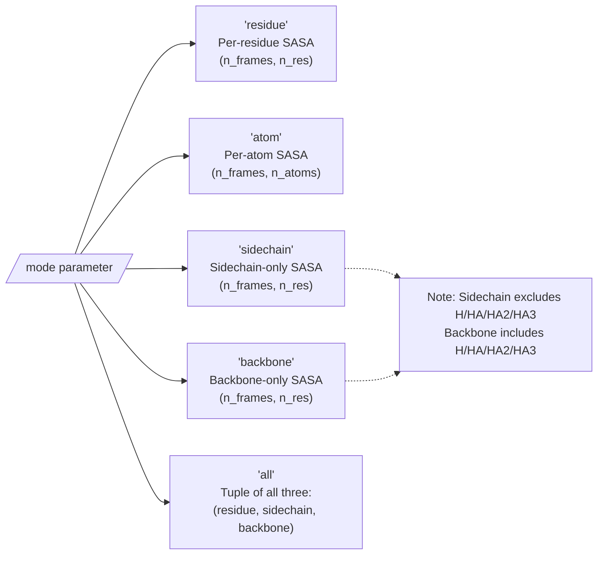
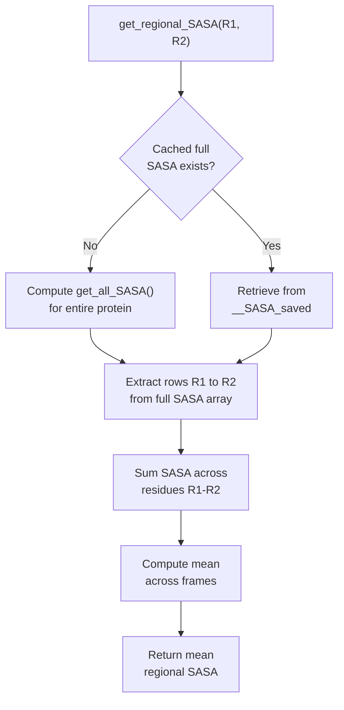
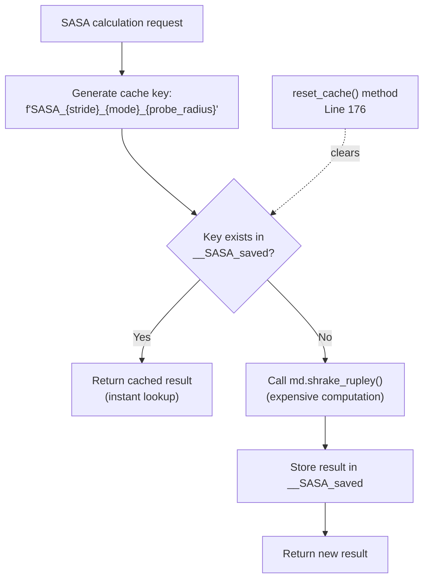
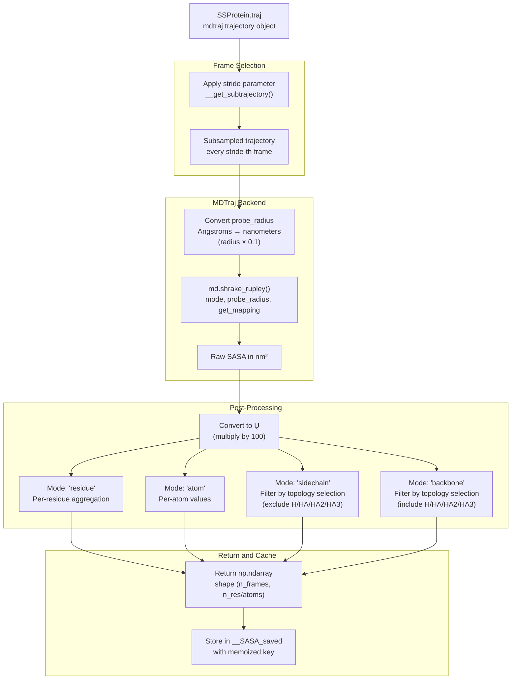

# Surface Accessibility

<details>
<summary>Relevant source files</summary>

The following files were used as context for generating this wiki page:

- [soursop/ssprotein.py](soursop/ssprotein.py)

</details>


## Purpose and Scope

This page documents the Surface Accessibility analysis capabilities in SOURSOP, specifically the calculation of Solvent Accessible Surface Area (SASA) for protein conformations. SASA quantifies how much of a protein's surface is exposed to solvent, which is particularly important for understanding intrinsically disordered proteins where transient exposure patterns reveal conformational preferences and potential binding sites.

The `SSProtein` class provides three main methods for SASA analysis: `get_all_SASA()` for whole-protein calculations, `get_regional_SASA()` for specific regions, and `get_site_accessibility()` for residue-type or position-specific analysis. For other structural properties like radius of gyration or end-to-end distance, see [Global Structural Properties](#4.3). For contact-based analysis, see [Contact Maps and Clustering](#4.5).

---

## Overview of SASA Calculation

SOURSOP uses the Shrake-Rupley algorithm (Golden-Spiral algorithm) to compute SASA values, leveraging mdtraj's `shrake_rupley()` function. All SASA values are returned in **Angstroms squared (Ų)**, and a standard probe radius of 1.4 Å (water molecule size) is used by default.



**Sources:** [soursop/ssprotein.py:3914-4217]()

---

## Core SASA Methods

### get_all_SASA()

The primary SASA calculation method that computes solvent accessibility across the entire protein trajectory with multiple resolution options.

**Method Signature:**
```python
get_all_SASA(probe_radius=1.4, mode='residue', stride=20)
```

**Parameters:**

| Parameter | Type | Default | Description |
|-----------|------|---------|-------------|
| `probe_radius` | float | 1.4 | Probe sphere radius in Angstroms (water = 1.4 Å) |
| `mode` | str | 'residue' | Resolution mode: 'residue', 'atom', 'sidechain', 'backbone', or 'all' |
| `stride` | int | 20 | Frame sampling interval (default higher due to computational cost) |

**Mode Options:**



**Return Values:**

- **'residue' mode**: `np.ndarray` of shape `(n_frames, n_residues)` - SASA per residue per frame
- **'atom' mode**: `np.ndarray` of shape `(n_frames, n_atoms)` - SASA per atom per frame  
- **'sidechain' mode**: `np.ndarray` of shape `(n_frames, n_residues)` - Sidechain SASA only
- **'backbone' mode**: `np.ndarray` of shape `(n_frames, n_residues)` - Backbone SASA only
- **'all' mode**: `tuple` of 3 arrays: `(residue_SASA, sidechain_SASA, backbone_SASA)`

**Important Notes:**

1. **Backbone hydrogen atoms**: MDTraj's 'sidechain' selection unexpectedly includes backbone H atoms (H, HA, HA2, HA3), while 'backbone' excludes them. SOURSOP corrects this at lines 3979-3984.

2. **Caps included**: SASA calculations include ACE/NME terminal caps if present.

3. **Memoization**: Results are cached with key `f'SASA_{stride}_{mode}_{probe_radius}'` (line 4010) for instant retrieval on repeated calls with identical parameters.

**Sources:** [soursop/ssprotein.py:3914-4054]()

---

### get_regional_SASA()

Computes the summed SASA for a contiguous protein region, useful for examining domain-specific or window-based accessibility.

**Method Signature:**
```python
get_regional_SASA(R1, R2, probe_radius=1.4, stride=20)
```

**Parameters:**

| Parameter | Type | Description |
|-----------|------|-------------|
| `R1` | int | First residue index (0-based, includes caps) |
| `R2` | int | Last residue index (0-based, inclusive) |
| `probe_radius` | float | Probe radius in Angstroms (default=1.4) |
| `stride` | int | Frame sampling interval (default=20) |

**Return Value:**
- `float` - Mean sum-total SASA (Ų) for the region across all sampled frames

**Performance Note:**
The method **must** calculate SASA over the entire protein (line 4207) to properly account for occlusion from atoms outside the region of interest. However, this computation is cached, so subsequent regional queries with the same stride/probe_radius are instantaneous.



**Sources:** [soursop/ssprotein.py:4159-4217]()

---

### get_site_accessibility()

Analyzes SASA for specific residue types or positions, returning per-site statistics useful for comparative analysis across sequence positions.

**Method Signature:**
```python
get_site_accessibility(input_list, probe_radius=1.4, mode='residue_type', stride=20)
```

**Parameters:**

| Parameter | Type | Default | Description |
|-----------|------|---------|-------------|
| `input_list` | list | - | Residue names (e.g., ['TRP','TYR']) or resid values ([1,2,3]) |
| `probe_radius` | float | 1.4 | Probe radius in Angstroms |
| `mode` | str | 'residue_type' | Either 'residue_type' or 'resid' |
| `stride` | int | 20 | Frame sampling interval |

**Mode Descriptions:**

| Mode | Input Format | Purpose |
|------|--------------|---------|
| `'residue_type'` | `['TRP', 'TYR', 'GLN']` | Analyze all instances of specified amino acid types |
| `'resid'` | `[1, 2, 3, 4]` | Analyze specific residue positions (0-based indexing) |

**Return Value:**
- `dict` - Keys are residue identifiers ("TYPE-NUMBER" strings), values are `[mean_SASA, std_SASA]` tuples

**Example Return:**
```python
{
    'TRP-5': [125.3, 15.2],   # Mean SASA = 125.3 Ų, StdDev = 15.2 Ų
    'TRP-18': [98.7, 22.1],
    'TYR-23': [142.5, 18.9]
}
```

**Use Cases:**
- Comparing burial/exposure of aromatic residues across a sequence
- Identifying consistently buried or exposed positions
- Quantifying site-specific conformational heterogeneity via standard deviation

**Sources:** [soursop/ssprotein.py:4060-4155]()

---

## Memoization and Performance

### Caching Mechanism

SOURSOP implements aggressive memoization for SASA calculations to avoid redundant computation. The cache key format is:

```python
memoized_name = f'SASA_{stride}_{mode}_{probe_radius}'
```



**Cache Invalidation:**
- The cache persists for the lifetime of the `SSProtein` object
- Calling `reset_cache()` (line 176) clears all memoized data including SASA
- Changing stride, mode, or probe_radius creates a new cache entry

**Performance Implications:**

| Operation | First Call | Subsequent Calls |
|-----------|------------|------------------|
| `get_all_SASA()` | Expensive (O(n_frames × n_atoms)) | Instant (O(1) lookup) |
| `get_regional_SASA()` | Triggers full SASA calculation | Instant if full SASA cached |
| `get_site_accessibility()` | Triggers full SASA calculation | Instant if full SASA cached |

**Recommended Workflow for Scanning:**
If analyzing multiple regions or sites with the same parameters, call `get_all_SASA()` once first to populate the cache, then all subsequent queries are instantaneous lookups.

**Sources:** [soursop/ssprotein.py:145](), [soursop/ssprotein.py:176-218](), [soursop/ssprotein.py:4010-4014]()

---

## SASA Calculation Pipeline

The following diagram illustrates the complete data flow from trajectory input to SASA output:



**Key Implementation Details:**

1. **Unit conversions** (lines 4019-4024):
   - Probe radius: Angstroms → nm (divide by 10)
   - Output SASA: nm² → Ų (multiply by 100)

2. **Sidechain/Backbone filtering** (lines 3978-3984):
   - MDTraj's 'sidechain' selection incorrectly includes backbone H atoms
   - SOURSOP explicitly excludes: H, HA, HA2, HA3 from sidechain
   - SOURSOP explicitly includes: H, HA, HA2, HA3 in backbone

3. **Topology selection** (line 4250):
   - Caps excluded via: `topology.select('(not resname "NME") and (not resname "ACE")')`
   - But full SASA calculations include caps for proper occlusion modeling

**Sources:** [soursop/ssprotein.py:3914-4054](), [soursop/ssprotein.py:4019-4050]()

---

## Units and Conventions

### Unit Summary

| Quantity | Input Units | Internal Units | Output Units |
|----------|-------------|----------------|--------------|
| Probe radius | Angstroms (Å) | Nanometers (nm) | N/A |
| SASA | N/A | nm² | Angstroms² (Ų) |

### Residue Indexing

- **0-based indexing**: All residue indices (`R1`, `R2`, resid values) start from 0
- **Caps included**: If ACE/NME caps are present, residue 0 may be ACE
- **CA-containing residues**: Use `SSProtein.resid_with_CA` property to identify residues with alpha carbons (excludes caps)

**Example:**
```python
# For a protein with ACE cap:
# resid 0 = ACE (no CA)
# resid 1 = first amino acid (has CA)
# resid N = last amino acid (has CA)
# resid N+1 = NME (no CA)

resids_with_CA = protein.resid_with_CA  # [1, 2, 3, ..., N]
```

**Sources:** [soursop/ssprotein.py:3914-3933](), [soursop/ssprotein.py:4019-4024]()

---

## Practical Usage Patterns

### Basic Per-Residue SASA

```python
# Compute per-residue SASA with default settings
sasa = protein.get_all_SASA()
# Returns: np.ndarray of shape (n_frames/20, n_residues)

# Mean SASA per residue across all frames
mean_sasa = np.mean(sasa, axis=0)

# Residue with highest average exposure
most_exposed_resid = np.argmax(mean_sasa)
```

### Sidechain vs Backbone Analysis

```python
# Get all three simultaneously
all_sasa, sc_sasa, bb_sasa = protein.get_all_SASA(mode='all', stride=10)

# Compute sidechain burial fraction
sc_fraction = sc_sasa / (sc_sasa + bb_sasa)

# Identify residues with buried sidechains but exposed backbones
buried_sc_exposed_bb = (sc_fraction < 0.3) & (bb_sasa > 50)
```

### Regional Scanning

```python
# Scan protein with sliding 10-residue window
window_size = 10
regional_sasa = []

for i in range(protein.n_residues - window_size):
    # This is fast after the first call due to caching
    regional_value = protein.get_regional_SASA(i, i + window_size)
    regional_sasa.append(regional_value)
```

### Residue Type Comparison

```python
# Compare aromatic residue exposure
aromatic_sasa = protein.get_site_accessibility(
    input_list=['TRP', 'TYR', 'PHE'],
    mode='residue_type',
    stride=10
)

# Extract mean values for each site
for site, (mean, std) in aromatic_sasa.items():
    print(f"{site}: {mean:.1f} ± {std:.1f} Ų")
```

### High-Resolution Atom-Level Analysis

```python
# Get per-atom SASA for detailed analysis
atom_sasa = protein.get_all_SASA(mode='atom', stride=5)
# Returns: np.ndarray of shape (n_frames/5, n_atoms)

# Map atoms to residues for custom aggregation
# (requires additional topology navigation)
```

**Sources:** [soursop/ssprotein.py:3914-4217]()

---

## Computational Considerations

### Algorithm Complexity

The Shrake-Rupley algorithm has complexity **O(n_atoms²)** per frame, making SASA calculations expensive for large systems. SOURSOP mitigates this through:

1. **Default stride of 20**: Samples 1 in 20 frames (vs. stride=1 for most other methods)
2. **Aggressive memoization**: Avoids redundant calculations
3. **MDTraj backend**: Optimized C++ implementation

### Performance Guidelines

| Protein Size | Recommended Stride | Approximate Time (per frame) |
|--------------|-------------------|------------------------------|
| < 50 residues | stride=10 | ~0.01-0.05 seconds |
| 50-100 residues | stride=20 | ~0.05-0.2 seconds |
| 100-200 residues | stride=50 | ~0.2-0.5 seconds |
| > 200 residues | stride=100+ | ~0.5+ seconds |

### Memory Usage

SASA arrays scale as **O(n_frames/stride × n_residues)** or **O(n_frames/stride × n_atoms)** depending on mode. For typical analysis:

- **100 residues, 5000 frames, stride=20**: ~160 KB per cached mode
- **200 residues, 10000 frames, stride=50**: ~320 KB per cached mode

The cache can be cleared with `protein.reset_cache()` if memory becomes a concern.

**Sources:** [soursop/ssprotein.py:3914-3926](), [soursop/ssprotein.py:4010-4014]()

---

## Related Methods and Data

### Related Analysis Methods

- **Contact maps** ([Contact Maps and Clustering](#4.5)): Use `get_contact_map()` to identify residue-residue contacts, which correlate with SASA (buried residues have low SASA)
- **Radius of gyration** ([Global Structural Properties](#4.3)): Global compactness metric that often correlates with average SASA
- **Distance maps** ([Distance Calculations](#4.2)): Inter-residue distances relate to solvent accessibility patterns

### Internal Data References

The `_internal_data.py` module contains `MAX_SASA` values for reference calculations, though these are not directly used by the current SASA methods.

**Sources:** [soursop/_internal_data.py:28]()

---