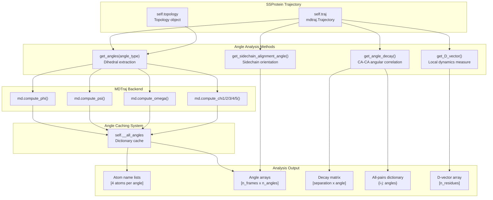
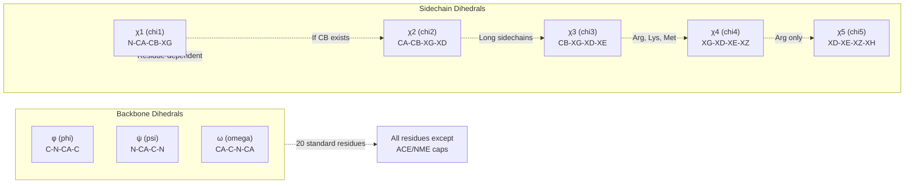
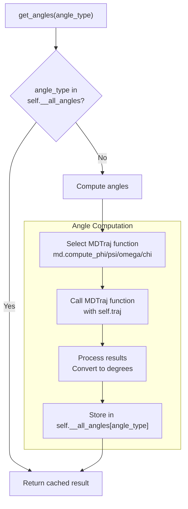
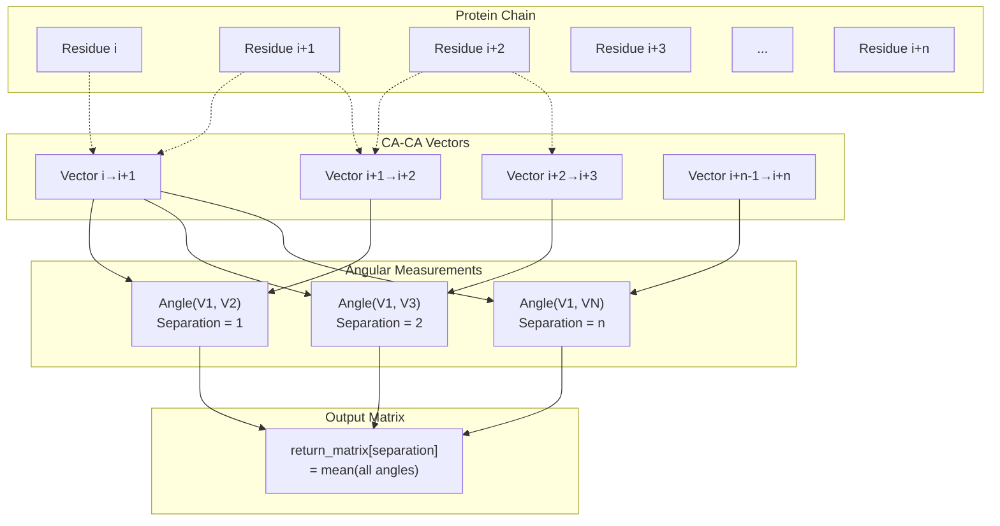
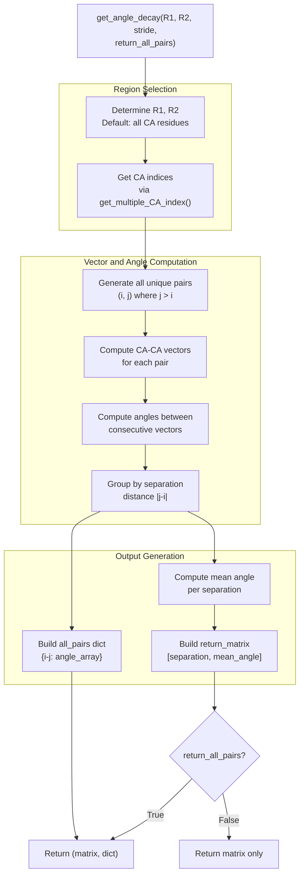
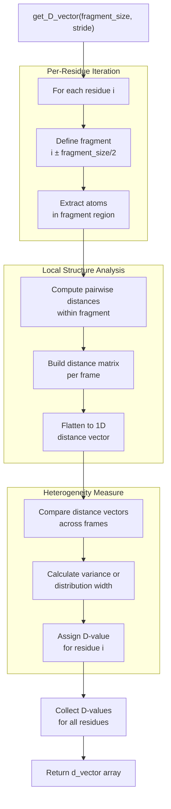
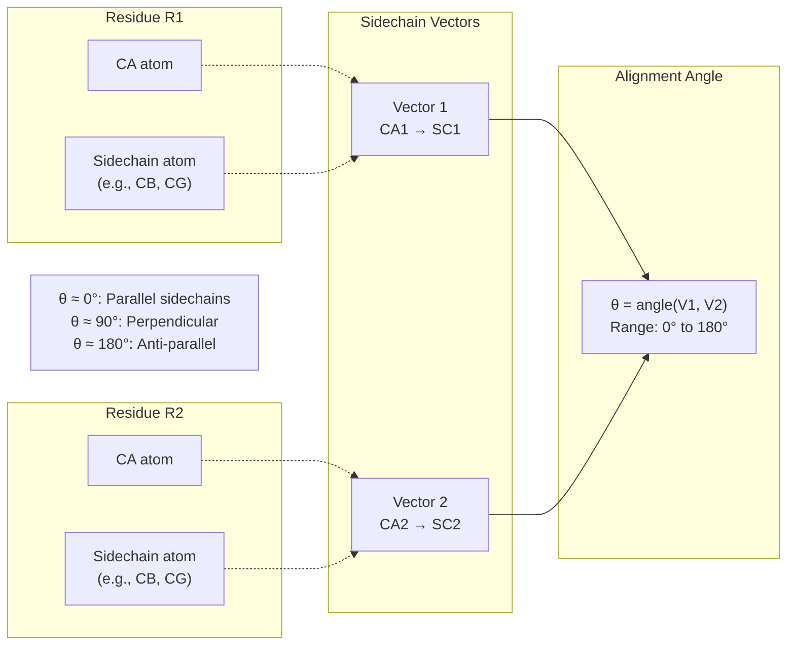

# Angles and Dynamics

<details>
<summary>Relevant source files</summary>

The following files were used as context for generating this wiki page:

- [soursop/data/test_data/gs6_distance_map_mean.npy](soursop/data/test_data/gs6_distance_map_mean.npy)
- [soursop/data/test_data/gs6_distance_map_std.npy](soursop/data/test_data/gs6_distance_map_std.npy)
- [soursop/ssprotein.py](soursop/ssprotein.py)
- [soursop/tests/test_ssproteins.py](soursop/tests/test_ssproteins.py)

</details>


This page documents the angle and dynamics analysis methods in the `SSProtein` class. These methods compute various angular measurements from protein conformations including backbone and sidechain dihedral angles, angular correlations between residue pairs, and sidechain orientation analysis.

For information about secondary structure analysis using angles, see [Secondary Structure Analysis](#4.4). For dihedral angle distributions used in sampling quality assessment, see [Dihedral Analysis](#5.2).

---

## Overview of Angle Analysis Methods

The `SSProtein` class provides four main categories of angle-related analysis:

| Method | Purpose | Returns |
|--------|---------|---------|
| `get_angles()` | Extract backbone (φ, ψ, ω) and sidechain (χ1-χ5) dihedral angles | Atom names and angle values |
| `get_angle_decay()` | Measure angular correlation between CA-CA vectors at different sequence separations | Mean angles by separation distance |
| `get_D_vector()` | Compute local heterogeneity in structural dynamics | Per-residue D-vector values |
| `get_sidechain_alignment_angle()` | Calculate angle between sidechain vectors of two residues | Alignment angles across frames |

**Diagram: Angle Analysis System Architecture**



**Sources:** [soursop/ssprotein.py:1-200](), [soursop/ssprotein.py:146](), [soursop/tests/test_ssproteins.py:1019-1045]()

---

## Dihedral Angles

Dihedral angles describe the geometry of the protein backbone and sidechains. The `SSProtein` class provides access to both backbone dihedrals (φ, ψ, ω) and up to five sidechain dihedrals (χ1-χ5) per residue.

### Angle Types

**Diagram: Dihedral Angle Types**



**Sources:** [soursop/tests/test_ssproteins.py:1019-1045]()

### The `get_angles()` Method

The `get_angles()` method extracts dihedral angles from the trajectory using MDTraj's angle computation functions. Results are cached in `self.__all_angles` to avoid redundant computation.

**Method Signature:**
```python
get_angles(angle_type, stride=1, verbose=True)
```

**Parameters:**

| Parameter | Type | Description |
|-----------|------|-------------|
| `angle_type` | `str` | One of: `'phi'`, `'psi'`, `'omega'`, `'chi1'`, `'chi2'`, `'chi3'`, `'chi4'`, `'chi5'` |
| `stride` | `int` | Frame spacing for analysis (default: 1) |
| `verbose` | `bool` | Print status messages (default: True) |

**Returns:**

A tuple `(atom_names, angle_values)` where:
- `atom_names`: List of lists, each containing 4 atom identifier strings defining the dihedral
- `angle_values`: NumPy array of shape `[n_frames, n_angles]` with angles in degrees

**Example Output Structure:**

For a peptide with 6 CA-containing residues, `get_angles('phi')` returns:

```python
atom_names = [
    ['ACE1-C', 'GLY2-N', 'GLY2-CA', 'GLY2-C'],
    ['GLY2-C', 'SER3-N', 'SER3-CA', 'SER3-C'],
    # ... one list per phi angle
]

angle_values = np.array([
    [-157.64, -126.71, ...],  # Frame 0
    [-155.32, -128.45, ...],  # Frame 1
    # ... one row per frame
])
```

**Diagram: Angle Caching Mechanism**



**Sources:** [soursop/ssprotein.py:146](), [soursop/tests/test_ssproteins.py:1019-1045]()

### Angle Availability by Residue Type

Not all angles are defined for all residues:

| Residue Property | Available Angles |
|-----------------|------------------|
| ACE/NME caps | None (no CA atom) |
| N-terminal residue | ψ, ω only (no φ) |
| C-terminal residue | φ, ω only (no ψ) |
| Glycine | φ, ψ, ω only (no CB, therefore no χ) |
| Standard residues with CB | φ, ψ, ω, χ1 |
| Long sidechains (Ile, Leu, etc.) | Up to χ2 or χ3 |
| Arg, Lys, Met | Up to χ4 |
| Arginine only | χ5 |

**Sources:** [soursop/tests/test_ssproteins.py:1037-1044]()

---

## Angle Decay Analysis

Angle decay measures the angular correlation between CA-CA vectors as a function of sequence separation. This provides insight into chain flexibility and persistence length.

### Conceptual Overview

The angle decay analysis computes the angle between CA-CA vectors for pairs of residues separated by varying numbers of residues along the sequence. High angles (close to 180°) indicate extended conformations, while lower angles indicate chain bending.

**Diagram: Angle Decay Calculation**



**Sources:** [soursop/tests/test_ssproteins.py:672-732]()

### The `get_angle_decay()` Method

**Method Signature:**
```python
get_angle_decay(R1=None, R2=None, stride=1, return_all_pairs=False, verbose=True)
```

**Parameters:**

| Parameter | Type | Description |
|-----------|------|-------------|
| `R1` | `int` or `None` | First residue in region (default: first CA residue) |
| `R2` | `int` or `None` | Last residue in region (default: last CA residue) |
| `stride` | `int` | Frame spacing for analysis (default: 1) |
| `return_all_pairs` | `bool` | If True, return dictionary of all individual pairs (default: False) |
| `verbose` | `bool` | Print status messages (default: True) |

**Returns:**

When `return_all_pairs=False`:
- `return_matrix`: NumPy array where `return_matrix[i]` = `[separation, mean_angle]` for separation distance `i`

When `return_all_pairs=True`:
- `(return_matrix, all_pairs)` tuple where `all_pairs` is a dictionary with keys like `"i-j"` mapping to angle arrays

**Return Matrix Structure:**

```python
return_matrix = np.array([
    [1, 145.2],  # Separation 1: mean angle 145.2°
    [2, 132.4],  # Separation 2: mean angle 132.4°
    [3, 125.1],  # Separation 3: mean angle 125.1°
    # ... decreasing angles indicate chain bending
])
```

**All Pairs Dictionary:**

```python
all_pairs = {
    "1-2": np.array([148.3, 142.1, ...]),  # Angles for residues 1→2 across frames
    "1-3": np.array([135.7, 129.2, ...]),  # Angles for residues 1→3 across frames
    "2-3": np.array([147.1, 143.8, ...]),  # Angles for residues 2→3 across frames
    # ... one entry per unique pair
}
```

The number of entries in `all_pairs` equals `∑(n-1, n-2, ..., 1)` where `n` is the number of CA-containing residues.

**Diagram: Angle Decay Data Flow**



**Sources:** [soursop/tests/test_ssproteins.py:672-732]()

---

## D-Vector Analysis

The D-vector provides a per-residue measure of local structural heterogeneity. It quantifies how much a residue's local environment varies across the ensemble.

### The `get_D_vector()` Method

The D-vector is computed by analyzing the distribution of local structural features for each residue.

**Method Signature:**
```python
get_D_vector(fragment_size=10, stride=1, backbone=True, weights=False, verbose=True)
```

**Parameters:**

| Parameter | Type | Description |
|-----------|------|-------------|
| `fragment_size` | `int` | Size of local fragment around each residue (default: 10) |
| `stride` | `int` | Frame spacing for analysis (default: 1) |
| `backbone` | `bool` | Use backbone atoms only (default: True) |
| `weights` | `array-like` or `False` | Frame weights for reweighting (default: False) |
| `verbose` | `bool` | Print status messages (default: True) |

**Returns:**

- `d_vector`: NumPy array of length `n_residues` containing D-vector values for each residue

Higher D-vector values indicate greater local heterogeneity (more structural variability in the local environment).

**Diagram: D-Vector Computation Process**



**Sources:** [soursop/tests/test_ssproteins.py:79]()

---

## Sidechain Alignment Angles

Sidechain alignment angles measure the relative orientation between sidechain vectors of two residues, providing information about packing and interactions.

### The `get_sidechain_alignment_angle()` Method

This method computes the angle between sidechain vectors defined by CA→sidechain_atom for two residues.

**Method Signature:**
```python
get_sidechain_alignment_angle(R1, R2, sidechain_atom_1='default', sidechain_atom_2='default', stride=1, verbose=True)
```

**Parameters:**

| Parameter | Type | Description |
|-----------|------|-------------|
| `R1` | `int` | First residue index |
| `R2` | `int` | Second residue index |
| `sidechain_atom_1` | `str` | Atom name for R1 sidechain vector (default: residue-specific) |
| `sidechain_atom_2` | `str` | Atom name for R2 sidechain vector (default: residue-specific) |
| `stride` | `int` | Frame spacing for analysis (default: 1) |
| `verbose` | `bool` | Print status messages (default: True) |

**Returns:**

- NumPy array of alignment angles (degrees) for each frame

**Default Sidechain Atoms:**

The method uses residue-specific default atoms defined in `DEFAULT_SIDECHAIN_VECTOR_ATOMS`:

```python
# Examples of default sidechain vector atoms
'ALA': 'CB'
'CYS': 'SG'
'ASP': 'CG'
'GLU': 'CD'
'PHE': 'CZ'
'TRP': 'CH2'
# ... etc.
```

**Limitations:**

- Does not work for residues without sidechains (GLY)
- Does not work for caps (ACE, NME)
- Both residues must have the specified sidechain atoms

**Diagram: Sidechain Alignment Angle Geometry**



**Sources:** [soursop/ssprotein.py:23](), [soursop/tests/test_ssproteins.py:782-882]()

---

## Common Patterns and Best Practices

### Caching Behavior

All angle methods use caching to improve performance:

```python
# First call computes and caches
phi_data = protein.get_angles('phi')  # Computes

# Subsequent calls return cached results
phi_data_again = protein.get_angles('phi')  # Instant
```

To clear the cache:
```python
protein.reset_cache()  # Clears self.__all_angles and other cached data
```

### Working with Stride

Using `stride` reduces computational cost and memory usage:

```python
# Analyze every frame (slow for large trajectories)
angles = protein.get_angles('phi', stride=1)

# Analyze every 10th frame (10x faster)
angles = protein.get_angles('phi', stride=10)
```

### Handling Missing Angles

Some residues may not have all angle types:

```python
phi_atoms, phi_values = protein.get_angles('phi')

# Check which residues have phi angles
print(f"Number of phi angles: {len(phi_atoms)}")
print(f"Total CA residues: {len(protein.resid_with_CA)}")

# N-terminal residue typically lacks phi
# C-terminal residue typically lacks psi
```

### Angle Decay Interpretation

Typical angle decay patterns:

| Mean Angle at Separation | Interpretation |
|--------------------------|----------------|
| > 150° | Highly extended, stiff chain |
| 120-150° | Moderately extended |
| 90-120° | Partially collapsed |
| < 90° | Highly collapsed, compact |

**Sources:** [soursop/ssprotein.py:146](), [soursop/ssprotein.py:176-218](), [soursop/tests/test_ssproteins.py:672-732]()

---