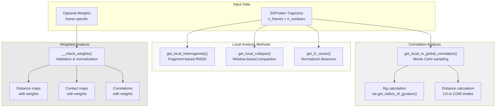
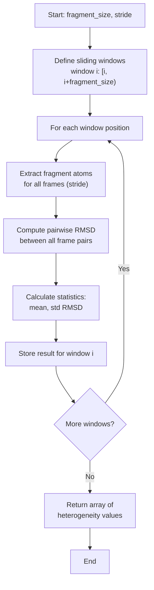
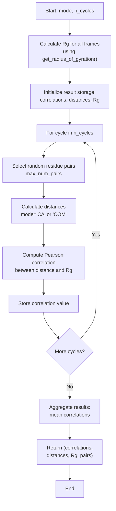
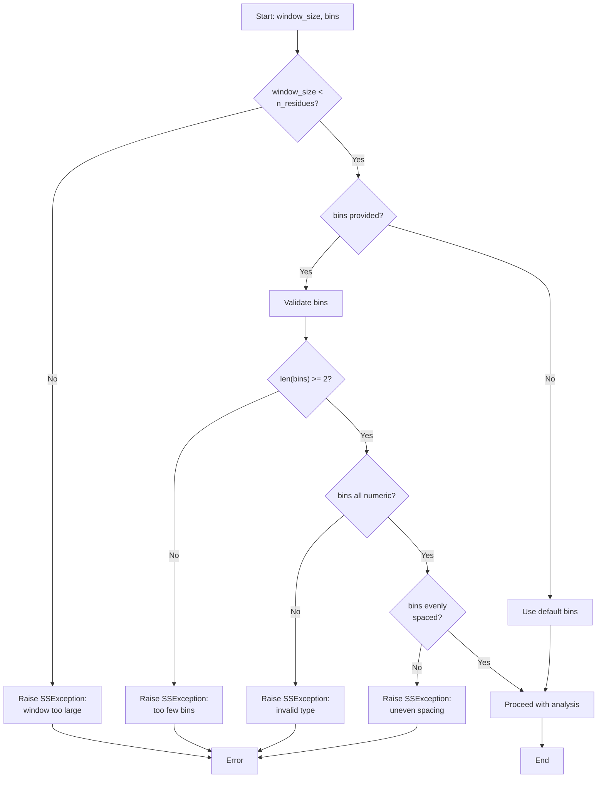
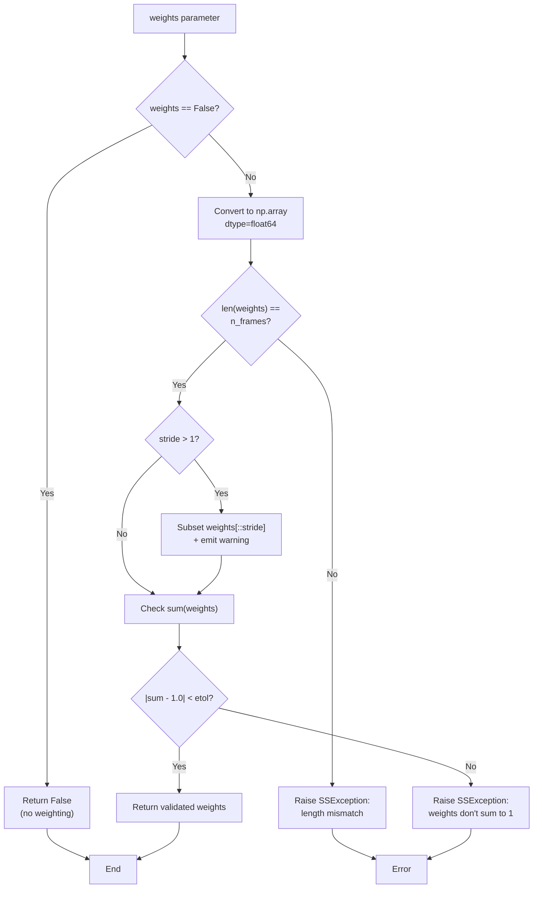
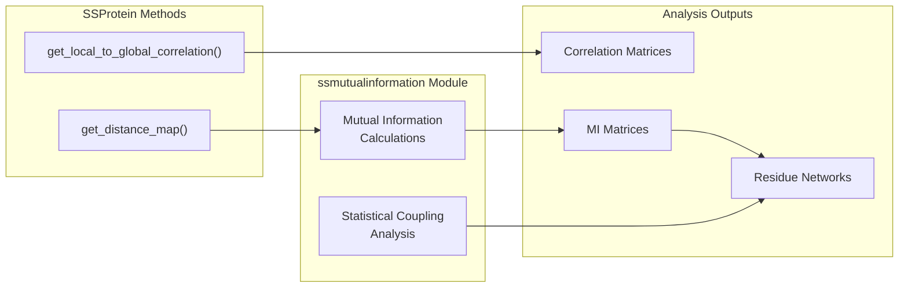
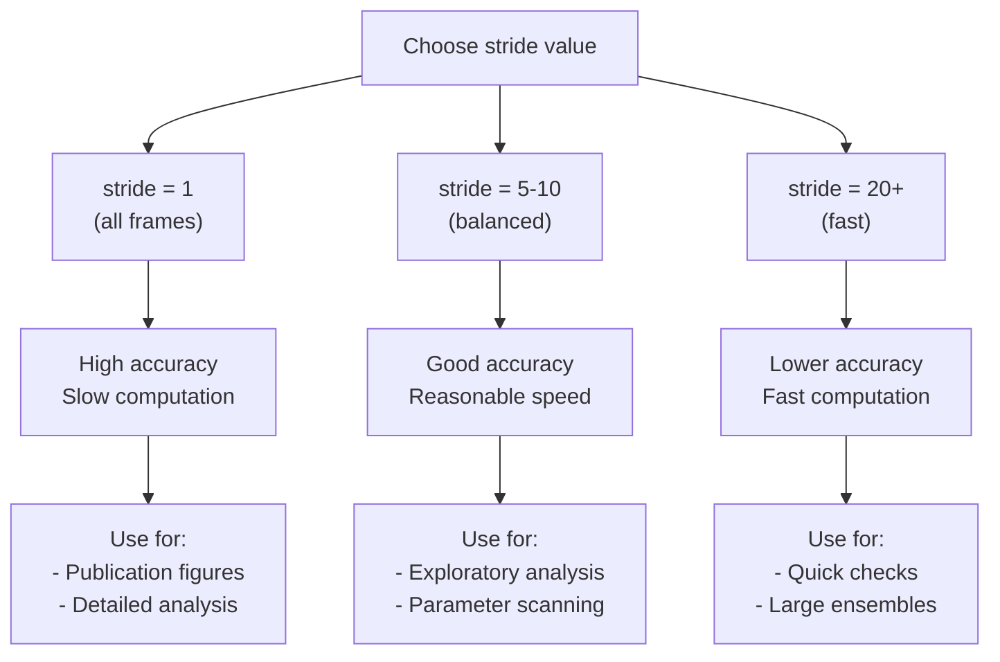

# Advanced Analysis Methods

<details>
<summary>Relevant source files</summary>

The following files were used as context for generating this wiki page:

- [soursop/data/test_data/gs6_distance_map_mean.npy](soursop/data/test_data/gs6_distance_map_mean.npy)
- [soursop/data/test_data/gs6_distance_map_std.npy](soursop/data/test_data/gs6_distance_map_std.npy)
- [soursop/ssprotein.py](soursop/ssprotein.py)
- [soursop/tests/test_ssproteins.py](soursop/tests/test_ssproteins.py)

</details>


This page documents advanced analytical methods available in the `SSProtein` class for sophisticated conformational analysis. These methods go beyond basic structural properties to examine local heterogeneity, correlations between local and global properties, regional compaction patterns, and weighted ensemble analysis.

For basic distance calculations, see [Distance Calculations](#4.2). For global structural properties like radius of gyration, see [Global Structural Properties](#4.3). For statistical correlation analysis using mutual information, see [Mutual Information Analysis](#6.3).

---

## Overview of Advanced Methods

The `SSProtein` class provides four main categories of advanced analysis:

| Method Category | Primary Function(s) | Purpose |
|----------------|---------------------|---------|
| **Local Heterogeneity** | `get_local_heterogeneity()` | Quantify conformational variability in sliding windows |
| **Local-to-Global Correlation** | `get_local_to_global_correlation()` | Correlate local distances with global size |
| **Local Collapse** | `get_local_collapse()` | Analyze regional compaction patterns |
| **D-Vector Analysis** | `get_D_vector()` | Calculate normalized distance vectors |
| **Weighted Analysis** | `weights` parameter | Re-weight conformational ensembles |

**Sources:** [soursop/ssprotein.py:1-100](), [soursop/tests/test_ssproteins.py:75-928]()

---

## Advanced Analysis Architecture



**Sources:** [soursop/ssprotein.py:350-405](), [soursop/tests/test_ssproteins.py:75-928]()

---

## Local Heterogeneity Analysis

The `get_local_heterogeneity()` method quantifies conformational variability within sliding windows along the protein sequence. This provides a position-specific measure of structural disorder.

### Method Signature

```python
get_local_heterogeneity(fragment_size=10, stride=1, weights=False, verbose=True)
```

### Parameters

| Parameter | Type | Default | Description |
|-----------|------|---------|-------------|
| `fragment_size` | int | 10 | Number of consecutive residues in each window |
| `stride` | int | 1 | Frame stride for analysis |
| `weights` | array-like or False | False | Optional per-frame weights |
| `verbose` | bool | True | Enable progress messages |

### Algorithm



### Output Format

Returns an array of heterogeneity values, one per window position:
- **Length:** `n_residues - fragment_size + 1`
- **Value:** Mean RMSD between all frame pairs within each window
- **Units:** Angstroms

### Example Usage Pattern

```python
# Measure local heterogeneity with 20-residue windows
heterogeneity = protein.get_local_heterogeneity(fragment_size=20, stride=2)

# heterogeneity[i] represents the structural variability
# of residues [i, i+20) across the ensemble
```

**Sources:** [soursop/tests/test_ssproteins.py:75-78](), [soursop/ssprotein.py:1-200]()

---

## Local-to-Global Correlation Analysis

The `get_local_to_global_correlation()` method measures how local inter-residue distances correlate with the global protein size (radius of gyration). This reveals which regions of the protein drive overall compaction or expansion.

### Method Signature

```python
get_local_to_global_correlation(mode='COM', n_cycles=100, max_num_pairs=10, 
                                stride=20, weights=False, verbose=True)
```

### Parameters

| Parameter | Type | Default | Description |
|-----------|------|---------|-------------|
| `mode` | str | 'COM' | Distance calculation mode: 'CA' or 'COM' |
| `n_cycles` | int | 100 | Number of Monte Carlo sampling cycles |
| `max_num_pairs` | int | 10 | Maximum residue pairs per cycle |
| `stride` | int | 20 | Frame stride for analysis |
| `weights` | array-like or False | False | Optional per-frame weights |
| `verbose` | bool | True | Enable progress messages |

### Algorithm Flow



### Mode Options

The `mode` parameter determines how distances are calculated:

| Mode | Description | Measurement Point |
|------|-------------|-------------------|
| `'CA'` | Alpha carbon distances | CA atom positions |
| `'COM'` | Center of mass distances | Residue COM positions |

### Return Values

Returns a 4-tuple:

1. **Correlations:** Array of Pearson correlation coefficients
2. **Distances:** Array of mean inter-residue distances
3. **Rg:** Array of radius of gyration values
4. **Pairs:** List of residue pairs analyzed

### Interpretation

- **Positive correlation:** Region expands when protein expands
- **Negative correlation:** Region compacts when protein expands (compensatory behavior)
- **Near-zero correlation:** Region size independent of global size

**Sources:** [soursop/tests/test_ssproteins.py:884-928](), [soursop/ssprotein.py:350-405]()

---

## Local Collapse Analysis

The `get_local_collapse()` method analyzes regional compaction by computing distance distributions within sliding windows.

### Method Signature

```python
get_local_collapse(window_size=10, bins=None, verbose=True)
```

### Parameters

| Parameter | Type | Default | Description |
|-----------|------|---------|-------------|
| `window_size` | int | 10 | Size of sliding window (residues) |
| `bins` | list or None | None | Histogram bins (must be evenly spaced) |
| `verbose` | bool | True | Enable progress messages |

### Validation Requirements

The method performs strict validation on input parameters:



### Output Format

Returns a 4-tuple:

1. **meanData:** Mean distance per window position
2. **stdData:** Standard deviation per window position
3. **histo:** Distance histogram per window position
4. **bins:** Bin edges used for histograms

**Output Length:** `n_residues - (window_size - 1)`

**Sources:** [soursop/tests/test_ssproteins.py:635-670](), [soursop/ssprotein.py:1-500]()

---

## D-Vector Calculations

The `get_D_vector()` method calculates normalized distance vectors for polymer scaling analysis.

### Method Signature

```python
get_D_vector(stride=1, weights=False, verbose=True)
```

### Parameters

| Parameter | Type | Default | Description |
|-----------|------|---------|-------------|
| `stride` | int | 1 | Frame stride for analysis |
| `weights` | array-like or False | False | Optional per-frame weights |
| `verbose` | bool | True | Enable progress messages |

### Calculation Method

The D-vector provides a normalized representation of inter-residue distances:


### Applications

The D-vector is particularly useful for:
- Polymer scaling analysis
- Comparing proteins of different lengths
- Identifying deviations from random coil behavior

**Sources:** [soursop/tests/test_ssproteins.py:79](), [soursop/ssprotein.py:1-500]()

---

## Weighted Ensemble Analysis

All advanced analysis methods support optional frame weighting through the `weights` parameter. This enables re-weighted ensemble analysis without regenerating trajectories.

### Weight Validation System



### Weight Requirements

The `__check_weights()` method enforces strict validation:

| Requirement | Default Tolerance | Purpose |
|-------------|-------------------|---------|
| Length matches `n_frames` | Exact | Ensure 1:1 frame mapping |
| Sum equals 1.0 | `etol=0.0000001` | Probability distribution |
| All values numeric | N/A | Enable arithmetic operations |

### Using Weights with Advanced Methods

```python
# Example: Re-weight ensemble based on RMSD to reference structure
import numpy as np

# Calculate weights (e.g., Boltzmann-like)
energies = compute_energies(protein)  # hypothetical function
weights = np.exp(-energies / kT)
weights = weights / np.sum(weights)  # normalize

# Apply weights to local heterogeneity
het_weighted = protein.get_local_heterogeneity(
    fragment_size=15, 
    weights=weights
)

# Apply to local-to-global correlation
corr_weighted = protein.get_local_to_global_correlation(
    mode='COM',
    weights=weights
)
```

### Methods Supporting Weights

The following methods accept the `weights` parameter:

| Method | Weight Application |
|--------|-------------------|
| `get_distance_map()` | Weighted distance averaging |
| `get_contact_map()` | Weighted contact probability |
| `get_local_heterogeneity()` | Weighted RMSD calculation |
| `get_local_to_global_correlation()` | Weighted Pearson correlation |
| `get_Q()` | Weighted native contact fraction |

**Sources:** [soursop/ssprotein.py:350-405](), [soursop/tests/test_ssproteins.py:363-439](), [soursop/tests/test_ssproteins.py:612-633]()

---

## Integration with Mutual Information

Advanced correlation analysis can be extended using the `ssmutualinformation` module, which provides statistical measures of residue-residue coupling.



For detailed mutual information analysis, see [Mutual Information Analysis](#6.3).

**Sources:** [soursop/ssprotein.py:25](), [soursop/ssmutualinformation.py:1-100]()

---

## Performance Considerations

Advanced analysis methods can be computationally intensive for large trajectories. Consider these optimization strategies:

### Optimization Strategy Matrix

| Method | Primary Cost | Optimization Strategy |
|--------|-------------|----------------------|
| `get_local_heterogeneity()` | RMSD calculations | Increase `stride`, reduce `fragment_size` |
| `get_local_to_global_correlation()` | Distance calculations | Reduce `n_cycles`, increase `stride` |
| `get_local_collapse()` | Distance distributions | Reduce `window_size`, increase stride in pre-processing |
| Weighted analysis | Weight validation | Pre-validate weights, reuse across calls |

### Stride vs. Accuracy Trade-off



### Memory Management

For very large trajectories (>100,000 frames), consider:
1. Processing trajectory in chunks
2. Using higher stride values
3. Pre-filtering frames based on structural criteria
4. Utilizing the caching mechanism in `SSProtein`

**Sources:** [soursop/ssprotein.py:478-500](), [soursop/ssutils.py:1-100]()

---

## Error Handling

Advanced methods implement comprehensive error checking:

### Common Exceptions

| Exception | Trigger Condition | Example |
|-----------|------------------|---------|
| `SSException` | Window size > chain length | `get_local_collapse(window_size=1000)` |
| `SSException` | Invalid mode parameter | `get_local_to_global_correlation(mode='invalid')` |
| `SSException` | Weights don't sum to 1 | `weights = [0.5, 0.5, 0.5]` |
| `SSException` | Stride > n_frames | `get_local_heterogeneity(stride=1000)` |
| `SSException` | Uneven bin spacing | `get_local_collapse(bins=[1,2,4,6])` |

### Validation Functions

All advanced methods use shared validation functions:

```python
# Internal validation functions (not user-facing)
__check_stride(stride)           # Validates stride value
__check_weights(weights, stride) # Validates weight array
__check_single_residue(R1)       # Validates residue index
```

**Sources:** [soursop/ssprotein.py:478-578](), [soursop/ssexceptions.py:1-50](), [soursop/tests/test_ssproteins.py:461-477]()

---

## Summary

Advanced analysis methods in `SSProtein` provide sophisticated tools for:

1. **Local Heterogeneity:** Quantifying position-specific conformational variability
2. **Local-to-Global Correlation:** Linking regional and global structural properties
3. **Local Collapse:** Analyzing regional compaction patterns
4. **D-Vector Analysis:** Normalized distance representations for polymer physics
5. **Weighted Analysis:** Ensemble re-weighting without trajectory regeneration

These methods build on the core distance and structural property calculations documented in [Distance Calculations](#4.2) and [Global Structural Properties](#4.3), and integrate with specialized modules like [Mutual Information Analysis](#6.3) for comprehensive conformational analysis.

**Sources:** [soursop/ssprotein.py:1-200](), [soursop/tests/test_ssproteins.py:75-928]()

---