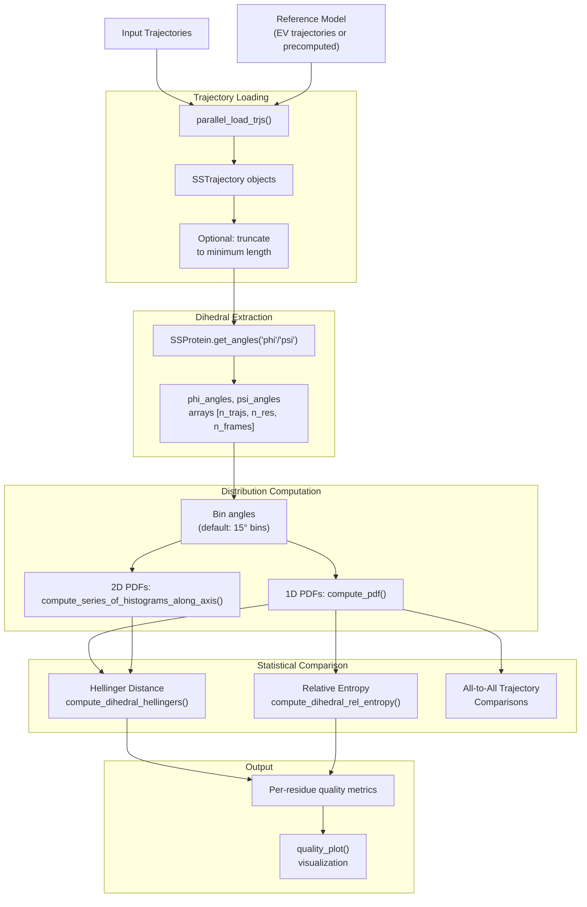
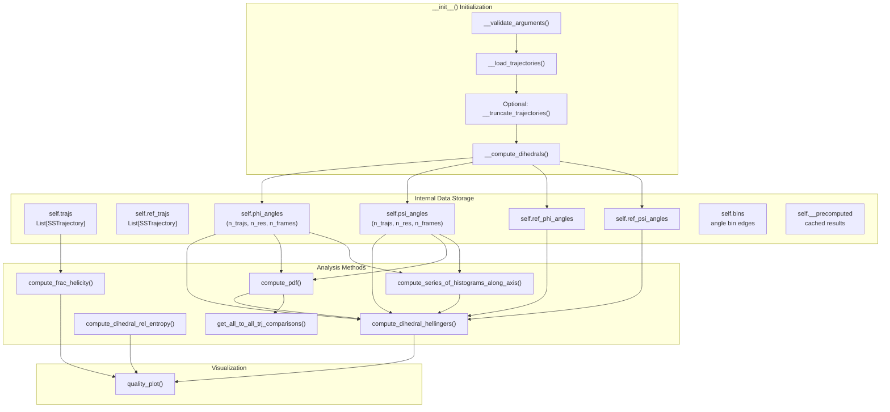
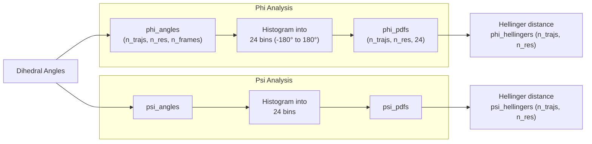
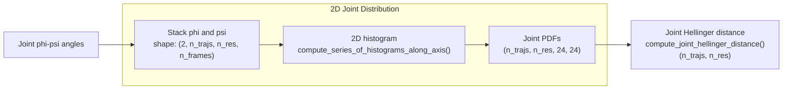
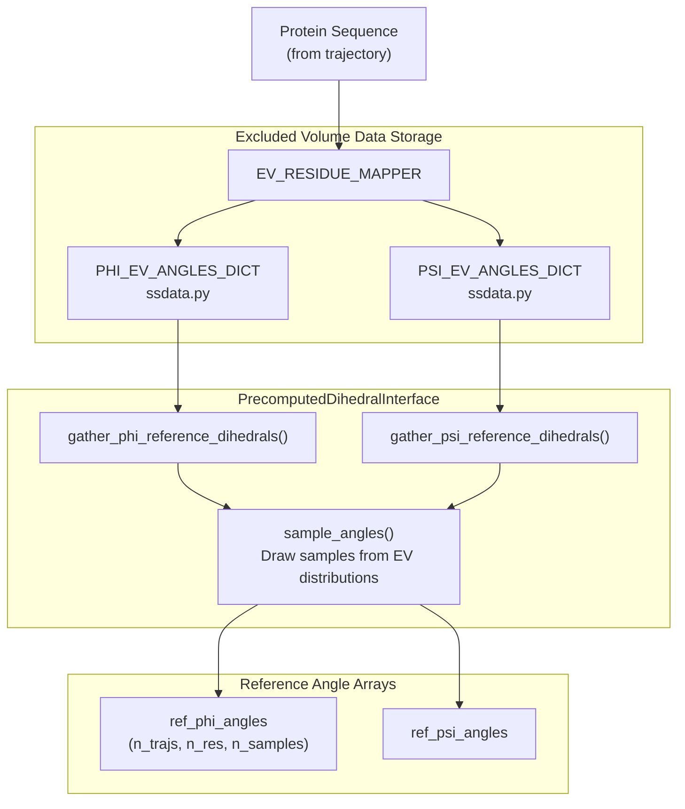
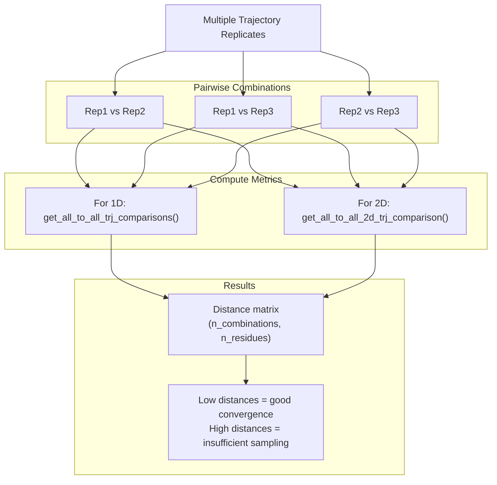
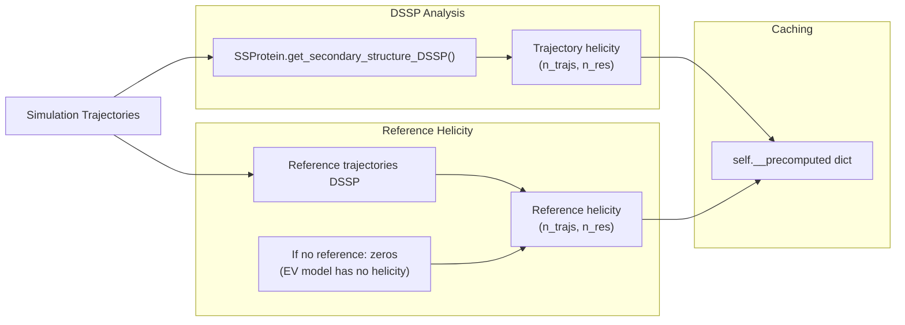
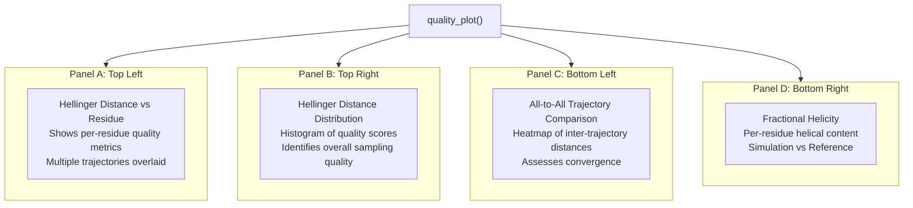
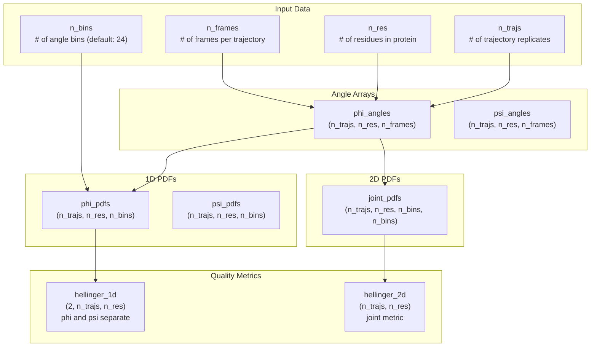
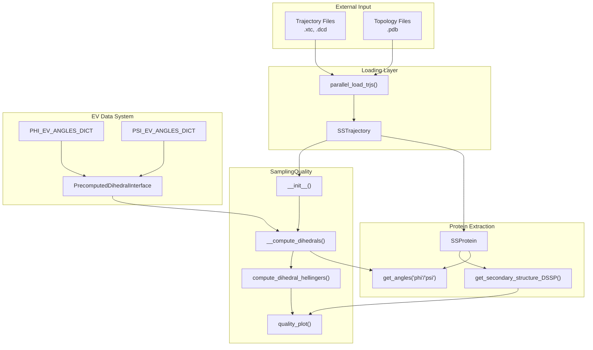

# SamplingQuality: PENGUIN Pipeline

<details>
<summary>Relevant source files</summary>

The following files were used as context for generating this wiki page:

- [README.md](README.md)
- [docs/index.rst](docs/index.rst)
- [docs/modules/sssampling.rst](docs/modules/sssampling.rst)
- [soursop/sssampling.py](soursop/sssampling.py)
- [soursop/sstrajectory.py](soursop/sstrajectory.py)
- [soursop/tests/test_sssampling.py](soursop/tests/test_sssampling.py)

</details>


This page documents the `SamplingQuality` class and the **PENGUIN** (**P**ipeline for **E**valuating co**N**formational hetero**G**eneity in **U**nstructured prote**IN**s) methodology for assessing conformational sampling quality in simulations of intrinsically disordered proteins (IDPs).

The PENGUIN pipeline compares the dihedral angle distributions of simulation trajectories against reference models (typically excluded volume or EV models) to quantify how well a simulation samples the conformational space expected for an unfolded protein. This enables users to determine if their simulations have converged to the limiting polymer behavior or retain residual structure.

**Related Documentation:**
- For loading trajectories, see [SSTrajectory](#3)
- For single-protein analysis methods, see [SSProtein](#4)
- For detailed initialization parameters, see [Initialization and Configuration](#5.1)
- For visualization details, see [Quality Plots and Visualization](#5.5)

---

## Overview of the PENGUIN Methodology

PENGUIN assesses sampling quality by comparing backbone dihedral angle distributions (φ/ψ angles) between simulation trajectories and reference ensembles. The methodology quantifies distributional differences using statistical metrics such as Hellinger distance or relative entropy (Kullback-Leibler divergence).

### Core Workflow



**Methodology Overview**

The pipeline operates in three phases:

1. **Data Acquisition**: Load simulation and reference trajectories, optionally truncating to equal lengths
2. **Distribution Analysis**: Extract dihedral angles and compute probability distributions (1D or 2D)
3. **Quality Assessment**: Quantify distributional differences using statistical distance metrics

Sources: [soursop/sssampling.py:106-234]()

---

## SamplingQuality Class Architecture

The `SamplingQuality` class encapsulates the entire PENGUIN workflow, managing trajectory loading, dihedral extraction, distribution computation, and quality metric calculation.

### Class Structure and Data Flow



Sources: [soursop/sssampling.py:106-234](), [soursop/sssampling.py:235-254]()

---

## Key Components and Methods

### Initialization Parameters

The `SamplingQuality` constructor accepts trajectories and configuration options:

| Parameter | Type | Description |
|-----------|------|-------------|
| `traj_list` | `List[str]` | Paths to simulation trajectory files |
| `reference_list` | `List[str]` or `None` | Paths to reference trajectory files (if None, uses precomputed EV data) |
| `top_file` | `str` | Topology file for simulation trajectories (default: `__START.pdb`) |
| `ref_top` | `str` or `None` | Topology file for reference trajectories |
| `method` | `str` | Comparison method: `"1D angle distributions"` or `"2D angle distributions"` |
| `bwidth` | `float` | Bin width in radians (default: 15° = 0.262 rad) |
| `proteinID` | `int` | Index of protein in `proteinTrajectoryList` to analyze (default: 0) |
| `n_cpus` | `int` | Number of CPUs for parallel loading (default: all available) |
| `truncate` | `bool` | Truncate trajectories to minimum length (default: False) |
| `force_sequential` | `bool` | Force sequential trajectory loading (default: False) |

**Usage Example:**
```python
from soursop.sssampling import SamplingQuality

# Compare simulation to explicit reference trajectories
sq = SamplingQuality(
    traj_list=['sim_rep1.xtc', 'sim_rep2.xtc', 'sim_rep3.xtc'],
    reference_list=['ev_rep1.xtc', 'ev_rep2.xtc', 'ev_rep3.xtc'],
    top_file='sim_topology.pdb',
    ref_top='ev_topology.pdb',
    method='2D angle distributions',
    bwidth=np.deg2rad(15)
)

# Or use precomputed EV data (no reference_list needed)
sq = SamplingQuality(
    traj_list=['sim_rep1.xtc', 'sim_rep2.xtc'],
    top_file='topology.pdb',
    method='2D angle distributions'
)
```

Sources: [soursop/sssampling.py:107-184]()

---

## Dihedral Analysis: 1D vs 2D Methods

PENGUIN supports two methods for comparing dihedral distributions:

### 1D Angle Distributions

Treats φ and ψ angles independently, computing separate PDFs for each angle type and comparing them individually.



**Characteristics:**
- Faster computation
- Returns two separate metric arrays (one for φ, one for ψ)
- Loses information about φ-ψ correlations

Sources: [soursop/sssampling.py:504-514]()

### 2D Angle Distributions

Computes joint φ-ψ probability distributions, preserving correlations between the two angles.



**Characteristics:**
- Captures φ-ψ correlations (e.g., Ramachandran plot structure)
- Computationally more expensive
- Returns a single metric array per trajectory-residue pair
- More sensitive to secondary structure content

Sources: [soursop/sssampling.py:489-502](), [soursop/sssampling.py:523-572]()

---

## Statistical Distance Metrics

PENGUIN uses two primary metrics to quantify distributional differences:

### Hellinger Distance

The Hellinger distance measures the similarity between two probability distributions:

$$H(P,Q) = \frac{1}{\sqrt{2}} \times \sqrt{\sum_{i=1}^{k}(\sqrt{p_i}-\sqrt{q_i})^2}$$

**Properties:**
- Range: [0, 1] where 0 = identical distributions, 1 = completely different
- Symmetric: H(P,Q) = H(Q,P)
- Satisfies triangle inequality (proper metric)

**Implementation:**
```python
# For 1D distributions
hellingers = sq.compute_dihedral_hellingers()  # Returns (phi, psi) tuple or joint array

# Interpretation
# hellingers < 0.2: Good agreement with reference
# hellingers 0.2-0.4: Moderate differences
# hellingers > 0.4: Significant deviation from reference
```

Sources: [soursop/sssampling.py:46-77](), [soursop/sssampling.py:481-522]()

### Relative Entropy (Kullback-Leibler Divergence)

Measures the information loss when Q is used to approximate P:

$$D_{KL}(P||Q) = \sum_{i=1}^{k} p_i \log\left(\frac{p_i}{q_i}\right)$$

**Properties:**
- Range: [0, ∞) where 0 = identical distributions
- Asymmetric: D(P||Q) ≠ D(Q||P)
- Not a proper metric (doesn't satisfy triangle inequality)

**Implementation:**
```python
# Compute relative entropy
rel_entr = sq.compute_dihedral_rel_entropy()  # Returns (phi_rel_entr, psi_rel_entr)
```

Sources: [soursop/sssampling.py:79-103](), [soursop/sssampling.py:574-592]()

---

## Reference Models: EV vs Explicit Trajectories

### Precomputed Excluded Volume (EV) Data

When `reference_list=None`, PENGUIN uses the `PrecomputedDihedralInterface` to load sequence-specific precomputed dihedral distributions from excluded volume simulations.



**Workflow:**
1. Extract sequence from simulation trajectory
2. Map each residue to its EV dihedral distributions
3. Sample angles from precomputed distributions
4. Create synthetic reference angle arrays matching simulation dimensions

**Advantages:**
- No need to run separate reference simulations
- Computationally efficient
- Standardized baseline for comparison

Sources: [soursop/sssampling.py:203-233](), [soursop/sssampling.py:993-1221]()

### Explicit Reference Trajectories

When `reference_list` is provided, PENGUIN loads actual trajectory files and extracts dihedrals directly.

**Use Cases:**
- Comparing different force fields
- Comparing mutations or PTMs
- Comparing simulation protocols
- Validating against experimental ensembles

**Requirements:**
- Reference trajectories must match simulation sequence length
- Use `truncate=True` if trajectories have different frame counts
- Reference topology must be compatible with reference trajectories

Sources: [soursop/sssampling.py:186-200](), [soursop/sssampling.py:403-419]()

---

## Trajectory Comparison and Convergence Analysis

### All-to-All Trajectory Comparisons

PENGUIN can compare multiple simulation replicates to assess convergence:



**Implementation:**
```python
# For 1D method
phi_df, psi_df = sq.get_all_to_all_trj_comparisons(metric='hellingers')

# For 2D method
joint_distances = sq.get_all_to_all_2d_trj_comparison(metric='hellingers')

# Low distances between replicates indicate convergence
```

Sources: [soursop/sssampling.py:766-831](), [soursop/sssampling.py:701-764]()

---

## Fractional Helicity Analysis

PENGUIN complements dihedral analysis with secondary structure content assessment:



**Usage:**
```python
trj_helicity, ref_helicity = sq.compute_frac_helicity(proteinID=0, recompute=False)

# trj_helicity shape: (n_trajectories, n_residues)
# Values: per-residue fraction of frames in helical conformation
```

**Interpretation:**
- High helicity in simulation vs. low in EV reference → residual structure
- Helicity patterns can indicate specific regions prone to transient structure
- Complements dihedral analysis for comprehensive quality assessment

Sources: [soursop/sssampling.py:434-479]()

---

## Visualization with quality_plot()

The `quality_plot()` method generates comprehensive 4-panel figures for visual quality assessment:

### Plot Structure



### Method Parameters

| Parameter | Type | Default | Description |
|-----------|------|---------|-------------|
| `dihedral` | `str` | `"2D"` | Which angle to plot: `"2D"`, `"phi"`, or `"psi"` |
| `increment` | `int` | `5` | X-axis stride for residue labels |
| `figsize` | `Tuple[int,int]` | `(7,5)` | Figure dimensions in inches |
| `dpi` | `int` | `400` | Resolution for saved figure |
| `panel_labels` | `bool` | `False` | Add A/B/C/D panel labels |
| `fontsize` | `int` | `10` | Font size for labels |
| `save_dir` | `str` | `None` | Directory to save figure (if provided) |
| `figname` | `str` | `"hellingers.pdf"` | Output filename |

**Usage Example:**
```python
fig, axd = sq.quality_plot(
    dihedral='2D',
    increment=5,
    figsize=(10, 8),
    dpi=300,
    save_dir='./figures',
    figname='sampling_quality_assessment.pdf'
)
```

Sources: [soursop/sssampling.py:846-989]()

---

## Complete Workflow Example

### Typical PENGUIN Analysis

```python
from soursop.sssampling import SamplingQuality
import numpy as np

# Initialize with multiple simulation replicates
# Using precomputed EV reference (no reference_list)
sq = SamplingQuality(
    traj_list=['sim1.xtc', 'sim2.xtc', 'sim3.xtc'],
    top_file='topology.pdb',
    method='2D angle distributions',
    bwidth=np.deg2rad(15),
    proteinID=0,
    truncate=True  # Ensure equal lengths
)

# Compute quality metrics
hellingers = sq.compute_dihedral_hellingers()
print(f"Hellinger distances shape: {hellingers.shape}")  # (n_trajs, n_residues)

# Assess convergence between replicates
all_to_all = sq.get_all_to_all_2d_trj_comparison()
print(f"Mean inter-replicate Hellinger: {np.mean(all_to_all)}")

# Compute fractional helicity
trj_hel, ref_hel = sq.compute_frac_helicity()
print(f"Mean simulation helicity: {np.mean(trj_hel)}")

# Generate comprehensive visualization
fig, axd = sq.quality_plot(
    dihedral='2D',
    save_dir='./output',
    figname='quality_assessment.pdf'
)
```

Sources: [soursop/sssampling.py:106-234](), [soursop/tests/test_sssampling.py:31-55]()

---

## Performance Considerations

### Computational Costs

| Operation | Complexity | Notes |
|-----------|-----------|-------|
| Trajectory loading | O(n_frames × n_atoms) | Use `n_cpus` for parallel loading |
| Dihedral extraction | O(n_trajs × n_frames × n_res) | Linear in trajectory dimensions |
| 1D PDF computation | O(n_trajs × n_res × n_frames × n_bins) | Fast, independent angles |
| 2D PDF computation | O(n_trajs × n_res × n_frames × n_bins²) | More expensive, joint distributions |
| Hellinger distance (1D) | O(n_trajs × n_res × n_bins) | Two separate calculations |
| Hellinger distance (2D) | O(n_trajs × n_res × n_bins²) | Single joint calculation |

### Optimization Tips

1. **Parallel Loading**: Set `n_cpus` appropriately for your system
2. **Sequential for Single Trajectory**: Use `force_sequential=True` if loading only one trajectory
3. **Stride During Loading**: Pass `stride=N` in kwargs to subsample frames
4. **Precomputed EV**: Faster than loading explicit reference trajectories
5. **1D Method**: Use for quick screening; 2D method for detailed analysis
6. **Caching**: Results are cached in `self.__precomputed` to avoid recomputation

Sources: [soursop/sssampling.py:235-254](), [soursop/sssampling.py:255-310]()

---

## Data Structures and Array Shapes

### Key Array Dimensions



Sources: [soursop/sssampling.py:380-432](), [soursop/sssampling.py:594-700]()

---

## Integration with SOURSOP Ecosystem

### Relationship to Core Classes



**Key Dependencies:**
- Uses `SSTrajectory` for trajectory management ([see SSTrajectory](#3))
- Relies on `SSProtein.get_angles()` for dihedral extraction ([see SSProtein](#4))
- Imports EV data from `ssdata` module ([see ssdata](#7.3))
- Uses `parallel_load_trjs()` for efficient loading
- Integrates with `ssutils` for validation

Sources: [soursop/sssampling.py:24-33](), [soursop/sssampling.py:255-310]()

---