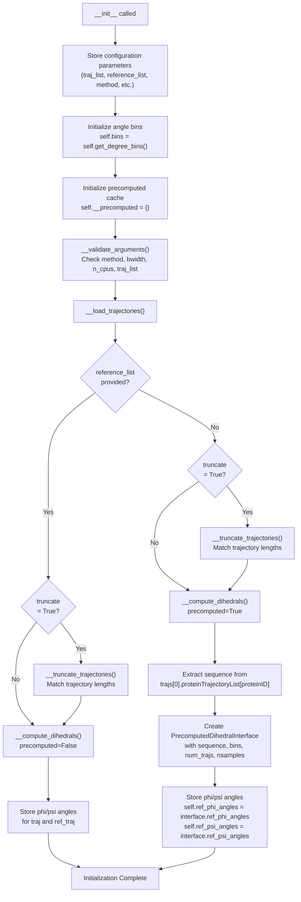
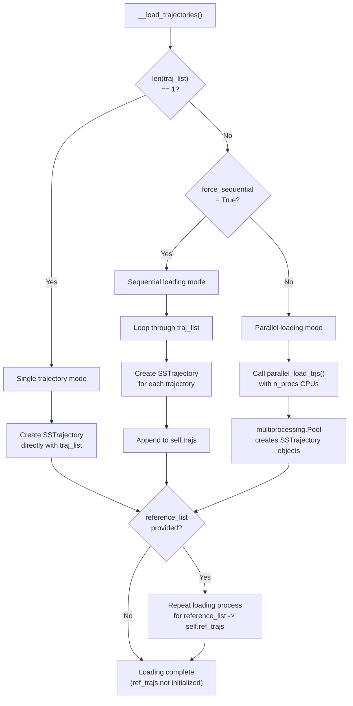
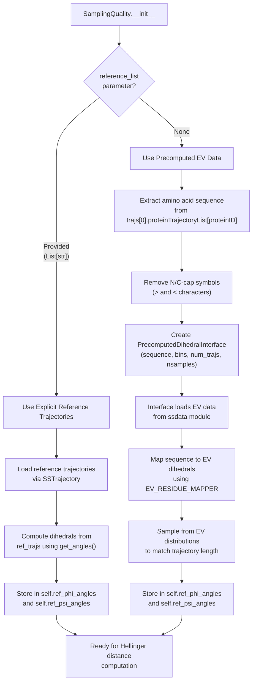

# Initialization and Configuration

<details>
<summary>Relevant source files</summary>

The following files were used as context for generating this wiki page:

- [soursop/sssampling.py](soursop/sssampling.py)
- [soursop/sstrajectory.py](soursop/sstrajectory.py)
- [soursop/tests/test_sssampling.py](soursop/tests/test_sssampling.py)

</details>


This page documents the initialization and configuration of the `SamplingQuality` class, which implements the PENGUIN (Protein ENsemble Quality evalUatIoN) methodology for assessing conformational sampling quality in molecular dynamics trajectories.

**Scope**: This page covers constructor parameters, initialization flow, trajectory loading options, reference model selection, and validation. For information about computing sampling metrics after initialization, see [Dihedral Analysis](#5.2) and [Hellinger Distance and Relative Entropy](#5.3). For details on the excluded volume (EV) reference model, see [Reference Models and EV Data](#5.4).

## Overview

The `SamplingQuality` class compares simulation trajectories against reference models to assess whether conformational sampling is adequate. The class is initialized with trajectory lists and configuration options, then internally:

1. Validates input parameters
2. Loads trajectories (in parallel or sequentially)
3. Extracts backbone dihedral angles (φ/ψ)
4. Obtains reference distributions (from trajectories or precomputed EV data)

Sources: [soursop/sssampling.py:106-234]()

## Constructor Signature

```python
SamplingQuality(
    traj_list: List[str],
    reference_list: Union[List[str], None] = None,
    top_file: str = "__START.pdb",
    ref_top: Union[str, None] = None,
    method: str = "2D angle distributions",
    bwidth: float = np.deg2rad(15),
    proteinID: int = 0,
    n_cpus: int = None,
    truncate: bool = False,
    force_sequential: bool = False,
    **kwargs: dict
)
```

Sources: [soursop/sssampling.py:107-120]()

## Configuration Parameters

The following table describes all initialization parameters:

| Parameter | Type | Default | Description |
|-----------|------|---------|-------------|
| `traj_list` | `List[str]` | **required** | List of trajectory file paths to analyze |
| `reference_list` | `Union[List[str], None]` | `None` | List of reference trajectory paths; if `None`, uses precomputed EV data |
| `top_file` | `str` | `"__START.pdb"` | Topology file path for simulation trajectories |
| `ref_top` | `Union[str, None]` | `None` | Topology file path for reference trajectories; uses `top_file` if `None` |
| `method` | `str` | `"2D angle distributions"` | Comparison method: `"2D angle distributions"` or `"1D angle distributions"` |
| `bwidth` | `float` | `np.deg2rad(15)` | Bin width in radians for histogramming dihedral angles |
| `proteinID` | `int` | `0` | Index of protein in `proteinTrajectoryList` to analyze |
| `n_cpus` | `int` | `None` | Number of CPUs for parallel loading; `None` uses all available cores |
| `truncate` | `bool` | `False` | If `True`, truncate all trajectories to minimum length |
| `force_sequential` | `bool` | `False` | If `True`, load trajectories sequentially instead of in parallel |
| `**kwargs` | `dict` | `{}` | Additional keyword arguments passed to `SSTrajectory` constructor (e.g., `stride`) |

Sources: [soursop/sssampling.py:121-165]()

## Initialization Flow

The following diagram shows the sequence of operations during `SamplingQuality` initialization:



Sources: [soursop/sssampling.py:166-234]()

## Argument Validation

During initialization, the `__validate_arguments()` method performs the following checks:

**Method Validation**
- Ensures `method` is either `"2D angle distributions"` or `"1D angle distributions"`
- Raises `SSException` if invalid method specified

**Bin Width Validation**
- Ensures `bwidth` is between 0 and 2π radians
- Raises `SSException` if out of range

**CPU Count Configuration**
- If `n_cpus` is `None`, sets to `os.cpu_count()` (all available cores)

**Trajectory List Validation**
- Ensures `traj_list` is non-empty
- Raises `SSException` if empty

Sources: [soursop/sssampling.py:235-254]()

## Trajectory Loading

### Loading Strategy Decision Tree



Sources: [soursop/sssampling.py:255-311]()

### Parallel Loading Implementation

When loading multiple trajectories with `force_sequential=False` (default), SOURSOP uses `parallel_load_trjs()` from `sstrajectory` module:

- **Function**: `parallel_load_trjs(trj_filenames, top_filenames, n_procs, **kwargs)`
- **Location**: [soursop/sstrajectory.py:1173-1208]()
- **Mechanism**: Uses `multiprocessing.Pool` to distribute trajectory loading across CPU cores
- **Benefits**: Significantly faster for multiple trajectories, especially with large files

The `**kwargs` passed to `SamplingQuality` are forwarded to each `SSTrajectory` constructor, enabling options like:
- `stride`: Load every nth frame
- `pdblead`: Include PDB structure as first frame
- `extra_valid_residue_names`: Recognize additional residue types

Sources: [soursop/sssampling.py:298-310](), [soursop/sstrajectory.py:1173-1208]()

## Trajectory Truncation

When `truncate=True`, the `__truncate_trajectories()` method ensures all trajectories have identical frame counts:

**Truncation Algorithm**:
1. Collect frame counts from all trajectories in `self.trajs` (and `self.ref_trajs` if present)
2. Compute `self.min_length = np.min(lengths)`
3. Create new `SSTrajectory` objects by slicing each trajectory: `traj[0:self.min_length]`
4. Replace `self.trajs` and `self.ref_trajs` with truncated versions

**Use Case**: Useful for comparing ongoing simulations that haven't all reached the same length yet.

Sources: [soursop/sssampling.py:312-378]()

## Method Selection: 1D vs 2D Angle Distributions

The `method` parameter determines how dihedral angle distributions are compared:

| Method | Description | Hellinger Distance Computation |
|--------|-------------|-------------------------------|
| `"1D angle distributions"` | Compares φ and ψ distributions separately | Computes HD for φ PDFs and ψ PDFs independently |
| `"2D angle distributions"` | Compares joint φ-ψ distributions | Computes HD for 2D histograms in φ-ψ space |

**Impact on Output Shape**:
- **1D method**: Returns `(2, n_trajectories, n_residues)` array where axis 0 is φ/ψ
- **2D method**: Returns `(n_trajectories, n_residues)` array with joint angle comparison

Sources: [soursop/sssampling.py:481-521]()

## Bin Configuration

The bin edges for histogramming dihedral angles are computed by `get_degree_bins()`:

```python
def get_degree_bins(self) -> np.ndarray:
    bwidth = np.round(np.rad2deg(self.bwidth))
    bins = np.arange(-180, 180 + bwidth, bwidth)
    return bins
```

**Default Configuration** (`bwidth=np.deg2rad(15)`):
- Bin width: 15 degrees
- Bins: [-180, -165, -150, ..., 165, 180]
- Total bins: 24

**Storage**: Bins are computed once during initialization and stored in `self.bins`.

Sources: [soursop/sssampling.py:833-844]()

## Reference Model Selection

### Decision Logic



Sources: [soursop/sssampling.py:186-234]()

### PrecomputedDihedralInterface

When `reference_list=None`, the `PrecomputedDihedralInterface` class provides excluded volume (EV) reference distributions:

**Class Location**: [soursop/sssampling.py:1208-1322]()

**Key Methods**:
- `gather_phi_reference_dihedrals(sequence)`: Retrieves φ angle distributions from `PHI_EV_ANGLES_DICT`
- `gather_psi_reference_dihedrals(sequence)`: Retrieves ψ angle distributions from `PSI_EV_ANGLES_DICT`
- `sample_angles(angle)`: Samples from EV distributions to generate synthetic trajectories matching the length of input trajectories

**Mapping Process**:
1. For each residue in sequence, determine preceding (φ) or subsequent (ψ) residue context
2. Map residue type using `EV_RESIDUE_MAPPER` to approximate residue class
3. Retrieve precomputed angle distribution from `PHI_EV_ANGLES_DICT` or `PSI_EV_ANGLES_DICT`
4. Sample angles from distribution using inverse CDF method

Sources: [soursop/sssampling.py:1208-1322](), [soursop/ssdata.py:26-30]()

## Class Attributes Initialized

After successful initialization, the following attributes are available:

| Attribute | Type | Description |
|-----------|------|-------------|
| `self.trajs` | `List[SSTrajectory]` | List of loaded simulation trajectories |
| `self.ref_trajs` | `List[SSTrajectory]` or `None` | List of loaded reference trajectories (if provided) |
| `self.phi_angles` | `np.ndarray` | φ dihedral angles from simulation trajectories |
| `self.psi_angles` | `np.ndarray` | ψ dihedral angles from simulation trajectories |
| `self.ref_phi_angles` | `np.ndarray` | φ dihedral angles from reference model |
| `self.ref_psi_angles` | `np.ndarray` | ψ dihedral angles from reference model |
| `self.bins` | `np.ndarray` | Bin edges for angle histograms |
| `self.__precomputed` | `dict` | Cache for computed PDFs and metrics |
| `self.min_length` | `int` | Minimum trajectory length (if `truncate=True`) |

Sources: [soursop/sssampling.py:166-234]()

## Example Usage Patterns

### Basic Usage with Precomputed EV Reference

```python
from soursop.sssampling import SamplingQuality

# Analyze trajectories against EV model
sq = SamplingQuality(
    traj_list=['traj1.xtc', 'traj2.xtc', 'traj3.xtc'],
    top_file='topology.pdb',
    method='2D angle distributions',
    proteinID=0
)
```

### Using Explicit Reference Trajectories

```python
# Compare WT against mutant simulations
sq = SamplingQuality(
    traj_list=['wt_rep1.xtc', 'wt_rep2.xtc'],
    reference_list=['mutant_rep1.xtc', 'mutant_rep2.xtc'],
    top_file='wt_topology.pdb',
    ref_top='mutant_topology.pdb',
    method='1D angle distributions'
)
```

### With Stride and Truncation

```python
# Load every 10th frame and ensure equal lengths
sq = SamplingQuality(
    traj_list=['sim1.dcd', 'sim2.dcd', 'sim3.dcd'],
    top_file='start.pdb',
    truncate=True,
    stride=10  # Passed to SSTrajectory
)
```

### Sequential Loading for Memory-Constrained Systems

```python
# Force sequential loading to reduce memory footprint
sq = SamplingQuality(
    traj_list=['large_traj1.xtc', 'large_traj2.xtc'],
    top_file='topology.pdb',
    force_sequential=True,
    n_cpus=1
)
```

Sources: [soursop/tests/test_sssampling.py:31-102]()

## Error Handling

Common initialization errors and their causes:

| Exception | Cause | Solution |
|-----------|-------|----------|
| `SSException: Input trajectory list must be non-empty` | `traj_list=[]` passed | Provide at least one trajectory path |
| `SSException: The bwidth parameter must be between 0 and 2*pi` | Invalid `bwidth` value | Use values like `np.deg2rad(15)` |
| `SSException: 'method' must be one of ...` | Invalid `method` string | Use `"1D angle distributions"` or `"2D angle distributions"` |
| `ValueError: Failed to load SSTrajectory` | Trajectory/topology mismatch | Ensure topology matches trajectory atom count |

Sources: [soursop/sssampling.py:235-254](), [soursop/sstrajectory.py:1167-1171]()

---