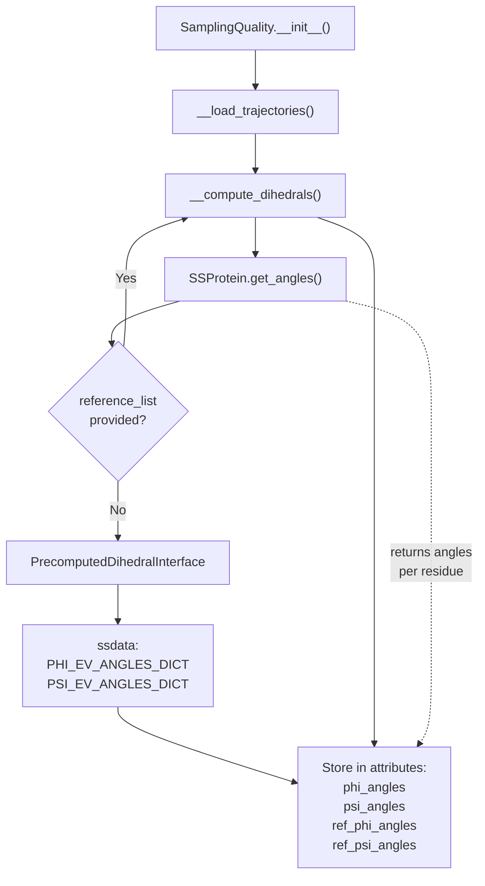
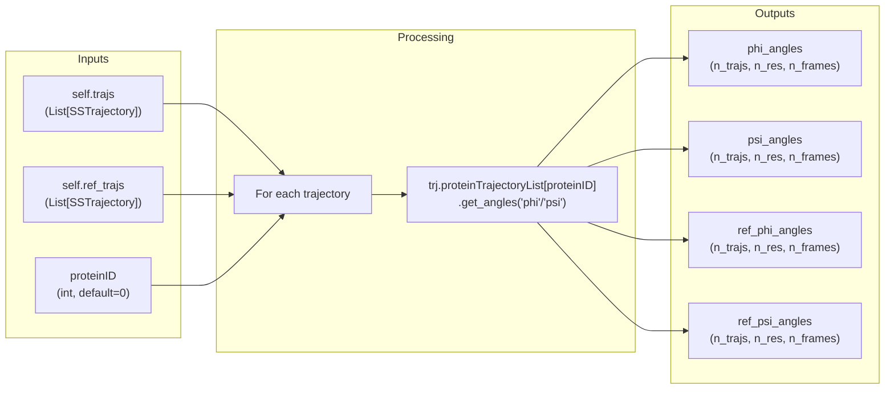
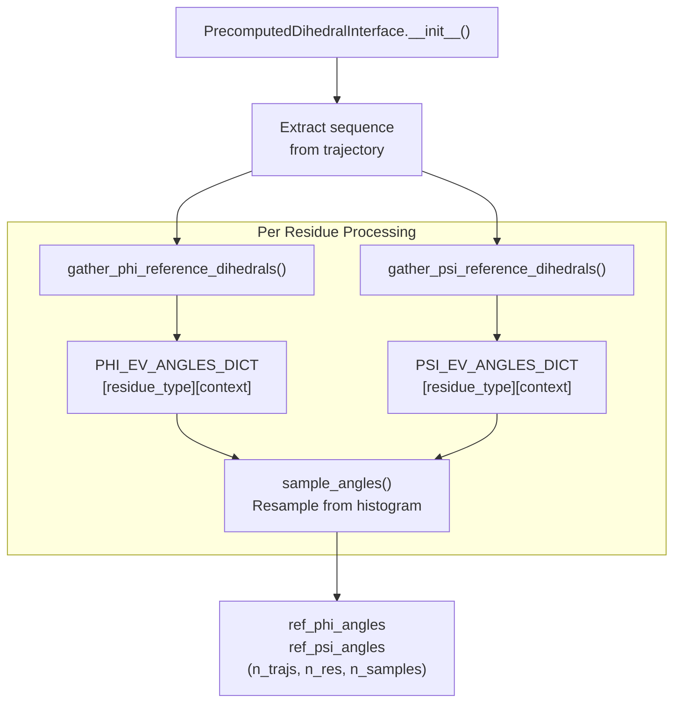
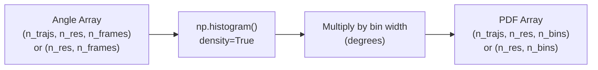
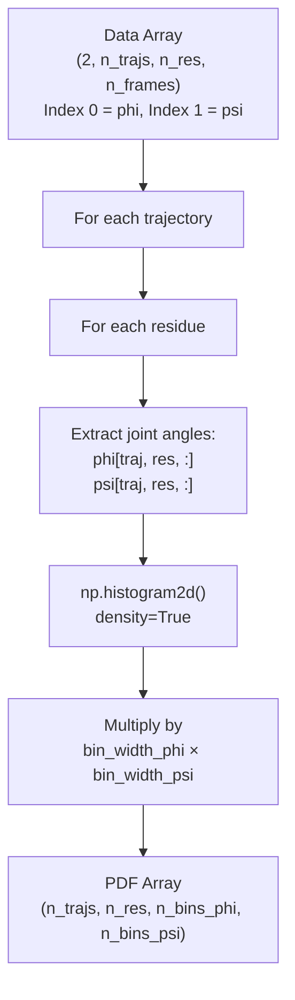
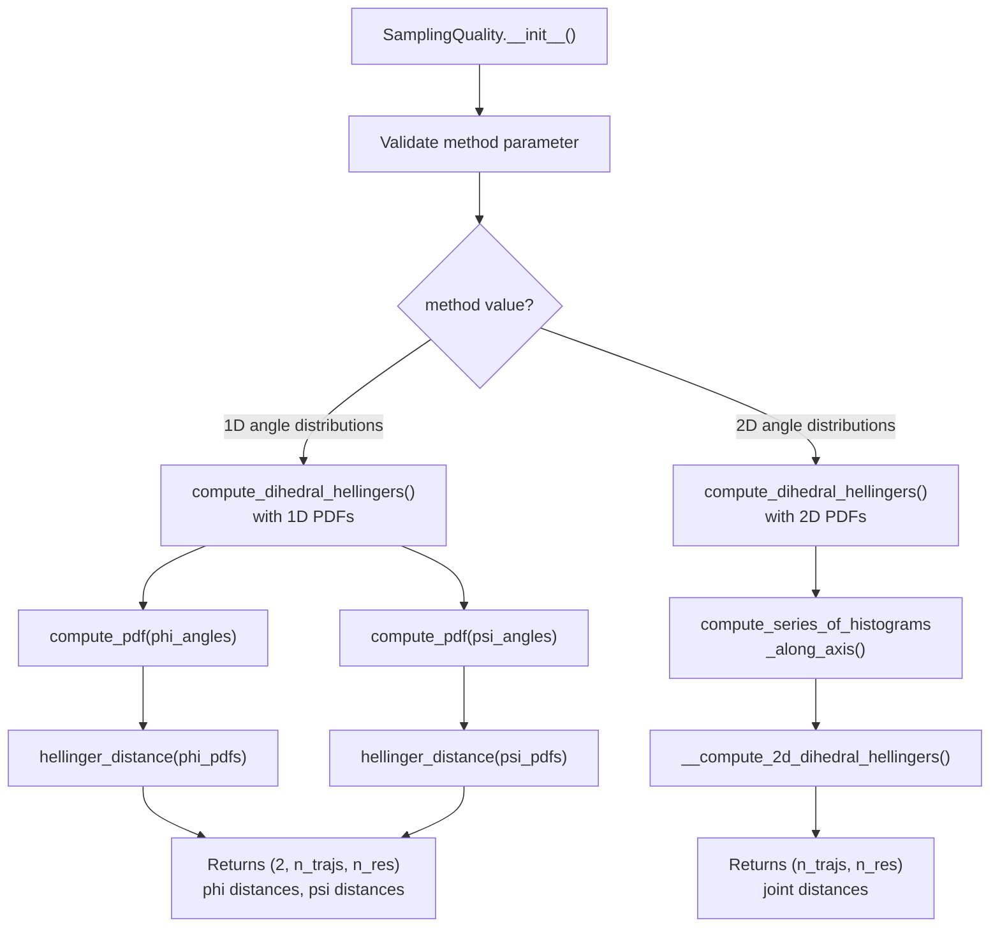
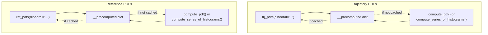
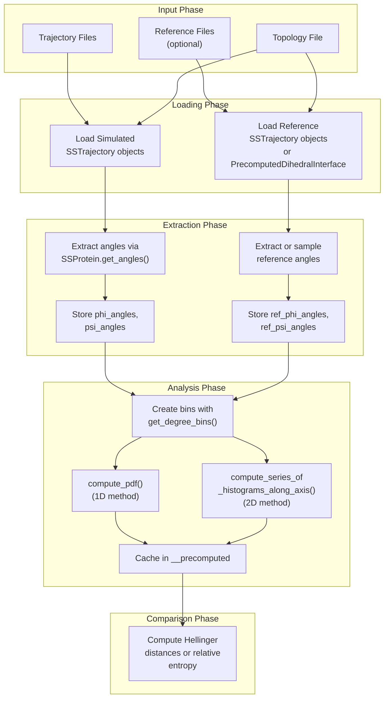

# Dihedral Analysis

<details>
<summary>Relevant source files</summary>

The following files were used as context for generating this wiki page:

- [soursop/sssampling.py](soursop/sssampling.py)
- [soursop/sstrajectory.py](soursop/sstrajectory.py)
- [soursop/tests/test_sssampling.py](soursop/tests/test_sssampling.py)

</details>


This page documents the dihedral angle analysis subsystem within the `SamplingQuality` class, which is the core of the PENGUIN (Protein ENsemble quality through Good and Unwavering measures IN dihedral space) methodology. Dihedral analysis extracts backbone phi (φ) and psi (ψ) angles from simulation trajectories and converts them into probability distributions for comparison with reference models.

For information about computing distance metrics between these distributions, see [Hellinger Distance and Relative Entropy](#5.3). For information about the excluded volume reference model system, see [Reference Models and EV Data](#5.4). For visualization of sampling quality results, see [Quality Plots and Visualization](#5.5).

## Overview

The dihedral analysis subsystem performs four primary operations:

1. **Extraction**: Extract φ and ψ backbone dihedral angles from trajectory frames
2. **Binning**: Discretize the continuous angle space (-180° to +180°) into bins
3. **Histogramming**: Compute probability density functions (PDFs) from angle distributions
4. **Storage**: Cache computed angles and PDFs for reuse in downstream analyses

The system supports two analysis modes: "1D angle distributions" (φ and ψ treated independently) and "2D angle distributions" (joint φ-ψ distributions per residue).

**Sources**: [soursop/sssampling.py:106-244]()

## Dihedral Angle Extraction

### Extraction Pipeline



### Implementation Details

The `__compute_dihedrals()` method is called during initialization and extracts angles from both simulated and reference trajectories:



The extracted angles are stored as NumPy arrays with shape `(n_trajectories, n_residues, n_frames)`, where:
- Each trajectory is analyzed independently
- Each residue has its own angle time series
- Angles are returned in **degrees** by `get_angles()` (converted from radians by SSProtein)

**Sources**: [soursop/sssampling.py:380-432](), [soursop/sssampling.py:194-233]()

### Reference Data Handling

When no reference trajectories are provided (`reference_list=None`), the system uses precomputed excluded volume (EV) angle distributions via the `PrecomputedDihedralInterface` class:



The `PrecomputedDihedralInterface` retrieves context-dependent angle distributions from `ssdata` and resamples them to match the trajectory length. For φ angles, the context is the **preceding** residue; for ψ angles, the context is the **subsequent** residue.

**Sources**: [soursop/sssampling.py:1208-1321](), [soursop/sssampling.py:211-233]()

## Angle Binning Strategy

### Bin Edge Generation

The `get_degree_bins()` method creates bin edges for discretizing angle space:

| Parameter | Value | Description |
|-----------|-------|-------------|
| `bwidth` | User-defined (default: 15°) | Bin width in radians, converted to degrees |
| Range | -180° to +180° | Full dihedral angle space |
| Number of bins | `360 / bwidth` | Total bins spanning the range |

The method returns an array of bin edges suitable for `np.histogram()`:

```python
bwidth_deg = np.round(np.rad2deg(self.bwidth))  # e.g., 15°
bins = np.arange(-180, 180 + bwidth_deg, bwidth_deg)
# bins = [-180, -165, -150, ..., 165, 180]
```

**Sources**: [soursop/sssampling.py:833-844]()

### Validation

The `bwidth` parameter is validated during initialization to ensure:
- `0 < bwidth < 2π` (in radians)
- Physically meaningful bin sizes (typically 10-20°)

**Sources**: [soursop/sssampling.py:240-244]()

## Probability Density Functions

### PDF Computation: 1D Case

The `compute_pdf()` method converts angle arrays into probability density functions:



**Key Implementation Detail**: The method converts probability **density** to probability **mass** by multiplying by the bin width in degrees:

```python
pdf = np.histogram(col, bins=bins, density=True)[0] * np.round(np.rad2deg(self.bwidth))
```

This ensures that the PDF values represent actual probabilities (sum to ~1.0) rather than probability densities (integrate to 1.0).

**Sources**: [soursop/sssampling.py:658-699]()

### PDF Computation: 2D Case

For joint φ-ψ distributions, the `compute_series_of_histograms_along_axis()` method creates 2D histograms:



The 2D PDFs capture correlations between φ and ψ angles, which is important for assessing conformational sampling quality since backbone angles are not independent.

**Sources**: [soursop/sssampling.py:594-656]()

## Analysis Methods: 1D vs 2D

The `SamplingQuality` class supports two analysis methods specified by the `method` parameter:

### Method Comparison Table

| Aspect | "1D angle distributions" | "2D angle distributions" |
|--------|--------------------------|--------------------------|
| **PDF Shape** | `(n_trajs, n_res, n_bins)` per angle | `(n_trajs, n_res, n_bins_phi, n_bins_psi)` |
| **Computation** | `compute_pdf()` on phi and psi separately | `compute_series_of_histograms_along_axis()` on joint angles |
| **Statistical Metric** | Hellinger distance per angle | Joint Hellinger distance per residue |
| **Captured Information** | Marginal distributions | Joint distribution with correlations |
| **Computational Cost** | Lower (2 × 1D histograms) | Higher (1 × 2D histogram) |
| **Use Case** | Quick assessment, large systems | Detailed assessment, smaller systems |

### Method Selection Logic



**Sources**: [soursop/sssampling.py:481-521](), [soursop/sssampling.py:235-238]()

## Accessing Computed Data

### Direct Attribute Access

After initialization, dihedral angles are stored as instance attributes:

| Attribute | Shape | Description |
|-----------|-------|-------------|
| `phi_angles` | `(n_trajs, n_res, n_frames)` | φ angles from simulated trajectories |
| `psi_angles` | `(n_trajs, n_res, n_frames)` | ψ angles from simulated trajectories |
| `ref_phi_angles` | `(n_trajs, n_res, n_frames)` | φ angles from reference model |
| `ref_psi_angles` | `(n_trajs, n_res, n_frames)` | ψ angles from reference model |
| `bins` | `(n_bins + 1,)` | Bin edges in degrees |

**Sources**: [soursop/sssampling.py:179](), [soursop/sssampling.py:194-233]()

### PDF Accessor Methods

The class provides methods to access computed PDFs with automatic caching:



#### Method Signatures

**`trj_pdfs(dihedral='joint', recompute=False)`**
- `dihedral`: `'trj_phi_pdfs'`, `'trj_psi_pdfs'`, or `'joint'`
- Returns: Cached or newly computed PDFs from simulated trajectories

**`ref_pdfs(dihedral='joint', recompute=False)`**
- `dihedral`: `'ref_phi_pdfs'`, `'ref_psi_pdfs'`, or `'joint'`
- Returns: Cached or newly computed PDFs from reference trajectories

The `recompute=True` flag forces recomputation even if cached values exist.

**Sources**: [soursop/sssampling.py:1064-1161]()

### Caching Strategy

The `__precomputed` dictionary stores expensive computations:

| Cache Key | Content | Computed By |
|-----------|---------|-------------|
| `'trj_phi_pdfs'` | φ PDFs from simulated data | `compute_pdf()` |
| `'trj_psi_pdfs'` | ψ PDFs from simulated data | `compute_pdf()` |
| `'ref_phi_pdfs'` | φ PDFs from reference data | `compute_pdf()` |
| `'ref_psi_pdfs'` | ψ PDFs from reference data | `compute_pdf()` |
| `'joint'` | 2D joint PDFs | `compute_series_of_histograms_along_axis()` |
| `'hellingers'` | Hellinger distances | `compute_dihedral_hellingers()` |
| `'trj_helicity'` | Fractional helicity from simulated data | `compute_frac_helicity()` |
| `'ref_helicity'` | Fractional helicity from reference data | `compute_frac_helicity()` |

**Sources**: [soursop/sssampling.py:180](), [soursop/sssampling.py:1094-1109]()

## Data Flow Summary



**Sources**: [soursop/sssampling.py:106-244](), [soursop/sssampling.py:380-432](), [soursop/sssampling.py:481-521](), [soursop/sssampling.py:658-699](), [soursop/sssampling.py:594-656]()

## Usage Example Pattern

The typical workflow for dihedral analysis is:

1. **Initialize** `SamplingQuality` with trajectory lists and method choice
2. **Access angles** directly via `phi_angles`, `psi_angles` attributes if needed
3. **Compute PDFs** via `trj_pdfs()` and `ref_pdfs()` (automatically cached)
4. **Compare distributions** via `compute_dihedral_hellingers()` (see [Hellinger Distance and Relative Entropy](#5.3))
5. **Visualize results** via `quality_plot()` (see [Quality Plots and Visualization](#5.5))

The system handles all intermediate computations automatically, caching expensive operations to avoid recomputation.

**Sources**: [soursop/tests/test_sssampling.py:31-54](), [soursop/tests/test_sssampling.py:85-102]()

---