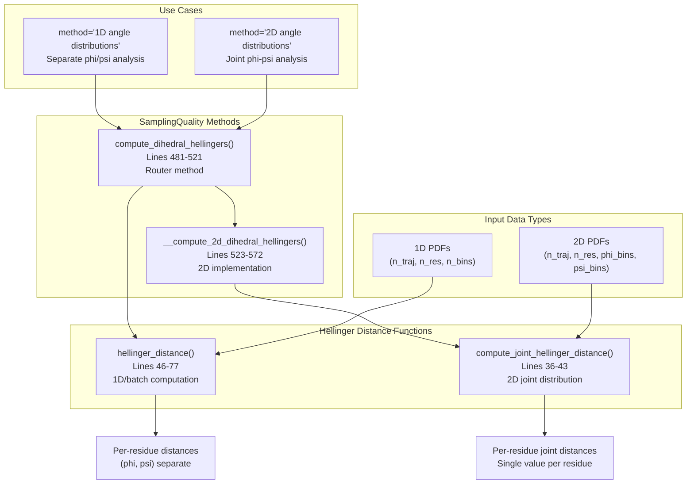
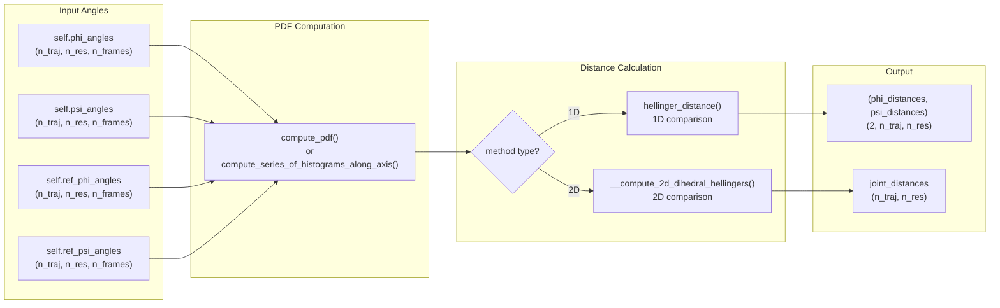
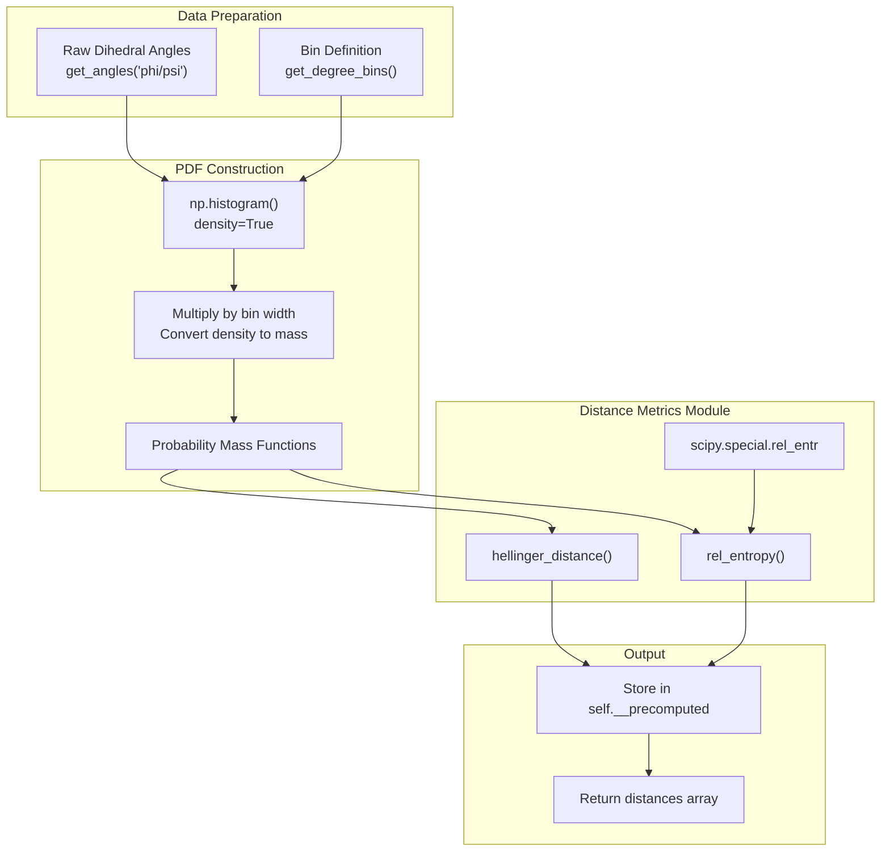

# Hellinger Distance and Relative Entropy

<details>
<summary>Relevant source files</summary>

The following files were used as context for generating this wiki page:

- [soursop/sssampling.py](soursop/sssampling.py)
- [soursop/sstrajectory.py](soursop/sstrajectory.py)
- [soursop/tests/test_sssampling.py](soursop/tests/test_sssampling.py)

</details>


This page documents the statistical distance metrics used in the PENGUIN sampling quality assessment pipeline to compare probability distributions of dihedral angles. These metrics quantify how similar or different two distributions are, providing a numerical measure of conformational sampling quality. For information about the broader PENGUIN pipeline, see [Initialization and Configuration](#5.1) and [Dihedral Analysis](#5.2). For visualization of results, see [Quality Plots and Visualization](#5.5).

## Purpose and Mathematical Foundation

The `SamplingQuality` class uses two primary statistical distance metrics to compare simulated trajectories against reference models (typically excluded volume limit):

1. **Hellinger Distance**: A symmetric measure bounded between 0 (identical distributions) and 1 (completely different distributions)
2. **Relative Entropy (Kullback-Leibler Divergence)**: An asymmetric measure that quantifies information loss when approximating one distribution with another

Both metrics operate on probability distributions computed from backbone dihedral angles (phi/psi). The choice of metric depends on the specific analysis requirements and desired mathematical properties.

Sources: [soursop/sssampling.py:36-103]()

## Hellinger Distance

### Mathematical Definition

The Hellinger distance between two discrete probability distributions P and Q is defined as:

```
H(P,Q) = (1/√2) × √(Σᵢ(√pᵢ - √qᵢ)²)
```

where pᵢ and qᵢ are the probability mass at bin i. This metric has several useful properties:
- **Symmetric**: H(P,Q) = H(Q,P)
- **Bounded**: 0 ≤ H(P,Q) ≤ 1
- **Metric**: Satisfies the triangle inequality

Sources: [soursop/sssampling.py:46-77]()

### Implementation Architecture



Sources: [soursop/sssampling.py:36-77](), [soursop/sssampling.py:481-572]()

### Function: `hellinger_distance()`

The `hellinger_distance()` function computes Hellinger distances for sets of probability distributions:

**Parameters:**
- `p` (np.ndarray): First probability distribution(s), with datapoints in last axis
- `q` (np.ndarray): Second probability distribution(s), matching shape of `p`

**Returns:**
- `np.ndarray`: Hellinger distance(s) between p and q

**Implementation Details:**

The function uses vectorized NumPy operations for efficient batch computation:

```python
numerator = np.sum(np.square(np.sqrt(p) - np.sqrt(q)), axis=-1)
denominator = np.sqrt(2)
return np.sqrt(numerator) / denominator
```

The `axis=-1` parameter ensures the sum is computed over the last dimension (bins), allowing the function to handle:
- Single distributions: shape `(n_bins,)`
- Sets of distributions: shape `(n_res, n_bins)` or `(n_traj, n_res, n_bins)`

Sources: [soursop/sssampling.py:46-77]()

### Function: `compute_joint_hellinger_distance()`

For 2D joint distributions (phi-psi pairs), a specialized function computes the Hellinger distance using the Bhattacharyya coefficient:

**Mathematical Approach:**
1. Compute Bhattacharyya coefficient: BC = Σᵢⱼ √(pᵢⱼ × qᵢⱼ)
2. Compute Hellinger distance: H = √(1 - BC)

This formulation is mathematically equivalent but more numerically stable for 2D distributions:

```python
b_coefficient = np.sum(np.sqrt(p * q))
distance = np.sqrt(1 - b_coefficient)
```

Note that this version omits the `1/√2` normalization factor present in the standard formula.

Sources: [soursop/sssampling.py:36-43]()

### 1D vs 2D Computation Methods

The `SamplingQuality` class supports two methods for computing Hellinger distances, controlled by the `method` parameter:

| Method | Distributions | Output | Use Case |
|--------|--------------|--------|----------|
| `"1D angle distributions"` | Separate phi and psi PDFs | Two arrays: phi distances, psi distances | Analyze phi and psi independently |
| `"2D angle distributions"` | Joint phi-psi 2D histograms | Single array: joint distances | Consider phi-psi coupling |

**1D Method Implementation:**

```python
# Lines 504-514
phi_trj_pdfs = self.compute_pdf(self.phi_angles, bins=self.bins)
phi_ref_trj_pdfs = self.compute_pdf(self.ref_phi_angles, bins=self.bins)

psi_trj_pdfs = self.compute_pdf(self.psi_angles, bins=self.bins)
psi_ref_trj_pdfs = self.compute_pdf(self.ref_psi_angles, bins=self.bins)

phi_hellingers = hellinger_distance(phi_trj_pdfs, phi_ref_trj_pdfs)
psi_hellingers = hellinger_distance(psi_trj_pdfs, psi_ref_trj_pdfs)
```

**2D Method Implementation:**

The 2D method constructs joint probability distributions and computes a single distance metric per residue that captures phi-psi correlations. The implementation iterates over trajectory replicates and residues to compute pairwise joint distances.

Sources: [soursop/sssampling.py:481-572]()

## Relative Entropy (Kullback-Leibler Divergence)

### Mathematical Definition

The relative entropy (KL divergence) from Q to P is defined as:

```
DKL(P||Q) = Σᵢ pᵢ log(pᵢ/qᵢ)
```

This metric measures the information lost when Q is used to approximate P. Important properties:
- **Asymmetric**: DKL(P||Q) ≠ DKL(Q||P)
- **Non-negative**: DKL(P||Q) ≥ 0
- **Not a metric**: Does not satisfy triangle inequality

The implementation uses SciPy's `rel_entr()` function which handles edge cases (zeros, infinities) appropriately.

Sources: [soursop/sssampling.py:79-103]()

### Function: `rel_entropy()`

**Parameters:**
- `p` (np.ndarray): First probability distribution(s)
- `q` (np.ndarray): Second probability distribution(s)

**Returns:**
- `np.ndarray`: Relative entropy for each distribution pair

**Implementation:**

```python
relative_entropy = np.sum(rel_entr(p, q), axis=-1)
```

The function leverages `scipy.special.rel_entr()` which computes element-wise relative entropy and handles numerical edge cases correctly (e.g., when p=0 or q=0).

Sources: [soursop/sssampling.py:79-103]()

## Usage in SamplingQuality

### Computing Dihedral Hellinger Distances

The `compute_dihedral_hellingers()` method is the primary interface for computing Hellinger distances:



Sources: [soursop/sssampling.py:481-521]()

### Computing Dihedral Relative Entropy

The `compute_dihedral_rel_entropy()` method computes KL divergence for phi and psi distributions:

```python
# Lines 574-592
phi_trj_pdfs = self.compute_pdf(self.phi_angles, bins=self.bins)
phi_ref_trj_pdfs = self.compute_pdf(self.ref_phi_angles, bins=self.bins)

psi_trj_pdfs = self.compute_pdf(self.psi_angles, bins=self.bins)
psi_ref_trj_pdfs = self.compute_pdf(self.ref_psi_angles, bins=self.bins)

phi_rel_entr = rel_entropy(phi_trj_pdfs, phi_ref_trj_pdfs)
psi_rel_entr = rel_entropy(psi_trj_pdfs, psi_ref_trj_pdfs)

return np.array((phi_rel_entr, psi_rel_entr))
```

**Note:** Currently only supports 1D distributions (separate phi and psi analysis). There is no 2D joint relative entropy implementation.

Sources: [soursop/sssampling.py:574-592]()

### All-to-All Trajectory Comparisons

The `SamplingQuality` class also provides methods for comparing trajectories against each other (rather than against a reference):

**1D Comparisons:** `get_all_to_all_trj_comparisons()`
- Computes pairwise distances between all trajectory combinations
- Supports both `metric="hellingers"` and `metric="relative entropy"`
- Returns two DataFrames (one for phi, one for psi)

**2D Comparisons:** `get_all_to_all_2d_trj_comparison()`
- Computes joint phi-psi distances between trajectory pairs
- Only supports Hellinger distance
- Returns single array with joint distances

These methods use `itertools.combinations()` to generate all unique pairs and compute the specified distance metric.

Sources: [soursop/sssampling.py:701-831]()

## Metric Comparison and Selection

### When to Use Each Metric

| Metric | Best For | Advantages | Disadvantages |
|--------|----------|------------|---------------|
| **Hellinger Distance** | General-purpose comparison | Symmetric, bounded [0,1], intuitive interpretation | Less sensitive to small differences |
| **Relative Entropy** | Information-theoretic analysis | More sensitive to differences, well-grounded theory | Asymmetric, unbounded, undefined for zero probabilities |
| **2D Hellinger** | Capturing phi-psi correlations | Considers joint distribution structure | More computationally expensive |

### Example Values and Interpretation

**Hellinger Distance Interpretation:**
- **H ≈ 0.0-0.2**: Distributions are very similar; good sampling
- **H ≈ 0.2-0.4**: Moderate differences; acceptable for flexible regions
- **H ≈ 0.4-0.6**: Substantial differences; potential sampling issues
- **H > 0.6**: Very different distributions; poor sampling or fundamentally different conformational spaces

The test suite demonstrates these calculations with alanine peptide simulations comparing wild-type to excluded volume reference:

```python
# Expected Hellinger distances for 1D method
hellingers = np.array([[[0.24167835, 0.19611402],
                        [0.24688875, 0.24731097],
                        [0.24903448, 0.20723213]],
                        [[0.13862987, 0.1848602 ],
                         [0.159583  , 0.18751601],
                         [0.1429838 , 0.13090839]]])

# Expected Hellinger distances for 2D method
hellingers_2d = np.array([[0.44302328, 0.42337237],
                          [0.46023975, 0.46853325],
                          [0.42439771, 0.42886934]])
```

Sources: [soursop/tests/test_sssampling.py:44-102]()

## Implementation Details

### Computational Flow



Sources: [soursop/sssampling.py:36-103](), [soursop/sssampling.py:658-699]()

### Performance Considerations

**Vectorization:** Both `hellinger_distance()` and `rel_entropy()` are vectorized to operate on multiple distributions simultaneously. The `axis=-1` parameter ensures operations are performed over the bin dimension while preserving trajectory and residue dimensions.

**Caching:** The `SamplingQuality` class caches computed PDFs and distances in the `self.__precomputed` dictionary to avoid redundant calculations. Methods like `hellingers_distances()` and `fractional_helicity()` check this cache before recomputing.

**2D Computation Cost:** The 2D joint distribution method requires nested loops over replicates and residues, making it slower than the 1D method. For a system with 3 trajectories and 100 residues, the 2D method performs 300 joint Hellinger distance calculations.

```python
# Lines 552-570
for replicate_idx in range(num_replicates):
    pdf1 = trj_pdfs[replicate_idx]
    pdf2 = ref_pdfs[replicate_idx]
    
    replicate_distances = []
    for angle_idx in range(pdf1.shape[0]):
        pdf1_angle = pdf1[angle_idx]
        pdf2_angle = pdf2[angle_idx]
        
        distance = compute_joint_hellinger_distance(pdf1_angle, pdf2_angle)
        replicate_distances.append(distance)
    
    hellinger_distances.append(replicate_distances)
```

Sources: [soursop/sssampling.py:523-572]()

### Numerical Stability

**Square Root Operations:** Both metrics involve square roots of probability values. The implementations handle edge cases where probabilities may be zero or very small.

**SciPy Integration:** The relative entropy function uses `scipy.special.rel_entr()` which provides numerically stable computation, correctly handling cases where p=0 (returns 0) or q=0 (returns infinity only if p>0).

**Probability Normalization:** The PDF computation multiplies histogram density by bin width to convert probability density to probability mass, ensuring proper normalization for distance calculations.

Sources: [soursop/sssampling.py:46-103]()

---