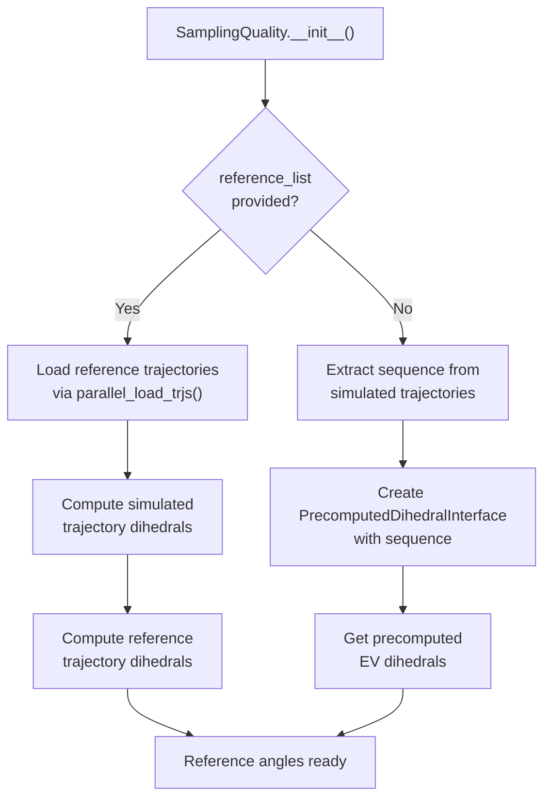
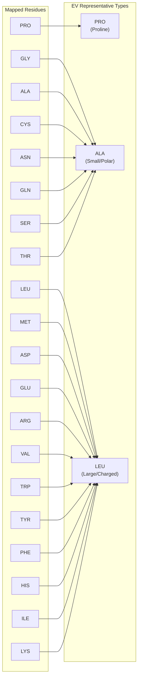
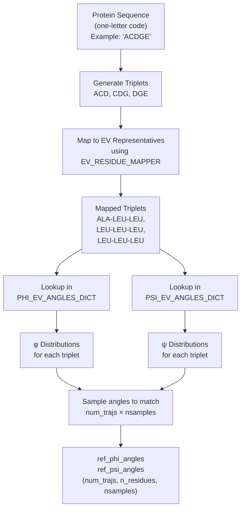
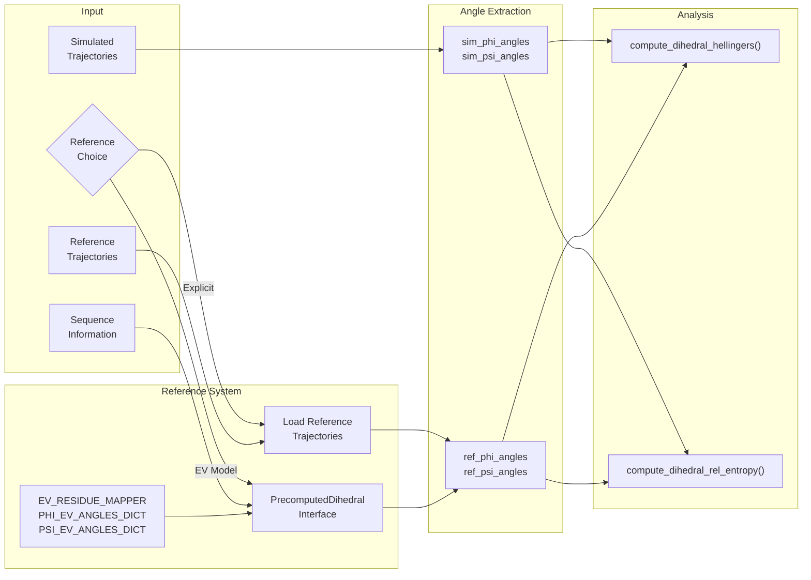

# Reference Models and EV Data

<details>
<summary>Relevant source files</summary>

The following files were used as context for generating this wiki page:

- [soursop/data/phi_excluded_volume_tripeptides.pickle](soursop/data/phi_excluded_volume_tripeptides.pickle)
- [soursop/data/psi_excluded_volume_tripeptides.pickle](soursop/data/psi_excluded_volume_tripeptides.pickle)
- [soursop/ssdata.py](soursop/ssdata.py)
- [soursop/sssampling.py](soursop/sssampling.py)
- [soursop/sstrajectory.py](soursop/sstrajectory.py)
- [soursop/tests/test_sssampling.py](soursop/tests/test_sssampling.py)

</details>


This page documents the reference model system used by the PENGUIN pipeline for assessing conformational sampling quality. It explains how SOURSOP compares simulated trajectories to reference models, with particular focus on the excluded volume (EV) reference data system and the `PrecomputedDihedralInterface` class.

For information about how to initialize and configure the `SamplingQuality` class, see [Initialization and Configuration](#5.1). For details on the statistical metrics used to compare distributions, see [Hellinger Distance and Relative Entropy](#5.3).

---

## Overview: Reference Models in PENGUIN

The PENGUIN methodology assesses sampling quality by comparing dihedral angle distributions from simulated trajectories against reference distributions. SOURSOP supports two approaches for providing reference data:

| Approach | Description | Use Case |
|----------|-------------|----------|
| **Explicit Reference Trajectories** | User provides trajectory files via `reference_list` parameter | Comparing mutants, PTMs, or different force fields |
| **Precomputed EV Reference** | Uses built-in excluded volume data when `reference_list=None` | Comparing to polymer physics limiting model |

Sources: [soursop/sssampling.py:107-120](), [soursop/sssampling.py:186-233]()

---

## Reference Model Selection Logic

The following diagram illustrates how `SamplingQuality` determines which reference model to use:



Sources: [soursop/sssampling.py:186-233]()

The key decision point occurs in `__init__`:

- **Lines 188-200**: If `reference_list` is provided, compute dihedrals from both simulated and reference trajectories
- **Lines 202-233**: If `reference_list` is `None`, compute dihedrals only from simulated trajectories and use the `PrecomputedDihedralInterface` to obtain reference angles

---

## The Excluded Volume (EV) Reference System

### What is the EV Reference Model?

The excluded volume (EV) reference represents the **polymer physics limiting model** where backbone conformational sampling is constrained only by steric clashes (hard-sphere repulsion). This provides a baseline for assessing whether a force field introduces artificial conformational biases beyond fundamental excluded volume effects.

### EV Data Files

SOURSOP includes precomputed EV dihedral angle distributions stored as pickle files:

| File | Content | Format |
|------|---------|--------|
| `psi_excluded_volume_tripeptides.pickle` | ψ (psi) angle distributions | Dictionary keyed by tripeptide sequences |
| `phi_excluded_volume_tripeptides.pickle` | φ (phi) angle distributions | Dictionary keyed by tripeptide sequences |

These files contain probability distributions for all possible tripeptide combinations under excluded volume conditions, computed from extensive Monte Carlo simulations.

Sources: [soursop/ssdata.py:142-144]()

### Loading EV Data

The EV angle dictionaries are loaded at module import:

```python
PSI_EV_ANGLES_DICT = np.load(soursop.get_data("psi_excluded_volume_tripeptides.pickle"), allow_pickle=True)
PHI_EV_ANGLES_DICT = np.load(soursop.get_data("phi_excluded_volume_tripeptides.pickle"), allow_pickle=True)
```

These dictionaries are then imported by `sssampling`:

```python
from soursop.ssdata import (
    EV_RESIDUE_MAPPER,
    ONE_TO_THREE,
    PHI_EV_ANGLES_DICT,
    PSI_EV_ANGLES_DICT,
)
```

Sources: [soursop/ssdata.py:142-144](), [soursop/sssampling.py:25-30]()

---

## Residue Mapping for EV Calculations

### The EV_RESIDUE_MAPPER

Because computing EV data for all 20³ = 8,000 tripeptide combinations is computationally expensive, SOURSOP uses a **residue coarse-graining scheme** that maps amino acids to three representative types:



Sources: [soursop/ssdata.py:115-140]()

### Mapping Logic

The `EV_RESIDUE_MAPPER` dictionary defines the mapping:

| Representative Type | Mapped Residues | Rationale |
|---------------------|----------------|-----------|
| **PRO** | PRO | Proline is conformationally unique (cyclic structure) |
| **ALA** | GLY, ALA, CYS, ASN, GLN, SER, THR | Small or polar side chains |
| **LEU** | LEU, MET, ASP, GLU, ARG, VAL, TRP, TYR, PHE, HIS, ILE, LYS | Large or charged side chains |

**Important**: The mapping prioritizes computational tractability over perfect accuracy. The comment "approximately alanine - not really" and "approximately leucine - not really" at lines [soursop/ssdata.py:118-127]() acknowledges this approximation.

Sources: [soursop/ssdata.py:115-140]()

---

## The PrecomputedDihedralInterface Class

### Purpose

The `PrecomputedDihedralInterface` class provides an interface for accessing precomputed EV reference data that matches the shape and format of dihedral angles extracted from real trajectories. This allows seamless comparison between simulated and reference distributions.

### Instantiation

When no `reference_list` is provided, `SamplingQuality` creates a `PrecomputedDihedralInterface`:

```python
sequence = (
    self.trajs[0]
    .proteinTrajectoryList[self.proteinID]
    .get_amino_acid_sequence(oneletter=True)
)

# Remove caps from sequence if present
sequence = sequence.replace(">", "").replace("<", "")

precomputed_interface = PrecomputedDihedralInterface(
    sequence,
    bins=self.bins,
    num_trajs=len(self.trajs),
    nsamples=len(self.trajs[0]),
)

self.ref_psi_angles = precomputed_interface.ref_psi_angles
self.ref_phi_angles = precomputed_interface.ref_phi_angles
```

Sources: [soursop/sssampling.py:216-233]()

### Constructor Parameters

| Parameter | Type | Description |
|-----------|------|-------------|
| `sequence` | str | One-letter amino acid sequence (caps removed) |
| `bins` | np.ndarray | Bin edges for angle histograms (from `get_degree_bins()`) |
| `num_trajs` | int | Number of simulated trajectories to match |
| `nsamples` | int | Number of frames per trajectory to match |

### Output Format

The interface provides two attributes:

- **`ref_psi_angles`**: Shape `(num_trajs, n_residues, nsamples)` - ψ angles matching simulated trajectory format
- **`ref_phi_angles`**: Shape `(num_trajs, n_residues, nsamples)` - φ angles matching simulated trajectory format

This format ensures that downstream analysis code (e.g., `compute_dihedral_hellingers()`) works identically whether using explicit reference trajectories or precomputed EV data.

Sources: [soursop/sssampling.py:225-233]()

---

## Data Flow: From Sequence to EV Reference Angles

The following diagram illustrates how a protein sequence is converted to EV reference dihedral angles:



Sources: [soursop/sssampling.py:216-233](), [soursop/ssdata.py:115-144]()

**Key Steps**:

1. **Triplet Generation**: For each residue position i, create triplet (i-1, i, i+1)
2. **Residue Mapping**: Convert each residue to its EV representative type using `EV_RESIDUE_MAPPER`
3. **Dictionary Lookup**: Retrieve precomputed distributions from `PHI_EV_ANGLES_DICT` and `PSI_EV_ANGLES_DICT`
4. **Sampling**: Generate angle samples matching the dimensionality of simulated trajectories

---

## Usage Examples

### Using Explicit Reference Trajectories

```python
from soursop.sssampling import SamplingQuality

# Compare wild-type vs mutant
quality = SamplingQuality(
    traj_list=['wt_traj1.xtc', 'wt_traj2.xtc'],
    reference_list=['mutant_traj1.xtc', 'mutant_traj2.xtc'],
    top_file='wt_topology.pdb',
    ref_top='mutant_topology.pdb',
    method='2D angle distributions'
)
```

### Using Precomputed EV Reference

```python
from soursop.sssampling import SamplingQuality

# Compare to excluded volume model
quality = SamplingQuality(
    traj_list=['sim_traj1.xtc', 'sim_traj2.xtc'],
    reference_list=None,  # Use EV reference
    top_file='topology.pdb',
    method='2D angle distributions'
)

# ref_phi_angles and ref_psi_angles are automatically 
# populated from PrecomputedDihedralInterface
```

Sources: [soursop/tests/test_sssampling.py:31-54](), [soursop/tests/test_sssampling.py:85-102]()

---

## Test Data Structure

The test suite includes both explicit reference trajectories and EV comparisons:

```
test_data/sampling_quality/
├── WT/                    # Wild-type trajectories
│   ├── traj1.xtc
│   ├── traj2.xtc
│   └── topology.pdb
└── EV/                    # Explicit EV trajectories for testing
    ├── traj1.xtc
    ├── traj2.xtc
    └── topology.pdb
```

The tests verify that:
- Angle extraction produces correct shapes: `(n_trajs, n_residues, n_frames)`
- Hellinger distances are computed correctly for both 1D and 2D methods
- PDF normalization matches expected values

Sources: [soursop/tests/test_sssampling.py:31-102]()

---

## Integration with SamplingQuality Workflow



Sources: [soursop/sssampling.py:186-233](), [soursop/sssampling.py:481-522](), [soursop/sssampling.py:574-592]()

The reference system feeds into the statistical comparison methods documented in [Hellinger Distance and Relative Entropy](#5.3) and ultimately to visualization via [Quality Plots and Visualization](#5.5).

---

## Key Implementation Details

### Sequence Processing

Capping groups (`<` for ACE, `>` for NME) are removed before using the sequence:

```python
sequence = sequence.replace(">", "").replace("<", "")
```

This ensures that terminal modifications don't interfere with tripeptide lookup in the EV dictionaries.

Sources: [soursop/sssampling.py:223]()

### Dimensionality Matching

The `PrecomputedDihedralInterface` ensures that reference angles have identical dimensions to simulated angles:
- Same number of trajectories (`num_trajs`)
- Same number of frames per trajectory (`nsamples`)
- Same number of residues (derived from sequence length)

This allows transparent substitution of reference sources without changing downstream code.

Sources: [soursop/sssampling.py:225-233]()

### Implicit Assumptions

The implementation assumes:
1. All simulated trajectories have the same sequence (enforced by using a single topology)
2. The sequence length matches the number of dihedrals extracted from trajectories
3. EV data is available for the mapped tripeptide sequences

Sources: [soursop/sssampling.py:214-216]()

---