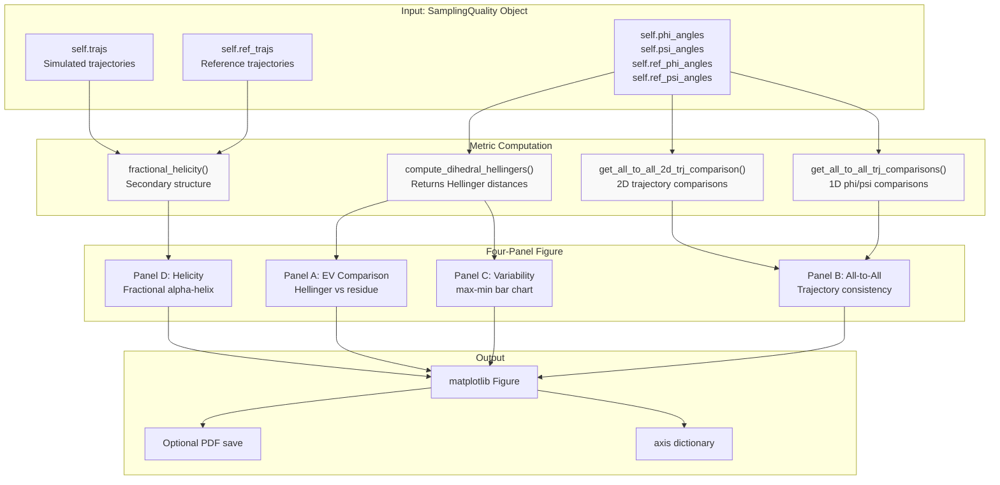
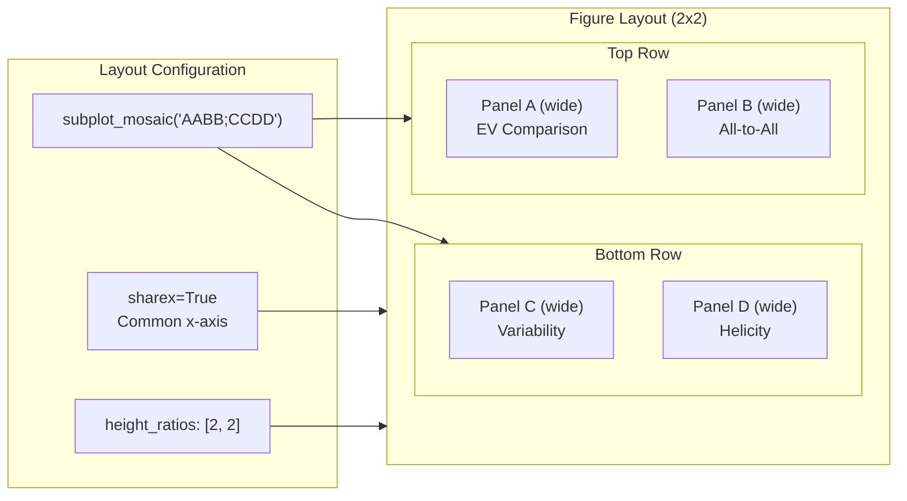
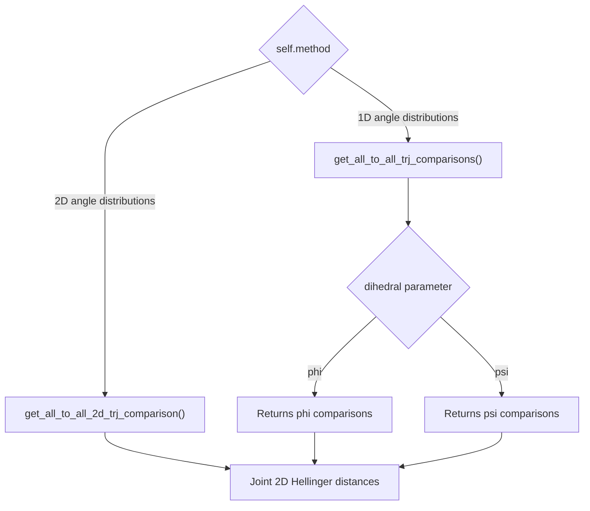
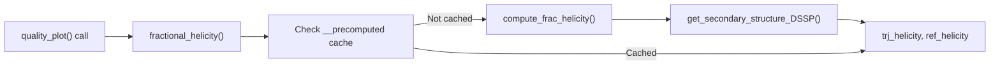
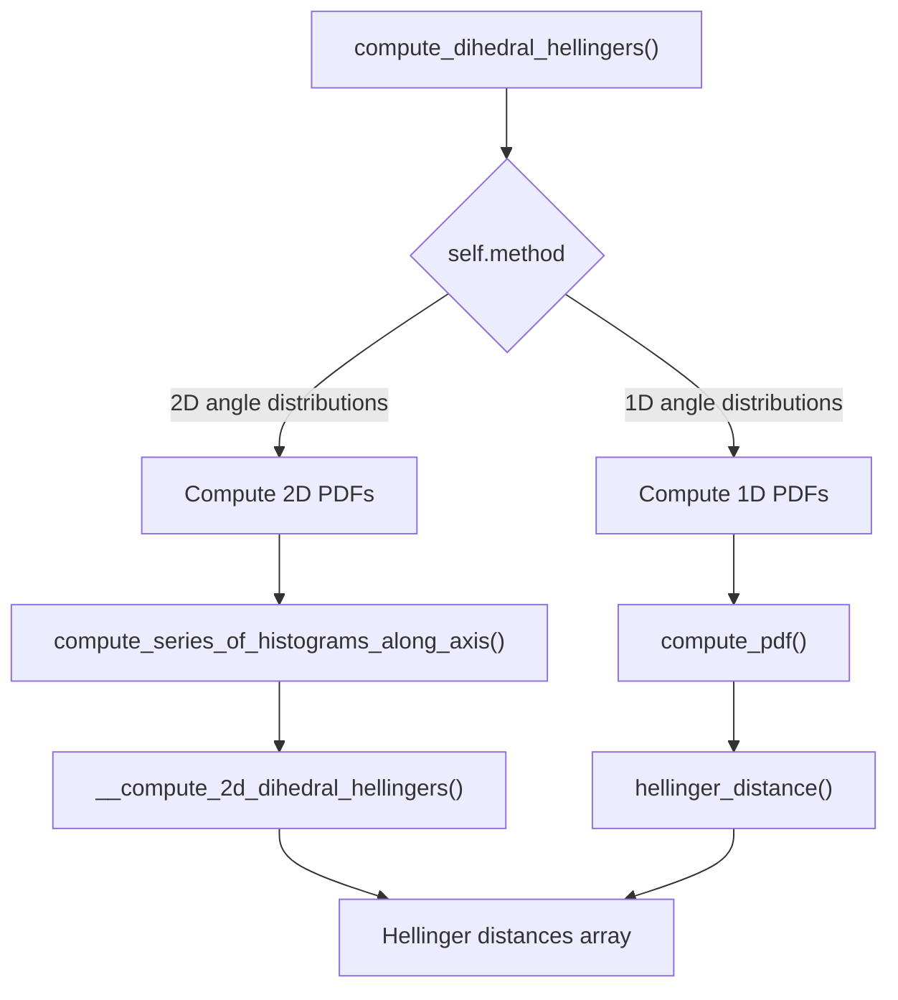

# Quality Plots and Visualization

<details>
<summary>Relevant source files</summary>

The following files were used as context for generating this wiki page:

- [soursop/sssampling.py](soursop/sssampling.py)
- [soursop/sstrajectory.py](soursop/sstrajectory.py)
- [soursop/tests/test_sssampling.py](soursop/tests/test_sssampling.py)

</details>


This page documents the visualization capabilities of the `SamplingQuality` class, specifically the `quality_plot()` method which generates comprehensive multi-panel figures for assessing conformational sampling quality. This visualization tool is the primary way to interpret PENGUIN analysis results.

For information about the underlying statistical metrics (Hellinger distance, relative entropy), see [5.3](#5.3). For details about the reference models and excluded volume data, see [5.4](#5.4).

## Overview

The quality plot provides a unified visual summary of sampling quality by displaying:
- **Convergence to reference model**: How well simulated ensembles match the excluded volume (EV) reference
- **Trajectory consistency**: Agreement between independent simulation replicates
- **Sampling variability**: Per-residue heterogeneity across replicates
- **Secondary structure propensity**: Fractional helicity as a complementary metric

The visualization is generated by a single method call but aggregates data from multiple analysis functions within the `SamplingQuality` class.

**Sources:** [soursop/sssampling.py:846-1062]()

## Quality Plot Architecture

The following diagram shows how the `quality_plot()` method orchestrates multiple data sources to generate the final visualization:



**Sources:** [soursop/sssampling.py:846-1062](), [soursop/sssampling.py:481-521](), [soursop/sssampling.py:701-764](), [soursop/sssampling.py:766-831](), [soursop/sssampling.py:1180-1200]()

## The quality_plot Method

The `quality_plot()` method is defined in the `SamplingQuality` class and provides a complete visualization workflow in a single function call.

### Method Signature

```python
def quality_plot(
    self,
    increment: int = 5,
    figsize: Tuple[int, int] = (7, 5),
    dpi: int = 400,
    panel_labels: bool = False,
    fontsize: int = 10,
    save_dir: str = None,
    dihedral: Union[None, str] = "2D",
    figname: str = "hellingers.pdf",
)
```

### Parameters

| Parameter | Type | Default | Description |
|-----------|------|---------|-------------|
| `increment` | `int` | `5` | X-axis stride for residue tick labels |
| `figsize` | `Tuple[int, int]` | `(7, 5)` | Figure dimensions in inches |
| `dpi` | `int` | `400` | Resolution for saved figure |
| `panel_labels` | `bool` | `False` | Whether to add manuscript-style panel labels (A, B, C, D) |
| `fontsize` | `int` | `10` | Font size for all text elements |
| `save_dir` | `str` | `None` | Directory path for saving the figure; if `None`, no file is saved |
| `dihedral` | `str` | `"2D"` | Which dihedral metric to plot: `"2D"`, `"phi"`, or `"psi"` |
| `figname` | `str` | `"hellingers.pdf"` | Output filename when saving |

### Return Values

Returns a tuple `(fig, axd)` where:
- `fig`: `matplotlib.figure.Figure` object
- `axd`: Dictionary mapping panel identifiers (`"A"`, `"B"`, `"C"`, `"D"`) to their corresponding axes

**Sources:** [soursop/sssampling.py:846-880]()

## Panel Layout and Structure

The quality plot uses a 2×2 mosaic layout created with `plt.subplot_mosaic()`:



The mosaic string `"AABB;CCDD"` creates:
- First row: panels A and B each spanning 2 columns
- Second row: panels C and D each spanning 2 columns
- All panels share the same x-axis (residue index)

**Sources:** [soursop/sssampling.py:892-898]()

## Panel A: Comparison to Excluded Volume Limit

Panel A displays the Hellinger distance between simulated trajectories and the excluded volume reference model as a function of residue position.

### Visual Elements

- **Red dots**: Individual Hellinger distances for each trajectory replicate at each residue (alpha=0.3)
- **Black line with squares**: Mean Hellinger distance across replicates
- **Y-axis**: Hellinger distance (0 to 1)
- **X-axis**: Residue index

### Interpretation

| Hellinger Distance | Interpretation |
|-------------------|----------------|
| **0.0** | Perfect agreement with EV model |
| **0.2-0.4** | Good sampling for disordered regions |
| **0.6-0.8** | Significant deviation (may indicate structure formation) |
| **1.0** | Complete disagreement with EV model |

For intrinsically disordered proteins, low Hellinger distances suggest the simulation is well-sampled and consistent with the polymer physics reference. High values may indicate:
- Residual secondary structure
- Transient tertiary contacts
- Insufficient sampling time
- Force field artifacts

**Sources:** [soursop/sssampling.py:946-973]()

## Panel B: All-to-All Trajectory Comparison

Panel B shows the internal consistency of independent trajectory replicates by computing Hellinger distances between all pairs of simulated trajectories.

### Data Source Selection

The panel uses different functions depending on the `method` and `dihedral` parameters:



### Visual Elements

- **Red dots**: Pairwise Hellinger distances between trajectory replicates
- **Black line with squares**: Mean pairwise distance
- **Y-axis**: Hellinger distance (0 to 1)
- **X-axis**: Residue index

### Interpretation

Low all-to-all Hellinger distances indicate:
- Good convergence between independent simulations
- Consistent sampling across replicates
- Reproducible conformational ensembles

High values suggest:
- Insufficient equilibration
- Rare event sampling differences
- Ergodicity issues in the simulation

**Sources:** [soursop/sssampling.py:975-998](), [soursop/sssampling.py:906-916]()

## Panel C: Sampling Variability

Panel C visualizes per-residue sampling variability by plotting the range (max - min) of Hellinger distances across trajectory replicates.

### Computation

The panel uses `np.ptp()` (peak-to-peak) to compute the range:

```python
max_minus_min = np.ptp(metric, axis=0)
```

where `metric` is the array of Hellinger distances from Panel A.

### Visual Elements

- **Black bars**: Range of Hellinger distances for each residue
- **Y-axis**: Hellinger distance range (0 to 1)
- **X-axis**: Residue index

### Interpretation

| Range Value | Interpretation |
|------------|----------------|
| **< 0.1** | Excellent consistency across replicates |
| **0.1-0.3** | Moderate variability, generally acceptable |
| **> 0.5** | High variability, may indicate sampling issues |

Regions with high variability may require:
- Longer simulation times
- Additional replicates
- Enhanced sampling methods
- Force field parameter examination

**Sources:** [soursop/sssampling.py:1000-1010]()

## Panel D: Fractional Helicity

Panel D displays the per-residue fractional helicity, providing a complementary measure of local structural propensity.

### Data Source

Helicity is computed using the `fractional_helicity()` method, which wraps `compute_frac_helicity()`:



### Visual Elements

- **Red dots**: Fractional helicity for each trajectory replicate (alpha=0.3)
- **Black line with squares**: Mean fractional helicity
- **Y-axis**: Fractional helicity (0 to 1)
- **X-axis**: Residue index

### Interpretation

Fractional helicity values:
- **0.0**: No helical propensity
- **0.2-0.4**: Transient helical structure
- **0.6-0.8**: Partial helix formation
- **1.0**: Fully helical residue

For IDPs, high helicity values may indicate:
- Sequence-encoded helical propensity
- Stabilizing interactions
- Deviation from random coil behavior

**Sources:** [soursop/sssampling.py:1012-1039](), [soursop/sssampling.py:1180-1200](), [soursop/sssampling.py:434-479]()

## Dihedral Angle Selection

The `dihedral` parameter controls which angular distribution is analyzed:

### Valid Options

| Value | Description | Applicable Method |
|-------|-------------|-------------------|
| `"2D"` | Joint phi-psi distribution (default) | `"2D angle distributions"` only |
| `"phi"` | Phi backbone dihedral only | `"1D angle distributions"` |
| `"psi"` | Psi backbone dihedral only | `"1D angle distributions"` |

### Validation

The method validates the `dihedral` parameter against the `method` specified during `SamplingQuality` initialization:

```python
if self.method == "1D angle distributions" and dihedral == "2D":
    raise ValueError(
        f"Cannot plot 1D angle distributions with dihedral = {dihedral} selector. "
        "Please set dihedral to phi or psi"
    )
```

**Sources:** [soursop/sssampling.py:900-904](), [soursop/sssampling.py:906-916]()

## Supporting Visualization Methods

The `quality_plot()` method relies on several internal methods to compute the displayed metrics:

### Hellinger Distance Computation



Key methods:
- `compute_dihedral_hellingers()`: Main entry point ([soursop/sssampling.py:481-521]())
- `compute_series_of_histograms_along_axis()`: For 2D distributions ([soursop/sssampling.py:594-656]())
- `compute_pdf()`: For 1D distributions ([soursop/sssampling.py:658-699]())
- `__compute_2d_dihedral_hellingers()`: 2D Hellinger calculation ([soursop/sssampling.py:523-572]())

### All-to-All Comparisons

The all-to-all comparison uses `itertools.combinations()` to generate all pairwise trajectory comparisons:

```python
# For 2D comparisons
pdf_combinations = np.transpose(
    np.array(tuple(itertools.combinations(pdfs, 2))), 
    axes=[1, 0, 2, 3, 4]
)
```

For single trajectory edge cases:
```python
if pdfs.shape[0] == 1:
    pdf_combinations = np.transpose(
        np.array(tuple(itertools.combinations(pdfs, 1))), 
        axes=[1, 0, 2, 3, 4]
    )
```

**Sources:** [soursop/sssampling.py:701-764](), [soursop/sssampling.py:766-831]()

## File Output

When `save_dir` is provided, the figure is saved to disk:

```python
if save_dir is not None:
    os.makedirs(save_dir, exist_ok=True)
    outpath = os.path.join(save_dir, f"{dihedral}_{figname}.pdf")
    fig.savefig(f"{outpath}", dpi=dpi)
```

The output filename incorporates the `dihedral` parameter:
- `"2D_hellingers.pdf"` for 2D analysis
- `"phi_hellingers.pdf"` for phi-only analysis
- `"psi_hellingers.pdf"` for psi-only analysis

**Sources:** [soursop/sssampling.py:1057-1060]()

## Panel Labels for Publication

Setting `panel_labels=True` adds manuscript-style panel identifiers:

```python
if panel_labels:
    for ax in axd:
        trans = transforms.ScaledTranslation(-20/72, 7/72, fig.dpi_scale_trans)
        axd[ax].text(
            -0.0825, 1.10, ax,
            transform=axd[ax].transAxes + trans,
            fontsize=fontsize,
            fontweight="bold",
            va="top", ha="right"
        )
```

This adds bold "A", "B", "C", "D" labels positioned above and to the left of each panel, following common publication formatting conventions.

**Sources:** [soursop/sssampling.py:1041-1055]()

## Usage Example

A typical workflow for generating quality plots:

```python
from soursop.sssampling import SamplingQuality

# Initialize SamplingQuality with trajectory lists
sq = SamplingQuality(
    traj_list=['sim1.xtc', 'sim2.xtc', 'sim3.xtc'],
    reference_list=None,  # Use precomputed EV reference
    top_file='topology.pdb',
    method='2D angle distributions'
)

# Generate quality plot
fig, axd = sq.quality_plot(
    increment=10,           # Label every 10th residue
    figsize=(10, 8),        # Larger figure
    dpi=300,                # Publication quality
    panel_labels=True,      # Add A, B, C, D labels
    save_dir='./results',   # Save to results directory
    dihedral='2D',          # Use joint phi-psi
    figname='quality.pdf'
)

# Access individual panels for customization
axd['A'].set_title('Custom Title for Panel A')
axd['B'].axhline(y=0.3, linestyle='--', color='gray')

# Save with modifications
fig.savefig('custom_quality.pdf', dpi=300, bbox_inches='tight')
```

**Sources:** [soursop/sssampling.py:846-1062]()

## Cached Computation

The `quality_plot()` method uses the `SamplingQuality` object's `__precomputed` cache to avoid redundant calculations:

| Cached Property | Method | Cache Key |
|----------------|--------|-----------|
| Trajectory PDFs | `trj_pdfs()` | `"trj_phi_pdfs"`, `"trj_psi_pdfs"`, `"joint"` |
| Reference PDFs | `ref_pdfs()` | `"ref_phi_pdfs"`, `"ref_psi_pdfs"`, `"joint"` |
| Hellinger distances | `hellingers_distances()` | `"hellingers"` |
| Fractional helicity | `fractional_helicity()` | `"trj_helicity"`, `"ref_helicity"` |

These cached values persist across multiple `quality_plot()` calls on the same `SamplingQuality` instance, improving performance when generating multiple variations of the plot.

**Sources:** [soursop/sssampling.py:1064-1111](), [soursop/sssampling.py:1113-1161](), [soursop/sssampling.py:1163-1178](), [soursop/sssampling.py:1180-1200]()

---