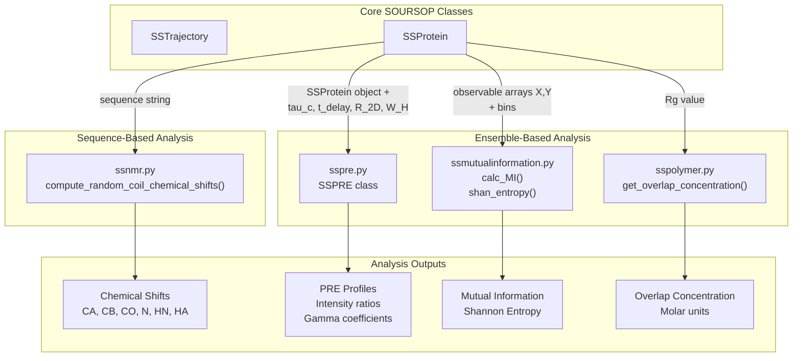
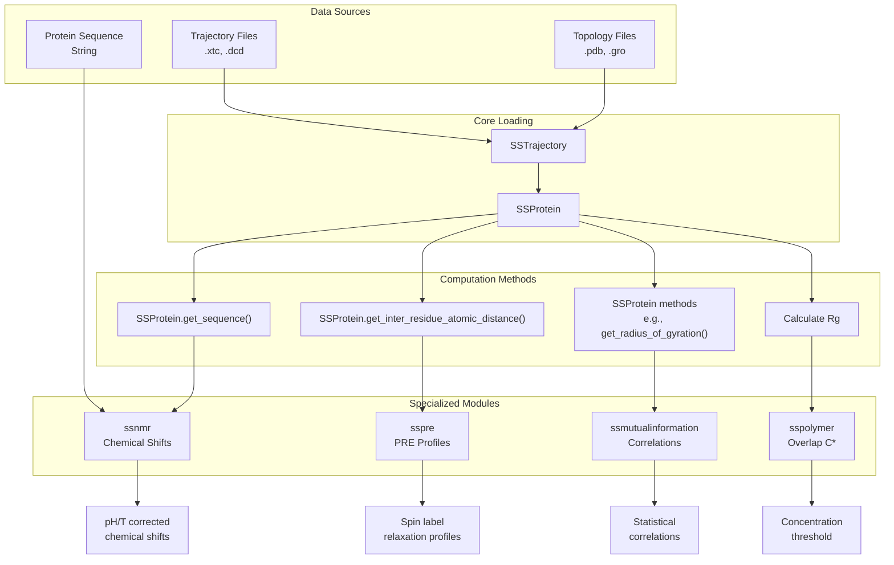
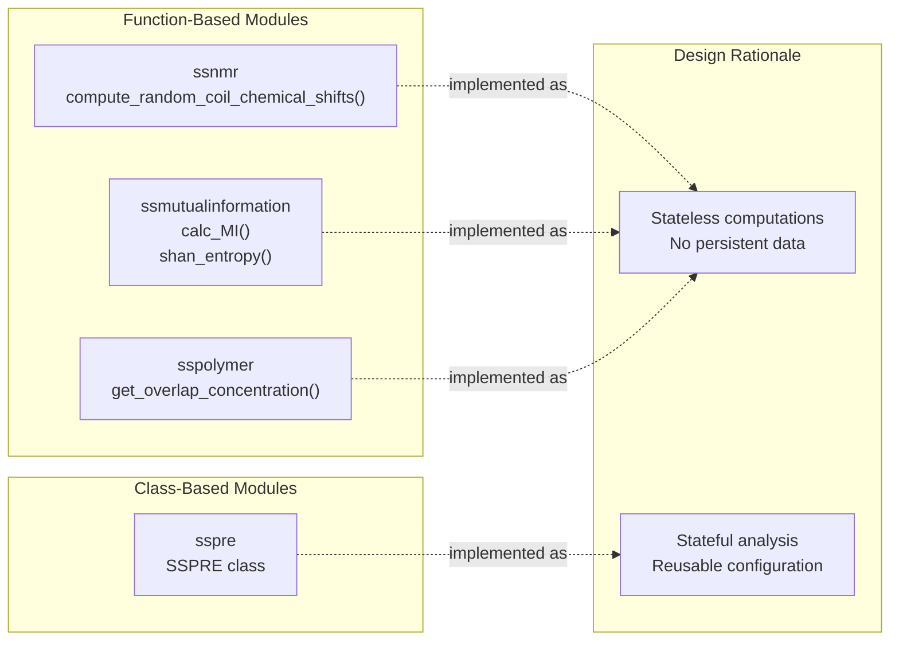
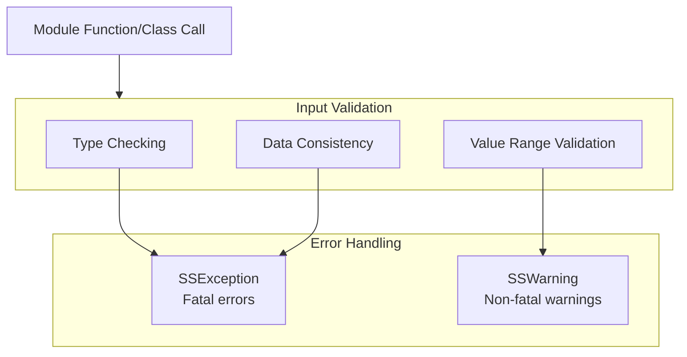
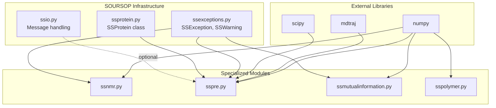

# Specialized Analysis Modules

<details>
<summary>Relevant source files</summary>

The following files were used as context for generating this wiki page:

- [soursop/_internal_data.py](soursop/_internal_data.py)
- [soursop/configs.py](soursop/configs.py)
- [soursop/soursop.py](soursop/soursop.py)
- [soursop/ssexceptions.py](soursop/ssexceptions.py)
- [soursop/ssio.py](soursop/ssio.py)
- [soursop/ssmutualinformation.py](soursop/ssmutualinformation.py)
- [soursop/ssnmr.py](soursop/ssnmr.py)
- [soursop/sspolymer.py](soursop/sspolymer.py)
- [soursop/sspre.py](soursop/sspre.py)
- [soursop/tests/conftest.py](soursop/tests/conftest.py)
- [soursop/tests/test_ssmutual_information.py](soursop/tests/test_ssmutual_information.py)

</details>


This page documents SOURSOP's specialized analysis modules—standalone modules that provide domain-specific analytical capabilities beyond the core trajectory and protein analysis functions. These modules consume data from `SSProtein` or `SSTrajectory` objects to compute experimental observables (NMR chemical shifts, PRE profiles) and polymer physics properties (mutual information, overlap concentration). Unlike the 50+ methods built into `SSProtein` (see [Single Protein Analysis](#4)), these modules are implemented as separate files with their own classes and functions, allowing for focused, specialized calculations without bloating the core classes.

For general protein analysis methods (Rg, end-to-end distance, contact maps, etc.), see [Single Protein Analysis](#4). For sampling quality assessment, see [PENGUIN Pipeline](#5).

**Sources:** Architecture diagrams, [soursop/ssnmr.py:1-667](), [soursop/sspre.py:1-229](), [soursop/ssmutualinformation.py:1-136](), [soursop/sspolymer.py:1-54]()

---

## Module Overview

SOURSOP provides four specialized analysis modules:

| Module | Primary Purpose | Key Functions/Classes | Input Requirements |
|--------|----------------|----------------------|-------------------|
| `ssnmr` | Random coil chemical shift prediction | `compute_random_coil_chemical_shifts()` | Protein sequence (string) |
| `sspre` | Paramagnetic relaxation enhancement profiles | `SSPRE` class | `SSProtein` object + experimental parameters |
| `ssmutualinformation` | Statistical correlation analysis | `calc_MI()`, `shan_entropy()` | Two observable arrays + bins |
| `sspolymer` | Polymer physics calculations | `get_overlap_concentration()` | Radius of gyration (float) |

These modules are designed as independent analytical tools that can be used separately from the main trajectory analysis workflow, though they typically consume data from `SSProtein` objects.

**Sources:** [soursop/ssnmr.py:14-18](), [soursop/sspre.py:19-25](), [soursop/ssmutualinformation.py:14-18](), [soursop/sspolymer.py:1-54]()

---

## Module Architecture



**Architecture Notes:**
- **Sequence-Based:** `ssnmr` operates on amino acid sequences and does not require trajectory data
- **Ensemble-Based:** `sspre`, `ssmutualinformation`, and `sspolymer` consume conformational ensemble data
- **Independence:** Each module is self-contained with no dependencies on other specialized modules
- **Integration:** All modules use common infrastructure (`ssexceptions`, `ssio`) for error handling

**Sources:** [soursop/ssnmr.py:28-101](), [soursop/sspre.py:32-229](), [soursop/ssmutualinformation.py:24-136](), [soursop/sspolymer.py:17-54]()

---

## Data Flow and Module Interaction



**Key Data Pathways:**
1. **NMR Path:** Sequence → `compute_random_coil_chemical_shifts()` → Chemical shifts
2. **PRE Path:** `SSProtein` → Distance calculations → `SSPRE` → Intensity/gamma profiles
3. **MI Path:** Observable arrays → Histogram binning → Shannon entropy → Mutual information
4. **Polymer Path:** Rg value → Volume calculation → Overlap concentration

**Sources:** [soursop/ssnmr.py:28-101](), [soursop/sspre.py:130-229](), [soursop/ssmutualinformation.py:26-105](), [soursop/sspolymer.py:17-54]()

---

## Module Characteristics Comparison

| Characteristic | ssnmr | sspre | ssmutualinformation | sspolymer |
|---------------|-------|-------|---------------------|-----------|
| **Input Type** | String sequence | SSProtein object | NumPy arrays | Float (Rg) |
| **Ensemble Required** | No | Yes | Yes | No (single value) |
| **Primary Algorithm** | Neighbor correction factors | Solomon-Bloembergen equation | Information theory | Volume calculation |
| **Computational Cost** | Low | Low-Medium | Depends on binning | Negligible |
| **Key Parameters** | pH, temperature, deuteration | tau_c, t_delay, R_2D, W_H | bins, weights, normalize | None |
| **Output Format** | List of dicts | Tuple of lists | Float or array | Float |
| **Experimental Comparison** | NMR spectroscopy | PRE experiments | General observables | Phase behavior |

**Sources:** [soursop/ssnmr.py:28-101](), [soursop/sspre.py:41-117](), [soursop/ssmutualinformation.py:26-68](), [soursop/sspolymer.py:17-36]()

---

## Typical Usage Patterns

### Pattern 1: NMR Chemical Shift Prediction
```
1. Extract protein sequence from SSProtein or provide directly
2. Call compute_random_coil_chemical_shifts(sequence, pH, temperature)
3. Receive list of chemical shifts for each residue
```

### Pattern 2: PRE Profile Calculation
```
1. Create SSProtein object from trajectory
2. Initialize SSPRE(SSProtein, tau_c, t_delay, R_2D, W_H)
3. Call generate_PRE_profile(label_position, atom='CB')
4. Receive (intensity_profile, gamma_profile) tuple
```

### Pattern 3: Mutual Information Analysis
```
1. Extract two observables from SSProtein methods
2. Define histogram bins spanning data range
3. Call calc_MI(X, Y, bins, normalize=True/False)
4. Receive mutual information value
```

### Pattern 4: Overlap Concentration
```
1. Calculate mean Rg from SSProtein.get_radius_of_gyration()
2. Call get_overlap_concentration(rg_value)
3. Receive concentration in molar units
```

**Sources:** [soursop/ssnmr.py:28-101](), [soursop/sspre.py:130-200](), [soursop/ssmutualinformation.py:26-68](), [soursop/sspolymer.py:17-36]()

---

## Implementation Details: Function vs. Class Design



**Design Principles:**

- **Functions:** Used for one-shot calculations with no state (`ssnmr`, `ssmutualinformation`, `sspolymer`)
- **Classes:** Used when analysis involves persistent parameters and multiple related operations (`SSPRE` stores experimental parameters for repeated profile generation)
- **No SSProtein Modification:** All modules treat input data as read-only to preserve trajectory integrity

The `SSPRE` class stores experimental parameters (`tau_c`, `t_delay`, `R_2D`, `W_H`) and pre-computes constants (`PREFACTOR`) in `__init__()`, allowing efficient generation of multiple PRE profiles with different label positions without recalculating these values.

**Sources:** [soursop/sspre.py:32-117](), [soursop/ssnmr.py:1-667](), [soursop/ssmutualinformation.py:1-136](), [soursop/sspolymer.py:1-54]()

---

## Error Handling and Validation

All specialized modules use SOURSOP's common error handling infrastructure:



**Validation Examples:**

| Module | Validation Type | Example Check | Source Lines |
|--------|----------------|---------------|--------------|
| `ssnmr` | Parameter range | Temperature 0-100°C, pH 0-14 | [soursop/ssnmr.py:103-108]() |
| `sspre` | Parameter sanity | R_2D ~10 Hz, tau_c 1-30 ns | [soursop/sspre.py:94-105]() |
| `sspre` | Type checking | SSProtein object required | [soursop/sspre.py:81-82]() |
| `ssmutualinformation` | Data consistency | Equal length X, Y arrays | [soursop/ssmutualinformation.py:70-71]() |
| `ssmutualinformation` | Range validation | Bins span full data range | [soursop/ssmutualinformation.py:73-77]() |

**Sources:** [soursop/ssnmr.py:103-108](), [soursop/sspre.py:81-105](), [soursop/ssmutualinformation.py:70-77](), [soursop/ssexceptions.py:26-52]()

---

## Module Dependencies



**Dependency Notes:**
- `ssnmr`: Minimal dependencies (only exception handling, no scipy/mdtraj)
- `sspre`: Full dependencies including mdtraj for SSProtein integration
- `ssmutualinformation`: Only numpy and exceptions (lightweight)
- `sspolymer`: Only numpy (most lightweight)

**Sources:** [soursop/ssnmr.py:20-21](), [soursop/sspre.py:13-17](), [soursop/ssmutualinformation.py:20-21](), [soursop/sspolymer.py:14]()

---

## Testing Infrastructure

The specialized modules have dedicated test coverage:

| Test File | Tested Module | Key Test Cases |
|-----------|--------------|----------------|
| `test_ssmutual_information.py` | `ssmutualinformation` | Shannon entropy calculation, MI calculation, NMI normalization |

**Test Coverage Highlights:**
- Shannon entropy validated against known uniform distributions
- Mutual information tested with correlated vs. uncorrelated random variables
- Normalized MI (NMI) validates to 0.0 for independent X,Y and 1.0 for X=X

**Sources:** [soursop/tests/test_ssmutual_information.py:1-31](), [soursop/tests/conftest.py:1-102]()

---

## Detailed Module Documentation

For comprehensive documentation of each specialized module, including mathematical foundations, parameter descriptions, and usage examples, see the following pages:

- **[NMR Chemical Shift Prediction](#6.1)** - `compute_random_coil_chemical_shifts()` function with pH, temperature, and deuteration corrections
- **[PRE Profile Calculation](#6.2)** - `SSPRE` class for paramagnetic relaxation enhancement analysis
- **[Mutual Information Analysis](#6.3)** - `calc_MI()` and `shan_entropy()` functions for statistical correlation
- **[Polymer Physics Utilities](#6.4)** - `get_overlap_concentration()` and related polymer calculations

**Sources:** Table of contents structure

---