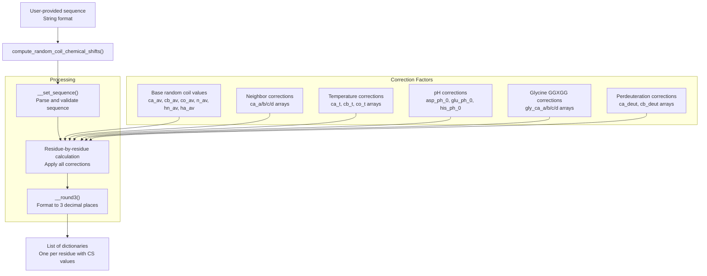
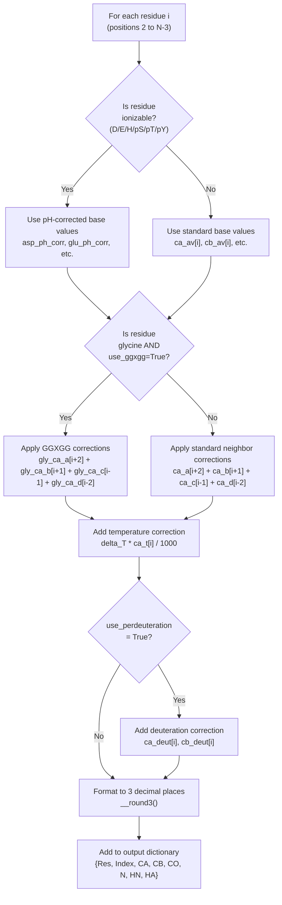
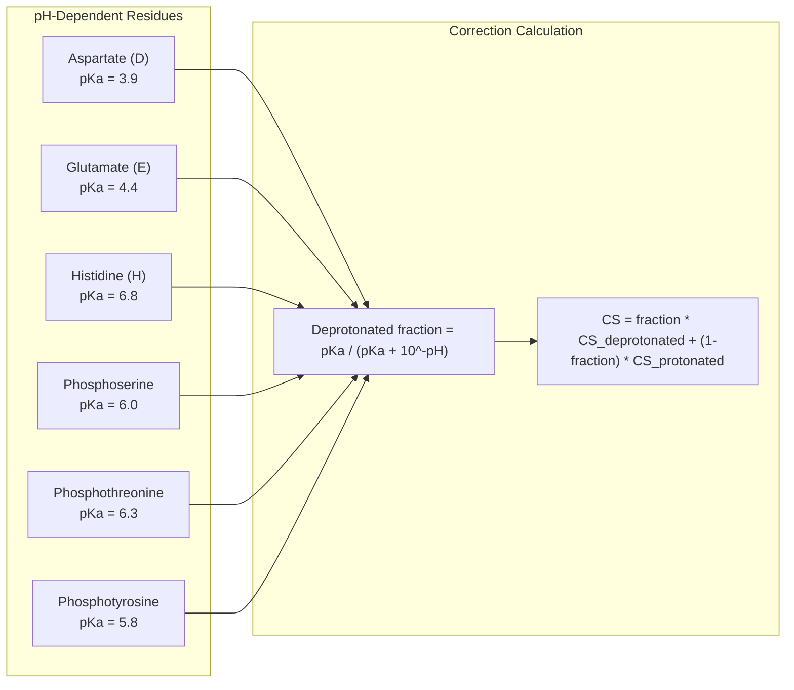
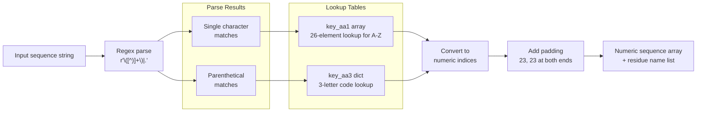
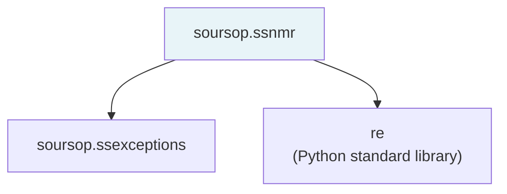
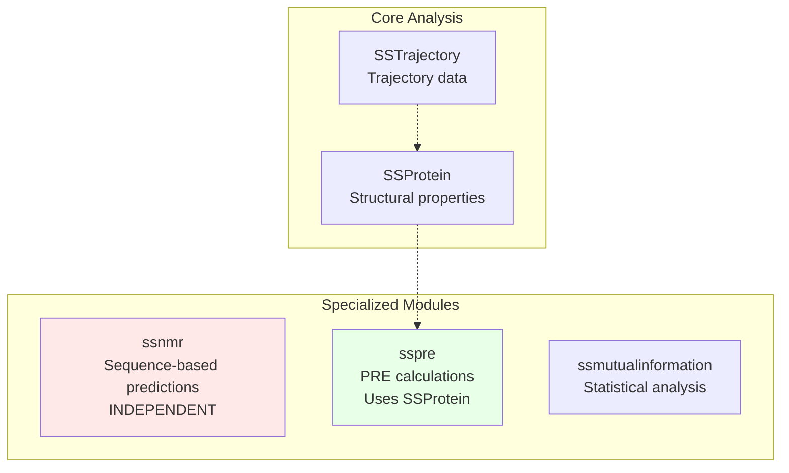

# NMR Chemical Shift Prediction

<details>
<summary>Relevant source files</summary>

The following files were used as context for generating this wiki page:

- [soursop/_internal_data.py](soursop/_internal_data.py)
- [soursop/configs.py](soursop/configs.py)
- [soursop/soursop.py](soursop/soursop.py)
- [soursop/ssexceptions.py](soursop/ssexceptions.py)
- [soursop/ssio.py](soursop/ssio.py)
- [soursop/ssmutualinformation.py](soursop/ssmutualinformation.py)
- [soursop/ssnmr.py](soursop/ssnmr.py)
- [soursop/tests/test_ssmutual_information.py](soursop/tests/test_ssmutual_information.py)

</details>


## Purpose and Scope

This document describes the NMR chemical shift prediction module in SOURSOP, which predicts random coil chemical shifts for intrinsically disordered protein sequences. The module implements the `compute_random_coil_chemical_shifts()` function located in the `ssnmr` module, which calculates backbone atom chemical shifts (CA, CB, CO, N, HN, HA) with corrections for temperature, pH, neighboring residues, and experimental conditions.

This module provides sequence-based predictions only and does not require trajectory data. For structural analysis methods that use trajectory data, see [SSProtein: Single Protein Analysis](#4).

**Sources:** [soursop/ssnmr.py:1-667]()

---

## Module Overview

The `ssnmr` module is a standalone functional module that does not depend on `SSProtein` or `SSTrajectory` objects. It operates purely on amino acid sequences provided as strings.



**Sources:** [soursop/ssnmr.py:28-560]()

---

## Core Function: compute_random_coil_chemical_shifts()

### Function Signature

```python
compute_random_coil_chemical_shifts(
    protein_sequence,
    temperature=25,
    pH=7.4,
    use_ggxgg=True,
    use_perdeuteration=False,
    asFloat=True
)
```

**Sources:** [soursop/ssnmr.py:28-28]()

### Parameters

| Parameter | Type | Default | Valid Range | Description |
|-----------|------|---------|-------------|-------------|
| `protein_sequence` | str | Required | - | Amino acid sequence using one-letter codes or parenthetical notation for modifications |
| `temperature` | float/int | 25 | 0-100 | Experimental temperature in degrees Celsius |
| `pH` | float/int | 7.4 | 0-14 | Solution pH for ionization state corrections |
| `use_ggxgg` | bool | True | - | Apply GGXGG-based neighbor correction for glycines |
| `use_perdeuteration` | bool | False | - | Apply perdeuteration correction factors (incompatible with phosphoresidues) |
| `asFloat` | bool | True | - | Return chemical shifts as floats (True) or formatted strings (False) |

**Sources:** [soursop/ssnmr.py:43-69]()

### Return Value

Returns a list of dictionaries, one per residue (excluding first two and last two residues due to neighbor correction requirements). Each dictionary contains:

| Key | Type | Description |
|-----|------|-------------|
| `"Res"` | str | Residue abbreviation (one or three-letter code) |
| `"Index"` | int | Zero-based residue index in the sequence |
| `"CA"` | float/str | CA chemical shift (ppm) |
| `"CB"` | float/str | CB chemical shift (ppm), or `"**.***"` for glycine |
| `"CO"` | float/str | CO chemical shift (ppm) |
| `"N"` | float/str | N chemical shift (ppm), or `"***.***"` for proline |
| `"HN"` | float/str | HN chemical shift (ppm), or `"*.***"` for proline |
| `"HA"` | float/str | HA chemical shift (ppm), or `"*.***"` if perdeuterated |

**Sources:** [soursop/ssnmr.py:71-75](), [soursop/ssnmr.py:537-557]()

---

## Input Sequence Format

The function accepts amino acid sequences in two formats:

1. **Standard one-letter codes**: `"ACDEFGHIKLMNPQRSTVWY"`
2. **Parenthetical notation for modifications**: Use parentheses for modified residues

### Supported Modifications

The module supports phosphorylated residues:

| Modification | Accepted Formats | Standard Residue |
|--------------|------------------|------------------|
| Phosphoserine | `(PSER)`, `(SEP)`, `(PS)` | Serine |
| Phosphothreonine | `(PTHR)`, `(TPO)`, `(PT)` | Threonine |
| Phosphotyrosine | `(PTYR)`, `(PTR)`, `(PY)` | Tyrosine |

**Example sequence with phosphorylation:**
```
"AASG(PSER)AADEFG(PTHR)KLMN"
```

**Sources:** [soursop/ssnmr.py:38-41](), [soursop/ssnmr.py:116-145]()

---

## Chemical Shift Calculation Methodology

The predicted chemical shift for each atom type is calculated using the formula:

```
CS_predicted = CS_base + ΔCS_neighbor + ΔCS_temperature + ΔCS_pH
```

For glycines with `use_ggxgg=True`, special neighbor corrections are applied. For perdeuterated proteins, additional isotope corrections are added.

### Calculation Workflow



**Sources:** [soursop/ssnmr.py:451-559]()

---

## Correction Factor Arrays

The module contains extensive empirical correction factor arrays derived from published experimental data. These arrays are hard-coded at the module level.

### Base Random Coil Values

Uncorrected random coil chemical shifts at 5°C and pH 6.5:

| Array | Atom Type | Reference Line |
|-------|-----------|----------------|
| `ca_av` | CA (alpha carbon) | [soursop/ssnmr.py:153-176]() |
| `cb_av` | CB (beta carbon) | [soursop/ssnmr.py:177-200]() |
| `co_av` | CO (carbonyl carbon) | [soursop/ssnmr.py:201-224]() |
| `n_av` | N (nitrogen) | [soursop/ssnmr.py:225-226]() |
| `hn_av` | HN (amide proton) | [soursop/ssnmr.py:227-228]() |
| `ha_av` | HA (alpha proton) | [soursop/ssnmr.py:229-230]() |

Each array contains 23 values indexed by amino acid type.

**Sources:** [soursop/ssnmr.py:152-230]()

### Neighbor Correction Factors

Neighbor corrections account for the influence of adjacent residues at four positions relative to the residue of interest:

- **Position a**: i+2 (two residues C-terminal)
- **Position b**: i+1 (one residue C-terminal)
- **Position c**: i-1 (one residue N-terminal)
- **Position d**: i-2 (two residues N-terminal)

For each atom type (CA, CB, CO, N, HN, HA), there are four correction arrays (e.g., `ca_a`, `ca_b`, `ca_c`, `ca_d`).

**Example structure:**
```python
ca_a = [-0.007, -0.043, -0.019, ...]  # 24 values (23 AAs + 1 for 'no residue')
```

**Sources:** [soursop/ssnmr.py:247-304]()

### Glycine-Specific GGXGG Corrections

Glycine exhibits different conformational behavior and requires special neighbor corrections when the `use_ggxgg` parameter is True:

| Array Set | Reference Lines |
|-----------|-----------------|
| `gly_ca_a`, `gly_ca_b`, `gly_ca_c`, `gly_ca_d` | [soursop/ssnmr.py:307-314]() |
| `gly_co_a`, `gly_co_b`, `gly_co_c`, `gly_co_d` | [soursop/ssnmr.py:317-324]() |
| `gly_n_a`, `gly_n_b`, `gly_n_c`, `gly_n_d` | [soursop/ssnmr.py:327-334]() |

**Sources:** [soursop/ssnmr.py:306-374]()

### Temperature Correction Factors

Temperature corrections are applied as linear corrections from the reference temperature (5°C):

```python
ΔCS_temp = (temperature - 5) * correction_factor / 1000
```

Arrays: `ca_t`, `cb_t`, `co_t`, `n_t`, `hn_t`, `ha_t`

**Sources:** [soursop/ssnmr.py:232-244](), [soursop/ssnmr.py:411]()

### pH Correction Factors

For ionizable residues (Asp, Glu, His, and phosphorylated residues), chemical shifts depend on protonation state, which varies with pH.



The module stores protonated and deprotonated chemical shifts for each ionizable residue in arrays like `asp_ph_0`, `glu_ph_0`, etc.

**Sources:** [soursop/ssnmr.py:376-437](), [soursop/ssnmr.py:452-498]()

### Perdeuteration Corrections

Perdeuterated proteins have deuterium instead of hydrogen on aliphatic carbons, which affects CA and CB chemical shifts:

| Array | Description |
|-------|-------------|
| `ca_deut` | CA isotope shift corrections (20 values) |
| `cb_deut` | CB isotope shift corrections (20 values) |

**Limitation:** Perdeuteration corrections are incompatible with phosphorylated residues. Attempting to use both will raise an `SSException`.

**Sources:** [soursop/ssnmr.py:403-407](), [soursop/ssnmr.py:448-449](), [soursop/ssnmr.py:532-534]()

---

## Sequence Processing and Validation

### Sequence Parsing

The `__set_sequence()` helper function converts the input string into numerical indices:



The function:
1. Uses regex to parse both single characters and parenthetical groups
2. Converts each residue to a numeric index (0-22 for standard AAs, 20-22 for phospho-residues)
3. Adds padding values (23 = "no residue") at both termini for neighbor correction boundary conditions

**Sources:** [soursop/ssnmr.py:563-626]()

### Temperature and pH Validation

The function performs sanity checks on experimental parameters:

| Parameter | Check | Exception Message |
|-----------|-------|-------------------|
| `temperature` | Must be 0-100°C | "Temperature provided was non-physiological" |
| `pH` | Must be 0-14 | "pH provided was non-physiological" |

**Sources:** [soursop/ssnmr.py:102-108]()

---

## Output Formatting

### Rounding Function

The `__round3()` helper function ensures consistent rounding to three decimal places:

```python
def __round3(num, asFloat=False):
    # Rounds to exactly 3 decimal places
    # Returns string or float based on asFloat parameter
```

This function handles edge cases where Python's default string conversion might produce fewer than three decimal places.

**Sources:** [soursop/ssnmr.py:630-664]()

### Special Output Cases

The output dictionary handles special cases for certain residues:

| Residue Type | Special Handling | Output Value |
|--------------|------------------|--------------|
| Glycine (G) | No CB atom | `"CB": "**.***"` |
| Proline (P) | No backbone NH | `"N": "***.***"`, `"HN": "*.***"` |
| Any (if perdeuterated) | No HA signal | `"HA": "*.***"` |

**Sources:** [soursop/ssnmr.py:537-557]()

---

## Error Handling

The module uses SOURSOP's standard exception system:

| Error Condition | Exception Type | Raised At |
|----------------|----------------|-----------|
| Temperature out of range (0-100) | `SSException` | [soursop/ssnmr.py:103-104]() |
| pH out of range (0-14) | `SSException` | [soursop/ssnmr.py:107-108]() |
| Phosphoresidue + perdeuteration | `SSException` | [soursop/ssnmr.py:448-449]() |

**Sources:** [soursop/ssnmr.py:20](), [soursop/ssexceptions.py:26-31]()

---

## Scientific Background and References

The chemical shift prediction methodology is based on empirical correction factors published in peer-reviewed literature:

### Primary References

1. **Kjaergaard & Poulsen (2011)** - Sequence correction factors and neighbor correction methodology
   - *J. Biomol. NMR* 50(2):157-165
   - Source: [soursop/ssnmr.py:84-86]()

2. **Kjaergaard, Brander & Poulsen (2011)** - Temperature and pH effects
   - *J. Biomol. NMR* 49(2):139-49
   - Source: [soursop/ssnmr.py:88-89]()

3. **Schwarzinger et al. (2001)** - Original sequence-dependent corrections
   - *JACS* 123(13):2970-8
   - Source: [soursop/ssnmr.py:91-92]()

4. **Cavanagh et al. (2007)** - Perdeuteration correction factors
   - *Protein NMR Spectroscopy - Principles and practice*, 2nd edition
   - Source: [soursop/ssnmr.py:94-95]()

### Web Resources

The code is based on JavaScript implementations by Alex Maltsev (NIH), available at:
https://www1.bio.ku.dk/english/research/bms/research/sbinlab/randomchemicalshifts/

**Sources:** [soursop/ssnmr.py:97]()

---

## Usage Examples

### Basic Usage

```python
from soursop.ssnmr import compute_random_coil_chemical_shifts

# Simple sequence at default conditions (25°C, pH 7.4)
sequence = "ACDEFGHIKLMNPQRSTVWY"
results = compute_random_coil_chemical_shifts(sequence)

# results is a list of dictionaries:
# [{'Res': 'D', 'Index': 2, 'CA': 54.586, 'CB': 40.942, ...}, ...]
```

### With Experimental Conditions

```python
# Specify temperature and pH
results = compute_random_coil_chemical_shifts(
    protein_sequence="ACDEFGHIKLMN",
    temperature=5,      # 5°C
    pH=6.5,            # pH 6.5
    use_ggxgg=True,
    asFloat=True
)
```

### With Phosphorylated Residues

```python
# Include phosphorylated residues using parenthetical notation
sequence = "AASG(PSER)AADEFG(PTHR)KLMN"
results = compute_random_coil_chemical_shifts(sequence)

# The phosphorylated positions will have pH-dependent shifts
```

### Perdeuterated Proteins

```python
# For perdeuterated samples (no phosphoresidues allowed)
sequence = "ACDEFGHIKLMNPQRSTVWY"
results = compute_random_coil_chemical_shifts(
    protein_sequence=sequence,
    use_perdeuteration=True
)

# HA values will be "*.***" in the output
```

**Sources:** [soursop/ssnmr.py:77-99]()

---

## Implementation Notes

### Indexing Scheme

The module uses zero-based indexing for numeric residue codes:

| Index | Residue | Index | Residue | Index | Residue |
|-------|---------|-------|---------|-------|---------|
| 0 | ALA (A) | 7 | ILE (I) | 14 | ARG (R) |
| 1 | CYS (C) | 8 | LYS (K) | 15 | SER (S) |
| 2 | ASP (D) | 9 | LEU (L) | 16 | THR (T) |
| 3 | GLU (E) | 10 | MET (M) | 17 | VAL (V) |
| 4 | PHE (F) | 11 | ASN (N) | 18 | TRP (W) |
| 5 | GLY (G) | 12 | PRO (P) | 19 | TYR (Y) |
| 6 | HIS (H) | 13 | GLN (Q) | 20-22 | Phospho-residues |

Index 23 is reserved for "no residue" (padding).

**Sources:** [soursop/ssnmr.py:115-145]()

### Computational Complexity

The function processes residues sequentially with O(N) time complexity, where N is the sequence length. For each residue, a constant number of array lookups and arithmetic operations are performed.

### Module Dependencies



The module has minimal dependencies:
- `re` (standard library) for regex parsing
- `soursop.ssexceptions` for `SSException`

**Sources:** [soursop/ssnmr.py:20-21]()

---

## Relationship to Other SOURSOP Modules

The `ssnmr` module is a standalone utility that does not interact with the core trajectory analysis infrastructure:



**Key distinction:** Unlike other specialized modules (e.g., `sspre` in [PRE Profile Calculation](#6.2)), `ssnmr` does not require trajectory data or `SSProtein` objects. It operates purely on sequence information and can be used independently of any simulation data.

**Sources:** [soursop/ssnmr.py:14-19]()

---