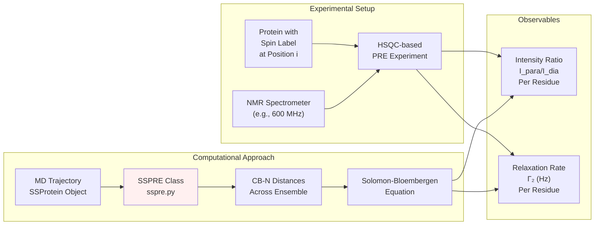
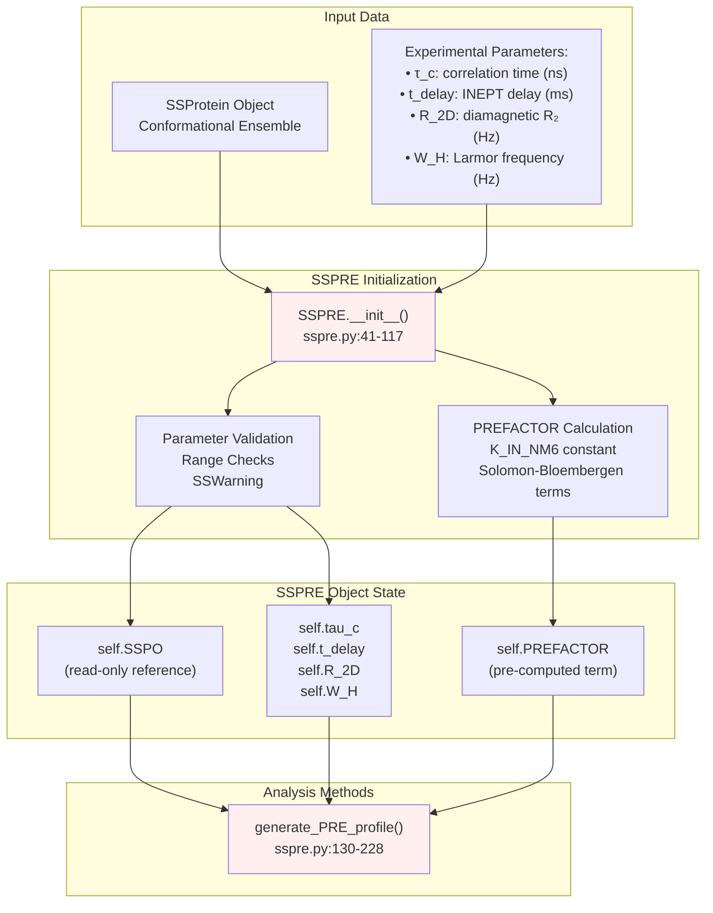
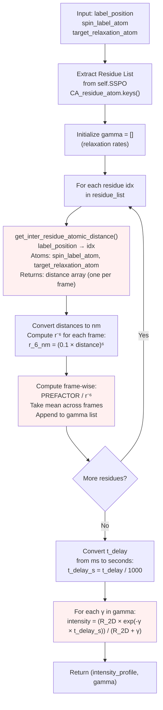
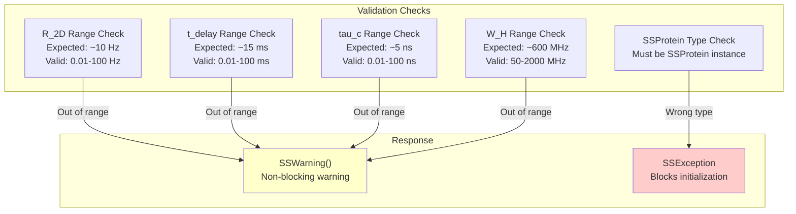
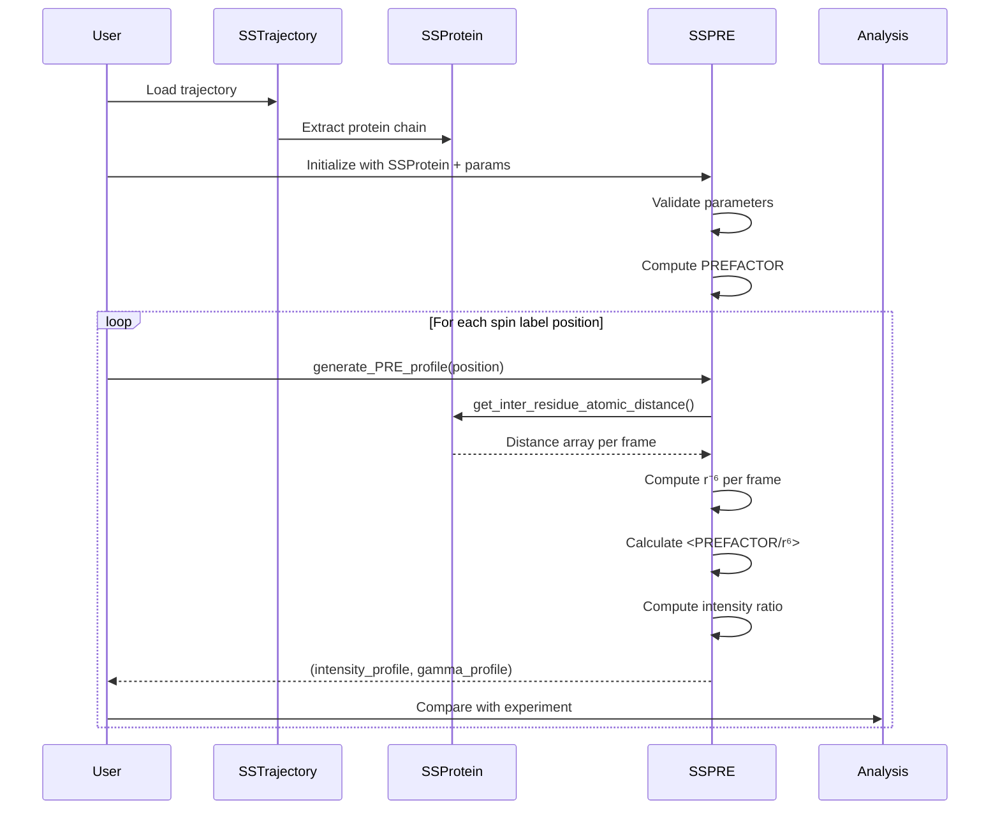
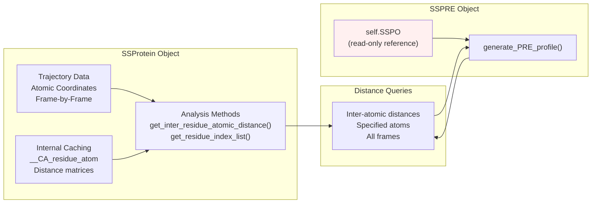

# PRE Profile Calculation

<details>
<summary>Relevant source files</summary>

The following files were used as context for generating this wiki page:

- [soursop/sspolymer.py](soursop/sspolymer.py)
- [soursop/sspre.py](soursop/sspre.py)
- [soursop/tests/conftest.py](soursop/tests/conftest.py)

</details>


## Purpose and Scope

This document describes the `sspre` module, which provides functionality for calculating synthetic Paramagnetic Relaxation Enhancement (PRE) profiles from conformational ensembles. PRE experiments measure the distance-dependent relaxation enhancement of nuclear spins near a paramagnetic center (typically a nitroxide spin label), making them powerful probes of ensemble structure in intrinsically disordered proteins.

The `SSPRE` class computes theoretical PRE intensity profiles and relaxation rate profiles from molecular dynamics trajectories, enabling direct comparison between simulation and experiment. These calculations are based on the Solomon-Bloembergen equation for dipolar relaxation.

For general protein analysis methods, see [SSProtein: Single Protein Analysis](#4). For other experimental observables like NMR chemical shifts, see [NMR Chemical Shift Prediction](#6.1).

**Sources:** [soursop/sspre.py:1-29]()

---

## Overview of PRE Theory

Paramagnetic Relaxation Enhancement experiments involve attaching a nitroxide spin label (typically via cysteine mutagenesis) at a specific position in a protein. The unpaired electron on the spin label enhances the transverse relaxation rate ($R_2$) of nearby nuclear spins through dipolar coupling, with the enhancement decaying as $r^{-6}$ where $r$ is the electron-nuclear distance.

The PRE intensity ratio ($I_{para}/I_{dia}$) reports on the ensemble-averaged distance between the spin label and observed nuclei:

- **Intensity ratio ≈ 0**: Residue is frequently near the spin label (strong PRE effect)
- **Intensity ratio ≈ 1**: Residue is typically far from the spin label (weak PRE effect)

The `SSPRE` class implements this calculation using the Solomon-Bloembergen equation, computing distance distributions from trajectories and converting them to observable PRE profiles.



**Diagram:** Relationship between experimental PRE measurements and computational prediction via the `SSPRE` class.

**Sources:** [soursop/sspre.py:19-25](), [soursop/sspre.py:130-199]()

---

## SSPRE Class Architecture

The `SSPRE` class provides a stateful object that encapsulates both the conformational ensemble (via an `SSProtein` object) and the experimental parameters needed for PRE calculation.



**Diagram:** Architecture of the `SSPRE` class showing initialization, state management, and analysis methods.

**Sources:** [soursop/sspre.py:32-117]()

---

## Initialization and Parameters

### Creating an SSPRE Object

The `SSPRE` class is initialized with an `SSProtein` object and four experimental parameters:

```python
from soursop.sspre import SSPRE

# Assuming 'protein' is an SSProtein object
pre_calculator = SSPRE(
    SSProteinObject=protein,
    tau_c=5.0,           # correlation time in nanoseconds
    t_delay=10.0,        # INEPT delay in milliseconds
    R_2D=10.0,           # diamagnetic R2 in Hz
    W_H=600000000        # Proton Larmor frequency in Hz (600 MHz)
)
```

### Parameter Descriptions

| Parameter | Type | Units | Typical Range | Description |
|-----------|------|-------|---------------|-------------|
| `SSProteinObject` | SSProtein | N/A | N/A | The protein ensemble to analyze |
| `tau_c` | float | nanoseconds | 1-30 | Effective correlation time for the electron-nuclear dipolar interaction |
| `t_delay` | float | milliseconds | 1-30 | Total duration of INEPT delays in the PRE pulse sequence (depends on experiment type, typically ~10 ms for HSQC) |
| `R_2D` | float | Hz | 5-20 | Transverse relaxation rate of backbone amide protons in the diamagnetic state (no spin label) |
| `W_H` | float | Hz | 100 MHz - 1 GHz | Proton Larmor frequency of the NMR magnet (e.g., 600000000 for a 600 MHz magnet) |

The initialization performs automatic parameter validation, issuing warnings via `SSWarning` if values fall outside typical ranges. This helps catch unit conversion errors or typographical mistakes.

**Sources:** [soursop/sspre.py:41-117]()

---

## Physical Constants and Prefactor Calculation

The PRE calculation uses fundamental physical constants defined at the module level:

```python
original_K = 1.2300e-32       # K constant in cm⁶·s⁻²
K_IN_NM6   = original_K*1e42  # K constant in nm⁶·s⁻²
```

During initialization, the `SSPRE` constructor pre-computes a prefactor term used in the Solomon-Bloembergen equation:

$$\text{PREFACTOR} = K \left( 4\tau_c + \frac{3\tau_c}{1 + \omega_H^2 \tau_c^2} \right)$$

where:
- $K$ is the dipolar coupling constant (`K_IN_NM6`)
- $\tau_c$ is the correlation time (converted from ns to seconds)
- $\omega_H$ is the proton Larmor frequency

This prefactor is stored in `self.PREFACTOR` and reused during profile generation, significantly improving computational efficiency.

**Sources:** [soursop/sspre.py:27-31](), [soursop/sspre.py:107-116]()

---

## Generating PRE Profiles

### The generate_PRE_profile() Method

The primary analysis method computes PRE profiles for a given spin label position:

```python
intensity_profile, gamma_profile = pre_calculator.generate_PRE_profile(
    label_position=25,              # residue index where spin label is attached
    spin_label_atom='CB',           # atom on which label resides
    target_relaxation_atom='N'      # atom experiencing relaxation (backbone amide)
)
```

### Method Parameters

| Parameter | Type | Default | Description |
|-----------|------|---------|-------------|
| `label_position` | int | Required | Residue index where the nitroxide spin label is located (should ideally have a CB atom) |
| `spin_label_atom` | str | `'CB'` | Atom name on which the spin label resides (use `'CA'` for glycine) |
| `target_relaxation_atom` | str | `'N'` | Atom experiencing relaxation (strongly recommended to keep as `'N'` for backbone amide nitrogen) |

### Return Values

The method returns a 2-tuple:

1. **Intensity Profile** (list of float): The PRE intensity ratio $I_{para}/I_{dia}$ for each residue
   - Values range from 0 (strong PRE, close contact) to 1 (weak PRE, distant)
   - Length equals the number of residues in the protein

2. **Gamma Profile** (list of float): The spin-label-induced amide proton relaxation rate $\Gamma_2$ in Hz for each residue
   - Directly comparable to experimental relaxation enhancement measurements
   - Length equals the number of residues in the protein

**Sources:** [soursop/sspre.py:130-228]()

---

## Calculation Methodology

### Distance-Based Relaxation Calculation

The PRE calculation follows this computational workflow:



**Diagram:** Computational workflow for generating PRE profiles via `generate_PRE_profile()`.

**Sources:** [soursop/sspre.py:201-228]()

---

## Critical Implementation Details

### Frame-Wise Averaging

The calculation correctly implements ensemble averaging by computing the relaxation contribution **for each frame independently** before averaging:

$$\Gamma_2^i = \left\langle \frac{\text{PREFACTOR}}{r_{ij}^6} \right\rangle_{\text{frames}}$$

This is the physically correct approach because the relationship between distance and relaxation is highly non-linear ($r^{-6}$ dependence). Computing $\langle r^{-6} \rangle$ is **not** equivalent to $\langle r \rangle^{-6}$, and only the former properly captures ensemble heterogeneity.

The implementation achieves this at [soursop/sspre.py:217-218]():
```python
r_6_nm = np.power(0.1*self.SSPO.get_inter_residue_atomic_distance(...), 6)
gamma.append(np.mean(self.PREFACTOR/r_6_nm))
```

### Distance Calculation

Inter-atomic distances are obtained via the `SSProtein.get_inter_residue_atomic_distance()` method, which returns an array of distances (in Ångströms) across all frames in the trajectory. The method specification of `spin_label_atom` and `target_relaxation_atom` allows flexible atom selection, though CB→N is the standard parameterization.

### Unit Conversions

Multiple unit conversions occur during the calculation:

1. **Distance**: Ångströms → nanometers (factor of 0.1) [soursop/sspre.py:217]()
2. **Correlation time**: nanoseconds → seconds (factor of 10⁻⁹) [soursop/sspre.py:108]()
3. **INEPT delay**: milliseconds → seconds (factor of 10⁻³) [soursop/sspre.py:221]()

**Sources:** [soursop/sspre.py:216-228]()

---

## Intensity Ratio Calculation

Once the relaxation rate profile $\Gamma_2$ is computed, the observable PRE intensity ratio is calculated using:

$$\frac{I_{para}}{I_{dia}} = \frac{R_{2D} \cdot e^{-\Gamma_2 \cdot t_{delay}}}{R_{2D} + \Gamma_2}$$

where:
- $I_{para}$ is the peak intensity in the paramagnetic state
- $I_{dia}$ is the peak intensity in the diamagnetic state
- $R_{2D}$ is the diamagnetic transverse relaxation rate
- $\Gamma_2$ is the PRE-induced relaxation enhancement
- $t_{delay}$ is the total INEPT delay duration

This formula accounts for signal loss during the pulse sequence delays due to both intrinsic relaxation ($R_{2D}$) and PRE-induced relaxation ($\Gamma_2$).

**Sources:** [soursop/sspre.py:220-227]()

---

## Parameter Validation and Warnings

The `SSPRE` constructor includes comprehensive validation to detect parameter errors:



**Diagram:** Parameter validation logic in `SSPRE.__init__()`.

The validation includes:

- **Type checking**: Ensures the first argument is an `SSProtein` object (raises `SSException` if not)
- **Range checking**: Warns if parameters fall outside typical experimental ranges (non-blocking)
- **Unit reminders**: Warning messages explicitly state expected units to help diagnose conversion errors

**Sources:** [soursop/sspre.py:81-106]()

---

## Example Usage Workflow

### Complete Analysis Example

```python
from soursop import SSTrajectory
from soursop.sspre import SSPRE

# Load trajectory
traj = SSTrajectory('trajectory.xtc', 'topology.pdb')
protein = traj.proteinTrajectoryList[0]

# Initialize PRE calculator with experimental parameters
pre_calc = SSPRE(
    SSProteinObject=protein,
    tau_c=5.0,          # 5 ns correlation time
    t_delay=10.0,       # 10 ms INEPT delay
    R_2D=10.0,          # 10 Hz diamagnetic R2
    W_H=600000000       # 600 MHz spectrometer
)

# Calculate PRE profile for spin label at position 50
intensity_ratio, gamma_2 = pre_calc.generate_PRE_profile(
    label_position=50,
    spin_label_atom='CB',
    target_relaxation_atom='N'
)

# intensity_ratio: List of I_para/I_dia values per residue
# gamma_2: List of relaxation rates (Hz) per residue
```

### Typical Application Pattern



**Diagram:** Typical usage pattern for PRE profile calculation showing interaction between components.

**Sources:** [soursop/sspre.py:130-228]()

---

## Performance Characteristics

### Computational Efficiency

The PRE calculation is highly optimized:

- **Pre-computation**: The `PREFACTOR` term is computed once during initialization and reused for all profiles
- **Vectorized operations**: Distance calculations use NumPy vectorization across frames
- **Fast distance queries**: Leverages `SSProtein`'s cached distance calculation infrastructure

According to the documentation comment at [soursop/sspre.py:149-150](), the calculation is "extremely fast (sub 10 seconds on a ~6000 frame ensemble)."

### Memory Footprint

The `SSPRE` object maintains minimal state:
- A read-only reference to the `SSProtein` object (no data duplication)
- Four scalar parameters (tau_c, t_delay, R_2D, W_H)
- One pre-computed scalar (PREFACTOR)

Distance arrays are computed on-demand and not retained, keeping memory usage low.

**Sources:** [soursop/sspre.py:77-116](), [soursop/sspre.py:149-150]()

---

## References and Theoretical Background

The PRE calculation methodology is based on established approaches from the following publications:

1. **Meng et al. (2013)** - PNAS 110:2123-2128
   - Early application of PRE simulations to disordered proteins
   - Established CB-N distance calculation protocol

2. **Das et al. (2016)** - PNAS 113:5616-5621
   - PRE analysis of p27Kip1 revealing cryptic sequence features
   - Validation of computational PRE prediction

3. **Peran et al. (2019)** - PNAS 116:12301-12310
   - PRE studies of unfolded states under native conditions
   - Demonstrated sequence-specific conformational preferences

These references are documented in the method docstring at [soursop/sspre.py:181-199]().

**Sources:** [soursop/sspre.py:181-199]()

---

## Integration with SSProtein

The `SSPRE` class operates as a consumer of `SSProtein` data:



**Diagram:** Relationship between `SSPRE` and `SSProtein`, showing data dependencies and method calls.

Key integration points:
- **`get_inter_residue_atomic_distance()`**: Primary data source for distance calculations
- **`_SSProtein__CA_residue_atom`**: Private attribute accessed to obtain residue list (via keys())
- **Read-only access**: The `SSPRE` object never modifies the underlying `SSProtein`

**Sources:** [soursop/sspre.py:77-82](), [soursop/sspre.py:202-206](), [soursop/sspre.py:217]()

---

## Testing and Validation

Test fixtures for PRE analysis are available in the test infrastructure. The test suite includes protein trajectories (CTL9, GS6, NTL9) that can be used to validate PRE calculations:

```python
# Example test fixture usage
@pytest.fixture(scope='session', autouse=True)
def CTL9_CP(request):
    topology_path = os.path.join(test_data_dir, CTL9_FILES[0])
    trajectory_path = os.path.join(test_data_dir, CTL9_FILES[1])
    CTL9_CP = sstrajectory.SSTrajectory(trajectory_path, topology_path).proteinTrajectoryList[0]
    return CTL9_CP
```

These fixtures provide validated `SSProtein` objects suitable for testing PRE calculations.

**Sources:** [soursop/tests/conftest.py:19-26]()

---

## Related Modules

The `SSPRE` module shares structural similarities with other specialized analysis modules:

- **`ssnmr`** ([NMR Chemical Shift Prediction](#6.1)): Computes NMR chemical shifts from ensembles
- **`ssmutualinformation`** ([Mutual Information Analysis](#6.3)): Calculates statistical correlations
- **`sspolymer`** ([Polymer Physics Utilities](#6.4)): Polymer-specific calculations like overlap concentration

All these modules follow the pattern of consuming `SSProtein` objects to compute specialized observables.

**Sources:** [soursop/sspre.py:1-18](), [soursop/sspolymer.py:1-54]()

---