# Mutual Information Analysis

<details>
<summary>Relevant source files</summary>

The following files were used as context for generating this wiki page:

- [soursop/_internal_data.py](soursop/_internal_data.py)
- [soursop/configs.py](soursop/configs.py)
- [soursop/soursop.py](soursop/soursop.py)
- [soursop/ssexceptions.py](soursop/ssexceptions.py)
- [soursop/ssio.py](soursop/ssio.py)
- [soursop/ssmutualinformation.py](soursop/ssmutualinformation.py)
- [soursop/ssnmr.py](soursop/ssnmr.py)
- [soursop/tests/test_ssmutual_information.py](soursop/tests/test_ssmutual_information.py)

</details>


This page documents the mutual information (MI) calculation functionality provided by the `ssmutualinformation` module. Mutual information is a statistical measure that quantifies the amount of information shared between two variables, making it useful for identifying correlations between different structural observables in molecular dynamics trajectories.

For other specialized analysis capabilities, see [NMR Chemical Shift Prediction](#6.1), [PRE Profile Calculation](#6.2), and [Polymer Physics Utilities](#6.4). For general structural analysis methods, see [SSProtein: Single Protein Analysis](#4).

**Sources:** [soursop/ssmutualinformation.py:14-18]()

---

## Module Architecture

Unlike other specialized analysis modules, `ssmutualinformation` is implemented as a collection of standalone functions rather than a class. This design allows these statistical utilities to be used flexibly with any observables extracted from trajectory analysis.

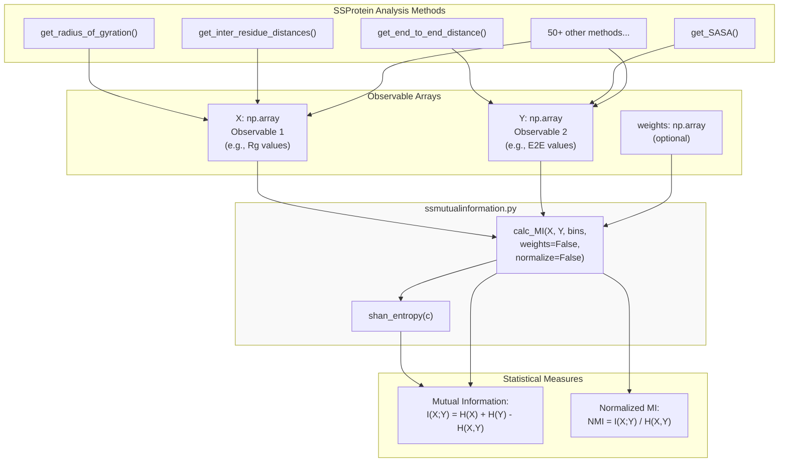

**Sources:** [soursop/ssmutualinformation.py:1-136]()

---

## Information Theory Foundations

Mutual information quantifies the reduction in uncertainty about one variable when the other is known. The calculation is based on Shannon entropy and joint probability distributions.

### Mathematical Framework

| Measure | Formula | Interpretation |
|---------|---------|----------------|
| **Shannon Entropy** | `H(X) = -Σ p(x) log p(x)` | Uncertainty in distribution X |
| **Joint Entropy** | `H(X,Y) = -Σ p(x,y) log p(x,y)` | Uncertainty in joint distribution |
| **Mutual Information** | `I(X;Y) = H(X) + H(Y) - H(X,Y)` | Shared information between X and Y |
| **Normalized MI** | `NMI = I(X;Y) / H(X,Y)` | MI scaled to [0,1] range |

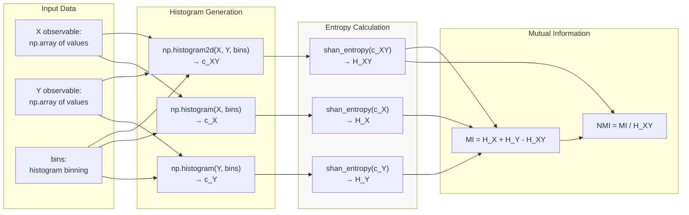

**Sources:** [soursop/ssmutualinformation.py:26-105](), [soursop/ssmutualinformation.py:110-136]()

---

## Function Reference

### calc_MI()

Calculate mutual information between two observables with optional weighting and normalization.

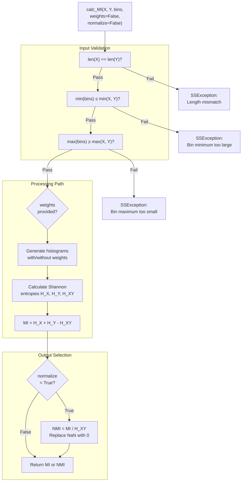

**Sources:** [soursop/ssmutualinformation.py:26-105]()

#### Parameters

| Parameter | Type | Default | Description |
|-----------|------|---------|-------------|
| `X` | `np.array` | (required) | First observable array. Must be same length as `Y`. |
| `Y` | `np.array` | (required) | Second observable array. Must be same length as `X`. |
| `bins` | `np.array` | (required) | Histogram bins. Must be uniformly spaced, monotonically increasing, and span the full data range of both `X` and `Y`. |
| `weights` | `np.array` or `False` | `False` | Optional weights for each observation. If provided, must be same length as `X` and `Y`. |
| `normalize` | `bool` | `False` | If `True`, returns normalized mutual information (NMI) scaled by joint Shannon entropy. |

#### Returns

- **float**: Mutual information value (or normalized mutual information if `normalize=True`)
- Larger values indicate greater mutual information
- MI values are bin-size dependent
- NMI values are in range [0, 1] where 0 indicates independence and 1 indicates perfect correlation

#### Implementation Details

**Histogram Generation** [soursop/ssmutualinformation.py:79-86]():
```python
if weights:
    c_XY = np.histogram2d(X,Y,bins,weights=weights)[0]
    c_X = np.histogram(X,bins,weights=weights)[0]
    c_Y = np.histogram(Y,bins,weights=weights)[0]
else:
    c_XY = np.histogram2d(X,Y,bins)[0]
    c_X = np.histogram(X,bins)[0]
    c_Y = np.histogram(Y,bins)[0]
```

**MI Calculation** [soursop/ssmutualinformation.py:88-92]():
```python
H_X = shan_entropy(c_X)
H_Y = shan_entropy(c_Y)
H_XY = shan_entropy(c_XY)
MI = H_X + H_Y - H_XY
```

**Normalization** [soursop/ssmutualinformation.py:94-103]():
```python
if normalize:
    nmi = MI / H_XY
    if np.isnan(nmi):
        nmi = 0
    return nmi
```

**Sources:** [soursop/ssmutualinformation.py:26-105]()

---

### shan_entropy()

Calculate the Shannon entropy of a probability distribution.

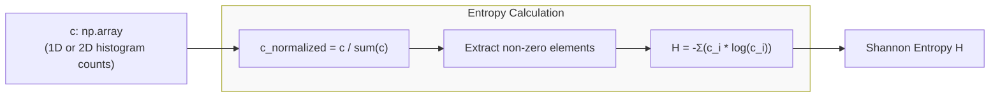

**Sources:** [soursop/ssmutualinformation.py:110-136]()

#### Parameters

| Parameter | Type | Description |
|-----------|------|-------------|
| `c` | `np.array` | Array (1D or 2D) or list of numerical values representing histogram counts or probability distribution |

#### Returns

- **float**: Shannon entropy of the distribution
- Higher entropy indicates more uniform (less predictable) distribution
- Lower entropy indicates more concentrated (more predictable) distribution

#### Implementation

[soursop/ssmutualinformation.py:127-135]():
```python
# normalize such that all elements sum up to 1
c_normalized = c / float(np.sum(c))

# now convert into a single vector of non-zero elements
c_normalized = c_normalized[np.nonzero(c_normalized)]

# compute the entropy associated with this vector
H = -sum(c_normalized* np.log(c_normalized))
return H
```

**Sources:** [soursop/ssmutualinformation.py:110-136]()

---

## Usage Patterns

### Pattern 1: Correlation Between Global Properties

Analyze the relationship between radius of gyration and end-to-end distance across a trajectory.

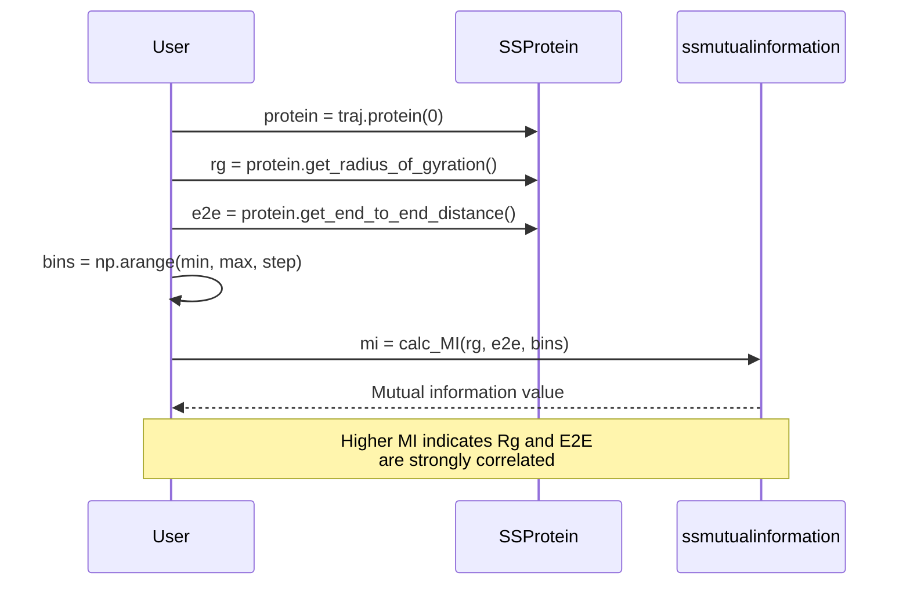

**Sources:** [soursop/ssmutualinformation.py:26-105]()

---

### Pattern 2: Weighted Analysis

Apply frame-specific weights (e.g., from reweighting schemes) to the mutual information calculation.

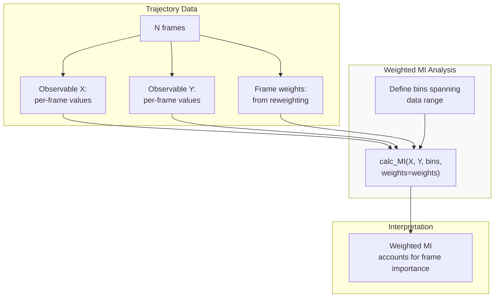

**Sources:** [soursop/ssmutualinformation.py:48-51](), [soursop/ssmutualinformation.py:79-86]()

---

### Pattern 3: Normalized MI for Comparing Observables

Use normalized mutual information to compare correlation strength across different observable pairs.

| Observable Pair | MI (Raw) | NMI (Normalized) | Interpretation |
|----------------|----------|------------------|----------------|
| Rg vs E2E | 0.693 | 0.95 | Very strong correlation |
| Rg vs SASA | 0.450 | 0.65 | Moderate correlation |
| E2E vs χ1 | 0.120 | 0.15 | Weak correlation |

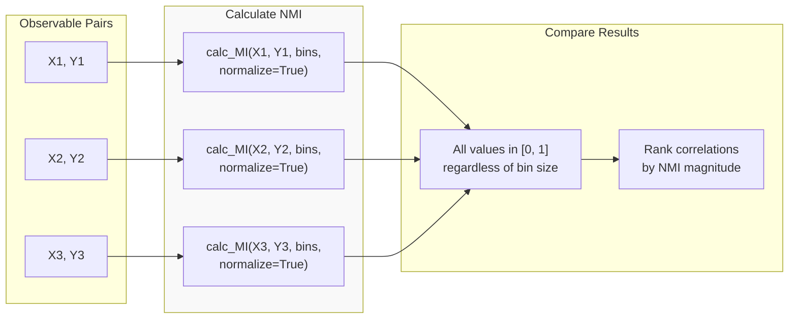

**Sources:** [soursop/ssmutualinformation.py:53-60](), [soursop/ssmutualinformation.py:94-103]()

---

## Practical Examples

### Example 1: Basic MI Calculation

```python
import numpy as np
from soursop import ssmutualinformation

# Extract observables from trajectory
# (assuming 'protein' is an SSProtein object)
rg_values = protein.get_radius_of_gyration()
e2e_values = protein.get_end_to_end_distance()

# Define bins that span both observables
bins = np.arange(0, 50, 0.5)  # 0 to 50 Å in 0.5 Å steps

# Calculate mutual information
mi = ssmutualinformation.calc_MI(rg_values, e2e_values, bins)
print(f"Mutual Information: {mi:.3f}")
```

**Sources:** [soursop/ssmutualinformation.py:26-68]()

---

### Example 2: Normalized MI for Scale-Independent Comparison

```python
# Compare multiple observable pairs
observables = {
    'Rg vs E2E': (rg_values, e2e_values),
    'Rg vs SASA': (rg_values, sasa_values),
    'E2E vs Asphericity': (e2e_values, asph_values)
}

results = {}
for name, (X, Y) in observables.items():
    # Use appropriate bins for each pair
    bins = np.linspace(min(X.min(), Y.min()), 
                       max(X.max(), Y.max()), 50)
    
    # Calculate normalized MI
    nmi = ssmutualinformation.calc_MI(X, Y, bins, normalize=True)
    results[name] = nmi

# Rank by correlation strength
for name, nmi in sorted(results.items(), key=lambda x: x[1], reverse=True):
    print(f"{name}: NMI = {nmi:.3f}")
```

**Sources:** [soursop/ssmutualinformation.py:94-103]()

---

### Example 3: Weighted MI with Reweighting

```python
# Apply frame weights from a reweighting scheme
frame_weights = compute_reweighting_factors(protein)  # external function

# Calculate weighted MI
mi_weighted = ssmutualinformation.calc_MI(
    rg_values, 
    e2e_values, 
    bins, 
    weights=frame_weights
)

# Compare to unweighted
mi_unweighted = ssmutualinformation.calc_MI(rg_values, e2e_values, bins)

print(f"Unweighted MI: {mi_unweighted:.3f}")
print(f"Weighted MI:   {mi_weighted:.3f}")
```

**Sources:** [soursop/ssmutualinformation.py:79-86]()

---

## Error Handling and Edge Cases

### Validation Checks

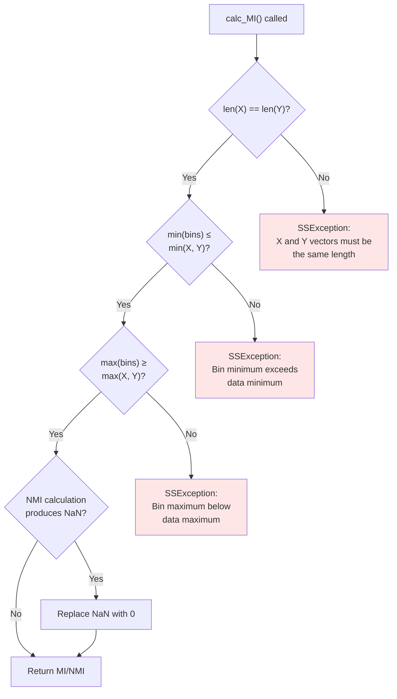

**Sources:** [soursop/ssmutualinformation.py:70-77](), [soursop/ssmutualinformation.py:100-102]()

### Common Exceptions

| Exception | Condition | Line Reference |
|-----------|-----------|----------------|
| `SSException` | `len(X) != len(Y)` | [soursop/ssmutualinformation.py:70-71]() |
| `SSException` | `min(bins) > min(X)` or `min(bins) > min(Y)` | [soursop/ssmutualinformation.py:73-74]() |
| `SSException` | `max(bins) < max(X)` or `max(bins) < max(Y)` | [soursop/ssmutualinformation.py:76-77]() |

**NaN Handling:** When normalization produces NaN (typically when joint entropy is zero), the value is automatically replaced with 0 [soursop/ssmutualinformation.py:100-102]().

**Sources:** [soursop/ssmutualinformation.py:70-77](), [soursop/ssmutualinformation.py:100-102]()

---

## Testing and Validation

The module includes comprehensive tests demonstrating expected behavior.

### Test Cases

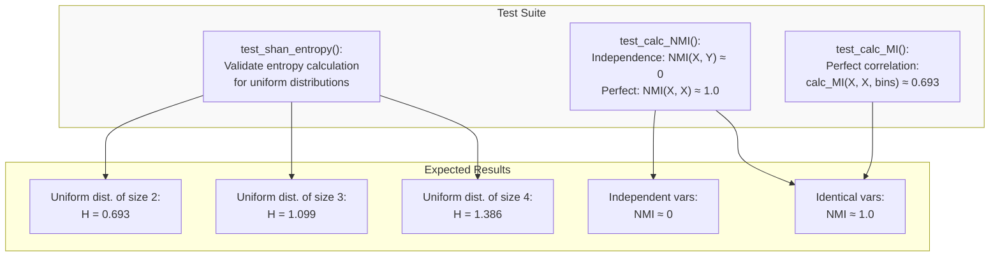

**Sources:** [soursop/tests/test_ssmutual_information.py:1-31]()

### Test Implementation

**Shannon Entropy Tests** [soursop/tests/test_ssmutual_information.py:6-11]():
- Validates entropy for uniform distributions of different sizes
- Verifies logarithmic growth with distribution size

**Mutual Information Tests** [soursop/tests/test_ssmutual_information.py:14-21]():
- Tests perfect correlation: MI between a variable and itself
- Uses random normal distributions to ensure robustness

**Normalized MI Tests** [soursop/tests/test_ssmutual_information.py:22-29]():
- Tests independence: random independent variables should have NMI ≈ 0
- Tests perfect correlation: identical variables should have NMI ≈ 1.0

**Sources:** [soursop/tests/test_ssmutual_information.py:1-31]()

---

## Implementation Notes

### Dependencies

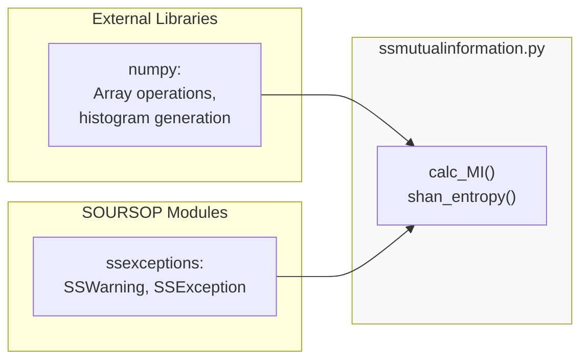

**Sources:** [soursop/ssmutualinformation.py:20-21]()

### Design Rationale

The module is implemented as **standalone functions** rather than a class because:

1. **Generality**: MI calculations are pure statistical operations that don't require state
2. **Flexibility**: Functions can be applied to any pair of observables from any source
3. **Simplicity**: No need to instantiate objects for one-off calculations
4. **Reusability**: Functions can be easily imported and used in different contexts

**Sources:** [soursop/ssmutualinformation.py:14-18]()

---

## Performance Considerations

### Bin Size Selection

Mutual information values are **bin-size dependent**. Consider these guidelines:

| Factor | Recommendation |
|--------|---------------|
| **Number of bins** | 30-100 bins typically provide good resolution |
| **Bin width** | Should be smaller than meaningful feature scales |
| **Data coverage** | Bins must span full data range (enforced by validation) |
| **Sample size** | More frames allow finer binning |

### Computational Cost

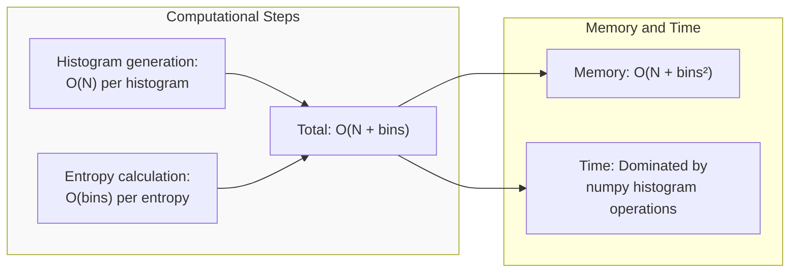

- **Time complexity**: O(N) where N is the number of frames
- **Memory complexity**: O(N + bins²) for 2D histogram
- **Bottleneck**: `np.histogram2d()` for large datasets

**Sources:** [soursop/ssmutualinformation.py:79-92]()

---

## Integration with SSProtein

While `ssmutualinformation` functions are standalone, they integrate naturally with `SSProtein` analysis methods:

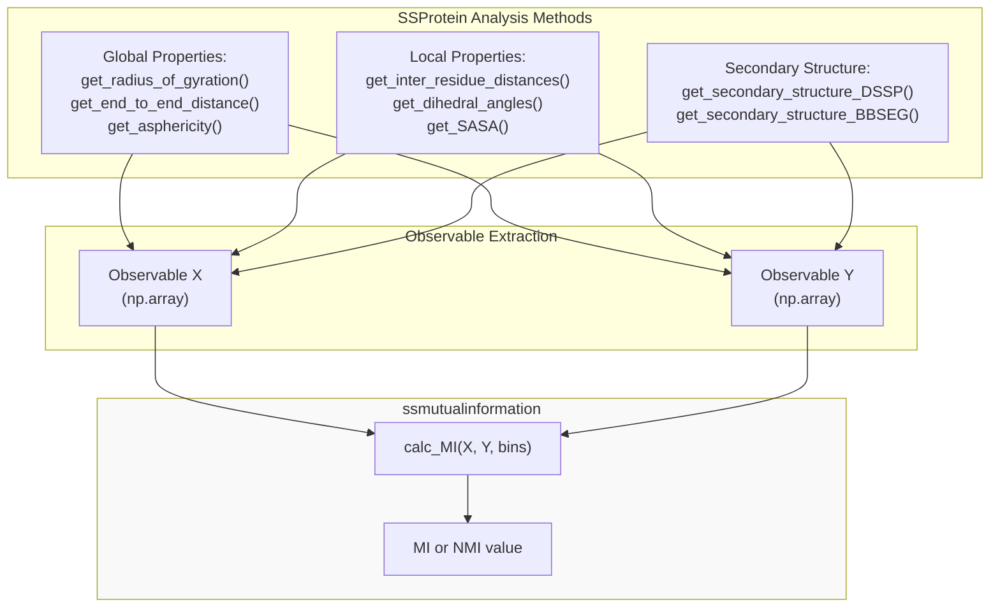

**Sources:** [soursop/ssmutualinformation.py:14-18]()

---