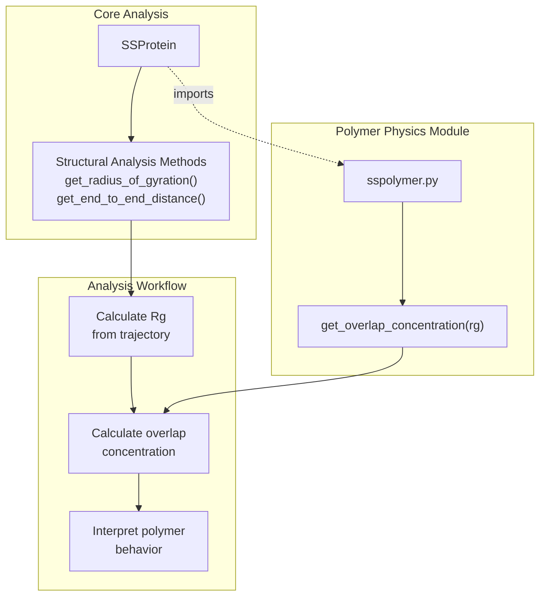
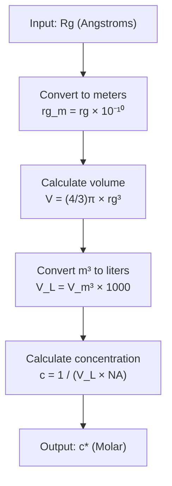
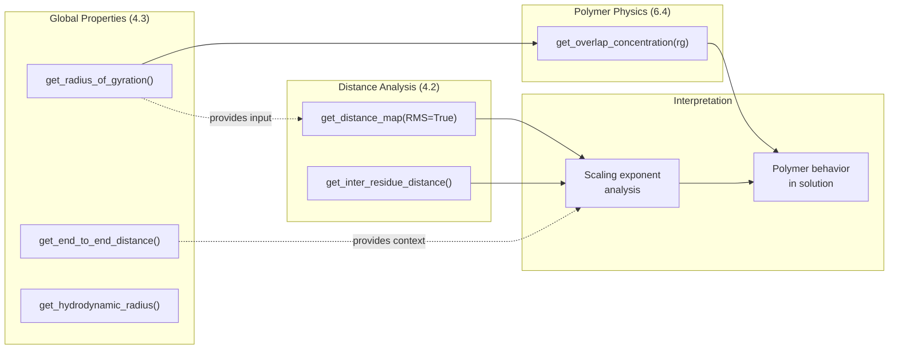

# Polymer Physics Utilities

<details>
<summary>Relevant source files</summary>

The following files were used as context for generating this wiki page:

- [soursop/sspolymer.py](soursop/sspolymer.py)
- [soursop/sspre.py](soursop/sspre.py)
- [soursop/ssprotein.py](soursop/ssprotein.py)
- [soursop/tests/conftest.py](soursop/tests/conftest.py)

</details>


## Purpose and Scope

This page documents the polymer physics utilities available in SOURSOP, specifically focusing on calculations relevant to understanding intrinsically disordered proteins (IDPs) as polymer chains. The primary utility is the overlap concentration calculation, which determines the concentration at which flexible polymer chains begin to interact in solution.

For information about calculating the radius of gyration and other global structural properties that serve as input to these utilities, see [Global Structural Properties](#4.3). For distance-based analysis methods that incorporate polymer physics concepts, see [Distance Calculations](#4.2).

## Overview

The polymer physics utilities in SOURSOP provide specialized calculations that treat proteins as flexible polymer chains. These utilities are particularly relevant for IDPs, which often behave as random coils or self-avoiding walks in solution. The main functionality is implemented in the `sspolymer` module, which can be used independently or in conjunction with `SSProtein` analysis methods.

**Sources:** [soursop/sspolymer.py:1-54]()

## System Architecture



**Sources:** [soursop/ssprotein.py:25](), [soursop/sspolymer.py:1-54]()

## Overlap Concentration Calculation

### Overview

The overlap concentration (c*) is a fundamental concept in polymer physics that represents the concentration at which flexible polymer chains begin to overlap with each other in solution. Below this concentration, chains behave as isolated polymers; above it, chains begin to interpenetrate and interact.

### Mathematical Background

The overlap concentration is calculated from the radius of gyration (Rg) using the relationship:

```
c* = M / (NA × V)
```

Where:
- M = molecular weight (implicit: 1 molecule)
- NA = Avogadro's number (6.023 × 10²³ mol⁻¹)
- V = volume occupied by the polymer, approximated as a sphere: V = (4/3)πRg³

### Function Interface

```python
def get_overlap_concentration(rg)
```

**Parameters:**

| Parameter | Type | Units | Description |
|-----------|------|-------|-------------|
| `rg` | float | Angstroms | Radius of gyration of the protein |

**Returns:**

| Type | Units | Description |
|------|-------|-------------|
| float | Molar (M) | Overlap concentration |

**Sources:** [soursop/sspolymer.py:17-53]()

### Implementation Details



**Sources:** [soursop/sspolymer.py:38-53]()

### Key Implementation Steps

1. **Unit Conversion (Angstroms → Meters):** The input Rg is converted from Angstroms to meters for SI unit consistency
   - [soursop/sspolymer.py:42]()

2. **Volume Calculation:** The volume is calculated assuming a spherical region with radius Rg
   - [soursop/sspolymer.py:45]()

3. **Liter Conversion:** The volume is converted from cubic meters to liters for molarity calculation
   - [soursop/sspolymer.py:48]()

4. **Concentration Calculation:** The final concentration uses Avogadro's number to convert from molecular count to molar units
   - [soursop/sspolymer.py:51]()

**Sources:** [soursop/sspolymer.py:38-53]()

## Usage Examples

### Basic Usage

```python
from soursop import sspolymer

# Rg value in Angstroms (example value for a typical IDP)
rg = 25.0  # Angstroms

# Calculate overlap concentration
c_star = sspolymer.get_overlap_concentration(rg)
print(f"Overlap concentration: {c_star:.2e} M")
```

### Integration with SSProtein Analysis

```python
from soursop import sstrajectory, sspolymer
import numpy as np

# Load trajectory
traj = sstrajectory.SSTrajectory('trajectory.xtc', 'topology.pdb')
protein = traj.proteinTrajectoryList[0]

# Calculate Rg across ensemble
rg_values = protein.get_radius_of_gyration()
mean_rg = np.mean(rg_values)

# Calculate overlap concentration
c_star = sspolymer.get_overlap_concentration(mean_rg)

print(f"Mean Rg: {mean_rg:.2f} Å")
print(f"Overlap concentration: {c_star:.2e} M")
print(f"Overlap concentration: {c_star*1000:.2e} mM")
```

**Sources:** [soursop/sspolymer.py:17-53](), [soursop/ssprotein.py:25]()

## Polymer Physics Concepts in SOURSOP

### Root Mean Square (RMS) Distances

Several distance-based analysis methods in `SSProtein` incorporate polymer physics concepts through the `RMS` parameter. When calculating distance maps, the RMS option computes the root mean squared distance:

```
RMS distance = √⟨r_ij²⟩
```

This is the formal order parameter for polymeric distance properties, as opposed to simple mean distances ⟨r_ij⟩.

| Method | RMS Support | Description |
|--------|-------------|-------------|
| `get_distance_map()` | Yes | Computes RMS distance maps when `RMS=True` |
| `get_end_to_end_distance()` | Implicit | Returns instantaneous distances suitable for RMS calculation |
| `get_inter_residue_distance()` | Implicit | Returns distance arrays suitable for RMS analysis |

**Sources:** [soursop/ssprotein.py:1251-1300]()

### Polymer Scaling Analysis

Distance maps with the `RMS=True` parameter are appropriate for polymer scaling analysis, where the relationship between sequence separation (|i - j|) and spatial distance follows power-law behavior:

```
⟨R²⟩ ~ |i - j|^(2ν)
```

Where ν is the scaling exponent (ν ≈ 0.5 for random coils, ν ≈ 0.6 for self-avoiding walks).

**Sources:** [soursop/ssprotein.py:1251-1300]()

## Connection to Other Analysis Methods



**Sources:** [soursop/ssprotein.py:25](), [soursop/sspolymer.py:1-54]()

## Physical Interpretation

### Overlap Concentration Values

Typical overlap concentrations for IDPs range from micromolar to millimolar, depending on the protein size:

| Rg Range | Typical Protein Size | Approximate c* | Regime |
|----------|---------------------|----------------|--------|
| 10-20 Å | Small IDPs (20-50 aa) | 1-10 mM | High concentration |
| 20-40 Å | Medium IDPs (50-150 aa) | 0.1-1 mM | Moderate concentration |
| 40-80 Å | Large IDPs (150-400 aa) | 0.01-0.1 mM | Low concentration |
| >80 Å | Very large IDPs (>400 aa) | <0.01 mM | Very low concentration |

**Interpretation:**
- **Below c\*:** Proteins behave as isolated chains; suitable for single-molecule analysis
- **Near c\*:** Transition regime where chain-chain interactions become significant
- **Above c\*:** Semi-dilute regime; proteins interpenetrate and exhibit collective behavior

**Sources:** [soursop/sspolymer.py:17-53]()

## Constants and Physical Parameters

### Avogadro's Number

The implementation uses Avogadro's number: **NA = 6.023 × 10²³ mol⁻¹**

[soursop/sspolymer.py:39]()

### Unit Conversions

| Conversion | Factor | Implementation Line |
|------------|--------|-------------------|
| Angstroms → Meters | × 10⁻¹⁰ | [soursop/sspolymer.py:42]() |
| Cubic meters → Liters | × 1000 | [soursop/sspolymer.py:48]() |

**Sources:** [soursop/sspolymer.py:38-53]()

## Testing

The polymer physics utilities are tested through the standard SOURSOP test suite. Test fixtures include protein trajectories that can be used to validate overlap concentration calculations:

| Fixture | Source | Use Case |
|---------|--------|----------|
| `GS6_CP` | [soursop/tests/conftest.py:38-43]() | Small test protein |
| `CTL9_CP` | [soursop/tests/conftest.py:20-26]() | Medium-sized protein |
| `NTL9_CP` | [soursop/tests/conftest.py:55-60]() | Test protein with structure |

**Sources:** [soursop/tests/conftest.py:1-102]()

## Related Utilities

The `sspolymer` module is imported alongside other utility modules in the core `SSProtein` class:

```python
from . import ssmutualinformation, ssio, sstools, sspolymer, ssutils
```

This placement indicates that `sspolymer` is designed as a utility module that provides specialized calculations rather than a full analysis framework.

**Sources:** [soursop/ssprotein.py:25]()

## Limitations and Considerations

1. **Spherical Approximation:** The overlap concentration calculation assumes the protein occupies a spherical volume, which is generally valid for random coils but may be less accurate for proteins with significant anisotropy.

2. **Mean Field Approximation:** The calculation treats the protein as occupying a uniform volume, neglecting internal density fluctuations and heterogeneity.

3. **Single Chain Properties:** The calculation is based on single-chain properties (Rg) and does not account for protein-protein interactions or excluded volume effects that may occur in crowded solutions.

4. **No Concentration Dependence:** The function calculates a single overlap concentration value and does not account for how protein conformation might change with concentration.

**Sources:** [soursop/sspolymer.py:17-53]()

---