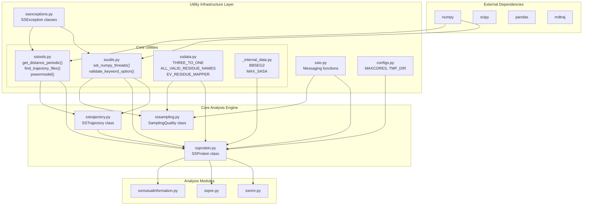
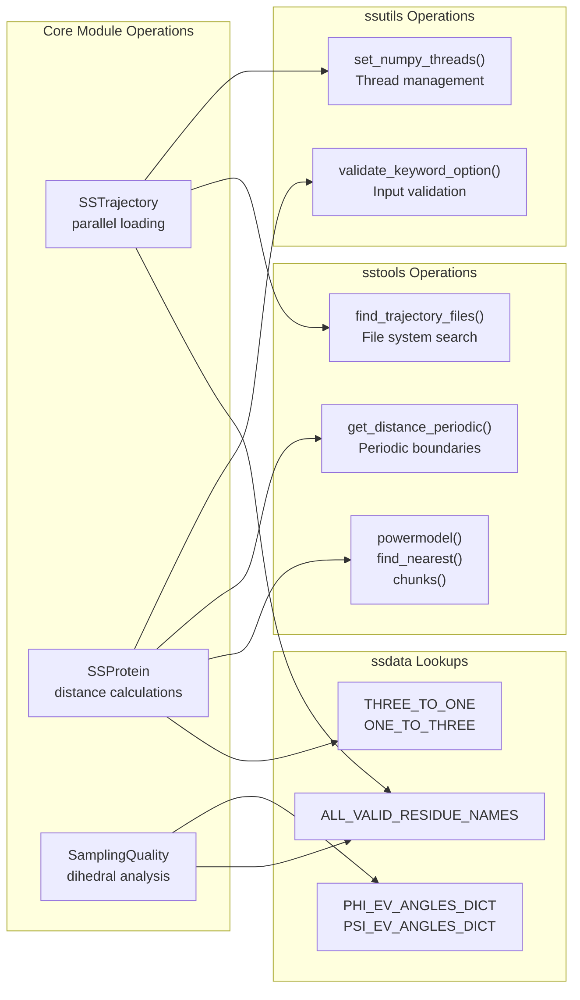

# Utility Modules and Infrastructure

<details>
<summary>Relevant source files</summary>

The following files were used as context for generating this wiki page:

- [.github/workflows/soursop-ci.yml](.github/workflows/soursop-ci.yml)
- [soursop/data/phi_excluded_volume_tripeptides.pickle](soursop/data/phi_excluded_volume_tripeptides.pickle)
- [soursop/data/psi_excluded_volume_tripeptides.pickle](soursop/data/psi_excluded_volume_tripeptides.pickle)
- [soursop/ssdata.py](soursop/ssdata.py)
- [soursop/sstools.py](soursop/sstools.py)
- [soursop/ssutils.py](soursop/ssutils.py)
- [soursop/tests/test_ssutils.py](soursop/tests/test_ssutils.py)

</details>


## Purpose and Scope

This page provides an overview of SOURSOP's utility modules and infrastructure layer. These modules provide essential supporting functionality that enables the core analysis engine to operate efficiently and reliably. The utilities handle thread management, numerical computations, data validation, amino acid nomenclature, error handling, and configuration management.

For detailed documentation on specific utility modules, see:
- Thread control and validation: [#7.1](#7.1)
- Numerical and file utilities: [#7.2](#7.2)
- Amino acid data and mappings: [#7.3](#7.3)
- Error handling and logging: [#7.4](#7.4)

For information about the core analysis classes that depend on these utilities, see [SSTrajectory](#3), [SSProtein](#4), and [SamplingQuality](#5).

## Overview

SOURSOP's infrastructure layer consists of multiple utility modules that form the foundation upon which the analysis engine is built. These modules are designed to be:

- **Reusable**: Functions and data structures used across multiple analysis modules
- **Performant**: Optimization of computational bottlenecks (e.g., thread management)
- **Reliable**: Input validation and standardized error handling
- **Maintainable**: Centralized data definitions and configurations

The utility layer represents approximately 57% of the codebase cluster analysis (for `ssutils`) and provides critical services that allow the core modules to focus on scientific analysis rather than infrastructure concerns.

**Sources:** [soursop/ssutils.py:1-195](), [soursop/sstools.py:1-247](), [soursop/ssdata.py:1-144]()

## Utility Module Catalog

The following table summarizes the utility modules available in SOURSOP:

| Module | Location | Primary Purpose | Key Components |
|--------|----------|----------------|----------------|
| **ssutils** | `soursop/ssutils.py` | Thread control and keyword validation | `set_numpy_threads()`, `validate_keyword_option()` |
| **sstools** | `soursop/sstools.py` | Numerical operations and file discovery | `get_distance_periodic()`, `find_trajectory_files()`, `powermodel()` |
| **ssdata** | `soursop/ssdata.py` | Amino acid nomenclature and biological data | `THREE_TO_ONE`, `ONE_TO_THREE`, `ALL_VALID_RESIDUE_NAMES`, `EV_RESIDUE_MAPPER` |
| **ssio** | `soursop/ssio.py` | User messaging and output formatting | Warning and informational message functions |
| **ssexceptions** | `soursop/ssexceptions.py` | Custom exception classes | `SSException` and derived exception types |
| **configs** | `soursop/configs.py` | Global configuration constants | `MAXCORES`, `TMP_DIR`, performance tuning parameters |
| **_internal_data** | `soursop/_internal_data.py` | Internal reference data | `BBSEG2` secondary structure data, `MAX_SASA` values |

**Sources:** [soursop/ssutils.py:1-195](), [soursop/sstools.py:1-247](), [soursop/ssdata.py:1-144]()

## Architecture and Dependencies

### Layered Architecture



This diagram illustrates the foundational role of utility modules in SOURSOP's architecture. The utilities sit between external dependencies and the core analysis engine, providing abstraction and reusable functionality.

**Sources:** [soursop/ssutils.py:1-195](), [soursop/sstools.py:1-247](), [soursop/ssdata.py:1-144]()

### Dependency Flow and Usage Patterns



This diagram shows specific utility functions and data structures consumed by core analysis operations, bridging conceptual operations to concrete code entities.

**Sources:** [soursop/ssutils.py:1-195](), [soursop/sstools.py:1-247](), [soursop/ssdata.py:1-144]()

## Key Infrastructure Components

### Thread Management and Performance Control

SOURSOP provides sophisticated thread control to optimize performance across different BLAS implementations (MKL and OpenBLAS) and operating systems. The `ssutils` module handles:

- **Dynamic BLAS library detection**: Automatically identifies MKL or OpenBLAS installations
- **Cross-platform compatibility**: Supports Windows, macOS, and Linux with different library naming conventions
- **Virtual environment awareness**: Detects Conda and virtualenv installations
- **Thread limit enforcement**: Prevents numpy from consuming excessive CPU cores

The primary entry point is `set_numpy_threads(num_threads)` at [soursop/ssutils.py:137-151](), which internally handles platform-specific library loading and configuration.

**Sources:** [soursop/ssutils.py:25-151]()

### Input Validation Framework

The `validate_keyword_option()` function at [soursop/ssutils.py:154-194]() provides standardized keyword validation throughout SOURSOP. This function:

- Checks that user-provided string arguments match allowed values
- Generates informative error messages with suggestions
- Supports custom error messages for domain-specific contexts
- Raises `SSException` on validation failure

Example usage pattern:
```python
ssutils.validate_keyword_option(mode, ['CA', 'COM', 'CA-COM'], 'mode')
```

**Sources:** [soursop/ssutils.py:154-194](), [soursop/tests/test_ssutils.py:22-38]()

### Numerical and Geometric Utilities

The `sstools` module provides helper functions for common numerical operations:

| Function | Location | Purpose |
|----------|----------|---------|
| `get_distance_periodic()` | [soursop/sstools.py:127-186]() | Calculate distances with periodic boundary conditions |
| `powermodel()` | [soursop/sstools.py:101-122]() | Compute power-law scaling relationships |
| `find_nearest()` | [soursop/sstools.py:75-96]() | Locate nearest value in array |
| `chunks()` | [soursop/sstools.py:29-46]() | Yield successive n-sized chunks from list |
| `fix_histadine_name()` | [soursop/sstools.py:51-70]() | Normalize histidine residue names (HIE/HID/HIP → HIS) |
| `find_trajectory_files()` | [soursop/sstools.py:190-246]() | Recursively discover trajectory and topology files |

**Sources:** [soursop/sstools.py:1-247]()

### Biological Data Definitions

The `ssdata` module centralizes amino acid nomenclature and biological data used throughout SOURSOP:

**Amino Acid Mappings:**
- `THREE_TO_ONE`: Dictionary mapping 3-letter codes to 1-letter codes at [soursop/ssdata.py:22-46]()
- `ONE_TO_THREE`: Reverse mapping from 1-letter to 3-letter codes at [soursop/ssdata.py:48-71]()
- `DEFAULT_SIDECHAIN_VECTOR_ATOMS`: Defines terminal atoms for each residue type at [soursop/ssdata.py:73-109]()

**Validation Lists:**
- `ALL_VALID_RESIDUE_NAMES`: Complete list of recognized residue names including standard amino acids, modified residues (PTR, TPO, SEP), non-standard residues (AIB, ABA), and caps (ACE, NME) at [soursop/ssdata.py:112]()

**Excluded Volume Reference Data:**
- `EV_RESIDUE_MAPPER`: Maps residues to representative types for excluded volume calculations at [soursop/ssdata.py:115-140]()
- `PHI_EV_ANGLES_DICT` and `PSI_EV_ANGLES_DICT`: Pre-computed dihedral angle distributions for reference models at [soursop/ssdata.py:142-144]()

**Sources:** [soursop/ssdata.py:1-144]()

## Configuration Management

### Global Configuration Constants

The `configs` module (not included in provided files but referenced in architecture) defines package-wide configuration parameters:

- **`MAXCORES`**: Maximum number of CPU cores for parallel operations
- **`TMP_DIR`**: Temporary directory for intermediate files
- **Performance tuning parameters**: Thread counts, memory limits, cache sizes

These configurations are imported and used by core modules to ensure consistent behavior across the package.

### Internal Reference Data

The `_internal_data` module provides:

- **`BBSEG2`**: Secondary structure assignment parameters for the BBSEG algorithm
- **`MAX_SASA`**: Maximum solvent-accessible surface area values per residue type
- **Other reference values**: Used for normalization and comparison in analysis methods

**Sources:** Architecture diagrams and module dependencies

## Integration Patterns

### Typical Usage in Core Modules

Core analysis classes integrate utilities through several patterns:

**1. Import-time data loading:**
```python
from soursop.ssdata import THREE_TO_ONE, ALL_VALID_RESIDUE_NAMES
```

**2. Function-call validation:**
```python
from soursop import ssutils
ssutils.validate_keyword_option(mode, ['CA', 'COM'], 'mode')
```

**3. Performance optimization:**
```python
from soursop.ssutils import set_numpy_threads
set_threads, library = set_numpy_threads(num_cores)
```

**4. Error handling:**
```python
from soursop.ssexceptions import SSException
raise SSException("Invalid trajectory format")
```

These patterns ensure consistent behavior, clear error messages, and optimized performance across all analysis modules.

**Sources:** [soursop/ssutils.py:1-195](), [soursop/sstools.py:1-247](), [soursop/ssdata.py:1-144]()

## Testing Infrastructure

The utility modules include comprehensive unit tests to ensure reliability:

- **Thread management tests**: Verify correct BLAS library detection and thread setting at [soursop/tests/test_ssutils.py:15-19]()
- **Validation tests**: Check keyword validation with valid and invalid inputs at [soursop/tests/test_ssutils.py:22-38]()
- **Error handling tests**: Ensure proper exception raising with custom messages

The test suite uses `pytest` with fixtures and runs across multiple platforms (Ubuntu, macOS, Windows) and Python versions (3.7, 3.8, 3.9) as configured in [.github/workflows/soursop-ci.yml:1-70]().

**Sources:** [soursop/tests/test_ssutils.py:1-39](), [.github/workflows/soursop-ci.yml:1-70]()

## Summary

SOURSOP's utility infrastructure provides a robust foundation for the analysis engine through:

1. **Performance optimization** via intelligent thread management
2. **Data consistency** through centralized biological data definitions
3. **Reliability** via comprehensive input validation
4. **Maintainability** through separation of concerns and reusable components
5. **Cross-platform support** with OS-aware implementations

These utilities enable the core analysis modules to focus on scientific computations while delegating infrastructure concerns to well-tested, specialized components.

---