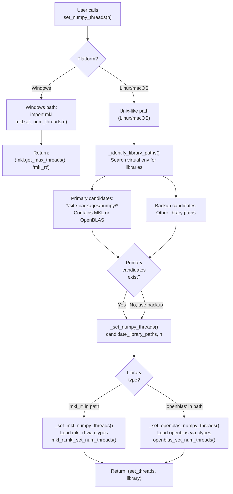
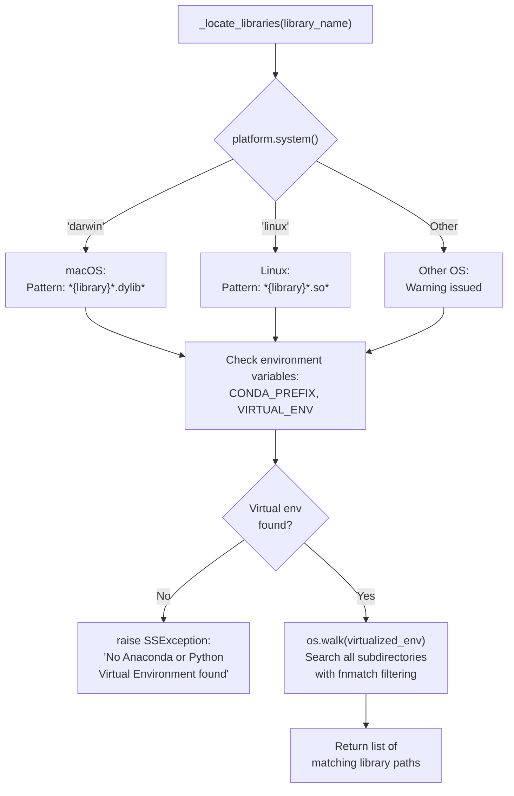
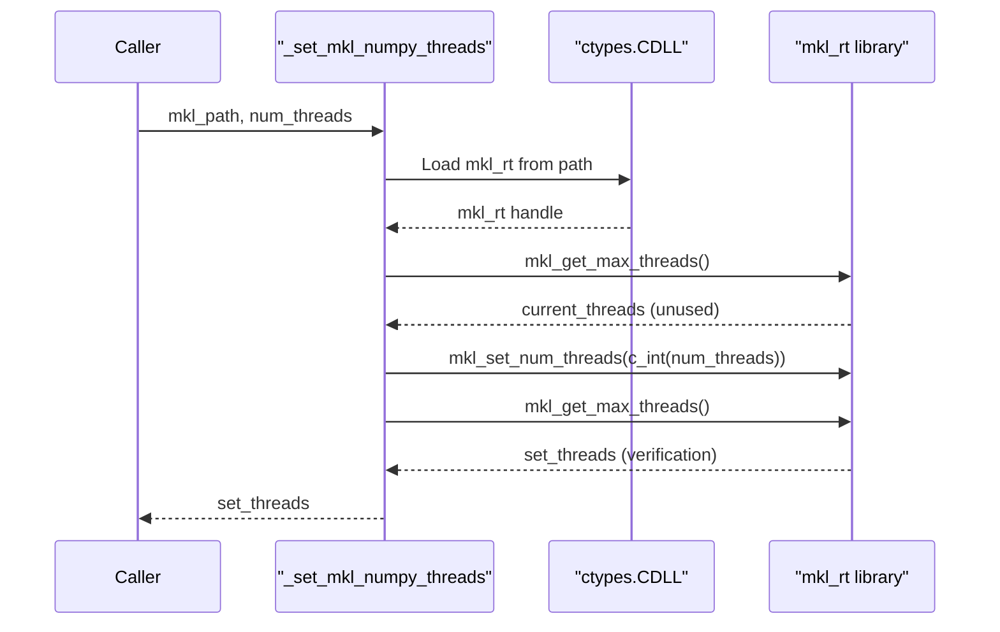
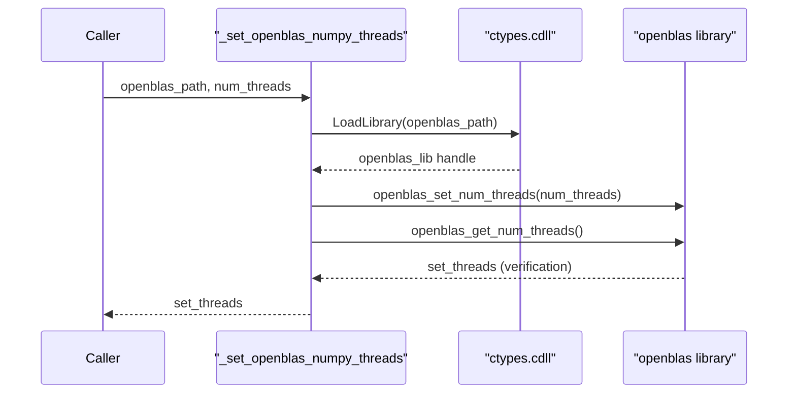
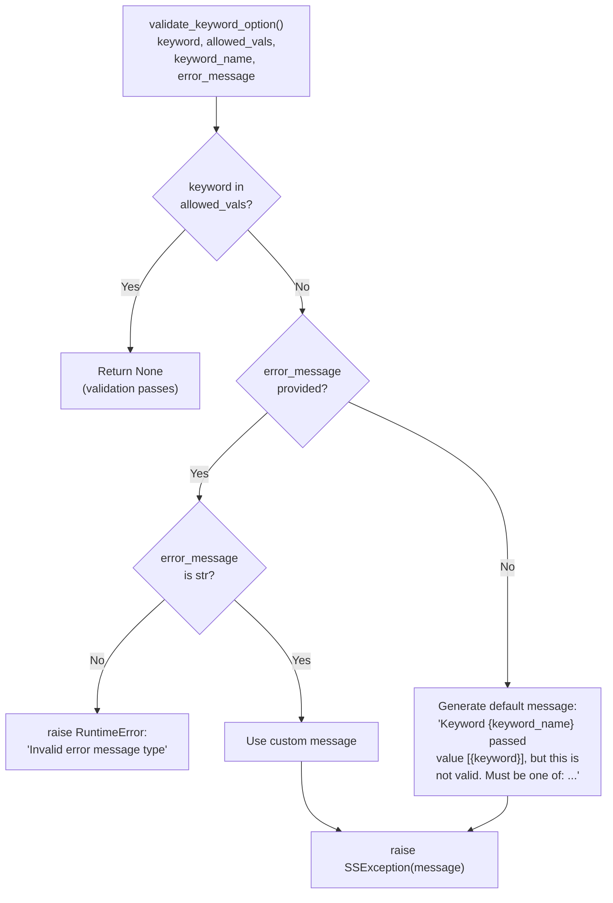

# ssutils: Thread Control and Validation

<details>
<summary>Relevant source files</summary>

The following files were used as context for generating this wiki page:

- [.github/workflows/soursop-ci.yml](.github/workflows/soursop-ci.yml)
- [soursop/ssutils.py](soursop/ssutils.py)
- [soursop/tests/test_ssutils.py](soursop/tests/test_ssutils.py)

</details>


## Purpose and Scope

The `ssutils` module provides critical infrastructure utilities for performance optimization and input validation across SOURSOP. This module contains two primary subsystems:

1. **Thread Control**: Functions to manage the number of threads used by numpy's underlying BLAS libraries (MKL and OpenBLAS) to prevent resource contention during parallel trajectory loading
2. **Keyword Validation**: A helper function to validate user-provided keyword arguments against allowed values

These utilities are used extensively by core analysis modules including `SSTrajectory`, `SSProtein`, and `SamplingQuality` to ensure optimal performance and robust error handling. For general numerical utilities and file operations, see [sstools: Numerical and File Utilities](#7.2).

Sources: [soursop/ssutils.py:1-195]()

---

## Thread Control Architecture

### Overview

SOURSOP's thread control system addresses a critical performance issue: numpy's BLAS backends (MKL, OpenBLAS) default to using all available CPU cores for linear algebra operations. When SOURSOP loads trajectories in parallel (see [Loading Trajectories](#3.1)), this creates thread oversubscription where each parallel worker spawns multiple BLAS threads, leading to severe performance degradation due to context switching overhead.

The solution is to explicitly limit BLAS threads to 1 per worker, allowing the higher-level parallelism (trajectory loading) to control CPU utilization efficiently.

Sources: [soursop/ssutils.py:131-136]()

### Supported BLAS Libraries

SOURSOP supports two BLAS implementations:

| Library | Identifier | Platforms | Detection Method |
|---------|-----------|-----------|------------------|
| Intel MKL | `mkl_rt` | Linux, macOS, Windows | ctypes via `mkl_rt.dll`/`.so`/`.dylib` |
| OpenBLAS | `openblas` | Linux, macOS | ctypes via `libopenblas.so`/`.dylib` |

Sources: [soursop/ssutils.py:25-26]()

### Thread Control Flow



**Diagram: Thread control execution flow from user call to BLAS library configuration**

Sources: [soursop/ssutils.py:137-151](), [soursop/ssutils.py:29-50](), [soursop/ssutils.py:89-109](), [soursop/ssutils.py:112-128]()

---

## Library Path Identification

### Virtual Environment Detection

The library identification system searches for BLAS libraries within the active Python environment to avoid system-wide conflicts. The process differs by platform:



**Diagram: Library path discovery process across platforms and environments**

Sources: [soursop/ssutils.py:52-86]()

### Library Path Prioritization

The `_identify_library_paths()` function implements a two-tier prioritization strategy:

1. **Primary candidates**: Libraries located in `site-packages/numpy/` subdirectories - these are numpy's bundled BLAS libraries
2. **Backup candidates**: Libraries found elsewhere in the virtual environment

This prioritization ensures that numpy's own BLAS backend is controlled first, falling back to system-level libraries only if necessary.

Sources: [soursop/ssutils.py:89-109](), [soursop/ssutils.py:104-108]()

---

## Setting Thread Counts

### MKL Backend

The `_set_mkl_numpy_threads()` function controls Intel MKL threading:



**Diagram: MKL thread configuration via ctypes interface**

The function uses three MKL C API calls:
- `mkl_get_max_threads()` - Query current thread limit
- `mkl_set_num_threads()` - Set new thread limit via `ctypes.byref(ctypes.c_int(num_threads))`
- `mkl_get_max_threads()` - Verify the new setting

Sources: [soursop/ssutils.py:29-40]()

### OpenBLAS Backend

The `_set_openblas_numpy_threads()` function controls OpenBLAS threading:



**Diagram: OpenBLAS thread configuration via ctypes interface**

The function uses two OpenBLAS C API calls:
- `openblas_set_num_threads()` - Set thread limit (no reference needed)
- `openblas_get_num_threads()` - Verify the new setting

Sources: [soursop/ssutils.py:43-49]()

### Platform-Specific Implementations

#### Windows

On Windows, SOURSOP uses the `mkl` Python package directly:

```python
import mkl
mkl.set_num_threads(num_threads)
return mkl.get_max_threads(), MKL_LIBRARY
```

This approach is simpler because Windows conda environments consistently include MKL, whereas building OpenBLAS from source on Windows requires compilers and is unreliable.

Sources: [soursop/ssutils.py:141-144]()

#### Unix-like Systems (Linux, macOS)

On Linux and macOS, the system performs automatic library discovery and uses ctypes to directly control the BLAS backend, supporting both MKL and OpenBLAS.

Sources: [soursop/ssutils.py:146-151]()

---

## Keyword Validation System

### The `validate_keyword_option` Function

The `validate_keyword_option()` function provides centralized validation for keyword arguments throughout SOURSOP. This prevents code duplication and ensures consistent error messaging.

**Function Signature:**

```python
validate_keyword_option(keyword, allowed_vals, keyword_name, error_message=None)
```

**Parameters:**

| Parameter | Type | Description |
|-----------|------|-------------|
| `keyword` | str | The actual value passed by the user |
| `allowed_vals` | list of str | Valid options for this keyword |
| `keyword_name` | str | The parameter name as it appears in the function signature |
| `error_message` | str or None | Optional custom error message |

**Behavior:**

- If `keyword` is in `allowed_vals`, the function returns `None` (validation passes)
- If `keyword` is not in `allowed_vals`, raises `SSException` with a descriptive error message
- If a custom `error_message` is provided but is not a string, raises `RuntimeError`

Sources: [soursop/ssutils.py:154-194]()

### Validation Flow



**Diagram: Keyword validation logic with error message handling**

Sources: [soursop/ssutils.py:185-194]()

### Usage Examples

The validation function is used throughout SOURSOP to check string-based mode parameters:

```python
# Example from SSProtein distance map methods
allowed_modes = ['CA', 'COM', 'sidechain']
validate_keyword_option(mode, allowed_modes, 'mode')
```

```python
# Example with custom error message
allowed_methods = ['DSSP', 'BBSEG']
validate_keyword_option(
    method, 
    allowed_methods, 
    'method',
    'Invalid secondary structure method. Use DSSP or BBSEG.'
)
```

Default error message format:
```
Keyword mode passed value [invalid_mode], but this is not valid.
Must be one of: CA, COM, sidechain
```

Sources: [soursop/ssutils.py:185-194]()

---

## Testing and Verification

### Test Coverage

The `test_ssutils.py` module provides unit tests for both subsystems:

**Thread Control Tests:**
- `test_set_numpy_threads()` - Verifies that setting 2 threads succeeds and returns the correct library type (`'mkl_rt'`, `'openblas'`, or other)
- Assertion that `blas_library != 'unknown'` ensures a supported library was found

**Validation Tests:**
- `test_validate_keyword_option()` - Tests valid keywords pass without exception
- Tests invalid keywords raise `SSException`
- Tests custom error messages are respected
- Tests non-string error messages raise `RuntimeError`

Sources: [soursop/tests/test_ssutils.py:15-38]()

### Continuous Integration

The CI pipeline tests thread control across multiple configurations:

| OS | Python Versions | BLAS Backend |
|----|-----------------|--------------|
| Ubuntu | 3.7, 3.8, 3.9 | OpenBLAS (via conda) |
| macOS | 3.7, 3.8, 3.9 | MKL or OpenBLAS |
| Windows | 3.7, 3.8, 3.9 | MKL (via conda) |

The CI workflow installs dependencies via `anaconda_requirements.txt` which includes numpy with BLAS backends, ensuring thread control functions are tested in realistic environments.

Sources: [.github/workflows/soursop-ci.yml:1-70](), [soursop/tests/test_ssutils.py:1-39]()

---

## Integration with Core Modules

### Usage in Parallel Loading

The primary use case for thread control is in `SSTrajectory`'s parallel trajectory loading. The workflow:

1. User calls `SSTrajectory(..., parallel=True, cores=N)`
2. SOURSOP spawns N worker processes
3. Before loading, each worker calls `set_numpy_threads(1)` to limit BLAS threads
4. Workers load trajectory chunks using mdtraj (which uses numpy extensively)
5. Total CPU utilization = N cores (no oversubscription)

Without thread control, each of N workers would spawn M BLAS threads, creating N×M threads competing for resources, often slower than single-threaded execution.

Sources: [soursop/ssutils.py:131-136]()

### Usage in Analysis Methods

The `validate_keyword_option()` function is used extensively in:

- **SSProtein**: Validating `mode` parameters in distance calculations (`'CA'`, `'COM'`, `'sidechain'`)
- **SSProtein**: Validating `method` parameters in secondary structure analysis (`'DSSP'`, `'BBSEG'`)
- **SamplingQuality**: Validating distribution comparison methods
- **SSProtein**: Validating contact map types and modes

This ensures that users receive clear, immediate feedback when providing invalid options, rather than encountering cryptic errors deep in the analysis code.

Sources: [soursop/ssutils.py:154-194]()

---

## API Reference

### Public Functions

#### `set_numpy_threads(num_threads)`

Set the number of threads used by numpy's BLAS backend.

**Parameters:**
- `num_threads` (int): Number of threads to use for BLAS operations

**Returns:**
- `tuple[int, str]`: A tuple containing:
  - `set_threads` (int): The actual number of threads set (for verification)
  - `library` (str): The BLAS library type (`'mkl_rt'`, `'openblas'`, or `'unknown'`)

**Raises:**
- `SSException`: If no virtual environment is detected (Linux/macOS only)
- May raise warnings if unsupported library or OS is detected

**Example:**
```python
from soursop import ssutils

# Limit BLAS to single-threaded operation
threads_set, blas_lib = ssutils.set_numpy_threads(1)
print(f"Set {threads_set} threads using {blas_lib}")
# Output: "Set 1 threads using openblas"
```

Sources: [soursop/ssutils.py:137-151]()

#### `validate_keyword_option(keyword, allowed_vals, keyword_name, error_message=None)`

Validate that a keyword argument matches one of the allowed values.

**Parameters:**
- `keyword` (str): The value to validate
- `allowed_vals` (list of str): List of permitted values
- `keyword_name` (str): Name of the parameter (for error messages)
- `error_message` (str, optional): Custom error message if validation fails

**Returns:**
- `None`: Returns nothing if validation succeeds

**Raises:**
- `SSException`: If `keyword` is not in `allowed_vals`
- `RuntimeError`: If `error_message` is provided but is not a string

**Example:**
```python
from soursop import ssutils

allowed_modes = ['CA', 'COM', 'sidechain']
mode = 'CA'

# This passes silently
ssutils.validate_keyword_option(mode, allowed_modes, 'mode')

# This raises SSException
invalid_mode = 'backbone'
ssutils.validate_keyword_option(invalid_mode, allowed_modes, 'mode')
# SSException: Keyword mode passed value [backbone], but this is not valid.
# Must be one of: CA, COM, sidechain
```

Sources: [soursop/ssutils.py:154-194]()

### Internal Functions

The following functions are implementation details and not intended for direct use:

- `_set_mkl_numpy_threads(mkl_path, num_threads)` - [soursop/ssutils.py:29-40]()
- `_set_openblas_numpy_threads(openblas_path, num_threads)` - [soursop/ssutils.py:43-49]()
- `_locate_libraries(library_name)` - [soursop/ssutils.py:52-86]()
- `_identify_library_paths()` - [soursop/ssutils.py:89-109]()
- `_set_numpy_threads(candidate_library_paths, num_threads)` - [soursop/ssutils.py:112-128]()

---

## Performance Considerations

### Thread Count Selection

The optimal number of BLAS threads depends on the execution context:

| Context | Recommended Setting | Rationale |
|---------|---------------------|-----------|
| Parallel loading (`SSTrajectory`) | 1 thread per BLAS operation | Allow process-level parallelism to dominate |
| Single-threaded analysis | Default (all cores) | Maximize BLAS performance |
| Interactive notebook | 2-4 threads | Balance responsiveness and throughput |
| Batch processing | 1 thread when using multiprocessing | Prevent oversubscription |

### Platform Performance Notes

**macOS with M1/M2 (Apple Silicon):**
- The Accelerate framework is used by default
- Thread control may have limited effect due to different threading model
- Consider testing with explicit OpenBLAS installation

**Linux with OpenBLAS:**
- Most common configuration in production environments
- Thread control typically works reliably
- Watch for `OPENBLAS_NUM_THREADS` environment variable conflicts

**Windows with MKL:**
- Most consistent behavior across configurations
- Direct Python package integration simplifies thread control
- No need for library path discovery

Sources: [soursop/ssutils.py:137-151]()

---

## Troubleshooting

### Common Issues

**Issue: `SSException: No Anaconda or Python Virtual Environment found`**

**Cause:** Running SOURSOP outside a virtual environment on Linux/macOS

**Solution:** 
- Activate a conda environment: `conda activate myenv`
- Or activate a virtualenv: `source venv/bin/activate`
- SOURSOP requires virtualized environments to locate BLAS libraries safely

Sources: [soursop/ssutils.py:76-77]()

**Issue: Thread count not being set (returns 0 or incorrect value)**

**Cause:** Library path detection failed or unsupported BLAS backend

**Solution:**
- Check if numpy is properly installed: `python -c "import numpy; print(numpy.__file__)"`
- Verify BLAS backend: `python -c "import numpy; numpy.show_config()"`
- Reinstall numpy with explicit BLAS: `conda install numpy mkl` or `conda install numpy openblas`

Sources: [soursop/ssutils.py:115-128]()

**Issue: `RuntimeError: Invalid error message type`**

**Cause:** Passed non-string value to `error_message` parameter in `validate_keyword_option()`

**Solution:** Ensure custom error messages are strings:
```python
# Wrong
validate_keyword_option(mode, modes, 'mode', 123)

# Correct
validate_keyword_option(mode, modes, 'mode', "Invalid mode selection")
```

Sources: [soursop/ssutils.py:190-193]()

---