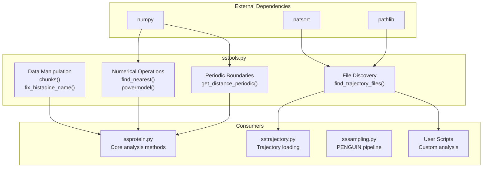
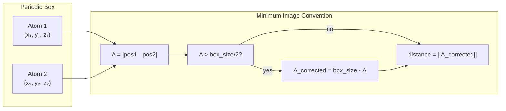
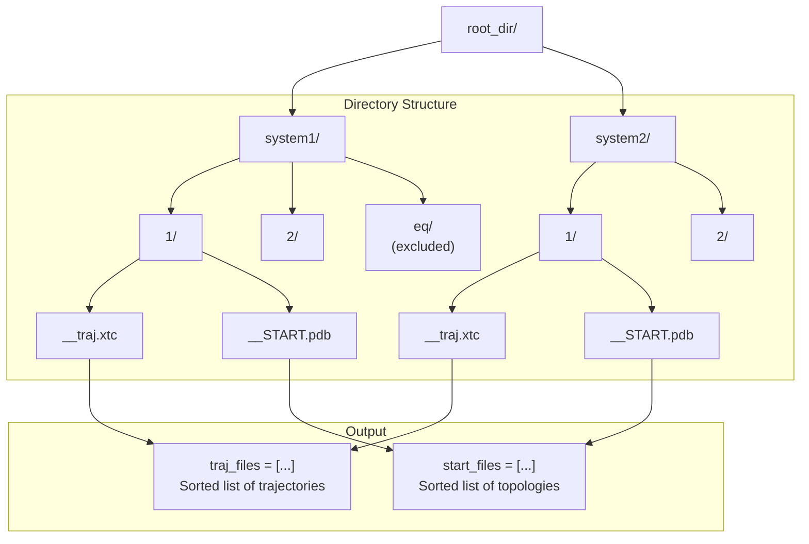
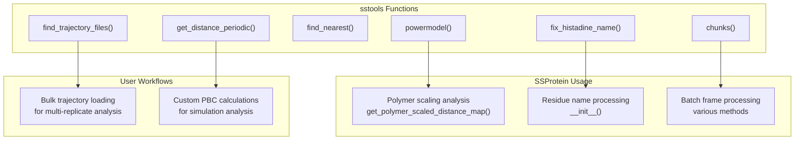

# sstools: Numerical and File Utilities

<details>
<summary>Relevant source files</summary>

The following files were used as context for generating this wiki page:

- [soursop/sstools.py](soursop/sstools.py)

</details>


The `sstools` module provides low-level numerical operations and file system utilities that support SOURSOP's core analysis capabilities. This module contains general-purpose helper functions that do not depend on trajectory or protein data structures, making it a foundational utility layer for the entire package.

**Scope**: This page documents utility functions for data manipulation, numerical calculations, periodic boundary conditions, and trajectory file discovery. For thread control and validation utilities, see [ssutils: Thread Control and Validation](#7.1). For biological data mappings (amino acids, residue names), see [ssdata: Amino Acid Data and Mappings](#7.3).

## Module Overview

The `sstools` module serves as a collection of standalone utility functions that address specific computational needs across SOURSOP. Unlike higher-level modules that operate on `SSProtein` or `SSTrajectory` objects, these functions work with primitive data types (arrays, lists, strings, file paths) and provide reusable algorithmic building blocks.



**Sources**: [soursop/sstools.py:1-247]()

## Function Categories

### Data Manipulation Utilities

#### chunks()

The `chunks()` function divides a list into successive n-sized chunks, yielding each chunk as a generator. This is commonly used for batch processing operations across trajectory frames or residue ranges.

**Function Signature**: [soursop/sstools.py:29-46]()

**Parameters**:
| Parameter | Type | Description |
|-----------|------|-------------|
| `l` | list | The list to be divided into chunks |
| `n` | int | The size of each chunk |

**Returns**: Generator yielding successive n-sized sublists

**Behavior**: The function rounds the maximum number of complete chunks and excludes any trailing elements that don't form a complete chunk. For example, a list of 25 elements with `n=10` yields two chunks of 10 elements each, excluding the final 5 elements.

**Example Usage**:
```python
from soursop import sstools

# Process data in batches of 100 frames
for frame_batch in sstools.chunks(range(1000), 100):
    # Process each batch of 100 frames
    process_frames(frame_batch)
```

**Sources**: [soursop/sstools.py:29-46]()

#### fix_histadine_name()

Histidine residues can appear in PDB files with multiple names depending on protonation state (HIS, HIE, HID, HIP). This function normalizes all histidine variants to the standard "HIS" name for consistent analysis.

**Function Signature**: [soursop/sstools.py:51-70]()

**Parameters**:
| Parameter | Type | Description |
|-----------|------|-------------|
| `name` | str | Three-letter residue code |

**Returns**: str - "HIS" if input is a histidine variant, otherwise the original name

**Recognized Histidine Variants**:
- **HIE**: Histidine with proton on epsilon nitrogen
- **HID**: Histidine with proton on delta nitrogen  
- **HIP**: Doubly protonated histidine (charged)

This function is used internally during residue validation and sequence processing to ensure consistent treatment of histidine across different force fields and PDB conventions.

**Sources**: [soursop/sstools.py:51-70]()

### Numerical Operations

#### find_nearest()

Locates the array element closest to a target value and returns both the index and the value. This is used for finding specific conformations, identifying frames at particular distances, or mapping continuous values to discrete bins.

**Function Signature**: [soursop/sstools.py:75-96]()

**Parameters**:
| Parameter | Type | Description |
|-----------|------|-------------|
| `array` | np.array | Array to search |
| `target` | numeric | Value to locate within the array |

**Returns**: tuple `(idx, value)` where `idx` is the index of the nearest element and `value` is the array value at that index

**Implementation**: Uses `numpy.argmin()` on the absolute difference between array elements and the target value for efficient O(n) search.

**Example**:
```python
import numpy as np
from soursop import sstools

rg_values = np.array([15.2, 18.7, 22.3, 19.8, 21.1])
target_rg = 20.0

idx, closest_rg = sstools.find_nearest(rg_values, target_rg)
# Returns: (3, 19.8) - frame 3 has Rg closest to 20.0
```

**Sources**: [soursop/sstools.py:75-96]()

#### powermodel()

Computes polymer scaling relationships using the power law form: R = R₀ × N^ν, where N is the polymer length, ν is the scaling exponent, and R₀ is a prefactor. This is fundamental for analyzing intrinsically disordered proteins as polymers.

**Function Signature**: [soursop/sstools.py:101-122]()

**Parameters**:
| Parameter | Type | Description |
|-----------|------|-------------|
| `X` | array or numeric | The independent variable (e.g., polymer length) |
| `nu` | float | Scaling exponent (ν) |
| `R0` | float | Prefactor constant |

**Returns**: array or numeric - The computed power law values

**Common Scaling Exponents**:
| Polymer Regime | ν Value | Description |
|----------------|---------|-------------|
| Collapsed | ~0.33 | Compact globular state |
| Ideal Chain | 0.5 | Gaussian random coil |
| Excluded Volume | ~0.588 | Self-avoiding walk in good solvent |
| Rod-like | 1.0 | Fully extended polymer |

**Application**: Used in polymer scaling analysis methods in `SSProtein` to fit experimental or simulation data to theoretical polymer models.

**Sources**: [soursop/sstools.py:101-122]()

### Periodic Boundary Conditions

#### get_distance_periodic()

Calculates distances between point pairs using the minimum image convention for periodic boundary conditions. This is essential for simulations in periodic boxes to correctly compute distances when atoms may be closer through periodic boundary crossings.



**Function Signature**: [soursop/sstools.py:127-186]()

**Parameters**:
| Parameter | Type | Description |
|-----------|------|-------------|
| `distance1` | np.array | Array of 3D positions (length n) |
| `distance2` | np.array | Array of 3D positions (length n, must match `distance1`) |
| `box_size` | float | Dimensions of the cubic simulation box |
| `box_shape` | str | Currently only 'cube' is supported |

**Returns**: np.array - Array of inter-position distances under minimum image convention

**Raises**: 
- `SSException` if `distance1` and `distance2` have different lengths
- `SSException` if `box_shape` is not 'cube'

**Algorithm**: For each dimension, if the coordinate difference exceeds half the box size, the periodic image is used instead. The final distance is computed using the corrected coordinate differences.

**Performance Note**: [soursop/sstools.py:173]() includes a comment indicating this implementation could be optimized (e.g., using Cython) for better performance with large arrays.

**Sources**: [soursop/sstools.py:127-186]()

### Trajectory File Discovery

#### find_trajectory_files()

Discovers and organizes trajectory and topology file pairs from complex directory structures, particularly useful for simulation campaigns with multiple replicates organized hierarchically.



**Function Signature**: [soursop/sstools.py:190-246]()

**Parameters**:
| Parameter | Type | Default | Description |
|-----------|------|---------|-------------|
| `root_dir` | str or pathlib.Path | required | Root directory containing simulation subdirectories |
| `num_replicates` | int | required | Number of replicate simulations (searches for dirs named 0 to num_replicates) |
| `exclude_dirs` | List or None | `["eq", "FULL"]` | Directory names to exclude from search |
| `traj_name` | str | `"__traj.xtc"` | Trajectory filename to locate |
| `top_name` | str | `"__START.pdb"` | Topology filename to locate |

**Returns**: tuple `(traj_files, start_files)` - Two lists of equal length containing matched trajectory and topology file paths

**Algorithm**:
1. Walk the directory tree starting from `root_dir`
2. Exclude directories matching names in `exclude_dirs`
3. Identify directories whose names match replicate numbers (0 to `num_replicates`)
4. Check for existence of both trajectory and topology files in matching directories
5. Group files by parent directory name and sort naturally using `natsort`
6. Return flattened lists maintaining correspondence between trajectories and topologies

**Natural Sorting**: Uses `natsorted()` from the `natsort` package to ensure numeric directory names are sorted correctly (1, 2, 10 instead of 1, 10, 2).

**Example Usage**:
```python
from soursop import sstools

# Find all trajectory files for 5 replicates in a simulation campaign
traj_files, top_files = sstools.find_trajectory_files(
    root_dir="/path/to/simulations",
    num_replicates=5,
    exclude_dirs=["equilibration", "backup"],
    traj_name="production.xtc",
    top_name="topology.pdb"
)

# Load discovered trajectories
from soursop.sstrajectory import SSTrajectory
traj = SSTrajectory(traj_files, top_files)
```

**Sources**: [soursop/sstools.py:190-246]()

## Integration with SOURSOP Core

The `sstools` functions are used throughout SOURSOP's core analysis modules:



**Key Dependencies**:
- **numpy**: All numerical operations
- **natsort**: Natural sorting of file names
- **pathlib**: Cross-platform path handling
- **ssexceptions**: Error handling via `SSException`
- **ssutils**: Keyword validation in `get_distance_periodic()`

**Sources**: [soursop/sstools.py:19-25]()

## Error Handling

Functions in `sstools` raise `SSException` for validation errors:

| Function | Error Condition | Exception Type |
|----------|-----------------|----------------|
| `get_distance_periodic()` | Mismatched array lengths | `SSException` |
| `get_distance_periodic()` | Invalid `box_shape` parameter | `SSException` (via `ssutils.validate_keyword_option()`) |

**Sources**: [soursop/sstools.py:162-165](), [soursop/sstools.py:168-169]()

## Design Patterns

### Pure Functions

All functions in `sstools` are pure functions (no side effects, deterministic output for given inputs). This makes them:
- Easy to test
- Safe for parallel execution
- Predictable in behavior
- Composable with other functions

### Type Hints

The module uses Python type hints for modern functions like `find_trajectory_files()` [soursop/sstools.py:190-195](), improving IDE support and documentation clarity.

### Generator Usage

The `chunks()` function uses Python generators (`yield`) for memory-efficient iteration over large lists without creating intermediate copies [soursop/sstools.py:46]().

**Sources**: [soursop/sstools.py:29-46](), [soursop/sstools.py:190-195]()

---