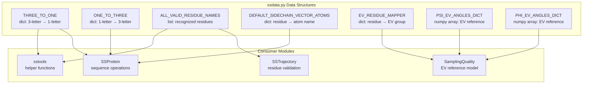
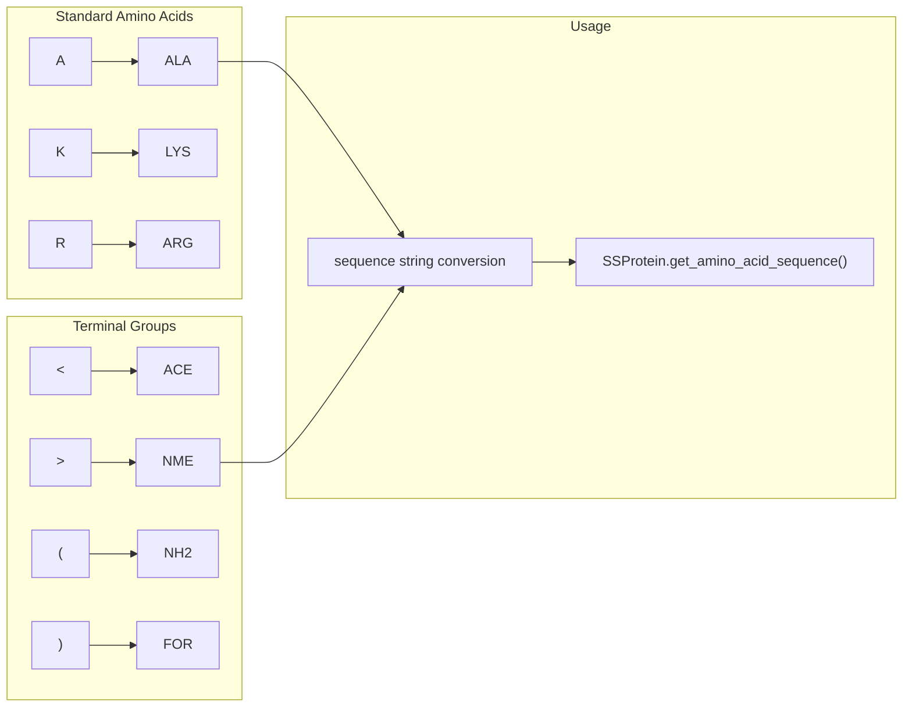
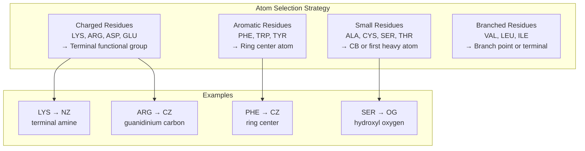
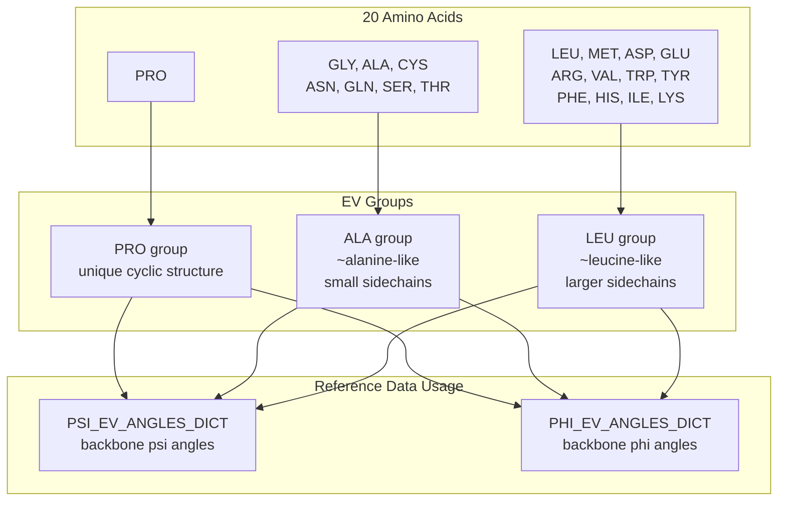
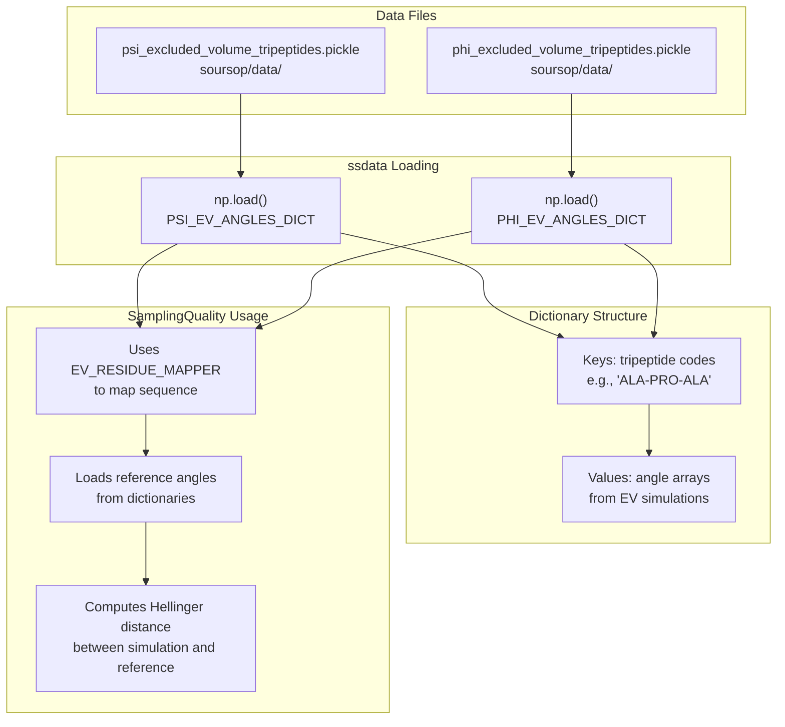
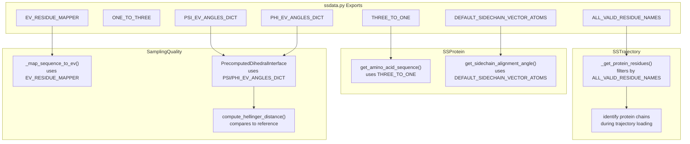

# ssdata: Amino Acid Data and Mappings

<details>
<summary>Relevant source files</summary>

The following files were used as context for generating this wiki page:

- [soursop/data/phi_excluded_volume_tripeptides.pickle](soursop/data/phi_excluded_volume_tripeptides.pickle)
- [soursop/data/psi_excluded_volume_tripeptides.pickle](soursop/data/psi_excluded_volume_tripeptides.pickle)
- [soursop/ssdata.py](soursop/ssdata.py)

</details>


## Purpose and Scope

The `ssdata` module provides reference data and mappings for amino acid nomenclature, residue validation, and excluded volume calculations. This module contains well-defined biological constants and data structures used throughout SOURSOP for sequence analysis, residue validation, and conformational sampling assessment.

For information about how this data is used in the PENGUIN pipeline, see [Reference Models and EV Data](#5.4). For utilities that perform calculations using this data, see [sstools: Numerical and File Utilities](#7.2).

**Sources:** [soursop/ssdata.py:14-18]()

## Module Overview

The `ssdata` module serves as the central repository for amino acid-related constants and reference data. It contains no computational logic—only data structures that are imported and used by other modules throughout the codebase.



**Sources:** [soursop/ssdata.py:1-144]()

## Amino Acid Nomenclature Mappings

### Three-Letter to One-Letter Code

The `THREE_TO_ONE` dictionary maps standard three-letter amino acid codes to single-letter codes. This includes the 20 standard amino acids plus terminal capping groups.

| Three-Letter Code | One-Letter Code | Description |
|------------------|-----------------|-------------|
| ALA | A | Alanine |
| CYS | C | Cysteine |
| ASP | D | Aspartate |
| GLU | E | Glutamate |
| PHE | F | Phenylalanine |
| GLY | G | Glycine |
| HIS | H | Histidine |
| ILE | I | Isoleucine |
| LYS | K | Lysine |
| LEU | L | Leucine |
| MET | M | Methionine |
| ASN | N | Asparagine |
| PRO | P | Proline |
| GLN | Q | Glutamine |
| ARG | R | Arginine |
| SER | S | Serine |
| THR | T | Threonine |
| VAL | V | Valine |
| TRP | W | Tryptophan |
| TYR | Y | Tyrosine |

#### Terminal Groups and Caps

| Three-Letter Code | One-Letter Code | Description |
|------------------|-----------------|-------------|
| ACE | < | Acetyl N-terminal cap |
| NME | > | N-methylamide C-terminal cap |
| NAC | > | N-acetyl C-terminal cap |
| NH2 | ( | Amide C-terminal cap |
| FOR | ) | Formyl N-terminal cap |

**Sources:** [soursop/ssdata.py:22-46]()

### One-Letter to Three-Letter Code

The `ONE_TO_THREE` dictionary provides the inverse mapping from single-letter codes to three-letter codes. Note that this mapping is not perfectly bijective for terminal groups (e.g., both NME and NAC map to '>').



**Sources:** [soursop/ssdata.py:48-71]()

## Valid Residue Names

### ALL_VALID_RESIDUE_NAMES

The `ALL_VALID_RESIDUE_NAMES` list defines all residue names recognized by SOURSOP when validating whether a molecule is a protein. This list is used during trajectory loading to filter protein chains from other molecular species.

```python
ALL_VALID_RESIDUE_NAMES = [
    # Standard amino acids
    'ALA','CYS','ASP','ASH','GLU','GLH','PHE','GLY',
    'HIE','HIS','HID','HIP','ILE','LEU','LYS','LYD',
    'MET','ASN','PRO','GLN','ARG','SER','THR','VAL',
    'TRP','TYR',
    
    # Non-standard/modified amino acids
    'AIB',  # α-aminoisobutyric acid
    'ABA',  # α-aminobutyric acid
    'NVA',  # Norvaline
    'NLE',  # Norleucine
    'ORN',  # Ornithine
    'DAB',  # Diaminobutyric acid
    
    # Post-translational modifications
    'PTR',  # Phosphotyrosine
    'TPO',  # Phosphothreonine
    'SEP',  # Phosphoserine
    'KAC',  # Acetyllysine
    'KM1',  # Monomethyllysine
    'KM2',  # Dimethyllysine
    'KM3',  # Trimethyllysine
    
    # Terminal groups
    'ACE','NME','FOR','NH2'
]
```

### Protonation State Variants

Several residues have multiple protonation state variants that are all recognized:

| Base Residue | Variants | Description |
|-------------|----------|-------------|
| Histidine | HIS, HIE, HID, HIP | Different protonation states (epsilon, delta, both) |
| Aspartate | ASP, ASH | Deprotonated / protonated |
| Glutamate | GLU, GLH | Deprotonated / protonated |
| Lysine | LYS, LYD | Protonated / deprotonated |

**Sources:** [soursop/ssdata.py:111-112]()

## Sidechain Vector Atom Definitions

### DEFAULT_SIDECHAIN_VECTOR_ATOMS

The `DEFAULT_SIDECHAIN_VECTOR_ATOMS` dictionary maps each residue type to the default atom used for sidechain vector calculations. These atoms are typically at or near the end of the sidechain and are used for methods like `get_sidechain_alignment_angle()`.



### Special Cases

| Residue | Atom | Notes |
|---------|------|-------|
| GLY | ERROR | Glycine has no sidechain |
| ACE, NME, FOR, NH2 | ERROR | Terminal groups have no standard sidechain |
| PRO | CG | Cyclic structure, CG chosen as representative |
| VAL | CB | Branch point is the sidechain vector |

### Post-Translational Modifications

Modified residues use the same atom as their unmodified counterparts:

| Modified Residue | Base | Atom | Modification |
|-----------------|------|------|--------------|
| PTR | TYR | CZ | Phosphorylation |
| TPO | THR | CB | Phosphorylation |
| SEP | SER | OG | Phosphorylation |
| KAC, KM1, KM2, KM3 | LYS | NZ | Acetylation/Methylation |

**Sources:** [soursop/ssdata.py:73-109]()

## Excluded Volume Reference Data

### EV_RESIDUE_MAPPER

The `EV_RESIDUE_MAPPER` dictionary maps amino acids into three groups for excluded volume (EV) calculations in the PENGUIN pipeline. This coarse-graining reduces the reference space while maintaining chemical realism.



#### Group Assignments

**PRO Group** (Special):
- PRO: Unique due to cyclic backbone constraint

**ALA Group** (Approximately alanine-like):
- GLY: Lacks sidechain, treated as small
- ALA: Reference for small sidechains
- CYS: Small polar sidechain
- ASN, GLN: Amide sidechains
- SER, THR: Hydroxyl sidechains

**LEU Group** (Approximately leucine-like):
- LEU: Reference for larger sidechains
- All other residues with substantial sidechains
- Includes charged (ASP, GLU, ARG, LYS)
- Includes hydrophobic (VAL, ILE, MET)
- Includes aromatic (PHE, TYR, TRP, HIS)

**Sources:** [soursop/ssdata.py:115-140]()

### Angle Reference Distributions

#### PSI_EV_ANGLES_DICT and PHI_EV_ANGLES_DICT

These dictionaries contain precomputed backbone dihedral angle distributions from excluded volume tripeptide simulations. They are loaded from pickle files and used by the `SamplingQuality` class as reference distributions for assessing conformational sampling.



The reference data structure:

| Dictionary | Contains | Format |
|-----------|----------|--------|
| `PSI_EV_ANGLES_DICT` | Psi angle distributions for tripeptides | `dict[str, np.ndarray]` |
| `PHI_EV_ANGLES_DICT` | Phi angle distributions for tripeptides | `dict[str, np.ndarray]` |

Each key represents a tripeptide context (e.g., "ALA-PRO-ALA") using the EV group names, and each value is a NumPy array of angle values sampled from excluded volume simulations of that tripeptide.

**Sources:** [soursop/ssdata.py:142-144]()

## Integration with Other Modules



### Usage Example Locations

| Module | Function/Method | ssdata Usage |
|--------|----------------|--------------|
| SSTrajectory | `__init__()` | Validates residues against `ALL_VALID_RESIDUE_NAMES` |
| SSProtein | `get_amino_acid_sequence()` | Converts residues using `THREE_TO_ONE` |
| SSProtein | `get_sidechain_alignment_angle()` | Looks up atoms in `DEFAULT_SIDECHAIN_VECTOR_ATOMS` |
| SamplingQuality | `_get_reference_distributions()` | Maps sequence using `EV_RESIDUE_MAPPER` |
| SamplingQuality | `PrecomputedDihedralInterface` | Loads data from `PSI_EV_ANGLES_DICT`, `PHI_EV_ANGLES_DICT` |

**Sources:** [soursop/ssdata.py:1-144]()

## Data File Locations

The excluded volume angle data is stored in the package data directory and accessed via the `soursop.get_data()` function:

| File | Location | Format | Size |
|------|----------|--------|------|
| psi_excluded_volume_tripeptides.pickle | soursop/data/ | NumPy pickle | Variable |
| phi_excluded_volume_tripeptides.pickle | soursop/data/ | NumPy pickle | Variable |

These files are included in the SOURSOP distribution and are loaded once when the `ssdata` module is imported. The data remains in memory for the lifetime of the Python session, avoiding repeated disk I/O.

**Sources:** [soursop/ssdata.py:142-144]()

---