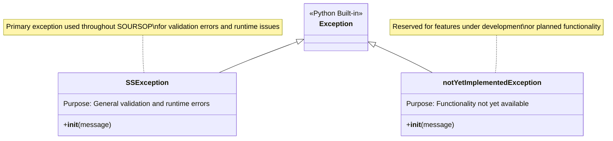
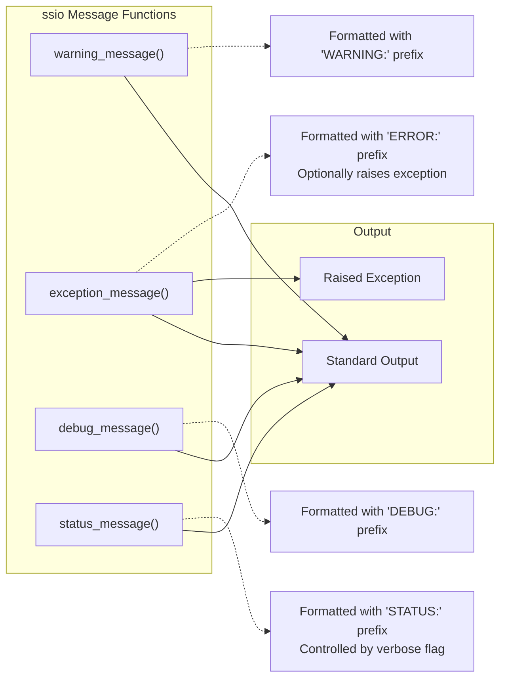
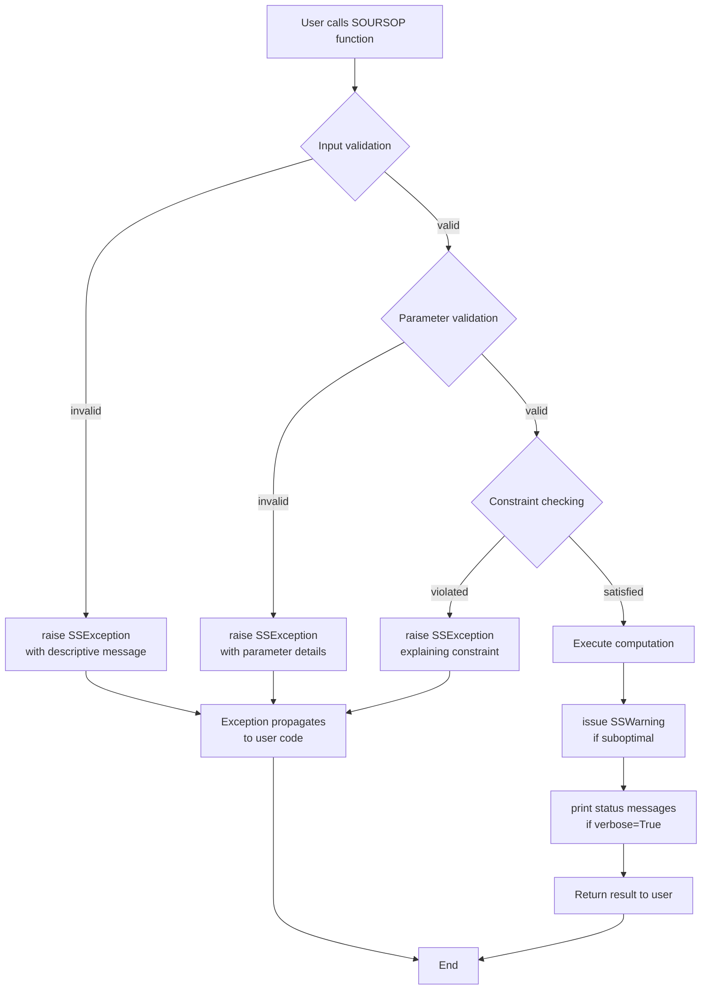

# Error Handling and Logging

<details>
<summary>Relevant source files</summary>

The following files were used as context for generating this wiki page:

- [soursop/_internal_data.py](soursop/_internal_data.py)
- [soursop/configs.py](soursop/configs.py)
- [soursop/soursop.py](soursop/soursop.py)
- [soursop/ssexceptions.py](soursop/ssexceptions.py)
- [soursop/ssio.py](soursop/ssio.py)
- [soursop/ssmutualinformation.py](soursop/ssmutualinformation.py)
- [soursop/ssnmr.py](soursop/ssnmr.py)
- [soursop/tests/test_ssmutual_information.py](soursop/tests/test_ssmutual_information.py)

</details>


This page documents SOURSOP's error handling and messaging infrastructure, which provides standardized mechanisms for reporting errors, warnings, and status information to users. The system consists of custom exception classes in the `ssexceptions` module and message formatting utilities in the `ssio` module. These utilities are used throughout the codebase to ensure consistent and informative error reporting. For information about input validation and parameter checking, see [ssutils: Thread Control and Validation](#7.1).

## Overview

SOURSOP's error handling infrastructure consists of two primary modules:

| Module | File | Purpose |
|--------|------|---------|
| **ssexceptions** | `soursop/ssexceptions.py` | Custom exception classes and warning functions |
| **ssio** | `soursop/ssio.py` | Formatted message output functions for warnings, errors, debug, and status |

These modules work together to provide a consistent error reporting experience across all analysis functions. Exception classes are raised when invalid inputs or computational errors occur, while the ssio module provides formatted output functions for various message types.

**Sources:** [soursop/ssexceptions.py:1-53](), [soursop/ssio.py:1-55]()

## Exception Class Hierarchy



**Sources:** [soursop/ssexceptions.py:24-42]()

## Custom Exception Classes

### SSException

The `SSException` class is the primary exception type used throughout SOURSOP for validation errors, invalid inputs, and runtime issues.

**Definition:** [soursop/ssexceptions.py:26-31]()

```python
class SSException(Exception):
    """
    Exception class for raising custom exceptions
    """
    pass
```

**Common Usage Patterns:**

| Scenario | Example Location | Purpose |
|----------|------------------|---------|
| Input validation | [soursop/ssmutualinformation.py:71-77]() | Ensures X and Y vectors have equal length and bins straddle full data range |
| Parameter validation | [soursop/ssnmr.py:103-108]() | Validates temperature and pH values are within physiological ranges |
| Incompatible options | [soursop/ssnmr.py:448-449]() | Prevents use of phosphorylated residues with deuteration corrections |

### notYetImplementedException

The `notYetImplementedException` class is reserved for functionality that is planned but not yet implemented.

**Definition:** [soursop/ssexceptions.py:36-41]()

```python
class notYetImplementedException(Exception):
    """
    Exception for functionality not yet implemented
    """
    pass
```

**Sources:** [soursop/ssexceptions.py:24-42]()

## Warning Functions

### SSWarning

The `SSWarning` function provides a standardized way to issue non-fatal warnings using Python's built-in warnings system.

**Definition:** [soursop/ssexceptions.py:46-51]()

```python
def SSWarning(string):
    """
    Custom function to display non-fatal warnings.
    """
    warnings.warn(string)
```

This function wraps Python's `warnings.warn()` to provide a consistent interface. Warnings are appropriate for situations where execution can continue but the user should be informed of potential issues or suboptimal conditions.

**Usage Example:**
```python
from soursop.ssexceptions import SSWarning

if some_condition:
    SSWarning("Parameter X is deprecated, use Y instead")
```

**Sources:** [soursop/ssexceptions.py:46-51]()

## Message Output Functions (ssio)

The `ssio` module provides formatted message output functions for different message types. These functions add consistent formatting and optional decorative frills to distinguish different message types.



**Sources:** [soursop/ssio.py:20-54]()

### warning_message

Prints a formatted warning message to standard output.

**Function Signature:** [soursop/ssio.py:20-28]()

```python
def warning_message(msg, with_frills=False):
```

**Parameters:**
- `msg` (str): The warning message to display
- `with_frills` (bool): If True, adds decorative borders around the message

**Output Format:**
```
WARNING: <msg>
```

With frills enabled:
```
<>@<>@<>@<>@<>@<>@<>@<>@<>@<>@<>@<>@<>@<>@<>@<>@<>@<>@<>@<>@<>@...

WARNING: <msg>

<>@<>@<>@<>@<>@<>@<>@<>@<>@<>@<>@<>@<>@<>@<>@<>@<>@<>@<>@<>@<>@...
```

**Sources:** [soursop/ssio.py:20-28]()

### exception_message

Prints a formatted error message and optionally raises an exception.

**Function Signature:** [soursop/ssio.py:30-42]()

```python
def exception_message(msg, exception, with_frills=False, raise_exception=True):
```

**Parameters:**
- `msg` (str): The error message to display
- `exception` (Exception): The exception object to raise
- `with_frills` (bool): If True, adds decorative borders around the message
- `raise_exception` (bool): If True, raises the exception after printing

**Output Format:**
```
ERROR: <msg>
```

This function provides a two-step error reporting pattern: first printing a human-readable error message, then optionally raising the exception for programmatic handling.

**Sources:** [soursop/ssio.py:30-42]()

### debug_message

Prints a formatted debug message to standard output.

**Function Signature:** [soursop/ssio.py:45-48]()

```python
def debug_message(msg):
```

**Parameters:**
- `msg` (str): The debug message to display

**Output Format:**
```
DEBUG: <msg>
```

**Sources:** [soursop/ssio.py:45-48]()

### status_message

Prints a formatted status message to standard output if verbose mode is enabled.

**Function Signature:** [soursop/ssio.py:51-53]()

```python
def status_message(msg, verbose):
```

**Parameters:**
- `msg` (str): The status message to display
- `verbose` (bool): Controls whether the message is printed

**Output Format:**
```
STATUS: <msg>
```

This function is commonly used for progress updates during long-running operations.

**Sources:** [soursop/ssio.py:51-53]()

## Usage Patterns Across SOURSOP

### Pattern 1: Input Validation with SSException

The most common pattern is validating user inputs and raising `SSException` with descriptive error messages.

**Example from ssmutualinformation:** [soursop/ssmutualinformation.py:70-77]()

```python
if len(X) != len(Y):
    raise SSException(f'Error: X and Y vectors must be the same length')

if np.min(bins) > np.min(X) or np.min(bins) > np.min(Y):
    raise SSException(f'Error: Bins passed to calc_MI in ssmutualinformation() '
                      f'do not straddle the full data range. Bin minimum {np.min(bins)} '
                      f'is bigger than one/both of data minima: X={np.min(X)}, Y={np.min(Y)}')
```

**Example from ssnmr:** [soursop/ssnmr.py:102-108]()

```python
if temperature > 100 or temperature < 0:
    raise SSException('Temperature provided (%i) was non-physiological. '
                      'Remember temperature should be in *celcius*.' %(temperature))

if pH < 0 or pH > 14:
    raise SSException('pH provided (%i) was non-physiological. '
                      'Remember pH should be in between 0 and 14.' %(pH))
```

**Sources:** [soursop/ssmutualinformation.py:70-77](), [soursop/ssnmr.py:102-108]()

### Pattern 2: Constraint Checking with Detailed Error Messages

When complex constraints must be satisfied, error messages include diagnostic information to help users identify the issue.

**Example from ssmutualinformation:** [soursop/ssmutualinformation.py:73-77]()

The error message includes:
- Description of the problem
- The function where it occurred
- The actual values encountered
- The expected relationship

This pattern helps users quickly diagnose and fix input issues.

**Sources:** [soursop/ssmutualinformation.py:73-77]()

### Pattern 3: Incompatible Options Detection

When certain parameter combinations are incompatible, descriptive exceptions explain the conflict.

**Example from ssnmr:** [soursop/ssnmr.py:448-449]()

```python
if ((22 in sequence) or (25 in sequence) or (28 in sequence)) and use_perdeuteration:
    raise SSException('Phosphorylated amino acids not supported in deuterated proteins')
```

**Sources:** [soursop/ssnmr.py:448-449]()

## Integration with Core Modules

```mermaid
graph TB
    subgraph "Core Analysis Modules"
        SSTrajectory["SSTrajectory"]
        SSProtein["SSProtein"]
        SamplingQuality["SamplingQuality"]
    end
    
    subgraph "Specialized Modules"
        ssnmr["ssnmr"]
        sspre["sspre"]
        ssmutual["ssmutualinformation"]
    end
    
    subgraph "Error Infrastructure"
        SSException["SSException class<br/>soursop/ssexceptions.py"]
        SSWarning["SSWarning()<br/>soursop/ssexceptions.py"]
        ssio["Message Functions<br/>soursop/ssio.py"]
    end
    
    subgraph "User"
        User["User Code"]
    end
    
    User -->|calls| SSTrajectory
    User -->|calls| SSProtein
    User -->|calls| SamplingQuality
    User -->|calls| ssnmr
    User -->|calls| sspre
    User -->|calls| ssmutual
    
    SSTrajectory -->|raises| SSException
    SSProtein -->|raises| SSException
    SamplingQuality -->|raises| SSException
    ssnmr -->|raises| SSException
    sspre -->|raises| SSException
    ssmutual -->|raises| SSException
    
    SSTrajectory -->|uses| ssio
    SSProtein -->|uses| ssio
    SamplingQuality -->|uses| ssio
    
    SSTrajectory -->|issues| SSWarning
    SSProtein -->|issues| SSWarning
    SamplingQuality -->|issues| SSWarning
    
    SSException -->|propagates to| User
    SSWarning -->|displayed to| User
    ssio -->|prints to| User
```

**Sources:** [soursop/ssexceptions.py:1-53](), [soursop/ssio.py:1-55](), [soursop/ssmutualinformation.py:21](), [soursop/ssnmr.py:20]()

## Message Type Decision Matrix

When implementing new functionality, use this matrix to determine the appropriate error handling approach:

| Situation | Action | Use |
|-----------|--------|-----|
| Invalid user input | Stop execution | `raise SSException(message)` |
| Non-physiological parameter | Stop execution | `raise SSException(message)` |
| Incompatible option combination | Stop execution | `raise SSException(message)` |
| Deprecated but still functional | Continue with warning | `SSWarning(message)` |
| Verbose progress updates | Conditional output | `ssio.status_message(message, verbose)` |
| Debug information | Output for developers | `ssio.debug_message(message)` |
| General user warning | Formatted output | `ssio.warning_message(message)` |
| Pre-exception notification | Output then raise | `ssio.exception_message(message, exception)` |
| Feature not implemented | Stop execution | `raise notYetImplementedException(message)` |

**Sources:** [soursop/ssexceptions.py:1-53](), [soursop/ssio.py:1-55]()

## Best Practices

### Exception Messages

1. **Be Specific**: Include the function/module name where the error occurred
2. **Include Values**: Show both expected and actual values in validation errors
3. **Suggest Solutions**: When possible, guide users toward fixing the issue
4. **Use f-strings**: For modern, readable string formatting with variable interpolation

**Example:**
```python
raise SSException(f'Error: Bins passed to calc_MI in ssmutualinformation() '
                  f'do not straddle the full data range. Bin minimum {np.min(bins)} '
                  f'is bigger than data minimum: X={np.min(X)}')
```

### Warning Usage

1. **Non-Breaking Changes**: Use warnings for deprecated parameters that still work
2. **Suboptimal Inputs**: Alert users to inputs that work but aren't ideal
3. **Automatic Corrections**: Inform users when the code makes automatic adjustments

### Status Messages

1. **Progress Indicators**: Use for operations that take significant time
2. **Verbose Control**: Always respect the `verbose` parameter
3. **Meaningful Updates**: Report actual progress, not just "working..."

**Sources:** [soursop/ssmutualinformation.py:70-77](), [soursop/ssnmr.py:102-108]()

## Error Handling Flow



**Sources:** [soursop/ssexceptions.py:1-53](), [soursop/ssio.py:1-55](), [soursop/ssmutualinformation.py:70-77](), [soursop/ssnmr.py:102-108]()

## Summary

SOURSOP's error handling infrastructure provides:

1. **Custom Exception Classes**: `SSException` for validation errors and `notYetImplementedException` for planned features
2. **Warning Functions**: `SSWarning()` for non-fatal warnings using Python's warnings system
3. **Formatted Output**: Message functions in `ssio` for consistent warning, error, debug, and status reporting
4. **Clear Error Messages**: Descriptive messages that include context, values, and guidance
5. **Consistent Patterns**: Standardized approaches used throughout the codebase

This infrastructure ensures that users receive clear, actionable information when errors occur or when the system needs to communicate warnings or status updates during analysis operations.

---