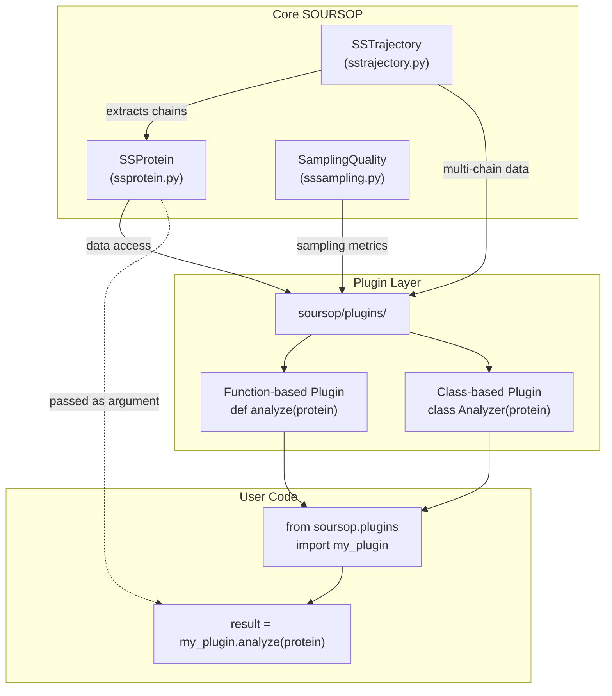
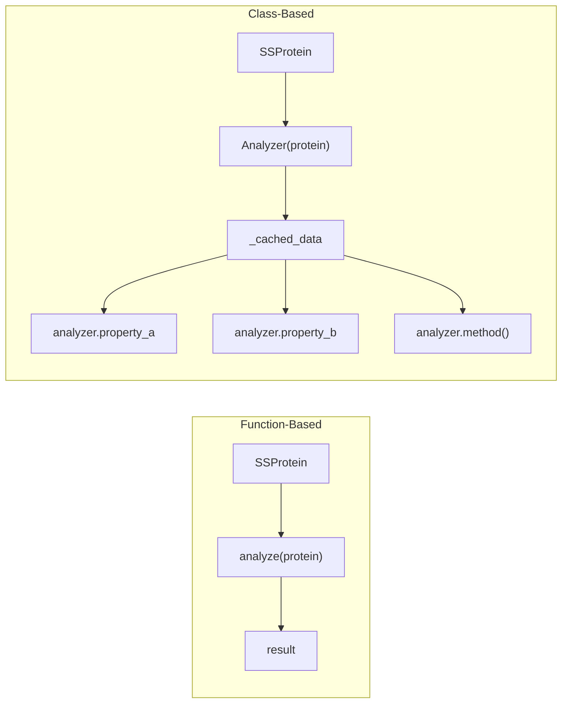
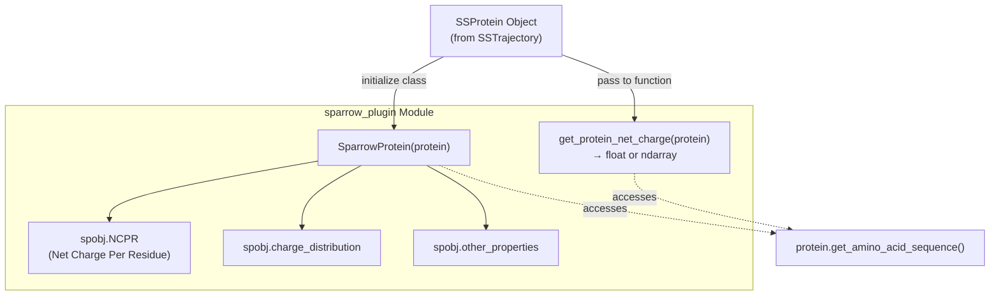
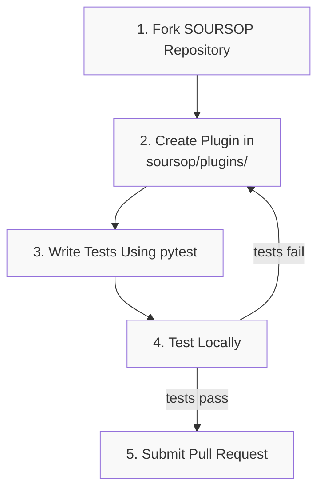
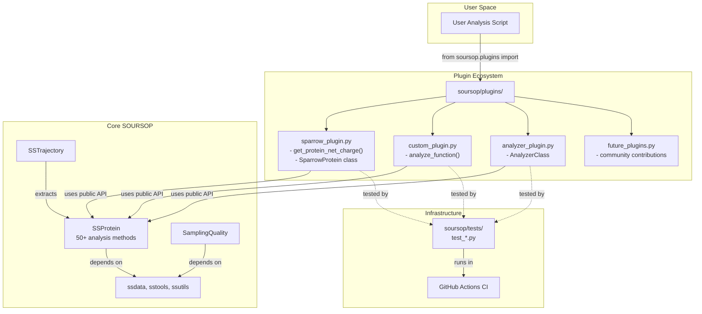

# Plugin Extension System

<details>
<summary>Relevant source files</summary>

The following files were used as context for generating this wiki page:

- [README.md](README.md)
- [docs/index.rst](docs/index.rst)
- [docs/modules/sssampling.rst](docs/modules/sssampling.rst)
- [docs/usage/development.rst](docs/usage/development.rst)
- [docs/usage/examples.rst](docs/usage/examples.rst)
- [soursop/data/test_data/all_residues.pdb](soursop/data/test_data/all_residues.pdb)
- [soursop/data/test_data/all_residues.xtc](soursop/data/test_data/all_residues.xtc)

</details>


## Purpose and Scope

This document explains SOURSOP's plugin extension system, which allows third-party developers to add custom analysis functionality without modifying the core codebase. Plugins provide a modular way to extend SOURSOP's analytical capabilities for specialized use cases in disordered protein analysis.

For information about the core analysis classes that plugins typically consume, see [SSProtein: Single Protein Analysis](#4) and [SSTrajectory: Loading and Multi-Chain Analysis](#3). For information about contributing to the core SOURSOP codebase itself, see [Contributing to SOURSOP](#9.1).

---

## Why Plugins?

The plugin system addresses several key design goals:

1. **Extensibility**: Researchers can add domain-specific analyses without forking the main repository
2. **Modularity**: New functionality remains isolated from core code, reducing integration complexity
3. **Community Development**: Lower barrier to contribution encourages ecosystem growth
4. **Maintenance**: Third-party extensions don't require core maintainer approval for every update

Plugins leverage SOURSOP's existing data structures (`SSProtein`, `SSTrajectory`, `SamplingQuality`) while adding specialized computational methods relevant to particular research questions.

Sources: [docs/usage/development.rst:1-5]()

---

## Plugin Architecture

### Directory Structure

All plugins reside in the `soursop/plugins/` directory. This location is part of the SOURSOP package namespace, enabling standard Python imports:

```python
from soursop.plugins import plugin_name
```

Each plugin is typically a single Python module (`.py` file) within this directory, though more complex plugins may use subdirectories with `__init__.py` files.

### Integration with Core Classes

Plugins access SOURSOP's trajectory and protein data through the public API of core classes. The typical data flow:



**Plugin Data Access Pattern**

Sources: [docs/usage/development.rst:4-5](), [README.md:17]()

### Design Principles

The plugin system follows these principles:

| Principle | Description | Benefit |
|-----------|-------------|---------|
| **Stateless by Default** | Plugins should not modify input objects | Prevents side effects, enables parallel analysis |
| **Public API Only** | Use only documented `SSProtein`/`SSTrajectory` methods | Ensures compatibility across SOURSOP versions |
| **Minimal Dependencies** | Avoid heavy external libraries when possible | Reduces installation complexity |
| **Self-Contained** | Each plugin should be independently usable | Simplifies maintenance and testing |

Sources: [docs/usage/development.rst:1-11]()

---

## Plugin Types

SOURSOP supports two primary plugin patterns: function-based and class-based plugins.

### Function-Based Plugins

Function-based plugins are simple stateless functions that accept SOURSOP objects and return computed results:

```python
def analyze_property(protein):
    """
    Compute property from SSProtein object.
    
    Parameters
    ----------
    protein : SSProtein
        Protein trajectory to analyze
        
    Returns
    -------
    result : float or ndarray
        Computed property
    """
    # Access protein data via public methods
    sequence = protein.get_amino_acid_sequence()
    rg = protein.get_radius_of_gyration()
    
    # Perform custom calculation
    result = custom_calculation(sequence, rg)
    return result
```

**When to Use**: Single computations, simple transformations, quick analyses that don't maintain state.

### Class-Based Plugins

Class-based plugins encapsulate stateful analysis, precomputed data, or multiple related methods:

```python
class ProteinAnalyzer:
    """
    Stateful analyzer for protein properties.
    
    Parameters
    ----------
    protein : SSProtein
        Protein trajectory to analyze
    """
    
    def __init__(self, protein):
        self.protein = protein
        self.sequence = protein.get_amino_acid_sequence()
        
        # Precompute expensive properties
        self._cached_property = self._compute_expensive()
    
    def _compute_expensive(self):
        """Internal computation performed once."""
        # Heavy calculation here
        pass
    
    @property
    def property_a(self):
        """First property based on cached data."""
        return self._cached_property * 2
    
    @property  
    def property_b(self):
        """Second property based on cached data."""
        return self._cached_property ** 0.5
```

**When to Use**: Multiple related analyses, expensive precomputations that benefit from caching, complex state management.



**Plugin Type Selection Guide**

Sources: [docs/usage/development.rst:14-33]()

---

## The sparrow_plugin Example

SOURSOP includes `sparrow_plugin` as a reference implementation demonstrating both plugin patterns. This plugin calculates protein charge-related properties.

### Module Location and Import

The plugin resides at `soursop/plugins/sparrow_plugin.py` and is imported via:

```python
from soursop.plugins import sparrow_plugin
```

### Function-Based Analysis: get_protein_net_charge()

The function-based component computes the net charge of a protein:

```python
from soursop.sstrajectory import SSTrajectory

T = SSTrajectory('ntl9.xtc', 'ntl9.pdb')
NTL9_CP = T.proteinTrajectoryList[0]

# Function-based usage
net_charge = sparrow_plugin.get_protein_net_charge(NTL9_CP)
print(net_charge)
```

This function:
1. Accepts an `SSProtein` object
2. Extracts amino acid sequence via `protein.get_amino_acid_sequence()`
3. Calculates net charge based on charged residues
4. Returns a scalar or time-series result

### Class-Based Analysis: SparrowProtein

The class-based component provides multiple charge-related properties:

```python
from soursop.plugins import sparrow_plugin

# Class-based usage
spobj = sparrow_plugin.SparrowProtein(NTL9_CP)
print(spobj.NCPR)  # Net Charge Per Residue
```

The `SparrowProtein` class:
- Initializes with an `SSProtein` object
- Precomputes sequence-based properties
- Exposes results as attributes (e.g., `NCPR`)
- May provide additional methods for related analyses



**sparrow_plugin Architecture**

Sources: [docs/usage/development.rst:14-33]()

---

## Creating Custom Plugins

### Development Workflow

The recommended workflow for plugin development:



**Plugin Development Workflow**

Sources: [docs/usage/development.rst:6-11]()

### Plugin Structure Guidelines

#### Minimal Function-Based Plugin

Create `soursop/plugins/my_analysis.py`:

```python
"""
my_analysis.py - Custom analysis for disordered proteins.

Author: Your Name
"""

def compute_custom_metric(protein, parameter=1.0):
    """
    Compute a custom metric from protein trajectory.
    
    Parameters
    ----------
    protein : SSProtein
        Protein object from SOURSOP trajectory
    parameter : float, optional
        Analysis parameter (default: 1.0)
        
    Returns
    -------
    metric : ndarray, shape (n_frames,)
        Computed metric for each frame
        
    Examples
    --------
    >>> from soursop import SSTrajectory
    >>> from soursop.plugins import my_analysis
    >>> T = SSTrajectory('traj.xtc', 'top.pdb')
    >>> protein = T.proteinTrajectoryList[0]
    >>> result = my_analysis.compute_custom_metric(protein)
    """
    # Extract necessary data
    sequence = protein.get_amino_acid_sequence()
    rg = protein.get_radius_of_gyration()
    
    # Perform calculation
    metric = rg * parameter  # Replace with actual logic
    
    return metric
```

#### Minimal Class-Based Plugin

```python
"""
my_analyzer.py - Stateful analysis class for proteins.

Author: Your Name
"""

class MyAnalyzer:
    """
    Analyzer for custom protein properties.
    
    Parameters
    ----------
    protein : SSProtein
        Protein object to analyze
    precompute : bool, optional
        Whether to precompute expensive properties (default: True)
        
    Attributes
    ----------
    property_1 : float
        First computed property
    property_2 : ndarray
        Second computed property (per-frame)
        
    Examples
    --------
    >>> from soursop import SSTrajectory
    >>> from soursop.plugins import my_analyzer
    >>> T = SSTrajectory('traj.xtc', 'top.pdb')
    >>> protein = T.proteinTrajectoryList[0]
    >>> analyzer = my_analyzer.MyAnalyzer(protein)
    >>> print(analyzer.property_1)
    """
    
    def __init__(self, protein, precompute=True):
        self.protein = protein
        self.sequence = protein.get_amino_acid_sequence()
        
        if precompute:
            self._precomputed = self._expensive_calculation()
        else:
            self._precomputed = None
    
    def _expensive_calculation(self):
        """Internal method for expensive computations."""
        # Perform heavy calculation once
        rg = self.protein.get_radius_of_gyration()
        return rg.mean()
    
    @property
    def property_1(self):
        """First property (scalar)."""
        if self._precomputed is None:
            self._precomputed = self._expensive_calculation()
        return self._precomputed
    
    @property
    def property_2(self):
        """Second property (time series)."""
        return self.protein.get_end_to_end_distance()
```

### Best Practices

| Practice | Rationale | Implementation |
|----------|-----------|----------------|
| **Comprehensive Docstrings** | Users need clear documentation | Follow NumPy docstring format with Parameters, Returns, Examples |
| **Type Checking** | Catch errors early | Use `isinstance(protein, SSProtein)` checks |
| **Error Handling** | Graceful failure with informative messages | Raise `SSException` with clear error descriptions |
| **Input Validation** | Prevent invalid computations | Check sequence length, frame count, residue types |
| **Memory Efficiency** | Large trajectories can exhaust memory | Use generators, compute properties on-demand when possible |
| **Reproducibility** | Scientific analyses must be reproducible | Document random seeds, numerical tolerances, algorithm versions |

### Testing Requirements

Every plugin must include tests in `soursop/tests/`. Create `test_my_plugin.py`:

```python
"""
test_my_plugin.py - Tests for my_analysis plugin.
"""

import pytest
import numpy as np
from soursop import SSTrajectory
from soursop.plugins import my_analysis

def test_compute_custom_metric():
    """Test custom metric computation."""
    # Load test trajectory
    T = SSTrajectory('soursop/data/test_data/test.xtc',
                     'soursop/data/test_data/test.pdb')
    protein = T.proteinTrajectoryList[0]
    
    # Compute metric
    result = my_analysis.compute_custom_metric(protein)
    
    # Assertions
    assert result is not None
    assert len(result) == protein.n_frames
    assert np.all(np.isfinite(result))

def test_parameter_sensitivity():
    """Test that parameter affects output correctly."""
    T = SSTrajectory('soursop/data/test_data/test.xtc',
                     'soursop/data/test_data/test.pdb')
    protein = T.proteinTrajectoryList[0]
    
    result1 = my_analysis.compute_custom_metric(protein, parameter=1.0)
    result2 = my_analysis.compute_custom_metric(protein, parameter=2.0)
    
    # Check expected relationship
    np.testing.assert_array_almost_equal(result2, result1 * 2.0)
```

Run tests locally before submitting:

```bash
pytest soursop/tests/test_my_plugin.py -v
```

Sources: [docs/usage/development.rst:10-11]()

### Accessing SSProtein Methods

Plugins leverage the extensive `SSProtein` API (50+ methods). Commonly used methods include:

```python
# Sequence information
sequence = protein.get_amino_acid_sequence()
residue_names = protein.get_amino_acid_sequence(oneletter=False)

# Global properties
rg = protein.get_radius_of_gyration()
ree = protein.get_end_to_end_distance()
asphericity = protein.get_asphericity()

# Distance calculations
distance_map = protein.get_distance_map()
ca_distances = protein.get_inter_residue_COM_distance(4, 10)

# Secondary structure
dssp = protein.get_secondary_structure_DSSP()
bbseg = protein.get_secondary_structure_BBSEG()

# Dihedrals
phi, psi = protein.get_all_PPII_angles()

# Surface accessibility
sasa = protein.get_SASA()

# Contact maps
contacts = protein.get_contact_map(distance_cutoff=5.0)
```

For the complete API, see [SSProtein: Single Protein Analysis](#4).

### Accessing SSTrajectory Methods

For multi-chain analysis plugins:

```python
# Load trajectory
T = SSTrajectory('traj.xtc', 'top.pdb')

# Access all proteins
proteins = T.proteinTrajectoryList  # List of SSProtein objects

# Multi-chain analysis
interchain_distances = T.get_interchain_distance_map(0, 1)
interchain_contacts = T.get_interchain_contact_map(0, 1, distance_cutoff=5.0)

# System properties
n_frames = T.n_frames
n_proteins = T.n_proteins
```

For multi-chain functionality, see [Multi-Chain Analysis Methods](#3.3).

Sources: [docs/usage/development.rst:18-33]()

---

## Contribution Process

### Step-by-Step Contribution

1. **Fork the Repository**
   ```bash
   # Via GitHub web interface
   # Navigate to https://github.com/holehouse-lab/soursop
   # Click "Fork" button
   ```

2. **Clone Your Fork**
   ```bash
   git clone https://github.com/YOUR_USERNAME/soursop.git
   cd soursop
   ```

3. **Create Plugin Branch**
   ```bash
   git checkout -b add-my-plugin
   ```

4. **Develop Plugin**
   - Add plugin file: `soursop/plugins/my_plugin.py`
   - Add test file: `soursop/tests/test_my_plugin.py`
   - Update documentation if needed

5. **Test Locally**
   ```bash
   # Install in development mode
   pip install -e .
   
   # Run tests
   pytest soursop/tests/test_my_plugin.py -v
   
   # Run full test suite (recommended)
   pytest soursop/tests/ -v
   ```

6. **Commit Changes**
   ```bash
   git add soursop/plugins/my_plugin.py
   git add soursop/tests/test_my_plugin.py
   git commit -m "Add my_plugin for custom analysis"
   ```

7. **Push to Fork**
   ```bash
   git push origin add-my-plugin
   ```

8. **Submit Pull Request**
   - Navigate to your fork on GitHub
   - Click "Pull Request" button
   - Provide clear description of plugin functionality
   - Reference any related issues

9. **Respond to Review**
   - Address reviewer comments
   - Update code as needed
   - Push updates to same branch (PR updates automatically)

### Pull Request Checklist

Before submitting, ensure:

- [ ] Plugin code follows existing style conventions
- [ ] Docstrings are complete with Parameters, Returns, Examples
- [ ] Tests are included and passing locally
- [ ] Plugin works with test trajectory data
- [ ] No modifications to core SOURSOP classes
- [ ] Dependencies are minimal and documented
- [ ] Example usage is provided in docstring

### Getting Help

If you encounter difficulties:

1. **Documentation Issues**: Contact Alex Holehouse or Jared Lalmansingh
2. **Testing Challenges**: Request guidance in GitHub issue or pull request
3. **Technical Questions**: Open a GitHub issue with `question` label

The SOURSOP maintainers are committed to supporting plugin development and will help ensure your contribution integrates smoothly.

Sources: [docs/usage/development.rst:6-11](), [README.md:14-17]()

---

## Plugin System Architecture Summary



**Complete Plugin System Architecture**

Sources: [docs/usage/development.rst:1-39](), [README.md:17](), [README.md:53]()

---