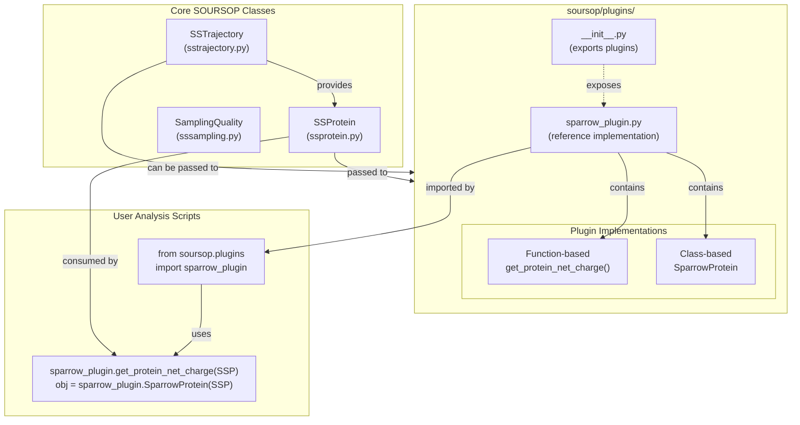
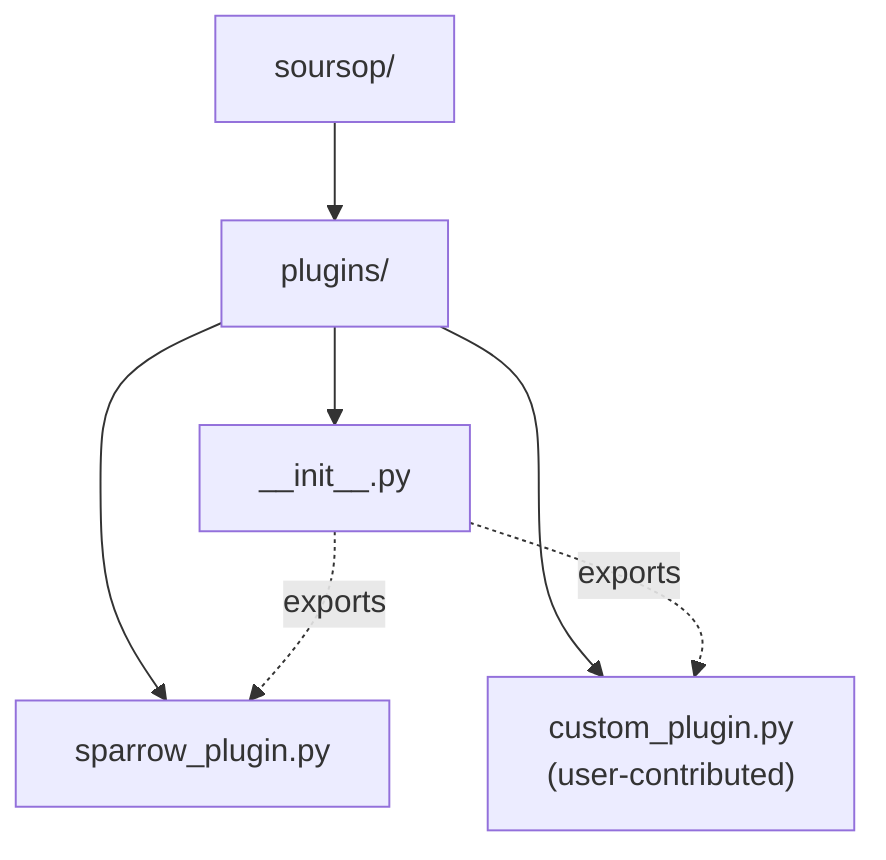
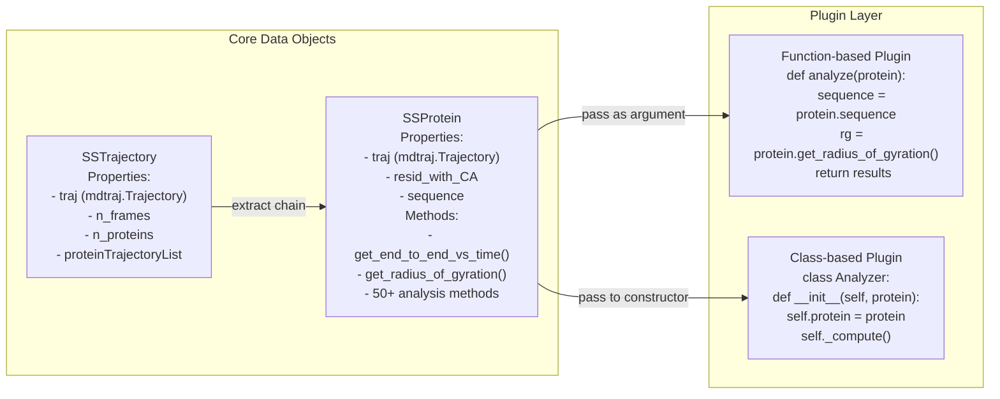
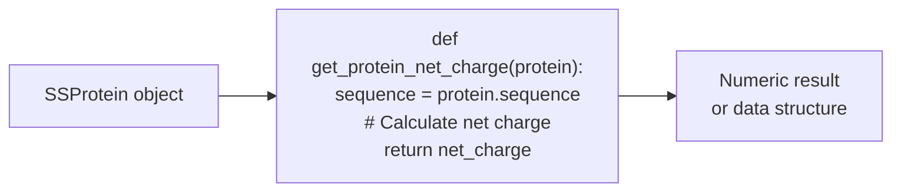
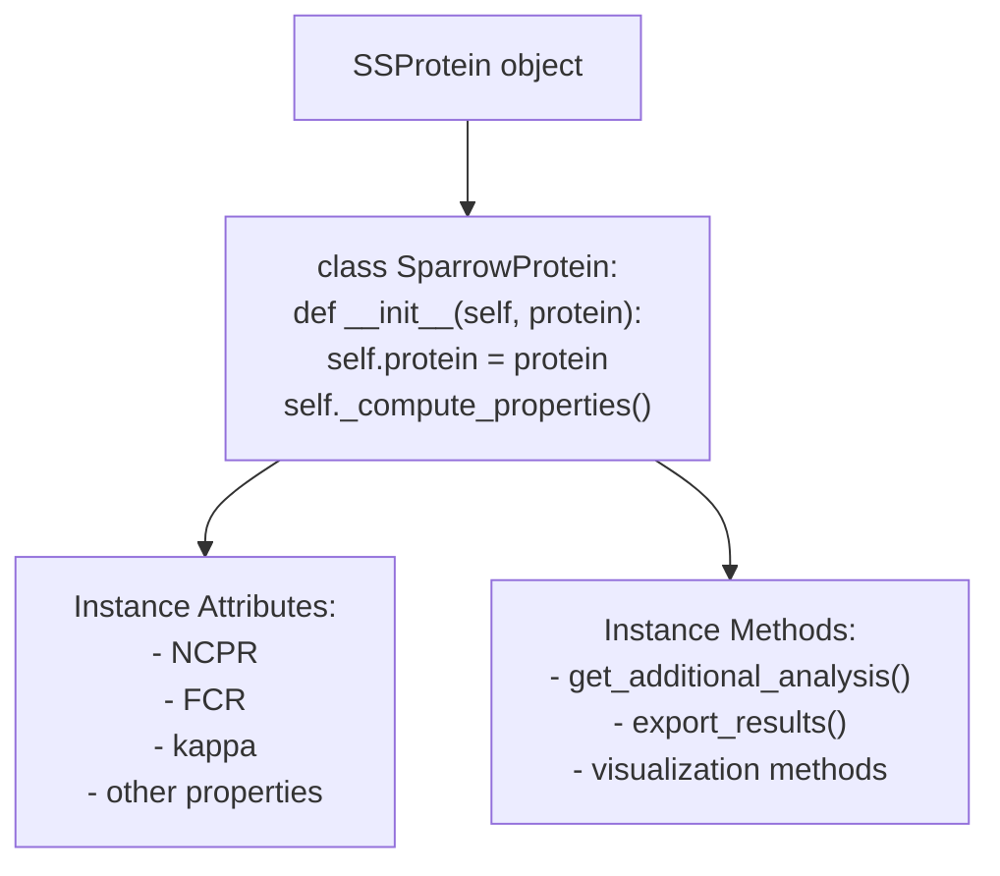
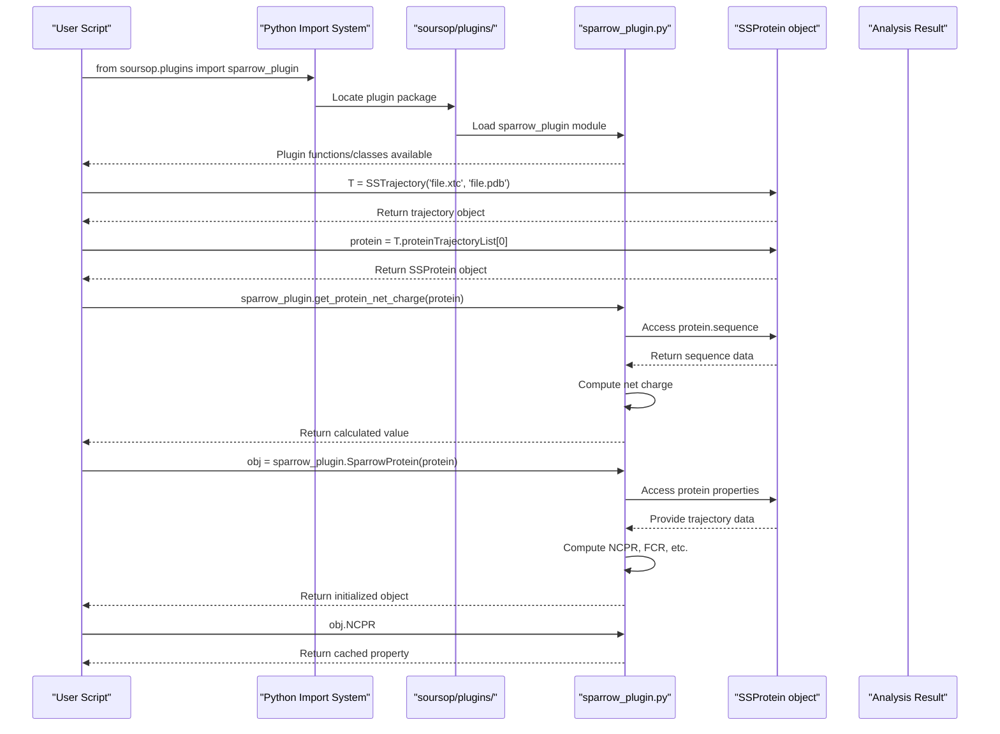
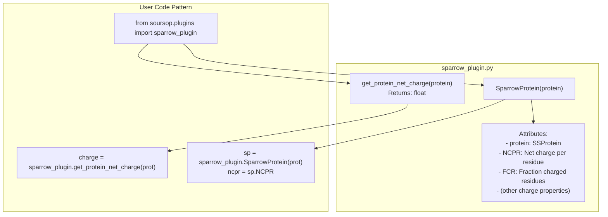
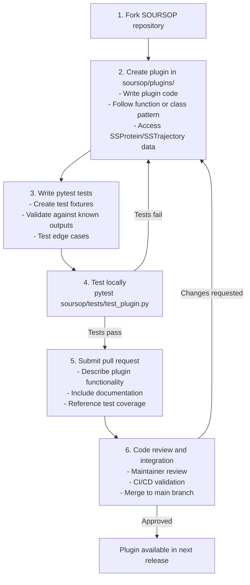
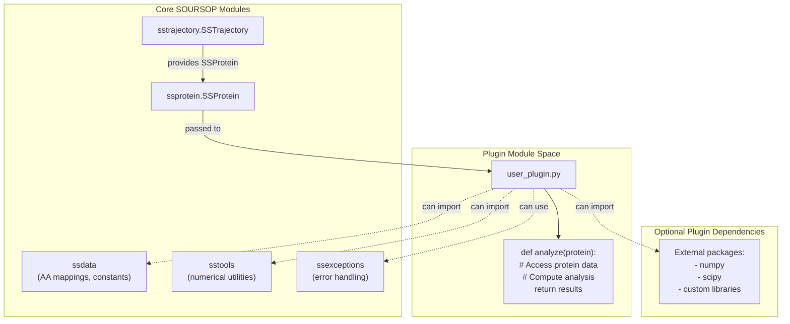

# Plugin Architecture

<details>
<summary>Relevant source files</summary>

The following files were used as context for generating this wiki page:

- [docs/usage/development.rst](docs/usage/development.rst)
- [docs/usage/examples.rst](docs/usage/examples.rst)
- [soursop/data/test_data/all_residues.pdb](soursop/data/test_data/all_residues.pdb)
- [soursop/data/test_data/all_residues.xtc](soursop/data/test_data/all_residues.xtc)

</details>


## Purpose and Scope

This page describes SOURSOP's plugin extension system, which enables third-party developers to add custom analysis functionality without modifying the core codebase. It covers the plugin directory structure, the interface contract between plugins and core classes, and the types of plugins supported (stateless functions and stateful classes).

For practical tutorials on creating your own plugins, see [Creating Custom Plugins](#8.2). For information about the core analysis classes that plugins interact with, see [SSProtein: Single Protein Analysis](#4) and [SSTrajectory: Loading and Multi-Chain Analysis](#3).

---

## Plugin System Design

SOURSOP implements a lightweight plugin architecture that allows developers to extend the framework's analytical capabilities. Plugins reside in the `soursop/plugins/` directory and consume data from the core `SSProtein` and `SSTrajectory` classes without requiring modifications to the core codebase.

### Design Philosophy

The plugin system follows these principles:

1. **Low barrier to entry**: Simple Python functions or classes can be plugins
2. **No core modifications**: Plugins are self-contained in the plugins directory
3. **Access to core data**: Full access to trajectory and protein data structures
4. **Flexibility**: Support for both stateless functions and stateful class-based plugins

**Plugin Architecture Overview**



Sources: [docs/usage/development.rst:1-39]()

---

## Plugin Directory Structure

Plugins are organized within the `soursop/plugins/` directory. This directory is part of the SOURSOP package and is included in the Python module path, making plugins importable as `soursop.plugins.<plugin_name>`.

**Plugin Directory Organization**



### Key Components

| Component | Purpose | Location |
|-----------|---------|----------|
| `soursop/plugins/` | Plugin directory root | Top-level plugins package |
| `__init__.py` | Module initialization, plugin exports | `soursop/plugins/__init__.py` |
| `sparrow_plugin.py` | Reference implementation | Example plugin demonstrating both function and class approaches |
| User plugins | Custom analysis modules | Any `.py` file added to this directory |

Sources: [docs/usage/development.rst:15-16]()

---

## Core Data Access Pattern

Plugins interact with SOURSOP's core data structures through well-defined interfaces. The primary data sources are `SSProtein` and `SSTrajectory` objects, which provide access to conformational ensembles, molecular properties, and trajectory data.

**Data Flow from Core to Plugins**



### Accessible Data and Methods

Plugins have full access to:

1. **SSProtein Interface**:
   - Trajectory data via `protein.traj` (mdtraj.Trajectory object)
   - Sequence information via `protein.sequence`
   - Residue lists via `protein.resid_with_CA`
   - All 50+ analysis methods (Rg, end-to-end distance, contact maps, etc.)

2. **SSTrajectory Interface**:
   - Multi-protein trajectory data via `trajectory.traj`
   - Individual protein chains via `trajectory.proteinTrajectoryList`
   - Frame count via `trajectory.n_frames`
   - Multi-chain analysis methods

Sources: [docs/usage/development.rst:18-33]()

---

## Plugin Types and Implementation Patterns

SOURSOP supports two plugin implementation patterns: stateless functions and stateful classes. Both patterns provide full access to core data structures while offering different organizational approaches.

### Stateless Function Plugins

Function-based plugins operate on input data without maintaining state between calls. They are ideal for simple calculations or transformations.

**Function Plugin Pattern**



**Characteristics**:
- Simple function signatures accepting `SSProtein` or `SSTrajectory` objects
- Return computed results directly
- No persistent state between invocations
- Easy to test and compose

**Example from sparrow_plugin**:
```python
from soursop.plugins import sparrow_plugin
net_charge = sparrow_plugin.get_protein_net_charge(NTL9_CP)
```

### Stateful Class Plugins

Class-based plugins encapsulate complex analysis workflows and maintain computed results as instance attributes. This pattern is suitable for multi-step analyses or when results need to be cached.

**Class Plugin Pattern**



**Characteristics**:
- Store reference to input `SSProtein` object
- Compute and cache analysis results in `__init__` or lazy properties
- Expose results as instance attributes
- Provide additional methods for related analyses

**Example from sparrow_plugin**:
```python
from soursop.plugins import sparrow_plugin
spobj = sparrow_plugin.SparrowProtein(NTL9_CP)
print(spobj.NCPR)  # Access computed property
```

Sources: [docs/usage/development.rst:18-33]()

---

## Plugin Import and Usage Flow

The plugin system integrates seamlessly with Python's module system, allowing standard import statements to access plugin functionality.

**Plugin Usage Sequence**



Sources: [docs/usage/development.rst:18-33]()

---

## Reference Implementation: sparrow_plugin

The `sparrow_plugin` serves as the canonical example of plugin implementation. It demonstrates both function-based and class-based patterns for computing protein charge properties.

**sparrow_plugin Architecture**



### Plugin Components

The reference implementation includes:

1. **Stateless function**: `get_protein_net_charge(protein)`
   - Accepts an `SSProtein` object
   - Computes net charge from sequence
   - Returns numeric result

2. **Stateful class**: `SparrowProtein`
   - Constructor accepts `SSProtein` object
   - Computes multiple charge-related properties
   - Exposes results via attributes like `NCPR`

This dual-pattern approach demonstrates the flexibility of the plugin system and provides templates for both simple and complex analyses.

Sources: [docs/usage/development.rst:13-33]()

---

## Plugin Development Workflow

The recommended workflow for developing and contributing plugins follows a standard open-source contribution model.

**Plugin Development and Integration Flow**



### Development Guidelines

| Step | Action | Purpose |
|------|--------|---------|
| Fork repository | Create personal copy of SOURSOP | Isolated development environment |
| Add plugin | Create `.py` file in `soursop/plugins/` | Plugin code location |
| Write tests | Create test file using pytest | Ensure correctness and prevent regressions |
| Local validation | Run `pytest` locally | Verify functionality before submission |
| Pull request | Submit PR to main repository | Request integration into official codebase |
| Review | Maintainer code review | Quality control and API consistency |

Sources: [docs/usage/development.rst:6-11]()

---

## Plugin Interface Contract

While SOURSOP does not enforce a strict interface, plugins should follow these conventions to ensure compatibility and maintainability.

### Conventions and Best Practices

**Function-based Plugins**:
- Accept `SSProtein` or `SSTrajectory` as first argument
- Use descriptive function names (e.g., `get_`, `compute_`, `calculate_`)
- Return standard Python types or numpy arrays
- Document parameters and return values

**Class-based Plugins**:
- Accept `SSProtein` or `SSTrajectory` in `__init__`
- Store reference to input object as `self.protein` or `self.trajectory`
- Compute properties in `__init__` or use lazy evaluation
- Expose results as public attributes or properties
- Document attributes and methods

**General Guidelines**:
- Import core classes from `soursop.sstrajectory` or `soursop.ssprotein`
- Handle edge cases (empty trajectories, missing residues, etc.)
- Raise appropriate exceptions with informative messages
- Avoid modifying input objects
- Use numpy/scipy for numerical computations

### Data Access Patterns

Plugins typically access:

```
SSProtein.traj              # mdtraj.Trajectory object
SSProtein.sequence          # Amino acid sequence string
SSProtein.resid_with_CA     # List of residue IDs with CA atoms
SSProtein.n_frames          # Number of frames
SSProtein.get_radius_of_gyration()  # Analysis methods
```

Sources: [docs/usage/development.rst:4]()

---

## Integration with Core Systems

Plugins operate independently of the core SOURSOP modules but rely on the data structures and utilities provided by the framework.

**Plugin Dependencies and Interactions**



### Dependency Guidelines

Plugins can:
- ✅ Import and use `SSProtein` and `SSTrajectory` objects
- ✅ Import utility modules like `ssdata`, `sstools`, `ssexceptions`
- ✅ Use any standard library or external packages (numpy, scipy, etc.)
- ✅ Define their own dependencies (documented in plugin docstring)

Plugins should not:
- ❌ Modify core SOURSOP class definitions
- ❌ Depend on private/internal APIs (names starting with `_`)
- ❌ Assume specific SOURSOP versions without documentation
- ❌ Create circular dependencies with core modules

Sources: [docs/usage/development.rst:1-39]()

---

## Summary

The SOURSOP plugin architecture provides a lightweight, flexible framework for extending analysis capabilities:

- **Simple integration**: Plugins are standard Python modules in `soursop/plugins/`
- **Two implementation patterns**: Functions for simple analyses, classes for complex workflows
- **Full data access**: Complete access to `SSProtein` and `SSTrajectory` interfaces
- **Low barrier to entry**: No complex APIs or registration required
- **Community-driven**: Open contribution model via pull requests

For hands-on guidance on creating plugins, see [Creating Custom Plugins](#8.2).

Sources: [docs/usage/development.rst:1-39]()

---