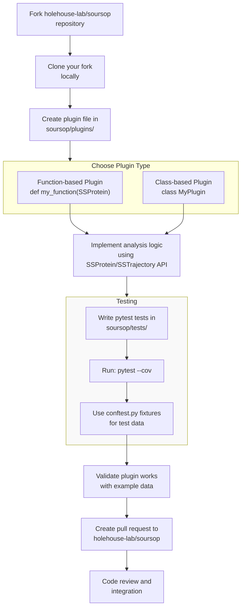
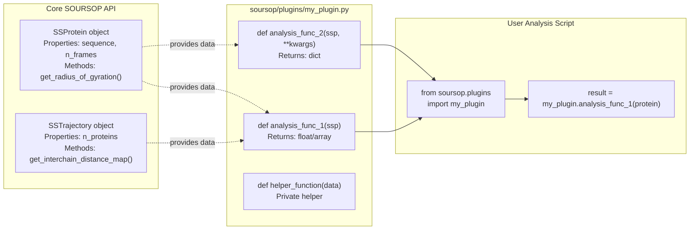
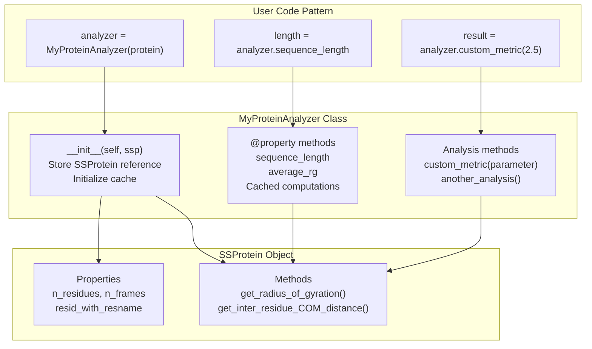
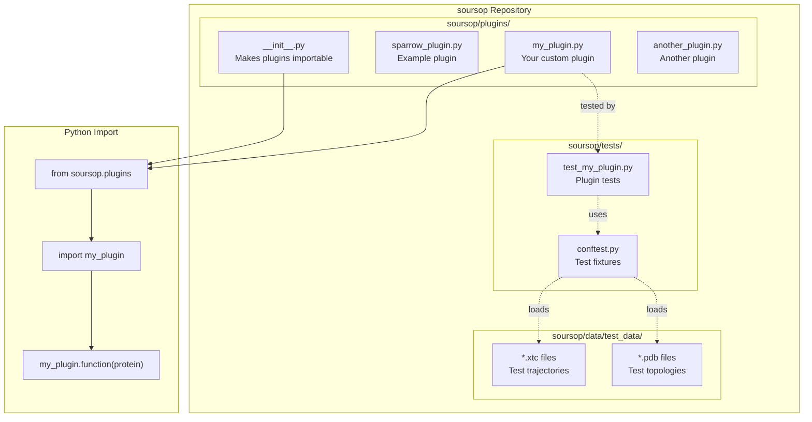

# Creating Custom Plugins

<details>
<summary>Relevant source files</summary>

The following files were used as context for generating this wiki page:

- [docs/usage/development.rst](docs/usage/development.rst)
- [docs/usage/examples.rst](docs/usage/examples.rst)
- [soursop/data/test_data/all_residues.pdb](soursop/data/test_data/all_residues.pdb)
- [soursop/data/test_data/all_residues.xtc](soursop/data/test_data/all_residues.xtc)

</details>


## Purpose and Scope

This page provides a practical guide for developing custom analysis plugins for SOURSOP. It covers the process of creating both function-based and class-based plugins, testing them, and contributing them to the project. For information about the plugin architecture and how plugins integrate with the core system, see [Plugin Architecture](#8.1). For details on the core analysis classes that plugins consume, see [SSProtein: Single Protein Analysis](#4) and [SSTrajectory: Loading and Multi-Chain Analysis](#3).

---

## Plugin Types Overview

SOURSOP supports two types of plugins that can be placed in the `soursop/plugins/` directory:

| Plugin Type | Description | Use Case | Example |
|-------------|-------------|----------|---------|
| **Function-based** | Stateless functions that operate on SOURSOP objects | Simple calculations or transformations | `get_protein_net_charge()` |
| **Class-based** | Stateful classes that wrap SOURSOP objects | Complex analysis with multiple methods and cached results | `SparrowProtein` |

Both types can access all public methods and properties of `SSProtein` and `SSTrajectory` objects, enabling custom analysis workflows that extend beyond the built-in functionality.

**Sources:** [docs/usage/development.rst:4-16]()

---

## Plugin Development Workflow



**Workflow for Contributing Plugins to SOURSOP**

The development workflow follows standard open-source contribution practices. After forking and cloning the repository, developers create their plugin in the `soursop/plugins/` directory, implement tests, and submit a pull request for integration.

**Sources:** [docs/usage/development.rst:6-11]()

---

## Creating Function-Based Plugins

Function-based plugins are ideal for stateless operations that compute a single result from SOURSOP objects. They follow a simple pattern:

```python
# In soursop/plugins/my_plugin.py

def my_analysis_function(ssp):
    """
    Perform custom analysis on an SSProtein object.
    
    Parameters
    ----------
    ssp : SSProtein
        The protein trajectory to analyze
        
    Returns
    -------
    result : float, array, or dict
        Analysis result
    """
    # Access SSProtein properties
    sequence = ssp.resid_with_resname
    n_frames = ssp.n_frames
    
    # Use SSProtein methods
    rg_values = ssp.get_radius_of_gyration()
    
    # Perform custom calculation
    result = compute_something(rg_values, sequence)
    
    return result
```

### Function Plugin Structure



**Function-Based Plugin Data Flow**

Functions accept `SSProtein` or `SSTrajectory` objects as parameters and use their public API to access trajectory data and perform calculations.

**Sources:** [docs/usage/development.rst:15-33]()

---

## Creating Class-Based Plugins

Class-based plugins encapsulate an `SSProtein` or `SSTrajectory` object and provide stateful analysis with multiple methods. This approach is useful when:

- Multiple related analyses need to be performed
- Results should be cached to avoid recomputation
- Complex state management is required

```python
# In soursop/plugins/my_plugin.py

class MyProteinAnalyzer:
    """
    Custom analyzer for SSProtein objects with multiple analysis methods.
    """
    
    def __init__(self, ssp):
        """
        Initialize analyzer with an SSProtein object.
        
        Parameters
        ----------
        ssp : SSProtein
            The protein trajectory to analyze
        """
        self._ssp = ssp
        self._cache = {}
    
    @property
    def sequence_length(self):
        """Get protein sequence length."""
        return self._ssp.n_residues
    
    @property
    def average_rg(self):
        """Compute and cache average radius of gyration."""
        if 'avg_rg' not in self._cache:
            rg_values = self._ssp.get_radius_of_gyration()
            self._cache['avg_rg'] = rg_values.mean()
        return self._cache['avg_rg']
    
    def custom_metric(self, parameter=1.0):
        """
        Compute custom metric with configurable parameter.
        
        Parameters
        ----------
        parameter : float
            Analysis parameter
            
        Returns
        -------
        metric : float
            Computed metric value
        """
        # Use SSProtein methods
        distances = self._ssp.get_inter_residue_COM_distance()
        
        # Custom calculation
        metric = calculate_something(distances, parameter)
        
        return metric
```

### Class Plugin Structure



**Class-Based Plugin Architecture**

Class-based plugins wrap an `SSProtein` object at initialization and provide properties and methods that internally call the core API. Caching can be implemented to optimize repeated calculations.

**Sources:** [docs/usage/development.rst:15-33]()

---

## Example: The sparrow_plugin

SOURSOP includes `sparrow_plugin` as a reference implementation demonstrating both function-based and class-based approaches. This plugin provides protein charge calculations.

### Function-Based Example

```python
# From soursop/plugins/sparrow_plugin.py (conceptual)

def get_protein_net_charge(ssp):
    """
    Calculate net charge of protein at neutral pH.
    
    Parameters
    ----------
    ssp : SSProtein
        Protein trajectory object
        
    Returns
    -------
    float
        Net charge of the protein
    """
    # Access sequence from SSProtein
    sequence = ssp.resid_with_resname
    
    # Calculate charges for each residue
    # (using amino acid charge properties)
    total_charge = sum_residue_charges(sequence)
    
    return total_charge
```

### Class-Based Example

```python
# From soursop/plugins/sparrow_plugin.py (conceptual)

class SparrowProtein:
    """
    Wrapper providing charge-related analysis for SSProtein objects.
    """
    
    def __init__(self, ssp):
        """
        Initialize with SSProtein object.
        
        Parameters
        ----------
        ssp : SSProtein
            Protein trajectory to analyze
        """
        self._ssp = ssp
    
    @property
    def NCPR(self):
        """
        Net charge per residue.
        
        Returns
        -------
        float
            NCPR value
        """
        sequence = self._ssp.resid_with_resname
        net_charge = calculate_net_charge(sequence)
        return net_charge / self._ssp.n_residues
    
    @property
    def fraction_positive(self):
        """Fraction of positively charged residues."""
        sequence = self._ssp.resid_with_resname
        return count_positive_residues(sequence) / len(sequence)
```

### Using the sparrow_plugin

```python
from soursop.sstrajectory import SSTrajectory

# Load trajectory
T = SSTrajectory('trajectory.xtc', 'topology.pdb')
protein = T.proteinTrajectoryList[0]

# Import plugin
from soursop.plugins import sparrow_plugin

# Use function-based plugin
net_charge = sparrow_plugin.get_protein_net_charge(protein)
print(f"Net charge: {net_charge}")

# Use class-based plugin
sp = sparrow_plugin.SparrowProtein(protein)
print(f"NCPR: {sp.NCPR}")
print(f"Fraction positive: {sp.fraction_positive}")
```

**Sources:** [docs/usage/development.rst:15-33]()

---

## Plugin File Organization



**Plugin Directory Structure and Import System**

Plugins reside in `soursop/plugins/` and are imported using `from soursop.plugins import my_plugin`. Tests go in `soursop/tests/` and use fixtures from `conftest.py` to load test data.

**Sources:** [docs/usage/development.rst:4-39]()

---

## Testing Plugins

All plugins must include comprehensive tests using pytest. Tests should cover:

1. **Basic functionality** - Does the plugin produce expected output?
2. **Edge cases** - How does it handle unusual inputs?
3. **Integration** - Does it work with real trajectory data?

### Test Structure

```python
# In soursop/tests/test_my_plugin.py

import pytest
from soursop.sstrajectory import SSTrajectory
from soursop.plugins import my_plugin


def test_function_plugin_basic(test_protein):
    """Test basic functionality of function plugin."""
    # test_protein fixture provided by conftest.py
    result = my_plugin.my_analysis_function(test_protein)
    
    # Assert expected behavior
    assert isinstance(result, float)
    assert result > 0


def test_function_plugin_with_parameters(test_protein):
    """Test function plugin with custom parameters."""
    result1 = my_plugin.my_analysis_function(test_protein, param=1.0)
    result2 = my_plugin.my_analysis_function(test_protein, param=2.0)
    
    # Results should differ with different parameters
    assert result1 != result2


def test_class_plugin_initialization(test_protein):
    """Test class plugin can be initialized."""
    analyzer = my_plugin.MyProteinAnalyzer(test_protein)
    
    assert analyzer.sequence_length == test_protein.n_residues


def test_class_plugin_property(test_protein):
    """Test class plugin property access."""
    analyzer = my_plugin.MyProteinAnalyzer(test_protein)
    
    # Property should return a value
    avg_rg = analyzer.average_rg
    assert isinstance(avg_rg, float)
    assert avg_rg > 0
    
    # Accessing again should use cache (same object)
    avg_rg2 = analyzer.average_rg
    assert avg_rg == avg_rg2


def test_class_plugin_method(test_protein):
    """Test class plugin method."""
    analyzer = my_plugin.MyProteinAnalyzer(test_protein)
    
    metric = analyzer.custom_metric(parameter=1.5)
    
    assert isinstance(metric, float)


def test_plugin_with_real_data():
    """Test plugin with actual trajectory file."""
    # Load test data (assumes test files exist)
    traj = SSTrajectory('path/to/test.xtc', 'path/to/test.pdb')
    protein = traj.proteinTrajectoryList[0]
    
    result = my_plugin.my_analysis_function(protein)
    
    # Compare against expected value
    assert abs(result - 1.234) < 0.001
```

### Running Tests

```bash
# Run all tests with coverage
pytest --cov

# Run tests in parallel
pytest --xdist --forked

# Run only plugin tests
pytest soursop/tests/test_my_plugin.py

# Run with verbose output
pytest -v soursop/tests/test_my_plugin.py
```

**Sources:** [docs/usage/development.rst:10]()

---

## Contributing Plugins to SOURSOP

### Pull Request Process

1. **Fork the repository**
   ```bash
   git clone https://github.com/<your-username>/soursop.git
   cd soursop
   ```

2. **Create a feature branch**
   ```bash
   git checkout -b add-my-plugin
   ```

3. **Add your plugin**
   - Create `soursop/plugins/my_plugin.py`
   - Add docstrings following NumPy style
   - Include type hints where appropriate

4. **Write tests**
   - Create `soursop/tests/test_my_plugin.py`
   - Achieve >80% code coverage
   - Test all functions and methods

5. **Run the test suite**
   ```bash
   pytest --cov --cov-report=term-missing
   ```

6. **Commit and push**
   ```bash
   git add soursop/plugins/my_plugin.py
   git add soursop/tests/test_my_plugin.py
   git commit -m "Add my_plugin for custom analysis"
   git push origin add-my-plugin
   ```

7. **Create pull request**
   - Go to GitHub and create a pull request
   - Describe what the plugin does
   - Explain use cases
   - Reference any related issues

**Sources:** [docs/usage/development.rst:6-11]()

---

## Plugin Best Practices

### Design Guidelines

| Guideline | Description | Rationale |
|-----------|-------------|-----------|
| **Single responsibility** | Each plugin should do one thing well | Easier to test and maintain |
| **Clear naming** | Use descriptive function/class names | `calculate_disorder_score` not `calc_ds` |
| **Complete documentation** | Include docstrings with Parameters/Returns sections | Users need to understand usage |
| **Minimal dependencies** | Avoid external packages if possible | Reduces installation complexity |
| **Type hints** | Add type annotations to function signatures | Improves code clarity and IDE support |
| **Error handling** | Validate inputs and provide clear error messages | Better debugging experience |

### Code Style

```python
# Good: Clear, documented, type-annotated
def calculate_persistence_length(
    ssp: SSProtein,
    backbone_atoms: str = 'CA',
    temperature: float = 300.0
) -> float:
    """
    Calculate persistence length from end-to-end distance distribution.
    
    Parameters
    ----------
    ssp : SSProtein
        Protein trajectory object
    backbone_atoms : str, optional
        Atoms to use for calculation (default: 'CA')
    temperature : float, optional
        Temperature in Kelvin (default: 300.0)
        
    Returns
    -------
    float
        Persistence length in Angstroms
        
    Raises
    ------
    ValueError
        If temperature is non-positive
    """
    if temperature <= 0:
        raise ValueError(f"Temperature must be positive, got {temperature}")
    
    # Implementation
    distances = ssp.get_end_to_end_distance()
    persistence = compute_from_distribution(distances, temperature)
    
    return persistence


# Bad: No documentation, unclear naming, no validation
def calc_pl(ssp, atoms='CA', T=300):
    distances = ssp.get_end_to_end_distance()
    return compute_from_distribution(distances, T)
```

### Performance Considerations

- **Cache expensive calculations** in class-based plugins
- **Use vectorized operations** (NumPy) instead of loops
- **Leverage SSProtein's caching** - repeated method calls are fast
- **Profile before optimizing** - use `cProfile` to identify bottlenecks

```python
# Good: Uses caching to avoid recomputation
class StructuralAnalyzer:
    def __init__(self, ssp):
        self._ssp = ssp
        self._cache = {}
    
    @property
    def compactness_score(self):
        """Cached compactness calculation."""
        if 'compactness' not in self._cache:
            rg = self._ssp.get_radius_of_gyration()
            ree = self._ssp.get_end_to_end_distance()
            self._cache['compactness'] = numpy.mean(rg / ree)
        return self._cache['compactness']


# Bad: Recomputes expensive operations every time
class StructuralAnalyzer:
    def __init__(self, ssp):
        self._ssp = ssp
    
    @property
    def compactness_score(self):
        """No caching - recalculates every access."""
        rg = self._ssp.get_radius_of_gyration()  # Expensive
        ree = self._ssp.get_end_to_end_distance()  # Expensive
        return numpy.mean(rg / ree)
```

### Accessing Core Functionality

Plugins have full access to the SSProtein and SSTrajectory APIs:

```python
def comprehensive_analysis(ssp):
    """
    Example showing access to various SSProtein methods.
    """
    # Structural properties
    rg = ssp.get_radius_of_gyration()
    ree = ssp.get_end_to_end_distance()
    asphericity = ssp.get_asphericity()
    
    # Distance calculations
    distance_map = ssp.get_inter_residue_distance(mode='CA')
    com_distances = ssp.get_inter_residue_COM_distance()
    
    # Secondary structure
    dssp = ssp.get_secondary_structure_DSSP()
    
    # Surface accessibility
    sasa = ssp.get_SASA()
    
    # Angles
    phi = ssp.get_phi_angles()
    psi = ssp.get_psi_angles()
    
    # Contact maps
    contacts = ssp.get_contact_map(distance_cutoff=8.0)
    
    # Sequence information
    sequence = ssp.resid_with_resname
    n_residues = ssp.n_residues
    n_frames = ssp.n_frames
    
    # Perform custom analysis using these data
    result = custom_computation(rg, ree, contacts)
    
    return result
```

**Sources:** [docs/usage/development.rst:4-39]()

---

## Summary

Creating custom plugins for SOURSOP involves:

1. **Choose plugin type** - Function-based for simple operations, class-based for stateful analysis
2. **Implement in soursop/plugins/** - Access full SSProtein/SSTrajectory API
3. **Write comprehensive tests** - Use pytest with fixtures from conftest.py
4. **Follow best practices** - Document thoroughly, validate inputs, use type hints
5. **Submit pull request** - Contribute back to the community

For questions about plugin development, contact the SOURSOP development team or open an issue on GitHub.

**Sources:** [docs/usage/development.rst:1-39]()

---