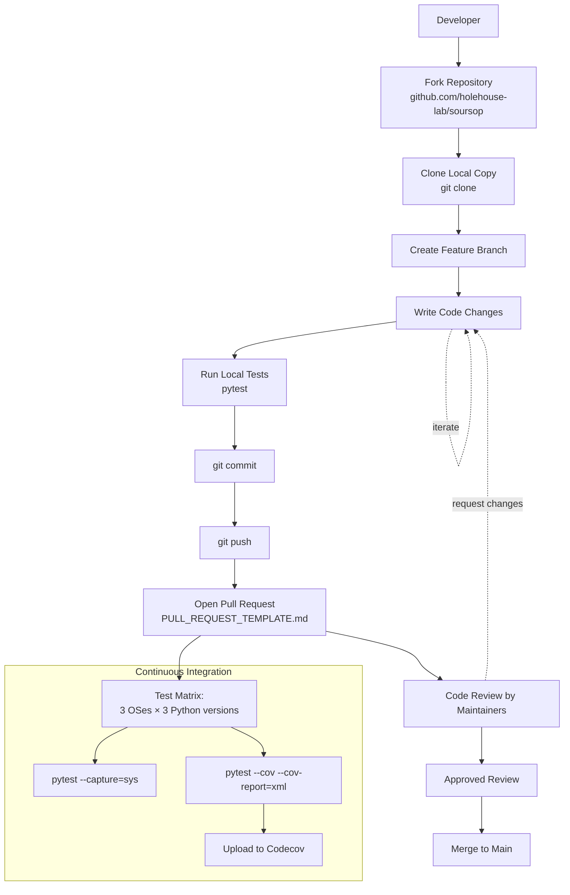
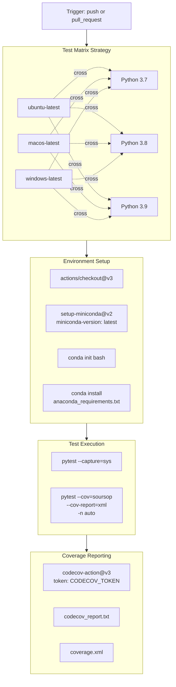
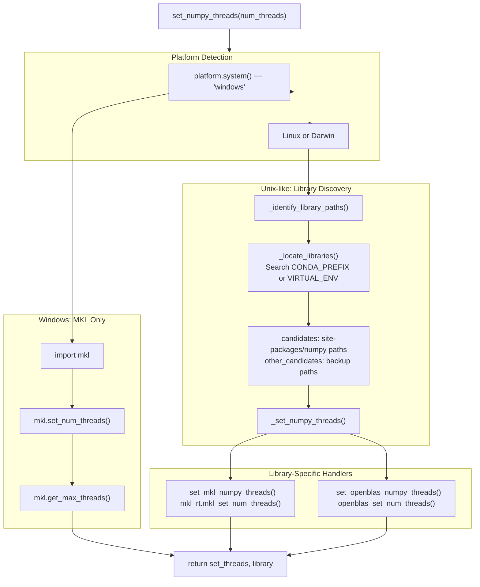
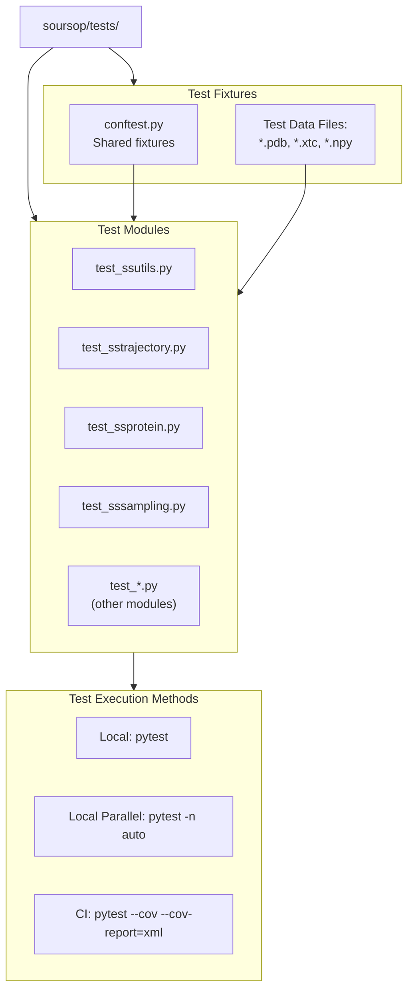

# Development Guide

<details>
<summary>Relevant source files</summary>

The following files were used as context for generating this wiki page:

- [.codecov.yml](.codecov.yml)
- [.github/CONTRIBUTING.md](.github/CONTRIBUTING.md)
- [.github/PULL_REQUEST_TEMPLATE.md](.github/PULL_REQUEST_TEMPLATE.md)
- [.github/workflows/soursop-ci.yml](.github/workflows/soursop-ci.yml)
- [CODE_OF_CONDUCT.md](CODE_OF_CONDUCT.md)
- [soursop/ssutils.py](soursop/ssutils.py)
- [soursop/tests/test_ssutils.py](soursop/tests/test_ssutils.py)

</details>


This page provides an overview of SOURSOP's development infrastructure, processes, and tools for contributors and developers working on the codebase itself. It covers the CI/CD pipeline, testing framework, contribution workflow, and development environment setup.

For creating custom analysis extensions that use SOURSOP, see [Plugin Extension System](#8). For installation instructions as an end user, see [Installation](#2.1).

## Development Infrastructure Overview

SOURSOP maintains a comprehensive development infrastructure that ensures code quality, platform compatibility, and maintainability. The system includes automated testing across multiple platforms and Python versions, code coverage tracking, automated documentation building, and standardized contribution workflows.

**Sources:** [.github/workflows/soursop-ci.yml:1-70](), [.github/CONTRIBUTING.md:1-70]()

### Development Workflow



**Sources:** [.github/CONTRIBUTING.md:1-70](), [.github/workflows/soursop-ci.yml:1-70](), [.github/PULL_REQUEST_TEMPLATE.md:1-12]()

This diagram shows the complete contribution workflow from initial fork to merge. The process follows standard GitHub fork-and-pull-request patterns with automated CI validation at each pull request.

## CI/CD Pipeline Architecture

### GitHub Actions Test Matrix

SOURSOP employs a comprehensive testing matrix that validates code across multiple platforms and Python versions. The CI pipeline is defined in [.github/workflows/soursop-ci.yml:1-70]() and executes on every push and pull request.



**Sources:** [.github/workflows/soursop-ci.yml:1-70]()

The test matrix produces **9 parallel test runs** (3 operating systems × 3 Python versions). Each run executes the full test suite twice: once for basic validation and once for coverage analysis.

### CI Pipeline Configuration Details

| Component | Configuration | Purpose |
|-----------|--------------|---------|
| **OS Matrix** | `ubuntu-latest`, `macos-latest`, `windows-latest` | Cross-platform compatibility |
| **Python Versions** | `3.7`, `3.8`, `3.9` | Support for current Python ecosystem |
| **Shell** | `bash -l {0}` | Consistent shell across all OSes, including Windows |
| **Package Manager** | `conda` with `anaconda_requirements.txt` | Solver-based dependency resolution |
| **Test Execution** | `pytest --capture=sys` | Basic test suite validation |
| **Coverage Testing** | `pytest --cov=soursop --cov-report=xml -n auto` | Parallel coverage analysis |
| **Coverage Upload** | `codecov/codecov-action@v3` | Automated coverage reporting |

**Sources:** [.github/workflows/soursop-ci.yml:1-70]()

#### Key CI Configuration Decisions

The CI pipeline makes several important configuration choices:

1. **Conda Environment**: Uses conda instead of pip for dependency management to ensure scientific computing libraries (numpy, scipy, mdtraj) are properly compiled and linked [.github/workflows/soursop-ci.yml:25-44]()

2. **Login Shell**: Forces bash login shell with `-l` flag to ensure conda initialization works consistently across OSes without per-OS sourcing [.github/workflows/soursop-ci.yml:36-41]()

3. **Parallel Testing**: Uses pytest's `-n auto` flag with `pytest-xdist` for parallel test execution, improving CI performance [.github/workflows/soursop-ci.yml:57]()

4. **Coverage Requirements**: Configured with 50% threshold in [.codecov.yml:1-13](), balancing quality assurance with development velocity

**Sources:** [.github/workflows/soursop-ci.yml:1-70](), [.codecov.yml:1-13]()

## Development Tools and Utilities

### Thread Control System

SOURSOP includes sophisticated thread management utilities to optimize performance on multi-core systems. The implementation handles different BLAS backends (MKL, OpenBLAS) across platforms.



**Sources:** [soursop/ssutils.py:29-152]()

#### Thread Management Implementation

The thread control system is implemented through several specialized functions in [soursop/ssutils.py:29-152]():

| Function | Lines | Purpose |
|----------|-------|---------|
| `set_numpy_threads()` | 137-152 | Main entry point, dispatches to platform-specific handlers |
| `_identify_library_paths()` | 89-109 | Searches virtual environment for BLAS libraries |
| `_locate_libraries()` | 52-86 | OS-specific library file discovery (`.so`, `.dylib`) |
| `_set_mkl_numpy_threads()` | 29-40 | Controls MKL backend thread count via ctypes |
| `_set_openblas_numpy_threads()` | 43-49 | Controls OpenBLAS backend thread count via ctypes |

**Sources:** [soursop/ssutils.py:29-152]()

### Keyword Validation Utility

The `validate_keyword_option()` function [soursop/ssutils.py:154-195]() provides standardized keyword validation across the codebase. This ensures consistent error messages and reduces code duplication.

**Function Signature:**
```python
validate_keyword_option(keyword, allowed_vals, keyword_name, error_message=None)
```

**Parameters:**
- `keyword`: The actual passed value to validate
- `allowed_vals`: List of acceptable values
- `keyword_name`: Parameter name for error reporting
- `error_message`: Optional custom error message

**Raises:** `SSException` if keyword is not in allowed_vals list

**Example Test Usage:**
```python
# Test from soursop/tests/test_ssutils.py:22-38
allowed_modes = ['COM', 'CA']
ssutils.validate_keyword_option('COM', allowed_modes, 'mode')
# Raises SSException for invalid modes:
# ssutils.validate_keyword_option('invalid', allowed_modes, 'mode')
```

**Sources:** [soursop/ssutils.py:154-195](), [soursop/tests/test_ssutils.py:22-38]()

## Contribution Guidelines

### Code of Conduct

All contributors must adhere to the Contributor Covenant Code of Conduct [CODE_OF_CONDUCT.md:1-78](). The project maintainers are committed to:

- Fostering an open and welcoming environment
- Ensuring harassment-free participation regardless of background
- Maintaining respectful discourse and constructive criticism
- Taking appropriate corrective action for unacceptable behavior

**Enforcement Contact:** alex.holehouse@wustl.edu [CODE_OF_CONDUCT.md:60]()

**Sources:** [CODE_OF_CONDUCT.md:1-78]()

### Contribution Types and Requirements

The contribution process varies based on the scope of changes:

#### Small Edits (Bug Fixes, Typos)

**Process:**
1. Fork and clone repository
2. Make changes on local version
3. Ensure all tests pass: `pytest`
4. Submit pull request explaining:
   - What changed
   - Why it was necessary
   - How it was implemented

**Sources:** [.github/CONTRIBUTING.md:48-54]()

#### New Features

**Process:**
1. Consider opening an issue first to discuss the feature
2. Fork and clone repository
3. Create feature branch
4. Implement feature with defensive programming practices
5. Write integrated tests using pytest
6. Document feature in SOURSOP documentation
7. Ensure all tests pass
8. Submit detailed pull request including:
   - Feature description
   - Utility justification
   - Implementation details
   - Documentation links

**Requirements for PR Acceptance:**
- Tests must pass across all CI configurations
- Code coverage must meet threshold (50%)
- Multiple core developer approvals required
- "Ready to go" checkbox must be marked
- Comprehensive documentation must be provided

**Sources:** [.github/CONTRIBUTING.md:56-69]()

### Pull Request Template

Every pull request uses a standardized template [.github/PULL_REQUEST_TEMPLATE.md:1-12]() with three sections:

| Section | Purpose |
|---------|---------|
| **Description** | Brief summary of PR purpose |
| **Todos** | Notable accomplishments or planned work |
| **Questions** | Open questions for reviewers |
| **Status** | "Ready to go" checkbox for merge readiness |

**Sources:** [.github/PULL_REQUEST_TEMPLATE.md:1-12]()

## Testing Infrastructure Overview

### Test Organization



**Sources:** [soursop/tests/test_ssutils.py:1-39](), [.github/workflows/soursop-ci.yml:46-57]()

### Example Test Implementation

The test suite demonstrates best practices for unit and regression testing. Example from [soursop/tests/test_ssutils.py:15-38]():

**Test 1: Thread Control Validation**
```python
def test_set_numpy_threads():
    num_threads = 2
    set_threads, blas_library = ssutils.set_numpy_threads(num_threads)
    assert blas_library != 'unknown'
    assert set_threads == num_threads
```

**Test 2: Keyword Validation with Exception Handling**
```python
def test_validate_keyword_option():
    allowed_modes = ['COM', 'CA']
    # Test valid keywords
    for mode in allowed_modes:
        ssutils.validate_keyword_option(mode, allowed_modes, 'mode')
    
    # Test invalid keyword raises SSException
    with pytest.raises(SSException):
        ssutils.validate_keyword_option('invalid_mode', allowed_modes, 'mode')
    
    # Test custom error message
    with pytest.raises(SSException):
        ssutils.validate_keyword_option('invalid_mode', allowed_modes, 'mode', 'Unsupported mode.')
    
    # Test invalid error message type
    with pytest.raises(RuntimeError):
        ssutils.validate_keyword_option('invalid_mode', allowed_modes, 'mode', 123)
```

**Testing Patterns Demonstrated:**
- Positive test cases (valid inputs)
- Negative test cases with `pytest.raises()`
- Custom error message validation
- Type checking for error messages

**Sources:** [soursop/tests/test_ssutils.py:15-38]()

## Development Environment Setup

### Required Tools

| Tool | Purpose | Installation |
|------|---------|--------------|
| **Git** | Version control | OS package manager |
| **Conda** | Package management | Miniconda or Anaconda |
| **pytest** | Test execution | `conda install pytest` |
| **pytest-cov** | Coverage analysis | `conda install pytest-cov` |
| **pytest-xdist** | Parallel testing | `conda install pytest-xdist` |

**Sources:** [.github/workflows/soursop-ci.yml:44-57]()

### Development Installation

**Step 1: Clone Repository**
```bash
git clone https://github.com/holehouse-lab/soursop.git
cd soursop
```

**Step 2: Create Development Environment**
```bash
conda create -n soursop-dev python=3.9
conda activate soursop-dev
conda install --file anaconda_requirements.txt --channel default --channel anaconda --channel conda-forge
```

**Step 3: Install in Development Mode**
```bash
pip install -e .
```

**Step 4: Run Tests**
```bash
# Basic test run
pytest

# Parallel execution
pytest -n auto

# With coverage
pytest --cov=soursop --cov-report=html
```

**Sources:** [.github/CONTRIBUTING.md:6-12](), [.github/workflows/soursop-ci.yml:40-57]()

## Key Development Principles

### Defensive Programming

The codebase emphasizes defensive programming through:

1. **Comprehensive keyword validation** using `validate_keyword_option()` [soursop/ssutils.py:154-195]()
2. **Custom exception types** via `ssexceptions` module for clear error messaging
3. **Type checking** in validation functions [soursop/tests/test_ssutils.py:36-38]()
4. **Extensive testing** with both positive and negative test cases

**Sources:** [soursop/ssutils.py:154-195](), [soursop/tests/test_ssutils.py:22-38](), [.github/CONTRIBUTING.md:64]()

### Cross-Platform Compatibility

The development infrastructure ensures cross-platform compatibility through:

1. **Multi-OS testing** in CI pipeline [.github/workflows/soursop-ci.yml:6-10]()
2. **Platform-specific code paths** for thread management [soursop/ssutils.py:141-151]()
3. **Consistent bash shell** usage across all platforms [.github/workflows/soursop-ci.yml:41]()
4. **OS-agnostic path handling** using `os.path.join()` [soursop/ssutils.py:104]()

**Sources:** [.github/workflows/soursop-ci.yml:6-41](), [soursop/ssutils.py:29-152]()

### Documentation Requirements

All new features must include:

- **Code documentation**: Docstrings for all public functions and classes
- **User documentation**: Updates to relevant wiki pages
- **Test documentation**: Comments explaining test purpose and methodology
- **PR documentation**: Comprehensive description following template

**Sources:** [.github/CONTRIBUTING.md:65-66]()

## Next Steps for Developers

For detailed information on specific development topics, see:

- **Contribution Workflow**: [Contributing to SOURSOP](#9.1)
- **Test Suite Details**: [Testing Infrastructure](#9.2)
- **CI/CD Configuration**: [Continuous Integration](#9.3)
- **Documentation System**: [Documentation Building](#9.4)
- **Release Process**: [Packaging and Release](#9.5)

For information on extending SOURSOP with custom analysis functionality, see [Plugin Extension System](#8).

**Sources:** [.github/CONTRIBUTING.md:1-70](), [.github/workflows/soursop-ci.yml:1-70]()

---