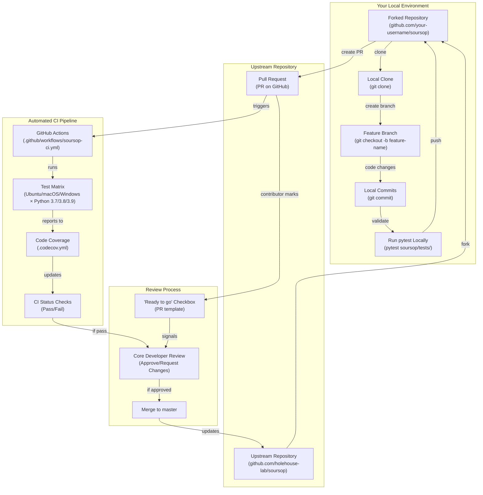
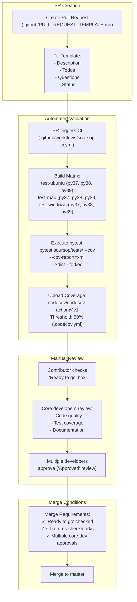

# Contributing to SOURSOP

<details>
<summary>Relevant source files</summary>

The following files were used as context for generating this wiki page:

- [.codecov.yml](.codecov.yml)
- [.github/CONTRIBUTING.md](.github/CONTRIBUTING.md)
- [.github/PULL_REQUEST_TEMPLATE.md](.github/PULL_REQUEST_TEMPLATE.md)
- [CODE_OF_CONDUCT.md](CODE_OF_CONDUCT.md)

</details>


This page explains the contribution workflow for developers who want to contribute code, documentation, or bug fixes to SOURSOP. It covers the GitHub fork-and-pull-request model, testing requirements, code review process, and community standards. For information about extending SOURSOP functionality through plugins without modifying the core codebase, see [Plugin Extension System](#8).

---

## Overview

SOURSOP welcomes external contributions through GitHub pull requests. All contributions must adhere to the Contributor Covenant Code of Conduct and pass automated testing before being merged. The Holehouse lab maintains final decision authority on accepting contributions to ensure consistency with project goals.

**Sources:** [.github/CONTRIBUTING.md:1-70](), [CODE_OF_CONDUCT.md:1-78]()

---

## Getting Started with Contributions

### Initial Setup

Before contributing, you must set up a development environment:

| Step | Action | Documentation |
|------|--------|---------------|
| 1 | Create GitHub account | [GitHub Signup](https://github.com/signup/free) |
| 2 | Fork repository | Fork `holehouse-lab/soursop` to your account |
| 3 | Clone your fork | `git clone https://github.com/<your-username>/soursop.git` |
| 4 | Install development dependencies | `pip install -e .` in your local clone |
| 5 | Verify test suite runs | `pytest soursop/tests/` |

**Best Practice:** Create feature branches for changes rather than working directly on `master`. Branch names should relate to the feature being added (e.g., `add-pka-analysis`, `fix-rg-calculation-bug`).

**Sources:** [.github/CONTRIBUTING.md:6-12]()

---

## Contribution Workflow

The following diagram shows the complete contribution lifecycle from initial fork to merge:



**Sources:** [.github/CONTRIBUTING.md:14-35]()

---

## Types of Contributions

SOURSOP categorizes contributions into two types with different requirements:

### Small Edits

Small contributions include bug fixes, typo corrections, or minor improvements that do not change core functionality.

**Requirements:**
1. Fork and clone the repository
2. Make changes on your local version
3. Ensure all tests pass: `pytest soursop/tests/`
4. Submit PR explaining:
   - What the change is
   - Why it was necessary/useful
   - How it was implemented

**Example small edits:**
- Fixing typos in docstrings or documentation
- Correcting minor calculation errors
- Updating deprecated function calls
- Improving error messages in [soursop/ssio.py]()

**Sources:** [.github/CONTRIBUTING.md:48-54]()

### New Features

Larger contributions that add functionality, modify algorithms, or change internal architecture.

**Process:**
1. **Before coding:** Consider opening a GitHub Issue to discuss the feature and ensure it aligns with project goals
2. Fork and clone (as above)
3. Create a feature branch with descriptive name
4. Implement the feature with appropriate code organization
5. Write comprehensive tests (see [Testing Infrastructure](#9.2))
6. Document the feature in SOURSOP docs (see [Documentation Building](#9.4))
7. Submit PR with detailed explanation:
   - What the feature does
   - Why it's useful
   - How it's implemented
   - Where the documentation is located
8. Be responsive to questions and review feedback

**Critical:** New features must include both tests and documentation or the PR will not be merged.

**Sources:** [.github/CONTRIBUTING.md:56-67]()

---

## Code of Conduct

SOURSOP follows the Contributor Covenant Code of Conduct v1.4. All contributors and maintainers must adhere to these standards.

### Core Principles

| Principle | Description |
|-----------|-------------|
| **Inclusivity** | Welcoming and inclusive language regardless of background, identity, or experience level |
| **Respect** | Respect differing viewpoints and experiences |
| **Constructive Feedback** | Gracefully accept constructive criticism |
| **Community Focus** | Prioritize what benefits the community over individual preferences |
| **Empathy** | Show empathy towards community members |

### Unacceptable Behavior

The following behaviors are prohibited:
- Sexualized language or unwelcome sexual attention
- Trolling, insulting comments, or personal attacks
- Public or private harassment
- Publishing private information without permission
- Other conduct inappropriate in a professional setting

### Enforcement

Violations should be reported to `alex.holehouse@wustl.edu`. The project team will investigate complaints confidentially and respond appropriately. Maintainers who violate the code may face repercussions.

**Sources:** [CODE_OF_CONDUCT.md:1-78]()

---

## Pull Request Process

The PR process follows a structured template and automated validation pipeline:



**Sources:** [.github/CONTRIBUTING.md:21-35](), [.github/PULL_REQUEST_TEMPLATE.md:1-12]()

### PR Template Structure

The `.github/PULL_REQUEST_TEMPLATE.md` provides a standard format:

```markdown
## Description
Brief description of the PR's purpose

## Todos
- [ ] TODO 1

## Questions
- [ ] Question1

## Status
- [ ] Ready to go
```

**Key Requirements:**
1. **Description:** Clear explanation of what the PR accomplishes
2. **Todos:** Checklist of tasks completed or remaining
3. **Questions:** Outstanding questions for reviewers
4. **Ready to go:** Checkbox must be checked to signal completion

**Sources:** [.github/PULL_REQUEST_TEMPLATE.md:1-12]()

---

## Testing Requirements

All contributions must maintain or improve test coverage. SOURSOP uses `pytest` with coverage reporting.

### Running Tests Locally

```bash
# Run all tests
pytest soursop/tests/

# Run with coverage report
pytest soursop/tests/ --cov=soursop --cov-report=html

# Run specific test file
pytest soursop/tests/test_ssprotein.py

# Run parallel with forked processes (matches CI)
pytest soursop/tests/ --xdist --forked
```

### Test Organization

Tests are located in `soursop/tests/` with the following structure:

| Test Category | Files | Purpose |
|---------------|-------|---------|
| Core trajectory tests | `test_sstrajectory.py` | Validate `SSTrajectory` loading and multi-chain methods |
| Core protein tests | `test_ssprotein.py` | Validate all `SSProtein` analysis methods |
| Sampling quality tests | `test_sssampling.py` | Validate PENGUIN pipeline and `SamplingQuality` |
| Utility tests | `test_sstools.py`, `test_ssutils.py` | Validate helper functions |
| Data module tests | `test_ssdata.py` | Validate amino acid mappings and EV data |
| Specialized module tests | `test_ssnmr.py`, `test_sspre.py`, etc. | Validate domain-specific analyses |

### Coverage Requirements

The `.codecov.yml` configuration sets:
- **Minimum project coverage threshold:** 50%
- **Patch coverage:** Not enforced (set to `false`)
- **Comment format:** Header only, with changes required

New features should include tests that cover:
- Normal operation (happy path)
- Edge cases (empty inputs, boundary values)
- Error conditions (invalid inputs, exceptions)
- Integration with existing classes (e.g., if adding `SSProtein` method, test with real trajectory)

**Sources:** [.github/CONTRIBUTING.md:29-30, 53, 63](), [.codecov.yml:1-14]()

---

## Documentation Requirements

New features must be documented in the SOURSOP documentation system. For details on building documentation locally, see [Documentation Building](#9.4).

### Documentation Locations

| Component | Location | Required Content |
|-----------|----------|------------------|
| Docstrings | In-code Python docstrings | Function/method signatures, parameters, returns, examples |
| API Reference | `docs/*.rst` files | Auto-generated from docstrings via Sphinx |
| User Guide | Wiki pages or `docs/` RST files | Conceptual explanations, tutorials, use cases |
| Examples | `docs/examples/` or docstrings | Working code examples demonstrating feature |

### Docstring Format

SOURSOP uses standard Python docstring format:

```python
def example_method(self, parameter1, parameter2=10):
    """
    Brief one-line description.
    
    Longer explanation of what the method does, including any
    important details about the algorithm or approach.
    
    Parameters
    ----------
    parameter1 : type
        Description of parameter1
    parameter2 : type, optional
        Description of parameter2 (default: 10)
        
    Returns
    -------
    type
        Description of return value
        
    Examples
    --------
    >>> protein = SSProtein(...)
    >>> result = protein.example_method(value1, parameter2=20)
    """
```

**Sources:** [.github/CONTRIBUTING.md:65]()

---

## Review and Approval Process

The merge process requires multiple checkpoints:

### Automated Checks

The CI pipeline (`.github/workflows/soursop-ci.yml`) automatically runs on every PR commit:

1. **Test Matrix Execution:** 9 configurations (3 OSes × 3 Python versions)
2. **Test Suite:** All tests in `soursop/tests/` with `pytest`
3. **Coverage Reporting:** Upload to Codecov with 50% threshold
4. **Status Updates:** Green checkmarks appear on PR if all pass

### Manual Review Criteria

Core developers review PRs for:

| Criterion | What Reviewers Check |
|-----------|---------------------|
| **Code Quality** | Follows Python conventions, clear variable names, appropriate abstractions |
| **Correctness** | Algorithm implementation matches intended behavior, handles edge cases |
| **Testing** | Adequate test coverage, tests pass locally and in CI |
| **Documentation** | Clear docstrings, user-facing docs updated if needed |
| **Integration** | Works with existing classes, doesn't break backward compatibility |
| **Performance** | No obvious performance regressions, considers memory usage |

### Merge Conditions

A PR is merged when **all** of the following are true:

1. ✅ The "Ready to go" checkbox is checked by the contributor
2. ✅ All CI checks pass (green checkmarks on PR page)
3. ✅ Multiple core developers have given "Approved" reviews
4. ✅ No outstanding questions or requested changes

### Decision Authority

The Holehouse lab reserves the right to decline proposed features or bug fixes. If a contribution is declined, a cogent and logical explanation will be provided. This ensures SOURSOP maintains consistency with its goals for analyzing intrinsically disordered proteins.

**Sources:** [.github/CONTRIBUTING.md:31-35, 69](), [CODE_OF_CONDUCT.md:42-46]()

---

## Summary Table: Contribution Checklist

Use this checklist to ensure your contribution meets all requirements:

| Stage | Small Edit | New Feature |
|-------|-----------|-------------|
| **Planning** | - | ✓ Consider opening Issue first |
| **Setup** | ✓ Fork and clone | ✓ Fork and clone |
| | ✓ Create feature branch | ✓ Create feature branch |
| **Implementation** | ✓ Make changes | ✓ Implement feature |
| | - | ✓ Add comprehensive tests |
| | - | ✓ Write documentation |
| **Validation** | ✓ Run `pytest soursop/tests/` | ✓ Run `pytest soursop/tests/` |
| | ✓ All tests pass | ✓ All tests pass |
| | - | ✓ Check coverage adequate |
| **PR Submission** | ✓ Complete PR template | ✓ Complete PR template |
| | ✓ Explain what, why, how | ✓ Explain what, why, how, where docs |
| **Review** | ✓ Check "Ready to go" | ✓ Check "Ready to go" |
| | ✓ Respond to feedback | ✓ Respond to feedback |
| | ✓ Wait for CI pass | ✓ Wait for CI pass |
| | ✓ Wait for approval | ✓ Wait for approval |

**Sources:** [.github/CONTRIBUTING.md:48-67]()

---