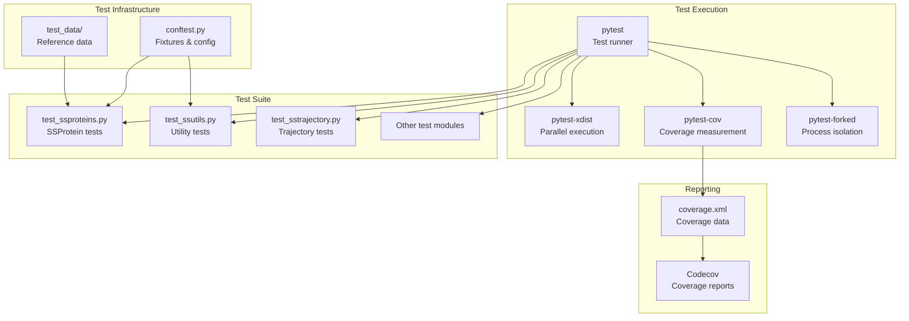
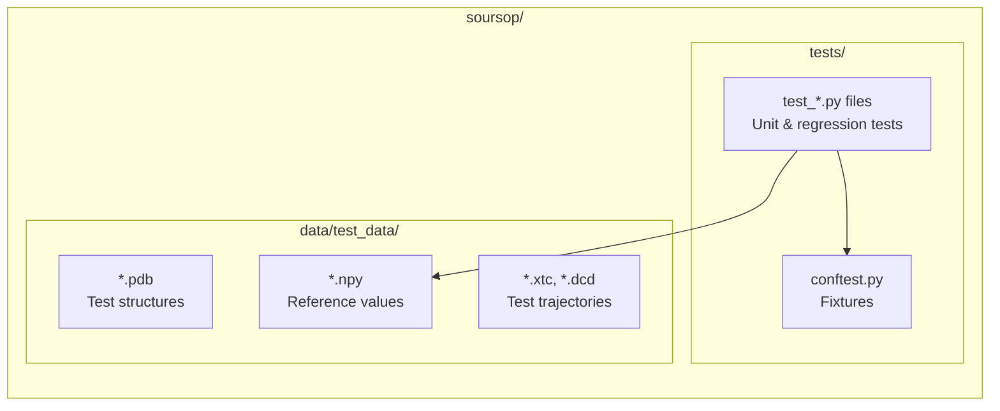
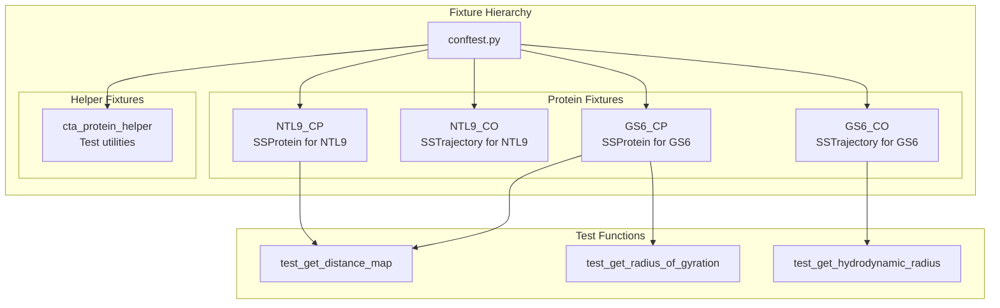
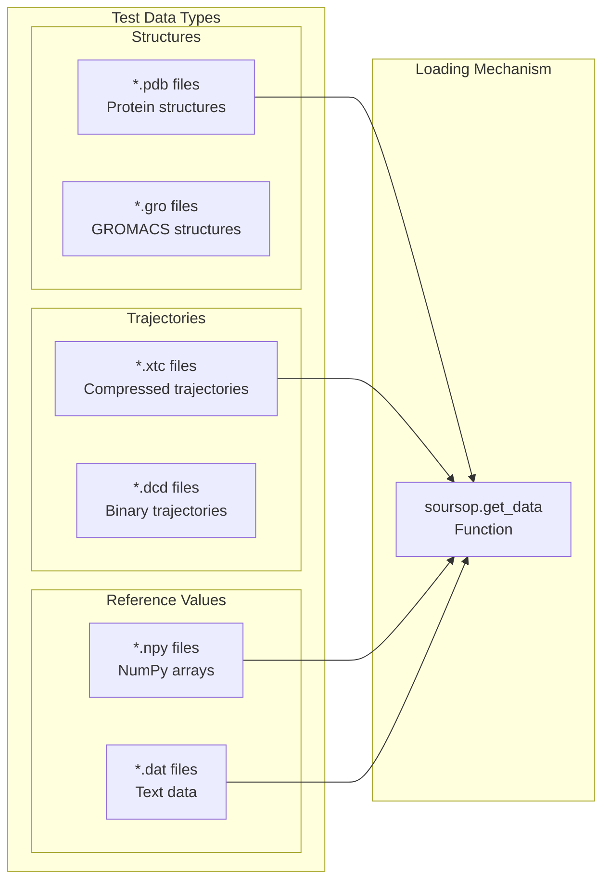
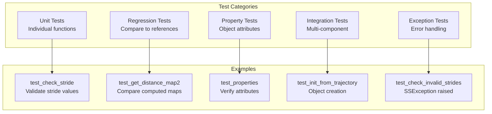
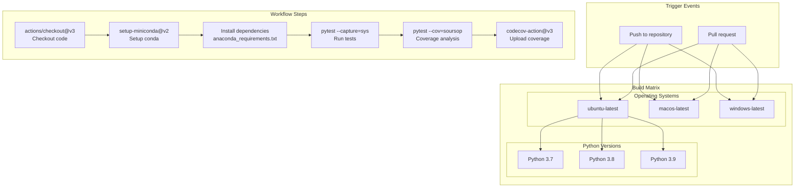

# Testing Infrastructure

<details>
<summary>Relevant source files</summary>

The following files were used as context for generating this wiki page:

- [.github/workflows/soursop-ci.yml](.github/workflows/soursop-ci.yml)
- [soursop/data/test_data/gs6_distance_map_mean.npy](soursop/data/test_data/gs6_distance_map_mean.npy)
- [soursop/data/test_data/gs6_distance_map_std.npy](soursop/data/test_data/gs6_distance_map_std.npy)
- [soursop/ssutils.py](soursop/ssutils.py)
- [soursop/tests/test_ssproteins.py](soursop/tests/test_ssproteins.py)
- [soursop/tests/test_ssutils.py](soursop/tests/test_ssutils.py)

</details>


This document describes SOURSOP's testing infrastructure, including the test framework, test suite organization, test data management, and continuous integration pipeline. For information about contributing code changes that require new tests, see [Contributing to SOURSOP](#9.1). For details about the CI/CD pipeline configuration, see [Continuous Integration](#9.3).

## Overview

SOURSOP uses `pytest` as its primary testing framework, with a comprehensive test suite covering unit tests, regression tests, and integration tests across multiple operating systems and Python versions. The testing infrastructure includes:

- **Test Framework**: pytest with plugins for parallel execution, coverage reporting, and process isolation
- **Test Matrix**: 9 configurations (3 operating systems × 3 Python versions)
- **Test Organization**: Module-specific test files with shared fixtures and reference data
- **CI/CD**: GitHub Actions for automated testing on every push and pull request
- **Coverage Tracking**: Codecov integration for monitoring test coverage

Sources: [.github/workflows/soursop-ci.yml:1-70]()

## Test Framework and Tools

### Core Testing Stack

SOURSOP's testing stack consists of several integrated tools:



**pytest Configuration and Plugins**

The test suite uses several pytest plugins invoked via command-line arguments:

- `--cov=soursop`: Measures code coverage for the soursop package
- `--cov-report=xml`: Generates XML coverage reports for Codecov
- `-n auto`: Enables parallel test execution using all available CPU cores
- `--capture=sys`: Captures stdout/stderr for cleaner test output

Sources: [.github/workflows/soursop-ci.yml:46-57]()

### Test Execution Modes

Tests can be run in multiple modes:

| Mode | Command | Purpose |
|------|---------|---------|
| **Standard** | `python -m pytest --capture=sys` | Basic test execution with output capture |
| **Parallel** | `python -m pytest -n auto` | Parallel execution across CPU cores |
| **Coverage** | `python -m pytest --cov=soursop --cov-report=xml` | Test with coverage measurement |
| **Module-specific** | `python -m pytest soursop/tests/test_ssproteins.py` | Run specific test file |
| **Function-specific** | `python -m pytest soursop/tests/test_ssproteins.py::test_get_distance_map` | Run single test |

Sources: [.github/workflows/soursop-ci.yml:46-57]()

## Test Suite Organization

### Directory Structure



Sources: [soursop/tests/test_ssproteins.py:1-10](), [soursop/data/test_data/gs6_distance_map_mean.npy:1-2]()

### Test File Naming Convention

Test files follow the pattern `test_<module>.py`, where `<module>` corresponds to the source module being tested:

| Source Module | Test File | Lines | Focus Area |
|---------------|-----------|-------|------------|
| `ssprotein.py` | `test_ssproteins.py` | ~1800+ | SSProtein class methods |
| `sstrajectory.py` | `test_sstrajectory.py` | - | Trajectory loading |
| `ssutils.py` | `test_ssutils.py` | 39 | Utility functions |
| `sssampling.py` | `test_sssampling.py` | - | Sampling quality |

Sources: [soursop/tests/test_ssproteins.py:1-3](), [soursop/tests/test_ssutils.py:1-3]()

## Test Data and Fixtures

### Test Fixtures via conftest.py

SOURSOP uses pytest fixtures defined in `conftest.py` to provide reusable test objects. Common fixtures include:



**Fixture Usage Example**

Tests reference fixtures by name in their function signatures:

```python
def test_get_distance_map(GS6_CO):
    # GS6_CO fixture provides an SSTrajectory object
    distance_map, stddev_map = GS6_CO.proteinTrajectoryList[0].get_distance_map()
```

Sources: [soursop/tests/test_ssproteins.py:202-210](), [soursop/tests/test_ssproteins.py:298-311]()

### Reference Data Files

Test data is stored in `soursop/data/test_data/` as NumPy arrays and structure files:



**Reference Data Usage**

Tests load reference data using `soursop.get_data()`:

```python
# Load expected values
test_data_mean = np.load(soursop.get_data('test_data/ntl9_distance_map_mean.npy'))
test_data_std = np.load(soursop.get_data('test_data/ntl9_distance_map_std.npy'))

# Compare computed vs reference
assert np.allclose(test_data_mean, distance_map, atol=1e-4, rtol=1e-5)
```

Sources: [soursop/tests/test_ssproteins.py:215-223](), [soursop/tests/test_ssproteins.py:234-242]()

### Reference Data Files for Regression Testing

Specific reference data files store expected computational results:

| File | Purpose | Shape |
|------|---------|-------|
| `ntl9_distance_map_mean.npy` | Expected mean distance map for NTL9 | (n_residues, n_residues) |
| `ntl9_distance_map_std.npy` | Expected std dev distance map for NTL9 | (n_residues, n_residues) |
| `gs6_distance_map_mean.npy` | Expected mean distance map for GS6 | (6, 6) |
| `gs6_distance_map_std.npy` | Expected std dev distance map for GS6 | (6, 6) |
| `bbseg2.dat` | BBSEG2 secondary structure reference | Text format |

Sources: [soursop/tests/test_ssproteins.py:185-198](), [soursop/data/test_data/gs6_distance_map_mean.npy:1-2](), [soursop/data/test_data/gs6_distance_map_std.npy:1-2]()

## Test Categories and Patterns

### Test Types

SOURSOP's test suite includes several categories of tests:



Sources: [soursop/tests/test_ssproteins.py:1-3]()

### Unit Tests: Function Validation

Unit tests verify individual methods work correctly with various inputs:

**Example: Testing stride validation**

```python
def test_check_invalid_strides(GS6_CP, NTL9_CP):
    strides = [-1, 0, 100]  # Invalid values
    proteins = [GS6_CP, NTL9_CP]
    for protein in proteins:
        for stride in strides:
            with pytest.raises(SSException):
                protein._SSProtein__check_stride(stride)
```

Sources: [soursop/tests/test_ssproteins.py:461-467]()

### Regression Tests: Numerical Accuracy

Regression tests compare computed values against reference data to ensure numerical stability:

**Example: Distance map regression test**

```python
def test_get_distance_map2(NTL9_CP):
    # Load reference data
    test_data_mean = np.load(soursop.get_data('test_data/ntl9_distance_map_mean.npy'))
    test_data_std = np.load(soursop.get_data('test_data/ntl9_distance_map_std.npy'))
    
    # Calculate map
    distance_map, stddev_map = NTL9_CP.get_distance_map()
    
    # Verify within tolerance
    assert np.allclose(test_data_mean, distance_map, atol=1e-4, rtol=1e-5)
    assert np.allclose(test_data_std, stddev_map, atol=1e-4, rtol=1e-5)
```

Sources: [soursop/tests/test_ssproteins.py:212-224]()

### Property Tests: Object State

Property tests verify that object attributes have expected values:

**Example: Testing SSProtein properties**

```python
def test_properties(GS6_CO, NTL9_CO, GS6_CP, NTL9_CP):
    properties = 'resid_with_CA,ncap,ccap,n_frames,n_residues,residue_index_list'.split(',')
    trajs = [GS6_CO, NTL9_CO]
    proteins = [GS6_CP, NTL9_CP]
    for ct_traj, ct_protein in zip(trajs, proteins):
        protein_from_ct = ssprotein.SSProtein(ct_traj)
        for prop in properties:
            assert getattr(protein_from_ct, prop) == getattr(ct_protein, prop)
```

Sources: [soursop/tests/test_ssproteins.py:335-344]()

### Exception Tests: Error Handling

Exception tests verify that appropriate exceptions are raised for invalid inputs:

**Example: Testing invalid weights**

```python
def test_check_weights_invalid_weights_type(GS6_CP, NTL9_CP):
    proteins = [GS6_CP, NTL9_CP]
    for protein in proteins:
        weights = 'abcdefgh'  # Invalid type
        with pytest.raises(ValueError):
            protein._SSProtein__check_weights(weights=weights)
```

Sources: [soursop/tests/test_ssproteins.py:363-368]()

### Code Coverage Tests

Special tests ensure comprehensive code coverage by exercising multiple code paths:

**Example: Comprehensive method coverage**

```python
def test_code_coverage(NTL9_CP):
    # Test various parameter combinations
    a = NTL9_CP.get_distance_map()
    a = NTL9_CP.get_distance_map(verbose=True)
    a = NTL9_CP.get_distance_map(verbose=False)
    a = NTL9_CP.get_distance_map(verbose=True, mode='COM')
    a = NTL9_CP.get_distance_map(verbose=False, mode='CA')
    a = NTL9_CP.get_distance_map(verbose=False, mode='COM', RMS=True)
    # ... more combinations
```

Sources: [soursop/tests/test_ssproteins.py:26-66]()

## Running Tests Locally

### Basic Test Execution

To run the complete test suite locally:

```bash
# Run all tests
python -m pytest

# Run with output capture
python -m pytest --capture=sys

# Run specific test file
python -m pytest soursop/tests/test_ssproteins.py

# Run specific test function
python -m pytest soursop/tests/test_ssproteins.py::test_get_distance_map
```

### Parallel Execution

For faster test execution, use parallel mode:

```bash
# Use all available cores
python -m pytest -n auto

# Use specific number of cores
python -m pytest -n 4
```

Sources: [.github/workflows/soursop-ci.yml:46-57]()

### Coverage Analysis

To generate coverage reports:

```bash
# Run tests with coverage
python -m pytest --cov=soursop --cov-report=xml

# Generate HTML report
python -m pytest --cov=soursop --cov-report=html

# View coverage in terminal
python -m pytest --cov=soursop --cov-report=term
```

The coverage report shows which lines of code are executed during tests.

Sources: [.github/workflows/soursop-ci.yml:53-57]()

### Debugging Failing Tests

For debugging individual tests:

```bash
# Run with verbose output
python -m pytest -v

# Show print statements
python -m pytest -s

# Stop on first failure
python -m pytest -x

# Drop into debugger on failure
python -m pytest --pdb
```

## CI/CD Pipeline

### GitHub Actions Workflow

The CI pipeline is defined in `.github/workflows/soursop-ci.yml`:



Sources: [.github/workflows/soursop-ci.yml:1-70]()

### Test Matrix Configuration

The CI pipeline tests across 9 configurations:

| OS | Python 3.7 | Python 3.8 | Python 3.9 |
|----|------------|------------|------------|
| **Ubuntu** | ✓ | ✓ | ✓ |
| **macOS** | ✓ | ✓ | ✓ |
| **Windows** | ✓ | ✓ | ✓ |

Each configuration runs the complete test suite independently.

Sources: [.github/workflows/soursop-ci.yml:6-10]()

### CI Workflow Steps

The CI pipeline executes the following steps for each configuration:

**1. Checkout Code**
```yaml
- uses: actions/checkout@v3
```

**2. Setup Miniconda**
```yaml
- name: Set up Python ${{ matrix.python-version }}
  uses: conda-incubator/setup-miniconda@v2
  with:
    miniconda-version: "latest"
    auto-update-conda: true
    python-version: ${{ matrix.python-version }}
```

**3. Install Dependencies**
```yaml
- name: Install Python dependencies
  shell: bash -l {0}
  run: |
    conda activate test
    conda install --file anaconda_requirements.txt --channel default --channel anaconda --channel conda-forge
```

**4. Run Tests**
```yaml
- name: Test with pytest
  shell: bash -l {0}
  run: |
    conda activate test
    python -m pytest --capture=sys
```

**5. Generate Coverage**
```yaml
- name: Perform code coverage test
  shell: bash -l {0}
  run: |
    conda activate test
    python -m pytest --cov=soursop --cov-report=xml -n auto
```

**6. Upload Coverage**
```yaml
- name: Upload coverage reports to Codecov
  uses: codecov/codecov-action@v3
  with:
    token: ${{ secrets.CODECOV_TOKEN }}
    files: ./coverage.xml
```

Sources: [.github/workflows/soursop-ci.yml:15-70]()

### Coverage Reporting

Coverage data is uploaded to Codecov with the following configuration:

| Parameter | Value | Purpose |
|-----------|-------|---------|
| `flags` | `unittests` | Categorizes coverage type |
| `env_vars` | `OS,PYTHON` | Tracks OS/Python version |
| `fail_ci_if_error` | `true` | Fails CI if upload fails |
| `files` | `./coverage.xml` | Coverage data file |
| `verbose` | `true` | Detailed logging |

Sources: [.github/workflows/soursop-ci.yml:59-69]()

## Test Utilities

### Thread Control Testing

The `test_ssutils.py` module tests thread control utilities:

**Testing `set_numpy_threads()`**

```python
def test_set_numpy_threads():
    num_threads = 2
    set_threads, blas_library = ssutils.set_numpy_threads(num_threads)
    assert blas_library != 'unknown'
    assert set_threads == num_threads
```

This test verifies that:
- Thread setting succeeds across different BLAS implementations (MKL, OpenBLAS)
- The library is correctly identified
- The requested number of threads is actually set

Sources: [soursop/tests/test_ssutils.py:15-19](), [soursop/ssutils.py:137-151]()

### Keyword Validation Testing

Tests for the `validate_keyword_option()` function verify argument validation:

**Testing valid and invalid keywords**

```python
def test_validate_keyword_option():
    allowed_modes = ['COM', 'CA']
    
    # Valid keywords should pass
    for mode in allowed_modes:
        ssutils.validate_keyword_option(mode, allowed_modes, 'mode')
    
    # Invalid keyword should raise SSException
    with pytest.raises(SSException):
        ssutils.validate_keyword_option('invalid_mode', allowed_modes, 'mode')
```

Sources: [soursop/tests/test_ssutils.py:22-38](), [soursop/ssutils.py:154-194]()

## Writing New Tests

### Test Function Naming

Follow these conventions when writing new tests:

| Pattern | Example | Purpose |
|---------|---------|---------|
| `test_<function_name>` | `test_get_distance_map` | Test specific function |
| `test_<function_name>_<variant>` | `test_get_distance_map2` | Alternative test scenario |
| `test_<function_name>_invalid_<param>` | `test_check_invalid_strides` | Test error handling |
| `test_<class>_<feature>` | `test_DSSP` | Test class functionality |

### Assertion Patterns

Common assertion patterns in the test suite:

**Numerical Comparison**
```python
# Exact equality
assert value == expected_value

# Floating point tolerance
assert abs(computed - expected) < 0.0001
assert np.isclose(computed, expected)
assert np.allclose(array1, array2, atol=1e-4, rtol=1e-5)
```

**Shape Validation**
```python
assert distance_map.shape == (n_residues, n_residues)
assert len(result) == expected_length
```

**Exception Testing**
```python
with pytest.raises(SSException):
    invalid_function_call()
```

Sources: [soursop/tests/test_ssproteins.py:126-128](), [soursop/tests/test_ssproteins.py:222-223](), [soursop/tests/test_ssproteins.py:461-467]()

### Using Fixtures

To use existing fixtures in new tests:

```python
def test_new_feature(GS6_CP, NTL9_CP):
    """Test a new feature on both test proteins."""
    proteins = [GS6_CP, NTL9_CP]
    for protein in proteins:
        result = protein.new_method()
        assert result is not None
```

### Adding Reference Data

To add new reference data:

1. Generate expected output using a validated implementation
2. Save to `soursop/data/test_data/` with descriptive name
3. Use `.npy` format for NumPy arrays: `np.save('reference.npy', data)`
4. Load in tests: `expected = np.load(soursop.get_data('test_data/reference.npy'))`

Sources: [soursop/tests/test_ssproteins.py:215-223]()

---