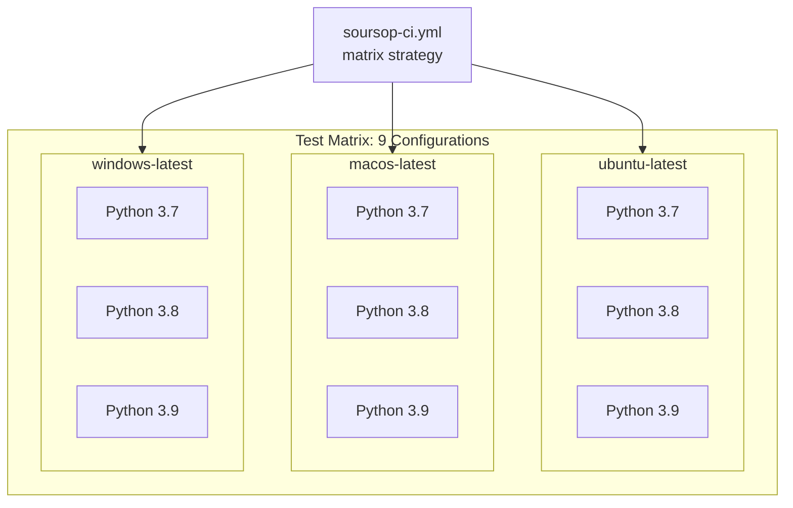
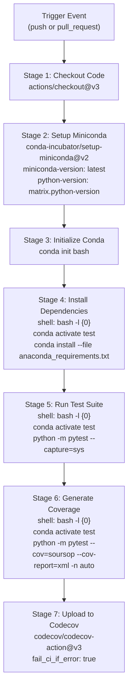
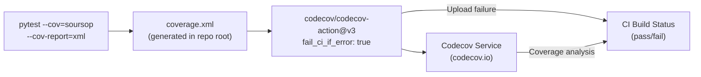
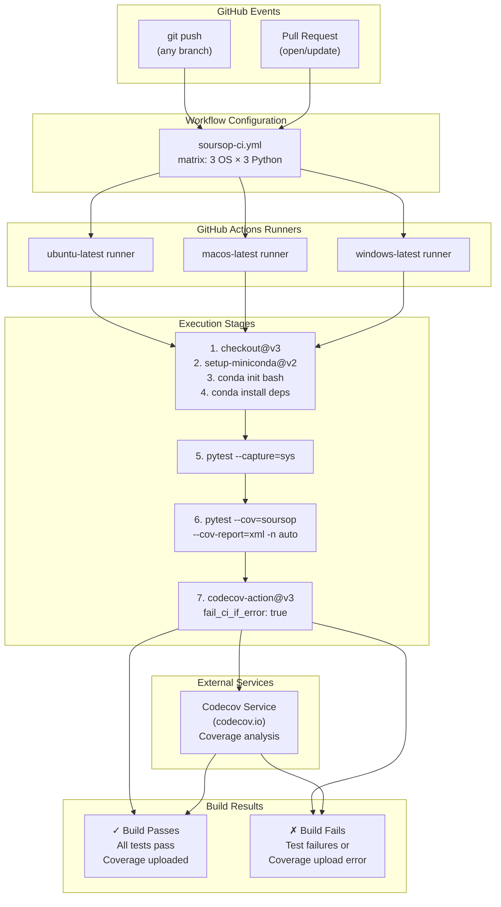

# Continuous Integration

<details>
<summary>Relevant source files</summary>

The following files were used as context for generating this wiki page:

- [.github/workflows/soursop-ci.yml](.github/workflows/soursop-ci.yml)
- [soursop/ssutils.py](soursop/ssutils.py)
- [soursop/tests/test_ssutils.py](soursop/tests/test_ssutils.py)

</details>


This page documents SOURSOP's continuous integration and continuous deployment (CI/CD) infrastructure. The CI system ensures code quality by automatically running the full test suite across multiple platforms and Python versions on every code change.

**Scope**: This page covers the GitHub Actions workflow configuration, test matrix, coverage reporting, and cross-platform execution strategy. For information about the test suite itself, see [Testing Infrastructure](#9.2). For documentation building automation, see [Documentation Building](#9.4). For release automation, see [Packaging and Release](#9.5).

## Overview

SOURSOP uses GitHub Actions to provide automated testing on every push and pull request. The CI pipeline validates code across 9 different configurations (3 operating systems × 3 Python versions) and enforces code coverage standards through Codecov integration.

**Sources**: [.github/workflows/soursop-ci.yml:1-70]()

---

## GitHub Actions Workflow

The CI configuration is defined in a single workflow file that orchestrates all testing activities. The workflow is triggered automatically on repository events and uses a matrix strategy to parallelize testing across multiple environments.

### Workflow Definition

| Property | Value |
|----------|-------|
| **Workflow Name** | `Soursop CI` |
| **Trigger Events** | `push`, `pull_request` |
| **Configuration File** | `.github/workflows/soursop-ci.yml` |
| **Job Name** | `build` |
| **Parallelization** | Matrix-based (9 configurations) |

**Sources**: [.github/workflows/soursop-ci.yml:1-4]()

### Trigger Conditions

The workflow executes on two event types:

- **Push events**: Any push to any branch triggers the full test suite
- **Pull request events**: Opening, updating, or reopening a pull request triggers testing

This ensures that both direct commits and proposed changes are validated before integration.

**Sources**: [.github/workflows/soursop-ci.yml:2]()

---

## Test Matrix Configuration

The CI system tests SOURSOP across a comprehensive matrix of operating systems and Python versions to ensure broad compatibility.



**Test Matrix: Platform and Python Version Combinations**

### Supported Platforms

| Operating System | GitHub Runner | Purpose |
|-----------------|---------------|---------|
| `ubuntu-latest` | Ubuntu Linux | Primary development/deployment platform |
| `macos-latest` | macOS | Apple Silicon/Intel Mac support |
| `windows-latest` | Windows Server | Windows user support |

### Supported Python Versions

The CI system tests against Python 3.7, 3.8, and 3.9 based on active support status referenced from https://endoflife.date/python. Python 3.10+ support is noted as requiring additional Conda compatibility work.

**Sources**: [.github/workflows/soursop-ci.yml:6-10]()

---

## Pipeline Stages

The CI pipeline executes in six sequential stages, each building on the previous stage's setup. The workflow uses explicit shell configuration to ensure consistent behavior across operating systems.



**CI Pipeline Stages and Data Flow**

### Stage 1: Code Checkout

The pipeline begins by checking out the repository code using `actions/checkout@v3`. This action is critical for Conda-based workflows, as noted in the configuration comments.

**Sources**: [.github/workflows/soursop-ci.yml:13-15]()

### Stage 2: Conda Environment Setup

The workflow uses `conda-incubator/setup-miniconda@v2` to establish a Conda environment:

- **Miniconda version**: `latest` (explicitly specified to ensure availability)
- **Auto-update**: Enabled via `auto-update-conda: true`
- **Python version**: Dynamically selected from matrix configuration

This approach was updated in July 2024 to ensure Miniconda installation reliability.

**Sources**: [.github/workflows/soursop-ci.yml:17-23]()

### Stage 3: Conda Initialization

The workflow explicitly runs `conda init bash` to configure the shell environment. This step is necessary because subsequent steps use bash login shells (`bash -l {0}`).

**Sources**: [.github/workflows/soursop-ci.yml:25-27]()

### Stage 4: Dependency Installation

Dependencies are installed using `anaconda_requirements.txt` rather than a traditional `requirements.txt`. This approach allows the Conda solver to determine appropriate package versions based on Python version and library compatibility:

```bash
conda activate test
conda install --file anaconda_requirements.txt \
  --channel default \
  --channel anaconda \
  --channel conda-forge
```

The workflow searches three Conda channels in order: `default`, `anaconda`, `conda-forge`.

**Sources**: [.github/workflows/soursop-ci.yml:29-44]()

### Stage 5: Test Execution

The test suite is executed with basic output capture:

```bash
conda activate test
python -m pytest --capture=sys
```

The `--capture=sys` flag redirects stdout/stderr to pytest's capture mechanism for cleaner test output.

**Sources**: [.github/workflows/soursop-ci.yml:46-50]()

### Stage 6: Coverage Generation

A second pytest run generates code coverage data with parallel execution:

```bash
conda activate test
python -m pytest --cov=soursop --cov-report=xml -n auto
```

| Flag | Purpose |
|------|---------|
| `--cov=soursop` | Measure coverage for the `soursop` package |
| `--cov-report=xml` | Generate XML coverage report for Codecov |
| `-n auto` | Run tests in parallel using pytest-xdist (auto-detect CPU count) |

The XML report is written to `./coverage.xml` in the repository root.

**Sources**: [.github/workflows/soursop-ci.yml:52-57]()

### Stage 7: Codecov Upload

Coverage results are uploaded to Codecov using `codecov/codecov-action@v3`:

| Configuration | Value | Purpose |
|--------------|-------|---------|
| `token` | `secrets.CODECOV_TOKEN` | Authentication for Codecov API |
| `name` | `codecov-umbrella` | Identifier for this upload |
| `flags` | `unittests` | Tag coverage as from unit tests |
| `env_vars` | `OS,PYTHON` | Include OS and Python version in report |
| `fail_ci_if_error` | `true` | **Fail build if upload fails** |
| `files` | `./coverage.xml` | Coverage data file |
| `verbose` | `true` | Detailed logging |
| `path_to_write_report` | `codecov_report.txt` | Local report artifact |

The `fail_ci_if_error: true` setting is critical—it ensures that coverage reporting failures cause CI failure, preventing merges with incomplete coverage data.

**Sources**: [.github/workflows/soursop-ci.yml:59-69]()

---

## Cross-Platform Shell Configuration

SOURSOP's CI workflow uses a specialized shell configuration strategy to ensure consistent behavior across Linux, macOS, and Windows platforms.

### The Login Shell Pattern

All steps after Conda initialization use the shell specification:

```yaml
shell: bash -l {0}
```

This configuration solves a cross-platform compatibility issue:

1. **Problem**: `conda init bash` updates different files on different operating systems:
   - Linux: Updates `~/.bashrc`
   - macOS: Updates `~/.bash_profile`
   - Windows: Updates appropriate configuration for bash emulation

2. **Solution**: The `-l` flag forces a **login shell**, which automatically sources the appropriate Conda initialization script regardless of OS.

3. **Benefit**: Eliminates need for OS-specific sourcing logic in the workflow.

**Sources**: [.github/workflows/soursop-ci.yml:33-39](), [.github/workflows/soursop-ci.yml:41](), [.github/workflows/soursop-ci.yml:47](), [.github/workflows/soursop-ci.yml:54]()

### Why Bash on All Platforms

The workflow uses `bash` even on Windows for consistency:

- **Windows compatibility**: Modern GitHub Actions Windows runners support bash
- **Unified commands**: Same commands work on all platforms
- **Conda compatibility**: Conda works reliably with bash across platforms

**Sources**: [.github/workflows/soursop-ci.yml:33-39]()

---

## Code Coverage Requirements

### Coverage Metrics

The CI system tracks coverage for the entire `soursop` package and enforces quality standards through Codecov integration.

### Coverage Reporting Configuration



**Coverage Data Flow from Test Execution to Build Status**

### Failure Conditions

The CI build fails under these conditions:

1. **Test failures**: Any test in the suite fails (standard pytest behavior)
2. **Coverage upload failure**: The `fail_ci_if_error: true` setting causes build failure if coverage cannot be uploaded to Codecov
3. **Coverage degradation**: Codecov may be configured (via Codecov dashboard settings, not shown in workflow) to fail builds when coverage decreases

### Coverage Report Artifacts

The workflow generates multiple coverage artifacts:

| Artifact | Location | Purpose |
|----------|----------|---------|
| `coverage.xml` | Repository root | Machine-readable coverage data for Codecov |
| `codecov_report.txt` | Repository root | Human-readable upload report |

**Sources**: [.github/workflows/soursop-ci.yml:53-69]()

---

## Testing Thread Control

SOURSOP includes functionality for controlling NumPy threading behavior, which is tested as part of the CI pipeline. The `ssutils.set_numpy_threads()` function manages BLAS library threading across different platforms.

### Thread Control Testing

The test suite validates thread control on all platforms:

```python
# From test_ssutils.py
def test_set_numpy_threads():
    num_threads = 2
    set_threads, blas_library = ssutils.set_numpy_threads(num_threads)
    assert blas_library != 'unknown'
    assert set_threads == num_threads
```

This test ensures:
- Thread control works on the CI platform
- The BLAS library is properly detected (MKL or OpenBLAS)
- Thread limits can be successfully set

### Platform-Specific Behavior

The `set_numpy_threads()` function handles platform differences:

| Platform | BLAS Library | Detection Method |
|----------|-------------|------------------|
| Windows | MKL | Uses `mkl` package directly |
| Linux | OpenBLAS or MKL | Searches virtual environment for library files |
| macOS | OpenBLAS or MKL | Searches virtual environment (`.dylib` or `.so`) |

**Sources**: [soursop/ssutils.py:137-151](), [soursop/tests/test_ssutils.py:15-19]()

---

## CI Workflow Architecture Summary



**Complete CI Workflow Architecture: From Trigger to Result**

**Sources**: [.github/workflows/soursop-ci.yml:1-70]()

---