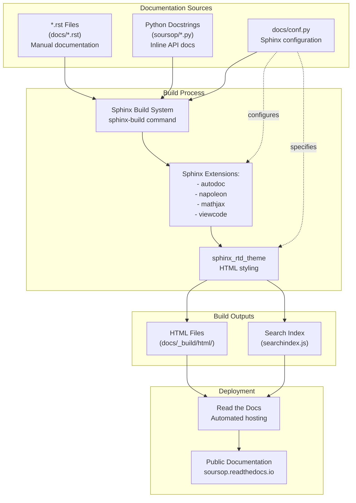
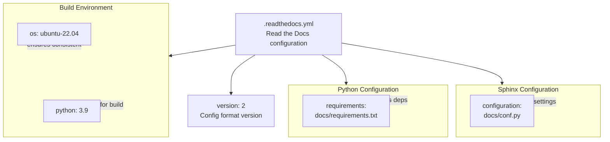
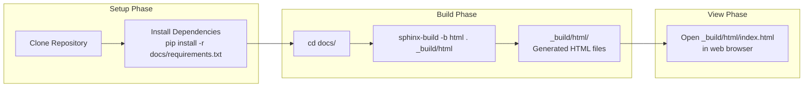

# Documentation Building

<details>
<summary>Relevant source files</summary>

The following files were used as context for generating this wiki page:

- [.readthedocs.yml](.readthedocs.yml)
- [devtools/conda-envs/test_env_nomdtraj.yaml](devtools/conda-envs/test_env_nomdtraj.yaml)
- [docs/conf.py](docs/conf.py)
- [docs/requirements.txt](docs/requirements.txt)
- [pyproject.toml](pyproject.toml)

</details>


## Purpose and Scope

This page explains the Sphinx-based documentation system used by SOURSOP, including the Read the Docs integration, Sphinx configuration, and procedures for building documentation locally. This covers the technical infrastructure for generating API documentation and user guides from reStructuredText (`.rst`) files and inline docstrings.

For information about contributing documentation content or writing docstrings, see [Contributing to SOURSOP](#9.1). For the full CI/CD pipeline that includes documentation building as part of automated testing, see [Continuous Integration](#9.3).

---

## Documentation System Overview

SOURSOP uses **Sphinx** as its documentation generation system, with **Read the Docs** providing automated hosting and continuous deployment. The documentation is written primarily in reStructuredText format and includes both manually-written guides and auto-generated API documentation extracted from Python docstrings.

### Documentation Technology Stack

| Component | Technology | Purpose |
|-----------|-----------|---------|
| **Documentation Generator** | Sphinx | Processes `.rst` files and docstrings into HTML/PDF |
| **Theme** | `sphinx_rtd_theme` | Provides Read the Docs visual styling |
| **Hosting Platform** | Read the Docs | Automated building and hosting at readthedocs.io |
| **API Documentation** | `sphinx.ext.autodoc` | Extracts docstrings from Python code |
| **Math Rendering** | `sphinx.ext.mathjax` | Renders mathematical equations |
| **Docstring Format** | Napoleon (Google/NumPy style) | Parses structured docstrings |

**Sources:** [docs/conf.py:60-66](), [docs/requirements.txt:1-4](), [.readthedocs.yml:16-18]()

---

## Documentation Build Pipeline



**Diagram: Documentation Build and Deployment Pipeline**

The build process follows a linear flow: source files (`.rst` and Python docstrings) are processed by Sphinx using configured extensions, styled with the RTD theme, and output as HTML files. On Read the Docs, this happens automatically on each commit; locally, developers run the build manually.

**Sources:** [docs/conf.py:1-191](), [.readthedocs.yml:1-18]()

---

## Sphinx Configuration

The primary Sphinx configuration resides in `docs/conf.py`, which defines project metadata, extensions, theme settings, and build options.

### Project Metadata

[docs/conf.py:23-32]() defines the project information displayed in the documentation:

```python
project = 'soursop'
copyright = "2015-2023, Alex Holehouse, Jared Lalmansingh [a MOLSSI sponsored project]"
author = 'Alex Holehouse'
```

The `version` and `release` fields are intentionally left empty, allowing version information to be dynamically generated by `versioningit` during the build process.

### Sphinx Extensions

[docs/conf.py:60-66]() configures the following extensions:

| Extension | Purpose |
|-----------|---------|
| `sphinx.ext.autodoc` | Automatically extracts docstrings from Python modules |
| `sphinx.ext.napoleon` | Parses Google-style and NumPy-style docstrings |
| `sphinx.ext.mathjax` | Renders LaTeX mathematical expressions |
| `sphinx.ext.viewcode` | Adds links to highlighted source code |

### Autodoc Configuration

[docs/conf.py:42-55]() configures automatic documentation generation:

```python
autodoc_default_options = {
    'private-members': True,
}

autodoc_mock_imports = ["mdtraj", "threadpoolctl", "natsort", "matplotlib", "pandas"]

autosummary_generate = True
```

The `autodoc_mock_imports` setting is critical for building documentation in environments where heavy dependencies (like `mdtraj`) are not available. This allows Read the Docs to build documentation without installing the full scientific computing stack.

### Theme Configuration

[docs/conf.py:109]() specifies the visual theme:

```python
html_theme = 'sphinx_rtd_theme'
```

This provides the standard Read the Docs appearance with responsive navigation, search functionality, and mobile support.

**Sources:** [docs/conf.py:19-191]()

---

## Read the Docs Integration

Read the Docs provides automated documentation building and hosting triggered by GitHub commits. Configuration is specified in `.readthedocs.yml`.

### Read the Docs Configuration File



**Diagram: Read the Docs Configuration Structure**

**Sources:** [.readthedocs.yml:1-18]()

### Configuration Details

[.readthedocs.yml:3]() specifies format version 2, which provides enhanced build configuration options.

[.readthedocs.yml:11-14]() defines the build environment:
- **Operating System:** Ubuntu 22.04 LTS
- **Python Version:** 3.9

[.readthedocs.yml:7-8]() specifies the Python dependencies file:
```yaml
python:
  install:
    - requirements: docs/requirements.txt
```

[.readthedocs.yml:17-18]() points to the Sphinx configuration:
```yaml
sphinx:
  configuration: docs/conf.py
```

### Documentation Dependencies

[docs/requirements.txt:1-4]() lists the minimal dependencies needed to build documentation:

| Package | Purpose |
|---------|---------|
| `sphinx_rtd_theme` | Read the Docs HTML theme |
| `numpy` | Required for parsing some docstrings |
| `scipy` | Required for parsing some docstrings |
| `versioningit` | Dynamic version string generation |

Note that `mdtraj` and other heavy dependencies are **not** included here because they are mocked via `autodoc_mock_imports` in `docs/conf.py`. This significantly reduces build time on Read the Docs.

**Sources:** [.readthedocs.yml:1-18](), [docs/requirements.txt:1-4]()

---

## Building Documentation Locally

Developers can build documentation locally to preview changes before pushing to GitHub.

### Local Build Workflow



**Diagram: Local Documentation Build Workflow**

### Step-by-Step Build Instructions

#### 1. Install Documentation Dependencies

```bash
# From repository root
pip install -r docs/requirements.txt
```

This installs Sphinx, the RTD theme, and other required packages.

#### 2. Navigate to Documentation Directory

```bash
cd docs/
```

#### 3. Run Sphinx Build

```bash
# Build HTML documentation
sphinx-build -b html . _build/html
```

Common build options:

| Option | Effect |
|--------|--------|
| `-b html` | Build HTML output (default) |
| `-b latex` | Build LaTeX output for PDF generation |
| `-a` | Rebuild all files (ignore cache) |
| `-E` | Rebuild environment (force full rebuild) |
| `-W` | Treat warnings as errors |

#### 4. View Built Documentation

```bash
# macOS
open _build/html/index.html

# Linux
xdg-open _build/html/index.html

# Windows
start _build/html/index.html
```

### Alternative: Using Make

The `docs/` directory typically includes a `Makefile` (though not shown in provided files) that provides convenient shortcuts:

```bash
# Build HTML
make html

# Clean build artifacts
make clean

# Build and clean in one step
make clean html
```

**Sources:** [docs/conf.py:1-191](), [docs/requirements.txt:1-4]()

---

## Documentation Source Structure

### Directory Layout

```
docs/
├── conf.py                 # Sphinx configuration
├── requirements.txt        # Build dependencies
├── index.rst              # Documentation homepage
├── _static/               # Static assets (CSS, images)
├── _templates/            # Custom Jinja2 templates
├── _build/                # Build output (git-ignored)
│   └── html/              # Generated HTML files
└── *.rst                  # Documentation pages
```

[docs/conf.py:77]() specifies the templates directory:
```python
templates_path = ['_templates']
```

[docs/conf.py:120]() specifies the static files directory:
```python
html_static_path = ['_static']
```

[docs/conf.py:98]() excludes build artifacts from processing:
```python
exclude_patterns = ['_build', 'Thumbs.db', '.DS_Store']
```

### File Types and Purposes

| File Extension | Purpose | Example |
|----------------|---------|---------|
| `.rst` | reStructuredText source | Manual documentation pages |
| `.py` | Python source files | Docstrings extracted by autodoc |
| `conf.py` | Configuration | Sphinx build settings |
| `requirements.txt` | Dependencies | Build environment packages |

[docs/conf.py:83]() restricts processing to reStructuredText files:
```python
source_suffix = '.rst'
```

[docs/conf.py:86]() designates the master document:
```python
master_doc = 'index'
```

This means `docs/index.rst` serves as the documentation homepage and contains the top-level table of contents.

**Sources:** [docs/conf.py:77-120]()

---

## Advanced Configuration

### Math Support

[docs/conf.py:63]() enables MathJax for rendering LaTeX equations in documentation:

```python
extensions = [
    'sphinx.ext.mathjax',
]
```

This allows docstrings and `.rst` files to include mathematical expressions like:

```rst
.. math::

   R_g = \sqrt{\frac{1}{N}\sum_{i=1}^{N}(r_i - r_{COM})^2}
```

### Source Code Links

[docs/conf.py:64]() enables source code viewing:

```python
extensions = [
    'sphinx.ext.viewcode',
]
```

This adds "[source]" links next to documented classes and functions, allowing readers to view the actual implementation.

### Output Formats

[docs/conf.py:162-165]() configures LaTeX/PDF output:

```python
latex_documents = [
    (master_doc, 'soursop.tex', 'soursop Documentation',
     'soursop', 'manual'),
]
```

To build PDF documentation:

```bash
sphinx-build -b latex . _build/latex
cd _build/latex
make
```

### Manual Page Generation

[docs/conf.py:172-175]() configures Unix manual page output:

```python
man_pages = [
    (master_doc, 'soursop', 'soursop Documentation',
     [author], 1)
]
```

**Sources:** [docs/conf.py:60-187]()

---

## Troubleshooting Documentation Builds

### Common Build Issues

| Issue | Cause | Solution |
|-------|-------|----------|
| **Import errors during build** | Missing dependencies | Add to `autodoc_mock_imports` in `conf.py` |
| **Warnings about missing modules** | Incomplete Python path | Check `sys.path.insert(0, os.path.abspath('..'))` at [docs/conf.py:21]() |
| **Outdated content** | Cached build artifacts | Run `make clean` or `rm -rf _build/` |
| **MathJax not rendering** | Missing extension | Verify `sphinx.ext.mathjax` in extensions list |

### Mock Imports Strategy

[docs/conf.py:52]() demonstrates the mock imports pattern:

```python
autodoc_mock_imports = ["mdtraj", "threadpoolctl", "natsort", "matplotlib", "pandas"]
```

This prevents Sphinx from actually importing these packages during documentation builds. When documenting code that imports `mdtraj`, Sphinx uses a mock object instead of the real module. This is essential for building documentation on Read the Docs where these packages may not be installed.

### Path Configuration

[docs/conf.py:19-21]() ensures Sphinx can find the `soursop` package:

```python
import os
import sys
sys.path.insert(0, os.path.abspath('..'))  # Adjust the path as needed
```

This adds the repository root to the Python path, allowing `import soursop` to work during documentation builds.

**Sources:** [docs/conf.py:19-52]()

---

## Integration with Version Control

### Git Ignored Files

Documentation build artifacts should be excluded from version control. The `.gitignore` file should include:

```
docs/_build/
docs/_static/
docs/_templates/
```

Only source files (`*.rst`, `conf.py`, `requirements.txt`) are committed to the repository.

### Continuous Documentation Builds

Read the Docs automatically builds documentation for:
- **Every commit to main branch:** Updates the "latest" version
- **Every tagged release:** Creates versioned documentation
- **Pull requests (optional):** Preview builds for review

This ensures documentation stays synchronized with code changes and provides version-specific documentation for users on older releases.

**Sources:** [.readthedocs.yml:1-18]()

---