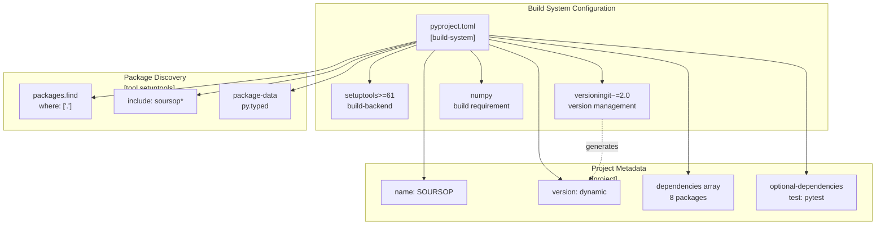
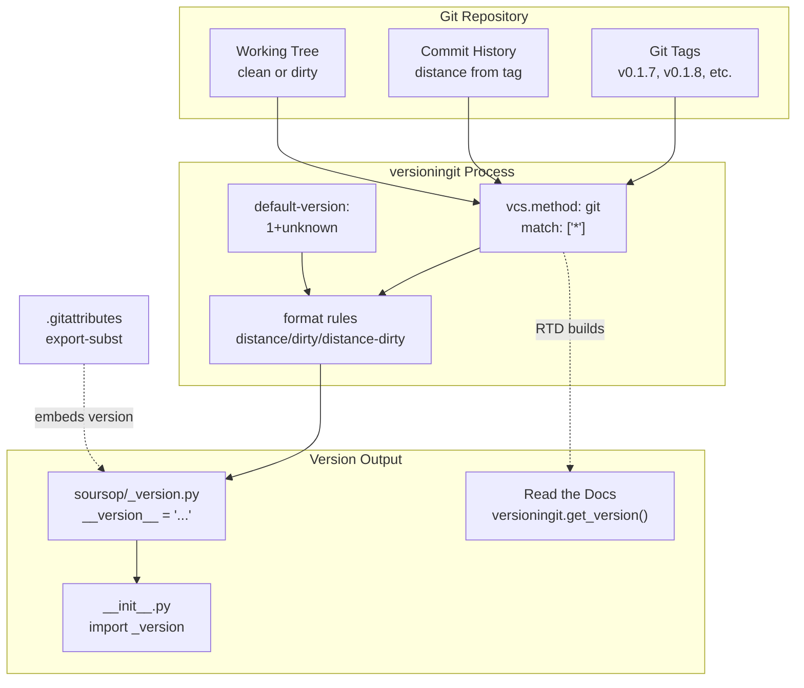
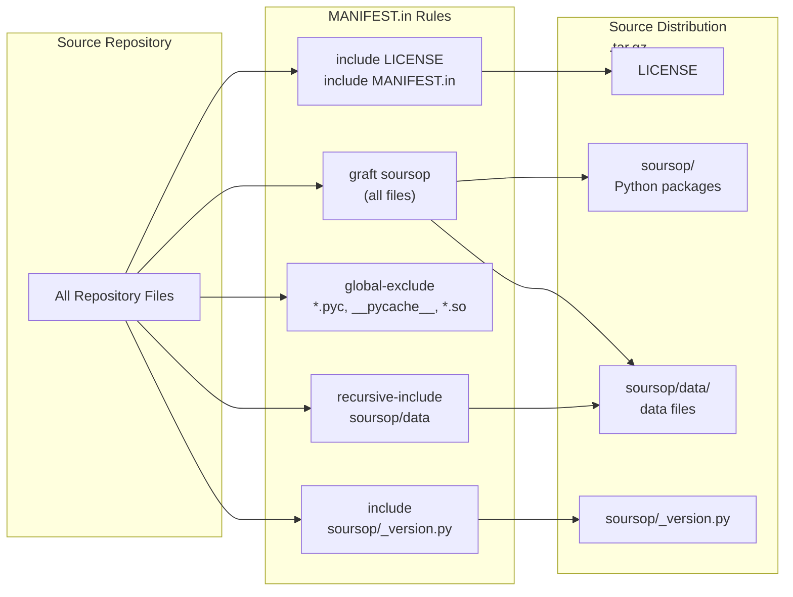
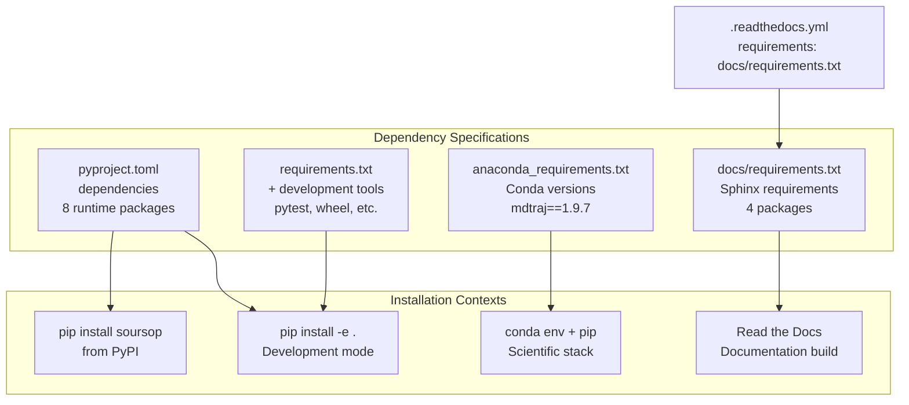
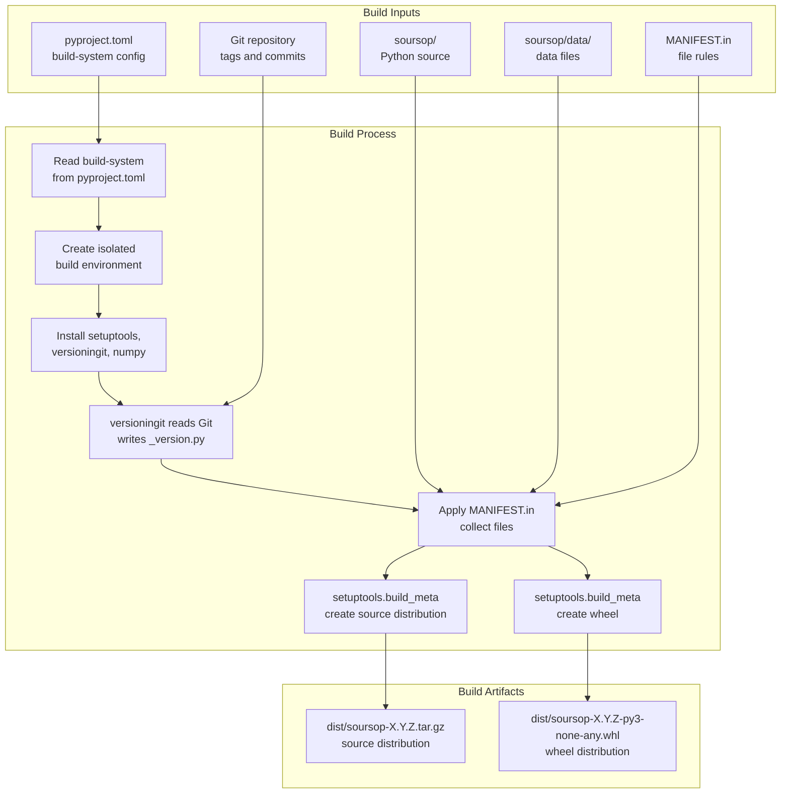
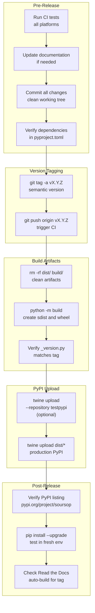

# Packaging and Release

<details>
<summary>Relevant source files</summary>

The following files were used as context for generating this wiki page:

- [.gitattributes](.gitattributes)
- [.readthedocs.yml](.readthedocs.yml)
- [MANIFEST.in](MANIFEST.in)
- [anaconda_requirements.txt](anaconda_requirements.txt)
- [devtools/conda-envs/test_env_nomdtraj.yaml](devtools/conda-envs/test_env_nomdtraj.yaml)
- [docs/conf.py](docs/conf.py)
- [docs/requirements.txt](docs/requirements.txt)
- [pyproject.toml](pyproject.toml)
- [requirements.txt](requirements.txt)
- [soursop/__init__.py](soursop/__init__.py)

</details>


This document describes SOURSOP's packaging infrastructure, version management, and release process. It covers the modern Python packaging configuration using `pyproject.toml`, dynamic versioning with `versioningit`, file inclusion via `MANIFEST.in`, and distribution to PyPI. This page is intended for maintainers preparing releases and contributors who need to understand the build system.

For information about continuous integration that validates releases, see [9.3](#9.3). For documentation building that accompanies releases, see [9.4](#9.4). For installation instructions from a user perspective, see [2.1](#2.1).

## Build System Configuration

SOURSOP uses a modern Python packaging approach based on PEP 517/518 standards, configured entirely through `pyproject.toml`. The build system uses `setuptools` with dynamic versioning provided by `versioningit`.

### pyproject.toml Structure

The `pyproject.toml` file defines the complete packaging configuration:

**Build Backend**: The `[build-system]` section specifies `setuptools` version 61 or higher as the build backend, with `versioningit` (~2.0) and `numpy` as build-time requirements [pyproject.toml:1-5]().

**Project Metadata**: The `[project]` section defines core metadata including:
- Package name: `SOURSOP`
- Dynamic version field (populated by `versioningit`)
- Description: "Simulation analysis package for working with disordered proteins"
- Author: Alex Holehouse
- License: LGPLv3
- Python requirement: >=3.7
- README: `README.md` [pyproject.toml:9-18]()

**Runtime Dependencies**: Listed in the `dependencies` array [pyproject.toml:21-30]():

| Dependency | Version Constraint | Purpose |
|------------|-------------------|---------|
| `numpy` | >=1.20.0 | Numerical computing |
| `scipy` | >=1.5.0 | Scientific algorithms |
| `cython` | (any) | Compilation support |
| `mdtraj` | >=1.9.5 | Trajectory I/O |
| `pandas` | >=0.23.0 | Data structures |
| `threadpoolctl` | >=2.2.0 | Thread management |
| `natsort` | (any) | Natural sorting |
| `matplotlib` | (any) | Plotting |

**Optional Dependencies**: Test dependencies are isolated in `[project.optional-dependencies]` with `pytest>=6.1.2` [pyproject.toml:32-35]().

**Package Discovery**: The `[tool.setuptools.packages.find]` section configures automatic package discovery to include `soursop` and all sub-packages [pyproject.toml:42-45]().



**Diagram: pyproject.toml Configuration Structure**

Sources: [pyproject.toml:1-68]()

## Dynamic Versioning with versioningit

SOURSOP uses `versioningit` to automatically generate version numbers from Git tags and commit history. This eliminates manual version number maintenance and ensures version traceability.

### Version Generation Rules

The `[tool.versioningit]` section configures version generation [pyproject.toml:52-68]():

**Default Version**: If no Git information is available, defaults to `"1+unknown"` [pyproject.toml:53]().

**Version Formatting**: Three format templates handle different repository states [pyproject.toml:55-58]():
- `distance`: `{base_version}+{distance}.{vcs}{rev}` - Clean commits after a tag
- `dirty`: `{base_version}+{distance}.{vcs}{rev}.dirty` - Uncommitted changes
- `distance-dirty`: `{base_version}+{distance}.{vcs}{rev}.dirty` - Both distance and dirty

**VCS Configuration**: Uses Git as the version control system with:
- `match = ["*"]`: All tags are considered
- `default-tag = "1.0.0"`: Fallback if no tags exist [pyproject.toml:60-65]()

**Version File Generation**: Writes version to `soursop/_version.py` [pyproject.toml:67-68]().

### Version Number Examples

| Repository State | Example Version |
|-----------------|----------------|
| Tagged release (v0.1.8) | `0.1.8` |
| 3 commits after v0.1.8 | `0.1.8+3.g7a2b1c4` |
| Dirty working tree | `0.1.8+3.g7a2b1c4.dirty` |
| No tags, 15 commits | `1.0.0+15.g9f3e2a1` |
| Read the Docs build | `1+unknown` |

### Version Embedding with .gitattributes

The `.gitattributes` file ensures version information is embedded during Git export operations:

```
soursop/_version.py export-subst
```

This directive tells Git to perform variable substitution in `_version.py` when creating archives via `git archive` [.gitattributes:1]().

### Version Loading at Runtime

The `soursop/__init__.py` module handles version loading with special logic for Read the Docs builds [soursop/__init__.py:18-23]():

```python
if os.getenv("READTHEDOCS") == "True" and not os.path.isfile('../soursop/_version.py'):   
    import versioningit            
    __version__ = versioningit.get_version('../')
else:
    from soursop._version import __version__
```

This ensures documentation builds on Read the Docs can generate version information even when `_version.py` doesn't exist.



**Diagram: Version Generation and Loading Pipeline**

Sources: [pyproject.toml:52-68](), [.gitattributes:1](), [soursop/__init__.py:18-23]()

## File Inclusion with MANIFEST.in

The `MANIFEST.in` file controls which files are included in source distributions beyond the Python packages themselves.

### Inclusion Rules

The manifest defines several inclusion directives [MANIFEST.in:1-9]():

**Top-Level Files**: `LICENSE` and `MANIFEST.in` itself are explicitly included [MANIFEST.in:1-2]().

**Package Directory**: The `graft soursop` directive recursively includes all files under the `soursop/` directory [MANIFEST.in:4]().

**Exclusions**: Python bytecode and build artifacts are excluded:
- `*.py[cod]`: Compiled Python files (.pyc, .pyo, .pyd)
- `__pycache__`: Python cache directories  
- `*.so`: Compiled shared objects [MANIFEST.in:5]()

**Data Files**: The `soursop/data/` directory and `_version.py` are explicitly included to ensure data files and version information are packaged [MANIFEST.in:7-8]().



**Diagram: File Inclusion Pipeline for Source Distributions**

Sources: [MANIFEST.in:1-9]()

## Dependency Management

SOURSOP maintains multiple dependency specification files for different installation contexts.

### Dependency Files

| File | Purpose | Context |
|------|---------|---------|
| `pyproject.toml` | Runtime and build dependencies | PyPI distribution, pip install |
| `requirements.txt` | Development and test dependencies | Development environments |
| `anaconda_requirements.txt` | Conda-compatible dependencies | Conda environments |
| `docs/requirements.txt` | Documentation build dependencies | Read the Docs, local docs |

### Development Dependencies

The `requirements.txt` file includes development and testing tools beyond runtime requirements [requirements.txt:1-14]():

- `wheel>=0.36`: Package building
- `pytest>=6.2.2`, `pytest-cov>=2.11`, `pytest-forked>=1.3`, `pytest-xdist>=2.2`: Testing infrastructure
- `mdtraj==1.9.5`: Pinned to specific version for stability
- `cx_Freeze==6.10`: Executable creation (if needed)
- `PyYAML>=6.0`, `ruamel_yaml>=0.15`: Configuration parsing

### Conda Dependencies

The `anaconda_requirements.txt` file specifies Conda-installable packages with some version differences [anaconda_requirements.txt:1-16]():

**Key Difference**: `mdtraj==1.9.7` instead of 1.9.5, as Conda may have different package availability. All version constraints are removed for packages that Conda manages (e.g., `numpy` instead of `numpy>=1.20.3`).

### Documentation Dependencies

The `docs/requirements.txt` file contains minimal requirements for building Sphinx documentation [docs/requirements.txt:1-4]():

- `sphinx_rtd_theme`: Read the Docs theme
- `numpy`, `scipy`: Required for API documentation generation
- `versioningit`: Version generation for docs

These dependencies are referenced by `.readthedocs.yml` for automated documentation builds [.readthedocs.yml:8]().



**Diagram: Dependency Management Across Contexts**

Sources: [pyproject.toml:21-35](), [requirements.txt:1-14](), [anaconda_requirements.txt:1-16](), [docs/requirements.txt:1-4](), [.readthedocs.yml:8]()

## Build and Distribution Process

The packaging process follows PEP 517 build isolation standards using `setuptools` as the build backend.

### Building Source Distributions

To create a source distribution (.tar.gz):

```bash
python -m build --sdist
```

This process:
1. Reads `pyproject.toml` to determine build requirements
2. Creates isolated build environment with `setuptools`, `versioningit`, `numpy`
3. Invokes `versioningit` to generate version from Git
4. Writes version to `soursop/_version.py`
5. Applies `MANIFEST.in` rules to collect files
6. Creates `dist/soursop-{version}.tar.gz`

### Building Wheel Distributions

To create a wheel distribution (.whl):

```bash
python -m build --wheel
```

Wheel builds follow similar steps but produce binary distributions that:
- Include compiled Python files (.pyc)
- Exclude source-only files (tests, docs)
- Provide faster installation than source distributions

### Version Verification

After building, verify the version was correctly embedded:

```bash
tar -tzf dist/soursop-*.tar.gz | grep _version.py
unzip -l dist/soursop-*.whl | grep _version.py
```

Both should show `soursop/_version.py` in the archive.



**Diagram: Build Process Flow**

Sources: [pyproject.toml:1-5](), [pyproject.toml:52-68](), [MANIFEST.in:1-9]()

## Release Workflow

The typical release workflow for SOURSOP involves tagging, building, and uploading to PyPI.

### Pre-Release Checklist

Before creating a release:

1. **Run full test suite** across platforms (see [9.3](#9.3))
2. **Update documentation** if needed (see [9.4](#9.4))
3. **Verify all changes are committed** to avoid `.dirty` version suffixes
4. **Check dependency versions** in `pyproject.toml` are still appropriate

### Tagging a Release

Create and push a Git tag following semantic versioning:

```bash
git tag -a v0.2.0 -m "Release version 0.2.0"
git push origin v0.2.0
```

The tag name (without the `v` prefix) becomes the base version. For example, `v0.2.0` generates version `0.2.0`.

### Building Release Artifacts

In a clean checkout at the tagged commit:

```bash
# Clean any existing builds
rm -rf dist/ build/ *.egg-info

# Build distributions
python -m build

# Verify version matches tag
tar -xzf dist/soursop-*.tar.gz -O */soursop/_version.py | grep __version__
```

The version in `_version.py` should match the tag exactly (e.g., `__version__ = "0.2.0"`).

### Uploading to PyPI

Using `twine` to upload distributions:

```bash
# Install twine if needed
pip install twine

# Upload to PyPI (requires credentials)
twine upload dist/*
```

For test uploads, use TestPyPI first:

```bash
twine upload --repository testpypi dist/*
```

### Post-Release Verification

After uploading:

1. **Verify PyPI listing**: Check https://pypi.org/project/soursop/
2. **Test installation**: `pip install --upgrade soursop` in a fresh environment
3. **Verify version**: `python -c "import soursop; print(soursop.__version__)"`
4. **Check Read the Docs**: Documentation should auto-build for the new tag

### Development Versions

Between releases, developers working from the repository will have versions like `0.2.0+5.g1a2b3c4`, indicating 5 commits beyond the v0.2.0 tag. This automatic versioning ensures development builds are always distinguishable from releases.



**Diagram: Complete Release Workflow**

Sources: [pyproject.toml:52-68]() (version tagging), build process references entire packaging configuration

## Integration with Read the Docs

The `.readthedocs.yml` file configures automated documentation builds that integrate with the release process [.readthedocs.yml:1-18]().

**Configuration Details**:
- Build OS: `ubuntu-22.04` [.readthedocs.yml:12]()
- Python version: `3.9` [.readthedocs.yml:14]()
- Requirements: `docs/requirements.txt` [.readthedocs.yml:8]()
- Sphinx config: `docs/conf.py` [.readthedocs.yml:18]()

Read the Docs automatically builds documentation for:
- Every commit to main branch
- Every Git tag (releases)
- Pull requests (preview builds)

The version-aware documentation ensures each release has corresponding versioned docs accessible via the Read the Docs version selector.

Sources: [.readthedocs.yml:1-18]()

## Package Metadata and Distribution Info

Beyond version numbers, SOURSOP's package metadata includes several key identifiers.

### Distribution Name

The package is distributed as `SOURSOP` (uppercase) on PyPI as specified in `pyproject.toml` [pyproject.toml:10](). However, it's imported as lowercase `soursop`:

```python
import soursop
from soursop import SSTrajectory
```

### License Information

SOURSOP is distributed under LGPLv3 (Lesser General Public License v3) [pyproject.toml:16](). The license text is included in distributions via `MANIFEST.in` [MANIFEST.in:1]().

### Type Hints Support

The package includes a `py.typed` marker file to indicate type hint support [pyproject.toml:48-50]():

```toml
[tool.setuptools.package-data]
soursop = [
    "py.typed"
]
```

This enables type checkers like `mypy` to use type information from SOURSOP.

### Python Version Support

SOURSOP requires Python 3.7 or higher [pyproject.toml:18]():

```toml
requires-python = ">=3.7"
```

This constraint is enforced during installation - pip will refuse to install on older Python versions.

Sources: [pyproject.toml:10](), [pyproject.toml:16](), [pyproject.toml:18](), [pyproject.toml:48-50](), [MANIFEST.in:1]()

---