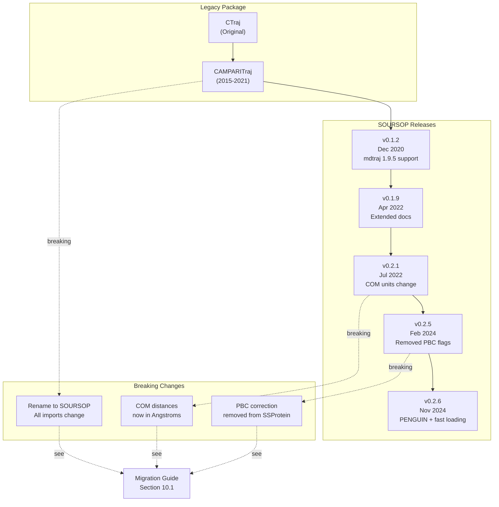
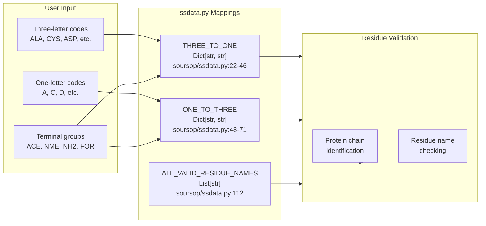
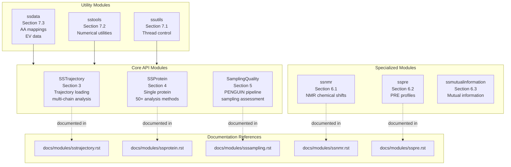

# Reference

<details>
<summary>Relevant source files</summary>

The following files were used as context for generating this wiki page:

- [README.md](README.md)
- [docs/index.rst](docs/index.rst)
- [docs/modules/sssampling.rst](docs/modules/sssampling.rst)
- [soursop/data/phi_excluded_volume_tripeptides.pickle](soursop/data/phi_excluded_volume_tripeptides.pickle)
- [soursop/data/psi_excluded_volume_tripeptides.pickle](soursop/data/psi_excluded_volume_tripeptides.pickle)
- [soursop/ssdata.py](soursop/ssdata.py)

</details>


This page provides quick reference materials for SOURSOP users and developers. It serves as a central location for version information, supported data types, performance guidelines, and external resources.

For detailed migration guides and breaking changes, see [Breaking Changes and Migration](#10.1).  
For a complete list of recognized amino acids and modifications, see [Supported Residue Types](#10.2).  
For optimization strategies and performance tuning, see [Performance Optimization](#10.3).

---

## Version and Compatibility Information

The following table summarizes SOURSOP version compatibility with key dependencies and major feature additions:

| SOURSOP Version | Release Date | Python Support | mdtraj Version | Key Features |
|-----------------|--------------|----------------|----------------|--------------|
| 0.2.6 | November 2024 | 3.7-3.9 | 1.9.5-1.9.7 | PENGUIN pipeline, fast coarse-grained loading, `pyproject.toml` packaging |
| 0.2.5 | February 2024 | 3.7-3.9 | 1.9.5-1.9.7 | Removed PBC flags from SSProtein, instantaneous distance maps |
| 0.2.1 | July 2022 | 3.7-3.9 | 1.9.5+ | COM distances in Angstroms (breaking change) |
| 0.1.9 | April 2022 | 3.6-3.9 | 1.9.5+ | Extended documentation |
| 0.1.2 | December 2020 | 3.6-3.9 | 1.9.5 | mdtraj 1.9.5 compatibility |

**Current stable release:** 0.2.6 (November 2024)

**Sources:** [README.md:1-84](), [docs/index.rst:1-70]()

---

## Version History Diagram



**Sources:** [README.md:33-80](), [docs/index.rst:33-66]()

---

## Core Data Structures and Constants

SOURSOP maintains several key data structures that define valid residue types, amino acid mappings, and reference data. These are primarily located in the `ssdata` module.

### Amino Acid Mapping Diagram



**Sources:** [soursop/ssdata.py:22-112]()

---

## Key Constants Reference

### Residue Mappings

| Constant | Location | Purpose |
|----------|----------|---------|
| `THREE_TO_ONE` | [soursop/ssdata.py:22-46]() | Maps 3-letter amino acid codes to 1-letter codes |
| `ONE_TO_THREE` | [soursop/ssdata.py:48-71]() | Maps 1-letter amino acid codes to 3-letter codes |
| `ALL_VALID_RESIDUE_NAMES` | [soursop/ssdata.py:112]() | List of all recognized residue names for validation |
| `DEFAULT_SIDECHAIN_VECTOR_ATOMS` | [soursop/ssdata.py:73-109]() | Default atoms for sidechain vector calculations |
| `EV_RESIDUE_MAPPER` | [soursop/ssdata.py:115-140]() | Maps residues to reference types for excluded volume analysis |

### Excluded Volume Reference Data

| Constant | Location | Purpose |
|----------|----------|---------|
| `PSI_EV_ANGLES_DICT` | [soursop/ssdata.py:142]() | Psi angle distributions for excluded volume reference |
| `PHI_EV_ANGLES_DICT` | [soursop/ssdata.py:144]() | Phi angle distributions for excluded volume reference |

These constants are used by the PENGUIN pipeline ([SamplingQuality](#5)) for comparing simulation ensembles against excluded volume reference models.

**Sources:** [soursop/ssdata.py:1-144]()

---

## Special Residue Types

SOURSOP recognizes several categories of residues beyond the standard 20 amino acids:

### Terminal Groups

| Code | Three-Letter | Symbol | Usage |
|------|--------------|--------|-------|
| ACE | ACE | `<` | N-terminal acetyl cap |
| NME | NME | `>` | C-terminal N-methylamide cap |
| NAC | NAC | `>` | Alternative C-terminal cap |
| NH2 | NH2 | `(` | N-terminal amine |
| FOR | FOR | `)` | N-terminal formyl |

### Modified Amino Acids

SOURSOP supports common post-translational modifications:
- **Phosphorylation:** PTR (phosphotyrosine), TPO (phosphothreonine), SEP (phosphoserine)
- **Acetylation:** KAC (acetyllysine)
- **Methylation:** KM1, KM2, KM3 (mono-, di-, tri-methylated lysine)
- **Protonation states:** ASH (protonated aspartate), GLH (protonated glutamate), LYD (deprotonated lysine)
- **Histidine tautomers:** HID, HIE, HIP

For a complete reference, see [Supported Residue Types](#10.2).

**Sources:** [soursop/ssdata.py:22-112]()

---

## External Resources

### Official Documentation and Code

| Resource | URL |
|----------|-----|
| GitHub Repository | https://github.com/holehouse-lab/soursop |
| Read the Docs | https://soursop.readthedocs.io/ |
| PyPI Package | https://pypi.org/project/soursop/ |
| Issue Tracker | https://github.com/holehouse-lab/soursop/issues |

### Publication

**Primary Citation:**  
Lalmansingh, J. M., Keeley, A. T., Ruff, K. M., Pappu, R. V. & Holehouse, A. S. *SOURSOP: A Python Package for the Analysis of Simulations of Intrinsically Disordered Proteins.* J. Chem. Theory Comput. (2023). doi:10.1021/acs.jctc.3c00190

**Links:**
- Journal: https://pubs.acs.org/doi/full/10.1021/acs.jctc.3c00190
- PDF: https://www.dropbox.com/s/bd5szapvxpn83r6/soursop_jctc.pdf?dl=0

**PENGUIN Citation:**  
Lotthammer, J. M. & Holehouse, A. S. *PENGUIN: A pipeline for evaluating conformational heterogeneity in unstructured proteins.* bioRxiv (2024). https://www.biorxiv.org/content/10.1101/2024.11.06.622270v1.abstract

**Sources:** [README.md:22-28](), [docs/index.rst:1-70]()

---

## API Reference Structure

The SOURSOP API is organized into several major modules, each documented separately:



**Sources:** [docs/index.rst:19-32](), [docs/modules/sssampling.rst:1-45]()

---

## Reference Module Functions

The `sssampling` module provides several standalone statistical functions for assessing conformational sampling quality:

| Function | Purpose | Location |
|----------|---------|----------|
| `hellinger_distance()` | Computes Hellinger distance between two probability distributions | [docs/modules/sssampling.rst:43]() |
| `rel_entropy()` | Computes relative entropy (Kullback-Leibler divergence) | [docs/modules/sssampling.rst:42]() |
| `compute_joint_hellinger_distance()` | Computes joint Hellinger distance for 2D distributions | [docs/modules/sssampling.rst:44]() |

These functions are used internally by the `SamplingQuality` class but can also be called directly for custom analyses.

**Sources:** [docs/modules/sssampling.rst:38-44]()

---

## Quick Reference: Common Operations

### Loading a Trajectory

```python
from soursop import SSTrajectory

# Basic loading
traj = SSTrajectory('topology.pdb', trajectory_files=['trajectory.xtc'])

# Get protein objects
protein = traj.proteinTrajectoryList[0]
```

### Getting Amino Acid Sequence

```python
# Get sequence as three-letter codes
sequence = protein.get_amino_acid_sequence(oneletter=False)

# Get sequence as one-letter codes
sequence = protein.get_amino_acid_sequence(oneletter=True)
```

### Residue Validation

```python
from soursop.ssdata import ALL_VALID_RESIDUE_NAMES

# Check if a residue name is valid
is_valid = 'ALA' in ALL_VALID_RESIDUE_NAMES
```

### Excluded Volume Reference Data

```python
from soursop.ssdata import PHI_EV_ANGLES_DICT, PSI_EV_ANGLES_DICT

# Access reference dihedral distributions
phi_angles = PHI_EV_ANGLES_DICT['ALA-ALA-ALA']
psi_angles = PSI_EV_ANGLES_DICT['ALA-ALA-ALA']
```

**Sources:** [soursop/ssdata.py:1-144]()

---

## License and Copyright

SOURSOP is licensed under the **GNU Lesser General Public License (LGPL)**.

**Copyright:** 2015-2024, Holehouse Lab and Pappu Lab

**Sources:** [README.md:30-31]()

---

## Support and Contributing

### Reporting Issues

- **Bug reports:** https://github.com/holehouse-lab/soursop/issues
- **Feature requests:** See [Development Guide](#9) for contribution workflow
- **Documentation issues:** Report via GitHub issues

### Contributing

For information on contributing to SOURSOP, including the development workflow, testing requirements, and documentation standards, see the [Development Guide](#9).

**Sources:** [README.md:14-17]()

---