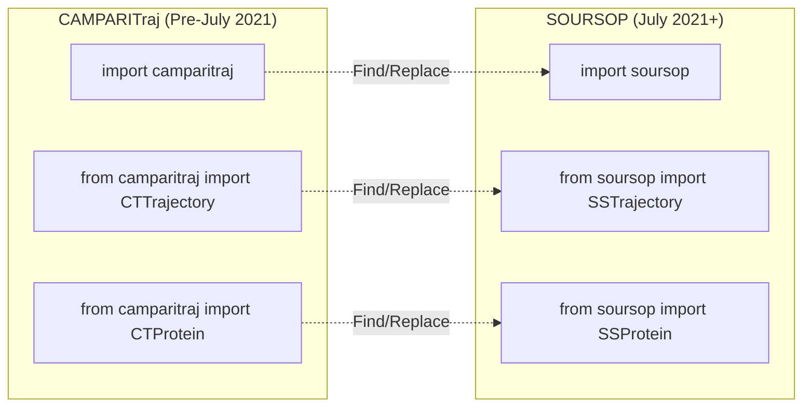
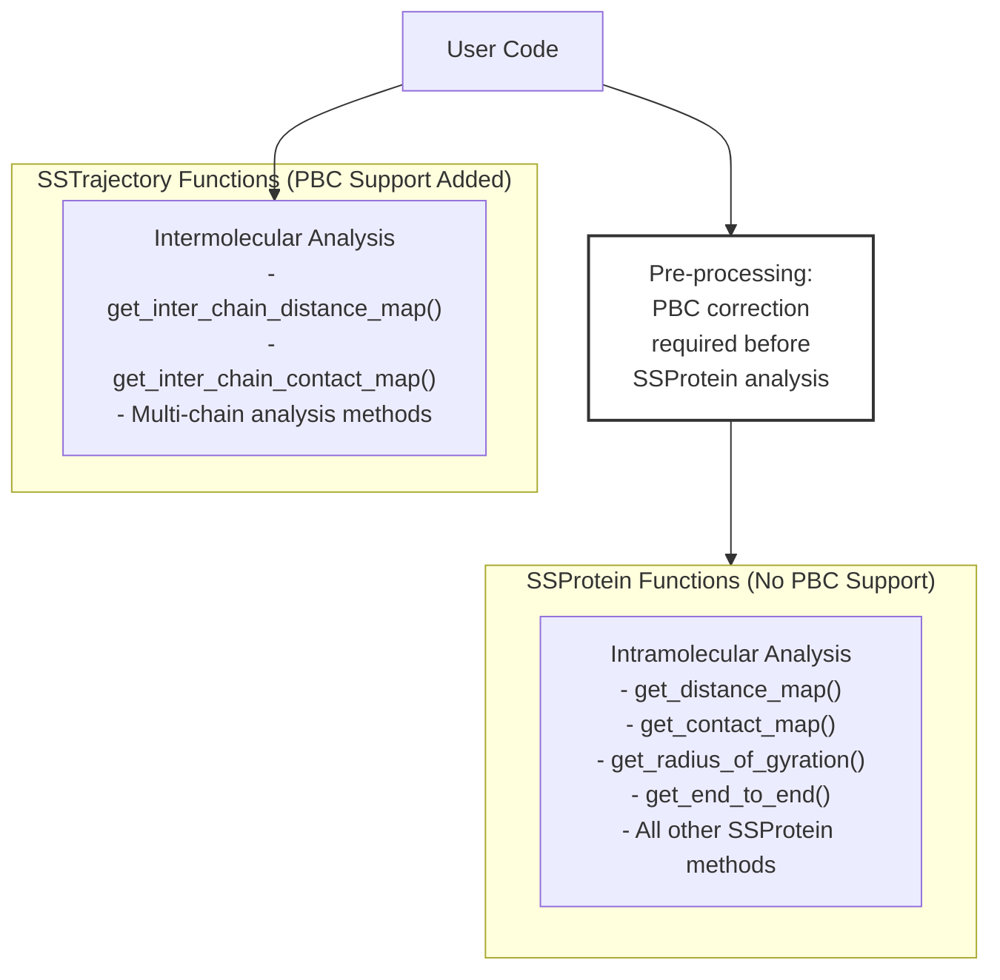
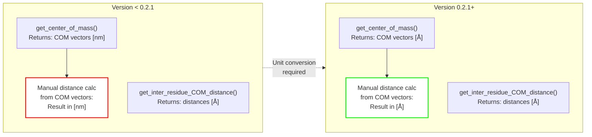

# Breaking Changes and Migration

<details>
<summary>Relevant source files</summary>

The following files were used as context for generating this wiki page:

- [README.md](README.md)
- [docs/index.rst](docs/index.rst)
- [docs/modules/sssampling.rst](docs/modules/sssampling.rst)

</details>


This page documents breaking changes across SOURSOP versions and provides migration guides for updating code when upgrading from older versions. It covers the major transition from CAMPARITraj to SOURSOP, as well as significant API changes in versions 0.2.1, 0.2.5, and 0.2.6.

For information about current installation and setup, see [Installation](#2.1). For performance optimization tips when working with the current version, see [Performance Optimization](#10.3).

## Overview of Breaking Changes

The table below summarizes all major breaking changes in SOURSOP's history, ordered chronologically:

| Version | Date | Change Type | Impact | Migration Effort |
|---------|------|-------------|--------|------------------|
| 0.1.x → SOURSOP | July 2021 | Package rename | High - All imports | Moderate - Find/replace |
| 0.2.1 | July 2022 | Unit change | Medium - COM calculations | Low - Recalculation needed |
| 0.2.5 | February 2024 | API removal | Medium - PBC users | Moderate - Preprocessing required |
| 0.2.6 | November 2024 | Packaging | Low - Installation only | Minimal - No code changes |
| 1.9.5+ | December 2020 | mdtraj compatibility | Low - Internal only | None - Automatic |

**Sources:** [README.md:34-77](), [docs/index.rst:35-65]()

## Major Migration: CAMPARITraj to SOURSOP

### The Transition

In July 2021, the package was renamed from **CAMPARITraj** to **SOURSOP**. This was the largest breaking change in the package's history, breaking all backward compatibility. The rename served to decouple the package from CAMPARI, reflecting its evolution into a general-purpose tool for analyzing all-atom simulations of IDPs from any simulation engine.

The package evolution: **CTraj** → **CAMPARITraj** → **SOURSOP**

**Sources:** [README.md:66-73](), [docs/index.rst:11]()

### Import Migration Diagram



**Sources:** [README.md:66-73]()

### Code Changes Required

| Old Code (CAMPARITraj) | New Code (SOURSOP) |
|------------------------|---------------------|
| `import camparitraj` | `import soursop` |
| `camparitraj.CTTrajectory(...)` | `soursop.SSTrajectory(...)` |
| `camparitraj.CTProtein` | `soursop.SSProtein` |
| `from camparitraj import ...` | `from soursop import ...` |
| `pip install camparitraj` | `pip install soursop` |

### Migration Steps

1. **Update imports**: Replace all instances of `camparitraj` with `soursop` in your codebase
2. **Update class names**: 
   - `CTTrajectory` → `SSTrajectory`
   - `CTProtein` → `SSProtein`
   - All other `CT*` classes → `SS*` equivalents
3. **Update installation**: Uninstall CAMPARITraj and install SOURSOP
4. **Test thoroughly**: The API remained largely the same, but verify all functionality

**Sources:** [README.md:66-73]()

### Migration Script Example

A simple find-and-replace migration can be performed with:

```bash
# Find all Python files using CAMPARITraj
find . -name "*.py" -type f -exec sed -i 's/camparitraj/soursop/g' {} +
find . -name "*.py" -type f -exec sed -i 's/CTTrajectory/SSTrajectory/g' {} +
find . -name "*.py" -type f -exec sed -i 's/CTProtein/SSProtein/g' {} +
```

**Note:** This is a simple approach. Always review changes before committing and ensure proper testing.

**Sources:** [README.md:66-73]()

## Version 0.2.5: Periodic Boundary Conditions Removal

### The Change

In February 2024, SOURSOP removed the `periodic` keyword argument from all `SSProtein` analysis functions. Previously, some functions supported a `periodic=True` flag for periodic boundary condition correction, but this was inconsistently available across methods.

**Rationale:** The design decision was made to remove PBC correction from intramolecular analysis to prevent scenarios where a user might analyze different properties with inconsistent PBC handling. Users must now ensure their trajectories are PBC-corrected before analysis.

**Sources:** [README.md:46-47]()

### Affected Functions Diagram



**Sources:** [README.md:46-47]()

### Migration Requirements

| Scenario | Action Required |
|----------|-----------------|
| Using `periodic=True` in any SSProtein method | Remove the keyword; pre-process trajectory with PBC correction |
| Multi-chain analysis with SSTrajectory | Use `periodic=True` with SSTrajectory methods (now supported) |
| Single-chain analysis | Ensure input trajectory is PBC-corrected before creating SSProtein |

### Code Migration Example

**Old code (pre-0.2.5):**
```python
# This would work in versions < 0.2.5
P = traj.proteinTrajectoryList[0]
rg = P.get_radius_of_gyration(periodic=True)  # periodic flag available
```

**New code (0.2.5+):**
```python
# Option 1: Pre-process trajectory for PBC
import mdtraj as md
traj_mdtraj = md.load('trajectory.xtc', top='topology.pdb')
traj_mdtraj.image_molecules(inplace=True)  # PBC correction
traj_mdtraj.save('trajectory_pbc_fixed.xtc')

# Then load with SOURSOP
traj = soursop.SSTrajectory('trajectory_pbc_fixed.xtc', 'topology.pdb')
P = traj.proteinTrajectoryList[0]
rg = P.get_radius_of_gyration()  # No periodic flag

# Option 2: For multi-chain systems, use SSTrajectory methods
traj = soursop.SSTrajectory('trajectory.xtc', 'topology.pdb')
inter_dist = traj.get_inter_chain_distance_map(0, 1, periodic=True)
```

**Sources:** [README.md:46-47]()

### Functions No Longer Supporting PBC

All `SSProtein` methods that previously accepted a `periodic` parameter now require pre-corrected trajectories. This includes but is not limited to:

- `get_distance_map()`
- `get_contact_map()`
- `get_radius_of_gyration()`
- `get_end_to_end()`
- Any other intramolecular distance calculations

**Sources:** [README.md:46-47]()

## Version 0.2.1: COM Distance Unit Changes

### The Change

In July 2022, all center-of-mass (COM) based functions were updated to return distances and positions consistently in **Angstroms**, not a mixture of Angstroms and nanometers. Prior to this version, COM vector positions (3×n matrices of x/y/z coordinates) were returned in nanometers, while distances were in Angstroms.

**Impact:** If you manually calculated distances between COM vectors before v0.2.1, those distances would have been in nanometers. Now all spatial measurements are uniformly in Angstroms.

**Sources:** [README.md:57-60]()

### Unit System Diagram



**Sources:** [README.md:57-60]()

### Affected COM Functions

| Function | Change | Impact |
|----------|--------|--------|
| `get_center_of_mass()` | Position vectors now in Å (was nm) | High - Recalculate if positions were used |
| `get_inter_residue_COM_distance()` | No change (already Å) | None |
| `get_regional_center_of_mass()` | Position vectors now in Å (was nm) | High - Recalculate if positions were used |
| Any COM-based function returning positions | All now return Å | High - Check manual calculations |

**Sources:** [README.md:57-60]()

### Migration Actions

1. **If using COM positions directly:** Multiply old values by 10 to convert nm → Å
2. **If manually calculating distances from COM:** Recalculate with new data
3. **If only using distance functions:** No changes needed (distances were already in Å)
4. **For saved COM data:** Note in metadata that pre-0.2.1 data is in nm

### Example Migration

**Before 0.2.1:**
```python
# COM positions returned in nanometers
com_vectors = protein.get_center_of_mass()  # Shape: (n_frames, 3) in [nm]
# Manual distance calculation
dist = np.linalg.norm(com_vectors[0] - com_vectors[1])  # Result in [nm]
```

**After 0.2.1:**
```python
# COM positions returned in Angstroms
com_vectors = protein.get_center_of_mass()  # Shape: (n_frames, 3) in [Å]
# Manual distance calculation
dist = np.linalg.norm(com_vectors[0] - com_vectors[1])  # Result in [Å]

# To convert old saved data to new units:
old_com_nm = np.load('old_com_data.npy')
new_com_angstrom = old_com_nm * 10.0
```

**Sources:** [README.md:57-60]()

## Version 0.2.6: Packaging and Performance Updates

### Packaging Changes

In November 2024, SOURSOP transitioned from `setup.py` to `pyproject.toml` for modern Python packaging and switched to `versioningit` for dynamic versioning. This change affects installation and development workflows but does not break existing analysis code.

**Sources:** [README.md:34-40](), [docs/index.rst:35-36]()

### Changes Overview

| Component | Old Method | New Method |
|-----------|-----------|------------|
| Build configuration | `setup.py` | `pyproject.toml` |
| Versioning | Manual in `setup.py` | `versioningit` dynamic |
| Development install | `python setup.py develop` | `pip install -e .` |
| Package metadata | `setup.py` | `pyproject.toml` |

### Migration for Developers

**Old workflow:**
```bash
python setup.py develop
python setup.py sdist bdist_wheel
```

**New workflow:**
```bash
pip install -e .
python -m build
```

For users installing via pip, no changes are required - `pip install soursop` works identically.

**Sources:** [README.md:39]()

### Performance Improvements

Version 0.2.6 also introduced significant performance improvements for single-chain, one-bead-per-residue trajectory loading:

- **~30× speed improvement** for coarse-grained trajectory loading
- Explicit support added via optimized loading path
- No API changes required - improvements are automatic

**Sources:** [README.md:36]()

### Additional Features

- Support for `NH3` and `FOR` residue types in `get_amino_acid_sequence()`
- Integration of `SamplingQuality` class (PENGUIN pipeline) into stable release
- Compatibility maintained with mdtraj 1.9.5-1.9.7

**Sources:** [README.md:37-38]()

## mdtraj Version Compatibility

### Compatibility Matrix

| SOURSOP Version | mdtraj Version | Python Version | Status |
|----------------|----------------|----------------|--------|
| 0.2.6+ | 1.9.5 - 1.9.7 | 3.7 - 3.9 | Supported |
| 0.2.5 | 1.9.5 - 1.9.7 | 3.7 - 3.9 | Supported |
| 0.1.2 | 1.9.5+ | 3.6+ | Legacy |
| 0.1.x | < 1.9.5 | 3.6+ | Deprecated |

### mdtraj 1.9.5 Transition

In December 2020 and January 2021, SOURSOP was restructured to ensure compatibility with mdtraj version 1.9.5, which introduced some internal changes. This restructuring was handled internally and required no user code changes.

**Note:** There is currently a known edge-case mismatch in error handling between different mdtraj versions that causes CI test failures, but this does not affect production use.

**Sources:** [README.md:20](), [README.md:76](), [docs/index.rst:61]()

### Checking Your Environment

```python
import mdtraj
import soursop

print(f"mdtraj version: {mdtraj.__version__}")
print(f"soursop version: {soursop.__version__}")

# Verify compatibility
assert mdtraj.__version__ >= "1.9.5", "Update mdtraj to >= 1.9.5"
```

**Sources:** [README.md:76]()

## Additional Updates

### Version 0.2.5 (March 2024)

Added `return_instantaneous_maps=False` keyword to `get_distance_maps()` function to optionally return a `[t, n, n]` tensor of frame-specific distance maps.

**No migration required** - this is a backward-compatible addition.

**Sources:** [README.md:42-43]()

### Version 0.2.3 (July 2023)

Added `explicit_residue_checking` flag to `SSTrajectory` constructor, enabling parsing of solvated `.gro` files or trajectories with non-protein molecules in the same chain.

**No migration required** - this is a backward-compatible addition with default behavior unchanged.

**Sources:** [README.md:50](), [docs/index.rst:43]()

## Summary Migration Checklist

When upgrading SOURSOP, check this list based on your current version:

**From CAMPARITraj (< 0.1.x):**
- [ ] Update all imports: `camparitraj` → `soursop`
- [ ] Rename classes: `CT*` → `SS*`
- [ ] Update installation: `pip install soursop`
- [ ] Full testing required

**From 0.1.x to 0.2.1:**
- [ ] Review any manual COM distance calculations
- [ ] Convert saved COM position data from nm to Å
- [ ] Recalculate COM-based analyses if needed

**From 0.2.0 to 0.2.5:**
- [ ] Remove `periodic=True` from all SSProtein methods
- [ ] Pre-process trajectories with PBC correction if needed
- [ ] Use SSTrajectory methods with `periodic=True` for multi-chain analysis

**From 0.2.5 to 0.2.6:**
- [ ] Update development workflow if contributing (use `pyproject.toml`)
- [ ] Benefit from ~30× faster coarse-grained loading (automatic)
- [ ] No code changes required for users

**Sources:** [README.md:34-77]()

---