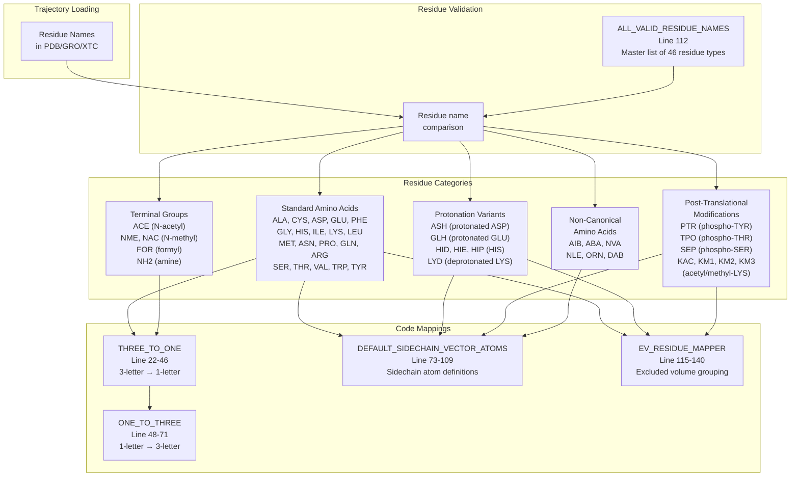
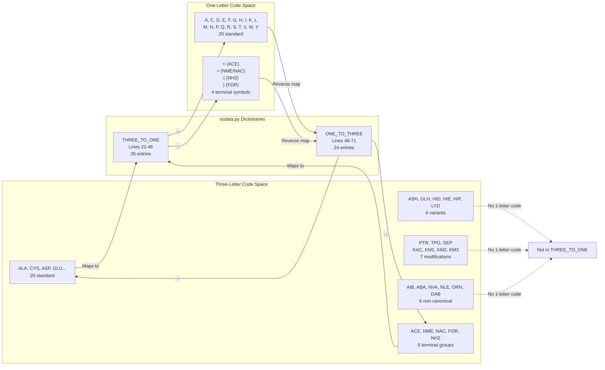
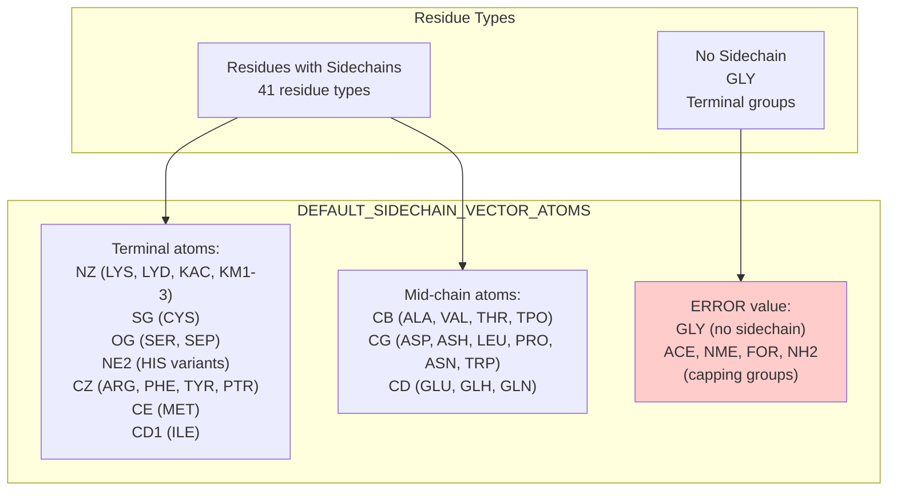
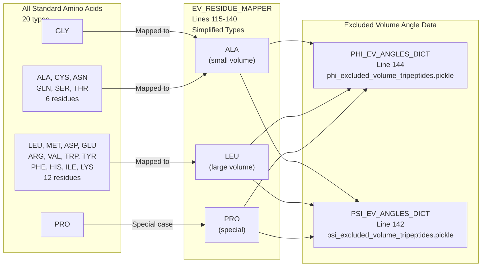
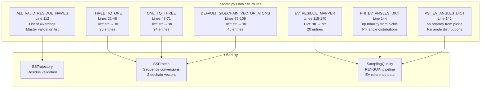

# Supported Residue Types

Relevant source files

The following files were used as context for generating this wiki page:

- [soursop/data/phi_excluded_volume_tripeptides.pickle](soursop/data/phi_excluded_volume_tripeptides.pickle)
- [soursop/data/psi_excluded_volume_tripeptides.pickle](soursop/data/psi_excluded_volume_tripeptides.pickle)
- [soursop/ssdata.py](soursop/ssdata.py)

This page documents all amino acid residue types, modifications, and terminal groups recognized by SOURSOP. These definitions control which molecules are identified as proteins during trajectory loading and analysis.

For information about amino acid data used in specialized analyses (e.g., chemical shift calculations), see [NMR Chemical Shift Prediction](#6.1). For information about how residues are validated during trajectory loading, see [Loading Trajectories](#3.1).

## Overview

SOURSOP recognizes a comprehensive set of residue types defined in `ALL_VALID_RESIDUE_NAMES` [soursop/ssdata.py:112](). This list includes:

- **20 standard amino acids**: The canonical amino acids found in proteins
- **Protonation variants**: Alternative protonation states (ASH, GLH, HID, HIE, HIP, LYD)
- **Post-translational modifications**: Phosphorylated and acetylated residues (PTR, TPO, SEP, KAC, KM1, KM2, KM3)
- **Non-canonical amino acids**: Non-standard amino acids (AIB, ABA, NVA, NLE, ORN, DAB)
- **Terminal groups**: N- and C-terminal caps (ACE, NME, FOR, NH2)

During trajectory loading, SOURSOP compares residue names against `ALL_VALID_RESIDUE_NAMES` to determine whether a molecule should be treated as a protein.

**Sources:** [soursop/ssdata.py:112]()

## Residue Type Categories

The following diagram illustrates how SOURSOP organizes and processes different residue types:

**Sources:** [soursop/ssdata.py:22-140]()

## Standard Amino Acids

SOURSOP supports all 20 standard amino acids with both three-letter and one-letter code mappings:

| Three-Letter | One-Letter | Full Name | Notes |
|--------------|------------|-----------|-------|
| ALA | A | Alanine | |
| CYS | C | Cysteine | |
| ASP | D | Aspartate | Negatively charged |
| GLU | E | Glutamate | Negatively charged |
| PHE | F | Phenylalanine | Aromatic |
| GLY | G | Glycine | No sidechain |
| HIS | H | Histidine | Can be protonated |
| ILE | I | Isoleucine | Branched |
| LYS | K | Lysine | Positively charged |
| LEU | L | Leucine | Branched |
| MET | M | Methionine | Contains sulfur |
| ASN | N | Asparagine | Polar |
| PRO | P | Proline | Cyclic; special φ angles |
| GLN | Q | Glutamine | Polar |
| ARG | R | Arginine | Positively charged |
| SER | S | Serine | Polar |
| THR | T | Threonine | Polar |
| VAL | V | Valine | Branched |
| TRP | W | Tryptophan | Aromatic, largest |
| TYR | Y | Tyrosine | Aromatic, polar |

These mappings are defined in `THREE_TO_ONE` [soursop/ssdata.py:22-46]() and `ONE_TO_THREE` [soursop/ssdata.py:48-71]().

**Sources:** [soursop/ssdata.py:22-71]()

## Protonation Variants

SOURSOP recognizes alternative protonation states for several amino acids. These variants are important for simulations at different pH values or when modeling specific protonation states:

| Residue | Variant | Description | Parent |
|---------|---------|-------------|--------|
| ASH | - | Protonated aspartate (neutral) | ASP |
| GLH | - | Protonated glutamate (neutral) | GLU |
| HID | δ | Histidine protonated at Nδ | HIS |
| HIE | ε | Histidine protonated at Nε | HIS |
| HIP | Both | Doubly protonated histidine (charged) | HIS |
| LYD | - | Deprotonated lysine (neutral) | LYS |

**Histidine Protonation States:**
- `HID`: Protonation at the Nδ atom
- `HIE`: Protonation at the Nε atom  
- `HIP`: Doubly protonated (positively charged)
- `HIS`: Default histidine (typically HIE in neutral pH)

All protonation variants are included in `ALL_VALID_RESIDUE_NAMES` [soursop/ssdata.py:112]() and have sidechain vector atoms defined in `DEFAULT_SIDECHAIN_VECTOR_ATOMS` [soursop/ssdata.py:73-109]().

**Sources:** [soursop/ssdata.py:76-88, 112]()

## Post-Translational Modifications

SOURSOP supports several common post-translational modifications:

### Phosphorylation

| Residue | Modified Atom | Description |
|---------|---------------|-------------|
| PTR | Tyrosine OH | Phosphorylated tyrosine |
| TPO | Threonine OH | Phosphorylated threonine |
| SEP | Serine OH | Phosphorylated serine |

### Lysine Modifications

| Residue | Description |
|---------|-------------|
| KAC | Acetylated lysine (ε-acetyl-lysine) |
| KM1 | Mono-methylated lysine |
| KM2 | Di-methylated lysine |
| KM3 | Tri-methylated lysine |

All PTM residues have sidechain vector atoms defined [soursop/ssdata.py:99-105]() and are recognized as valid protein residues [soursop/ssdata.py:112]().

**Sources:** [soursop/ssdata.py:88-105, 112]()

## Non-Canonical Amino Acids

SOURSOP supports several non-canonical amino acids commonly used in peptide research:

| Code | Full Name | Description |
|------|-----------|-------------|
| AIB | α-Aminoisobutyric acid | Conformationally restricted; induces helicity |
| ABA | α-Aminobutyric acid | One extra methyl group vs. alanine |
| NVA | Norvaline | Linear; isosteric with leucine |
| NLE | Norleucine | Linear; isosteric with methionine |
| ORN | Ornithine | Shorter analog of lysine |
| DAB | Diaminobutyric acid | Shorter analog of lysine |

These residues are included in `ALL_VALID_RESIDUE_NAMES` [soursop/ssdata.py:112]() but do not have entries in the `THREE_TO_ONE` or `ONE_TO_THREE` mappings, as they do not have standard one-letter codes.

**Sources:** [soursop/ssdata.py:112]()

## Terminal Groups and Caps

SOURSOP recognizes common N-terminal and C-terminal capping groups used to cap peptide termini:

| Code | Full Name | Type | One-Letter | Description |
|------|-----------|------|------------|-------------|
| ACE | N-acetyl | N-terminal | `<` | Acetyl capping group |
| NME | N-methylamide | C-terminal | `>` | N-methyl amide cap |
| NAC | N-acetyl | C-terminal | `>` | Alternative to NME |
| FOR | Formyl | N-terminal | `)` | Formyl capping group |
| NH2 | Amide | C-terminal | `(` | Simple amide cap |

These capping groups are mapped to special one-letter codes in `THREE_TO_ONE` [soursop/ssdata.py:42-46]() to allow compact sequence representation. They have `'ERROR'` entries in `DEFAULT_SIDECHAIN_VECTOR_ATOMS` [soursop/ssdata.py:106-109]() since they do not have sidechains.

**Sources:** [soursop/ssdata.py:42-46, 106-109, 112]()

## Residue Name Mapping System

The following diagram shows how SOURSOP's mapping dictionaries relate to each other:

**Key Points:**
- Only standard amino acids and terminal groups have one-letter codes
- Protonation variants, PTMs, and non-canonical amino acids only have three-letter codes
- `THREE_TO_ONE` contains 26 entries; `ONE_TO_THREE` contains 24 entries
- Special symbols `< > ( )` represent terminal groups in one-letter sequences

**Sources:** [soursop/ssdata.py:22-71]()

## Sidechain Vector Atoms

For many analyses (e.g., sidechain orientation, D-vector calculations), SOURSOP needs to identify a representative atom for each residue's sidechain. This is defined in `DEFAULT_SIDECHAIN_VECTOR_ATOMS` [soursop/ssdata.py:73-109]():

**Atom Selection Strategy:**
- **Small residues** (ALA, SER, THR, CYS): Use β-carbon (CB) or first heavy sidechain atom
- **Medium residues** (ASP, ASN, LEU, PRO): Use γ-carbon (CG)
- **Long residues** (GLU, GLN, ARG, LYS): Use terminal heavy atom
- **Aromatic residues** (PHE, TYR, TRP): Use ring center or terminal carbon
- **Special cases**: GLY returns `'ERROR'` (no sidechain beyond Cα)

**Sources:** [soursop/ssdata.py:73-109]()

## Excluded Volume Mapping for PENGUIN

For the PENGUIN conformational sampling assessment pipeline (see [Reference Models and EV Data](#5.4)), residues are mapped to simplified types based on excluded volume. This mapping is defined in `EV_RESIDUE_MAPPER` [soursop/ssdata.py:115-140]():

**Mapping Strategy:**
- **ALA-like (small)**: GLY, ALA, CYS, ASN, GLN, SER, THR → `'ALA'`
- **LEU-like (large)**: LEU, MET, ASP, GLU, ARG, VAL, TRP, TYR, PHE, HIS, ILE, LYS → `'LEU'`
- **PRO (special)**: PRO → `'PRO'` (unique backbone constraints)

This simplified mapping is used to look up dihedral angle distributions from the excluded volume reference dataset [soursop/ssdata.py:142-144](), which provides baseline angle distributions free from sequence-specific conformational preferences.

**Note:** Only standard amino acids have excluded volume mappings. Protonation variants, PTMs, and non-canonical residues are not included in this mapping and cannot be used with the PENGUIN analysis pipeline.

**Sources:** [soursop/ssdata.py:115-144]()

## Residue Type Data Structures

The following diagram summarizes all data structures in `ssdata.py` that define residue type information:

**Sources:** [soursop/ssdata.py:22-144]()

## Complete Reference Table

The following table provides a complete reference of all 46 recognized residue types:

| Three-Letter | Category | One-Letter | Has SC Vector | In EV Mapper | Notes |
|--------------|----------|------------|---------------|--------------|-------|
| ALA | Standard | A | CB | ALA | Alanine |
| CYS | Standard | C | SG | ALA | Cysteine |
| ASP | Standard | D | CG | LEU | Aspartate |
| GLU | Standard | E | CD | LEU | Glutamate |
| PHE | Standard | F | CZ | LEU | Phenylalanine |
| GLY | Standard | G | ERROR | ALA | Glycine (no sidechain) |
| HIS | Standard | H | NE2 | LEU | Histidine |
| ILE | Standard | I | CD1 | LEU | Isoleucine |
| LYS | Standard | K | NZ | LEU | Lysine |
| LEU | Standard | L | CG | LEU | Leucine |
| MET | Standard | M | CE | LEU | Methionine |
| ASN | Standard | N | CG | ALA | Asparagine |
| PRO | Standard | P | CG | PRO | Proline |
| GLN | Standard | Q | CD | ALA | Glutamine |
| ARG | Standard | R | CZ | LEU | Arginine |
| SER | Standard | S | OG | ALA | Serine |
| THR | Standard | T | CB | ALA | Threonine |
| VAL | Standard | V | CB | LEU | Valine |
| TRP | Standard | W | CG | LEU | Tryptophan |
| TYR | Standard | Y | CZ | LEU | Tyrosine |
| ASH | Protonation | - | CG | - | Protonated aspartate |
| GLH | Protonation | - | CD | - | Protonated glutamate |
| HID | Protonation | - | NE2 | - | Histidine (Nδ protonated) |
| HIE | Protonation | - | NE2 | - | Histidine (Nε protonated) |
| HIP | Protonation | - | NE2 | - | Histidine (doubly protonated) |
| LYD | Protonation | - | NZ | - | Deprotonated lysine |
| PTR | PTM | - | CZ | - | Phosphotyrosine |
| TPO | PTM | - | CB | - | Phosphothreonine |
| SEP | PTM | - | OG | - | Phosphoserine |
| KAC | PTM | - | NZ | - | Acetyl-lysine |
| KM1 | PTM | - | NZ | - | Methyl-lysine (mono) |
| KM2 | PTM | - | NZ | - | Methyl-lysine (di) |
| KM3 | PTM | - | NZ | - | Methyl-lysine (tri) |
| AIB | Non-canonical | - | - | - | α-Aminoisobutyric acid |
| ABA | Non-canonical | - | - | - | α-Aminobutyric acid |
| NVA | Non-canonical | - | - | - | Norvaline |
| NLE | Non-canonical | - | - | - | Norleucine |
| ORN | Non-canonical | - | - | - | Ornithine |
| DAB | Non-canonical | - | - | - | Diaminobutyric acid |
| ACE | Terminal | < | ERROR | - | N-acetyl cap |
| NME | Terminal | > | ERROR | - | N-methylamide cap |
| NAC | Terminal | > | ERROR | - | N-acetyl cap (alternative) |
| FOR | Terminal | ) | ERROR | - | Formyl cap |
| NH2 | Terminal | ( | ERROR | - | Amide cap |

**Legend:**
- **Has SC Vector**: Atom name for sidechain vector, or `ERROR` if no sidechain
- **In EV Mapper**: Target residue type for excluded volume mapping (`-` if not mapped)

**Sources:** [soursop/ssdata.py:22-144]()

---