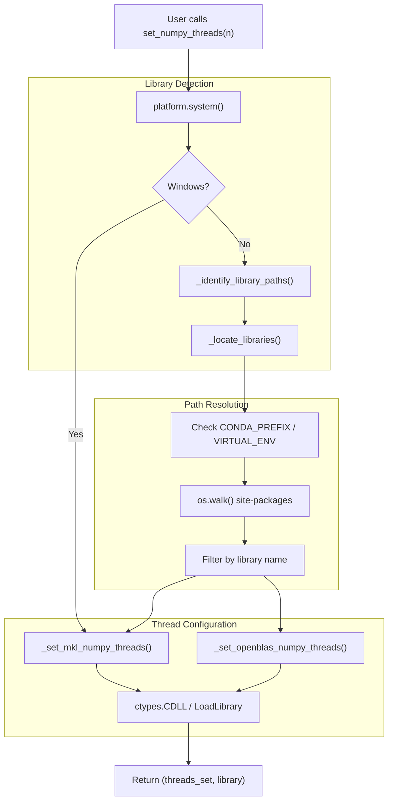
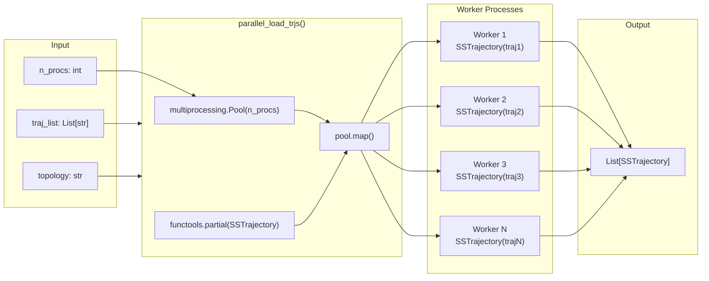
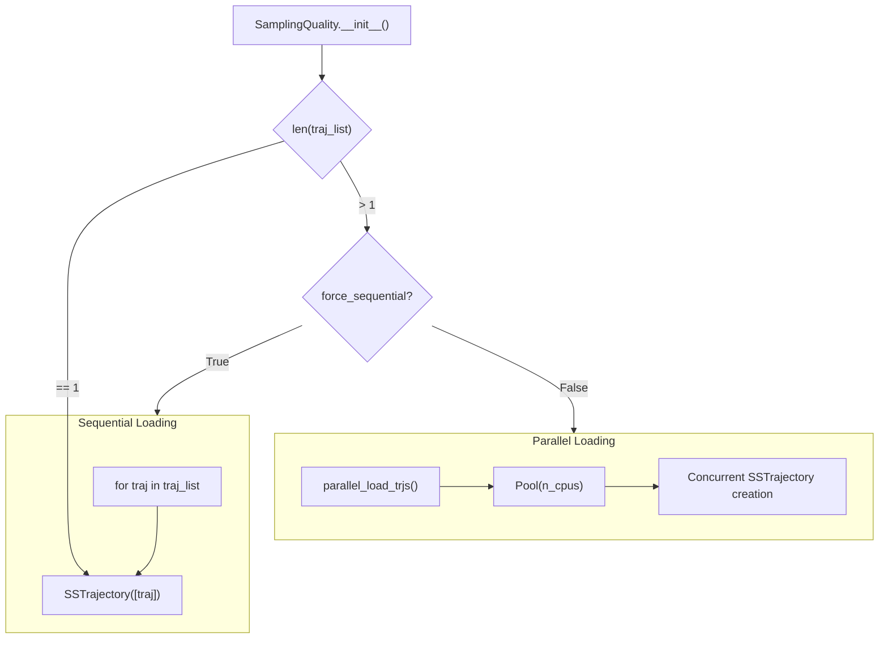
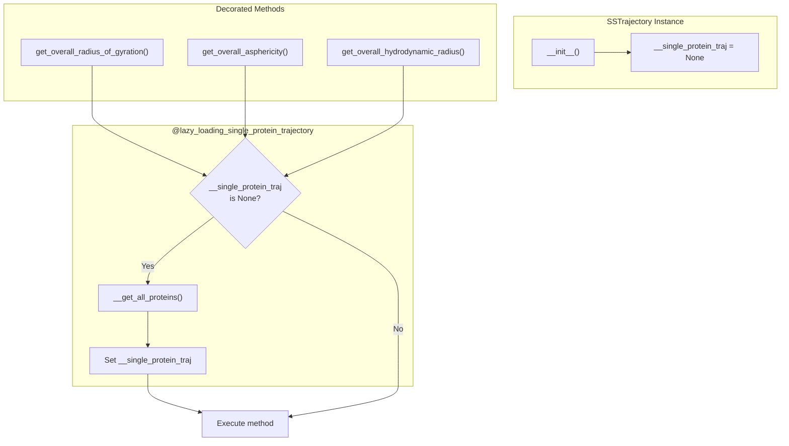
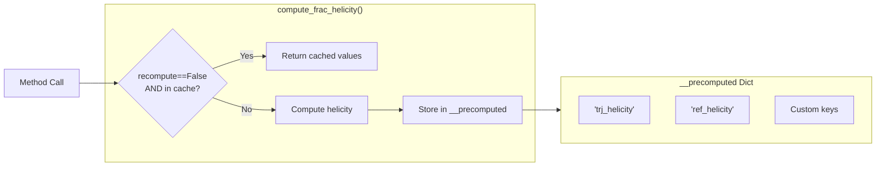
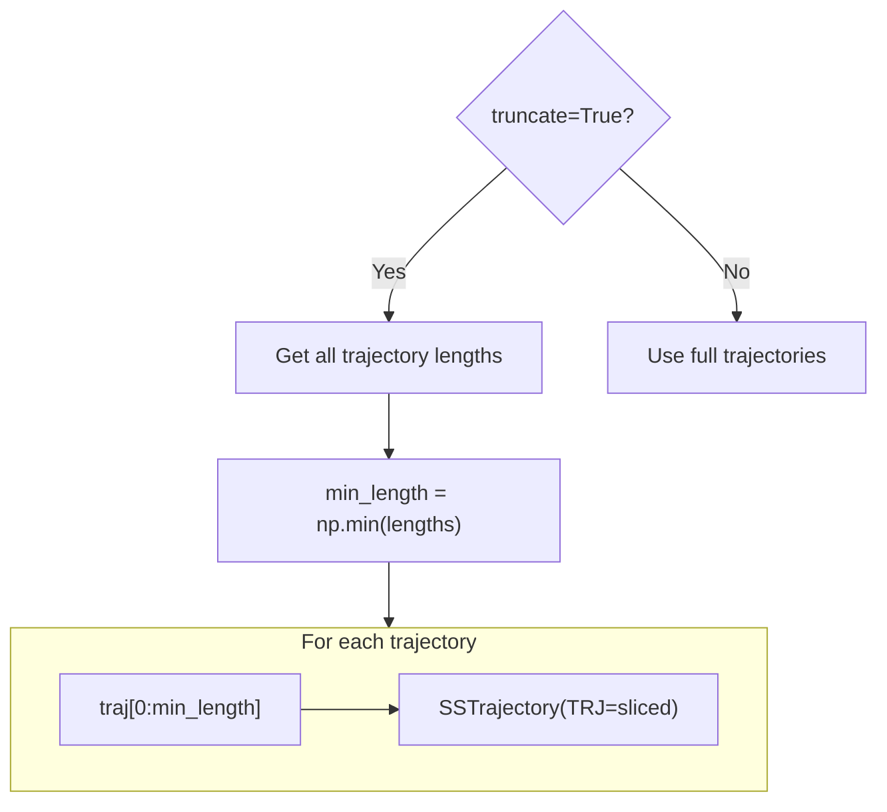
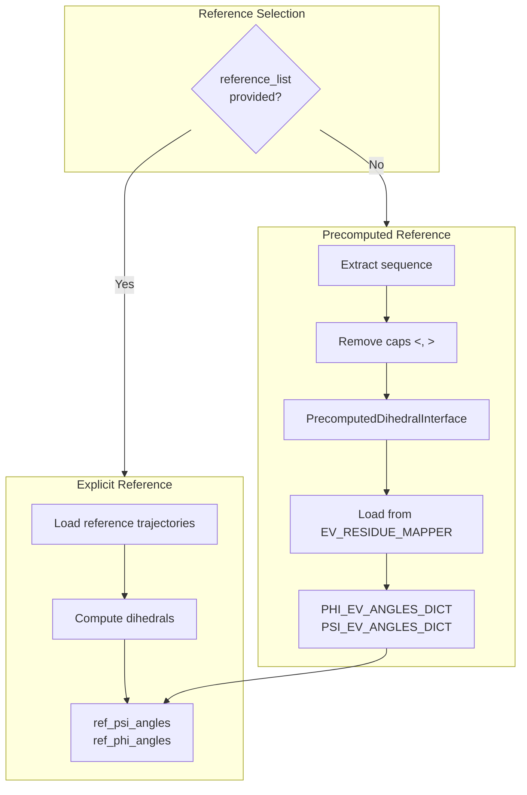
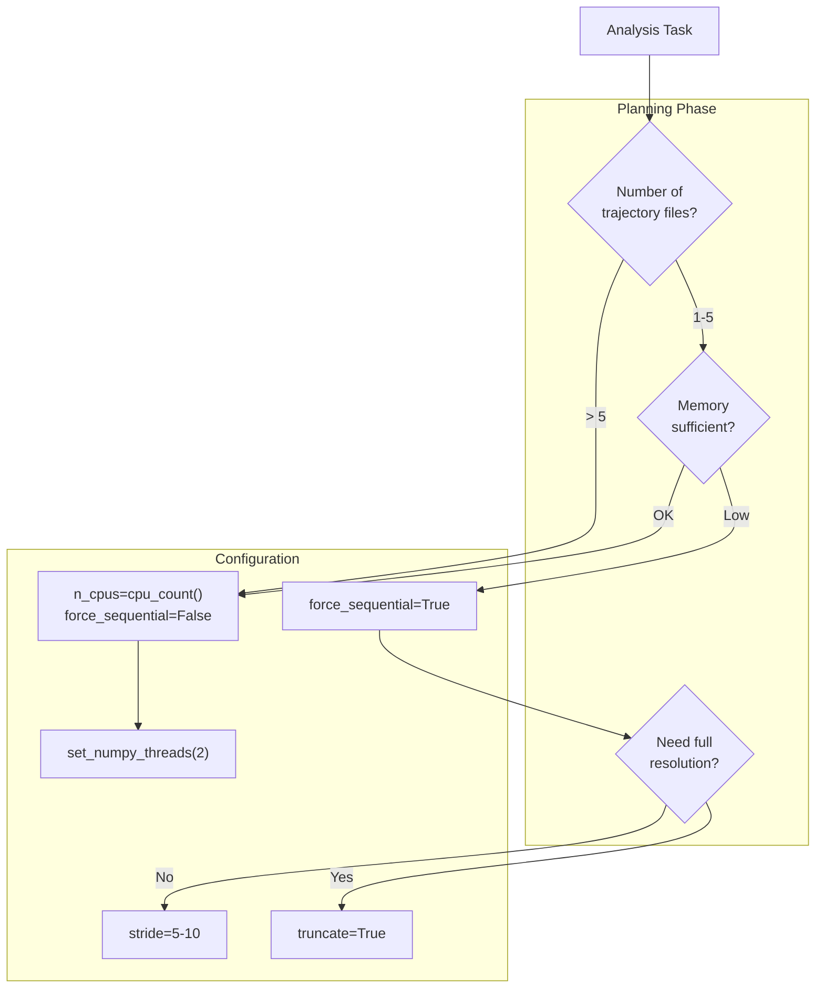
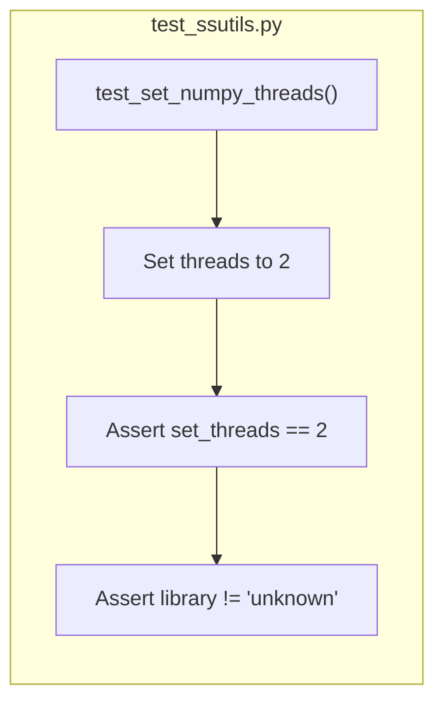

# Performance Optimization

<details>
<summary>Relevant source files</summary>

The following files were used as context for generating this wiki page:

- [.github/workflows/soursop-ci.yml](.github/workflows/soursop-ci.yml)
- [soursop/sssampling.py](soursop/sssampling.py)
- [soursop/sstrajectory.py](soursop/sstrajectory.py)
- [soursop/ssutils.py](soursop/ssutils.py)
- [soursop/tests/test_sssampling.py](soursop/tests/test_sssampling.py)
- [soursop/tests/test_ssutils.py](soursop/tests/test_ssutils.py)

</details>


## Purpose and Scope

This page documents performance optimization strategies and features available in SOURSOP for improving analysis speed, reducing memory footprint, and controlling computational resources. Topics covered include thread management for NumPy operations, parallel trajectory loading, lazy loading mechanisms, and caching strategies.

For information about general trajectory loading, see [Loading Trajectories](#3.1). For information about the plugin system architecture, see [Plugin Architecture](#8.1).

---

## Thread Control for NumPy Operations

SOURSOP provides explicit control over the number of threads used by NumPy's underlying BLAS libraries (MKL or OpenBLAS). This is critical when running multiple SOURSOP analyses concurrently or when working in environments with limited CPU resources.

### Setting Thread Count

The `ssutils.set_numpy_threads()` function allows you to limit NumPy's thread usage:

```python
from soursop import ssutils

# Limit NumPy to 4 threads
num_threads_set, library = ssutils.set_numpy_threads(4)
print(f"Set {num_threads_set} threads using {library}")
```

### Architecture and Implementation

The thread control system automatically detects the BLAS backend (MKL on Windows, MKL or OpenBLAS on Unix-like systems) and applies the appropriate configuration:



**Sources:** [soursop/ssutils.py:137-151](), [soursop/ssutils.py:29-49](), [soursop/ssutils.py:89-109]()

### Platform-Specific Behavior

| Platform | Library Search | File Extension | Notes |
|----------|---------------|----------------|-------|
| Windows | Direct `mkl` import | `.dll` | Uses conda's bundled MKL |
| Linux | Environment scanning | `.so*` | Searches CONDA_PREFIX or VIRTUAL_ENV |
| macOS | Environment scanning | `.dylib*` | Searches for Intel MKL or OpenBLAS |

### Why Thread Control Matters

NumPy operations (especially linear algebra routines like matrix multiplications, SVD, and eigenvalue computations) will by default attempt to use all available CPU cores. This can cause issues when:

1. **Running multiple SOURSOP analyses in parallel** - Each process may spawn many threads, leading to oversubscription
2. **Working on shared compute resources** - Respecting resource limits is important
3. **Memory bandwidth limitations** - More threads don't always mean faster execution

**Sources:** [soursop/ssutils.py:131-136](), [soursop/ssutils.py:52-86]()

---

## Parallel Trajectory Loading

SOURSOP provides parallel trajectory loading capabilities through the `parallel_load_trjs()` function, which significantly reduces I/O time when loading multiple trajectory files.

### Architecture



**Sources:** [soursop/sstrajectory.py:31-33](), [soursop/sssampling.py:297-310]()

### Usage in SamplingQuality

The `SamplingQuality` class automatically uses parallel loading when multiple trajectories are provided:



**Key Parameters:**

| Parameter | Type | Default | Description |
|-----------|------|---------|-------------|
| `n_cpus` | int | `os.cpu_count()` | Number of parallel processes |
| `force_sequential` | bool | False | Override parallel loading |
| `truncate` | bool | False | Match trajectory lengths |

**Sources:** [soursop/sssampling.py:255-310](), [soursop/sssampling.py:107-178]()

### When to Use Sequential vs Parallel Loading

**Use Parallel Loading (Default) When:**
- Loading multiple trajectory files (>1)
- Files are on fast storage (SSD, local disk)
- Sufficient RAM is available (each process loads a full trajectory)

**Use Sequential Loading (`force_sequential=True`) When:**
- Memory is limited (loads one trajectory at a time)
- Files are on slow network storage (parallel I/O may hurt performance)
- Debugging trajectory loading issues
- Only 1-2 trajectories are being loaded

**Sources:** [soursop/sssampling.py:280-310]()

---

## Lazy Loading Mechanisms

SOURSOP implements lazy loading for certain expensive operations that may not always be needed.

### Single Protein Trajectory Lazy Loading

The `SSTrajectory` class uses a decorator-based lazy loading pattern for the combined protein trajectory:



**Implementation Details:**

The `lazy_loading_single_protein_trajectory` decorator checks if the full protein trajectory has been loaded. If not, it extracts all protein atoms and creates a single `SSProtein` object:

- **Trigger:** First call to `get_overall_*()` methods
- **Cached:** Once loaded, reused for all subsequent calls
- **Memory Impact:** Single merged trajectory object instead of per-chain objects

**Sources:** [soursop/sstrajectory.py:34-58](), [soursop/sstrajectory.py:233-235](), [soursop/sstrajectory.py:665-689]()

---

## Caching Mechanisms

SOURSOP implements internal caching to avoid redundant computations.

### SamplingQuality Precomputed Cache

The `SamplingQuality` class maintains a `__precomputed` dictionary for expensive calculations:



**Cached Computations:**

| Key | Computation | Cost | Recompute Flag |
|-----|-------------|------|----------------|
| `trj_helicity` | DSSP secondary structure | High | `recompute` parameter |
| `ref_helicity` | Reference DSSP | High | `recompute` parameter |

**Usage Pattern:**

```python
# First call - computes and caches
helicity_1, ref_helicity_1 = sq.compute_frac_helicity(proteinID=0)

# Second call - returns cached values
helicity_2, ref_helicity_2 = sq.compute_frac_helicity(proteinID=0)

# Force recomputation
helicity_3, ref_helicity_3 = sq.compute_frac_helicity(proteinID=0, recompute=True)
```

**Sources:** [soursop/sssampling.py:180](), [soursop/sssampling.py:434-479]()

---

## Memory Management Strategies

### Trajectory Truncation

When analyzing ongoing simulations or comparing trajectories of different lengths, the `truncate` parameter enables memory-efficient processing:



**When to Truncate:**

- **Ongoing simulations:** Different replicas may have different lengths
- **Memory constraints:** Analyzing a consistent subset reduces memory
- **Fair comparisons:** Ensures all analyses use same amount of data

**Memory Savings Example:**

```
Without truncation:
  Traj1: 10,000 frames × 500 atoms × 8 bytes = 40 MB
  Traj2: 50,000 frames × 500 atoms × 8 bytes = 200 MB
  Total: 240 MB

With truncation to 10,000 frames:
  Traj1: 10,000 frames × 500 atoms × 8 bytes = 40 MB
  Traj2: 10,000 frames × 500 atoms × 8 bytes = 40 MB
  Total: 80 MB (67% reduction)
```

**Sources:** [soursop/sssampling.py:312-378]()

### Stride Parameter

All trajectory loading functions accept a `stride` parameter (passed via `**kwargs`) to load every nth frame:

```python
# Load every 10th frame
sq = SamplingQuality(
    traj_list,
    reference_list,
    top_file='topology.pdb',
    stride=10  # Passed to SSTrajectory
)
```

**Memory Impact:** Loading with `stride=10` reduces memory by ~90%.

**Sources:** [soursop/sssampling.py:156-159]()

---

## Precomputed Reference Data

For sampling quality analysis without explicit reference trajectories, SOURSOP uses precomputed dihedral distributions from excluded volume (EV) simulations.

### PrecomputedDihedralInterface



**Benefits:**

- **No reference trajectory needed:** Saves disk I/O and memory
- **Consistent baseline:** All comparisons use same EV model
- **Fast initialization:** Lookup is faster than computing dihedrals

**Data Source:** Precomputed from extensive EV simulations stored in `ssdata.py`

**Sources:** [soursop/sssampling.py:211-233](), [soursop/ssdata.py:26-29]()

---

## Performance Best Practices

### Optimal Configuration Matrix

| Scenario | `n_cpus` | `force_sequential` | `stride` | `truncate` | `set_numpy_threads` |
|----------|----------|-------------------|----------|-----------|---------------------|
| Single trajectory, full analysis | 1 | N/A | 1 | False | 4-8 |
| Multiple trajectories, HPC | `cpu_count()` | False | 1 | False | 1-2 |
| Memory-limited system | 2-4 | True | 5-10 | True | 2 |
| Quick exploratory analysis | 4-8 | False | 10 | True | 2-4 |
| Production analysis, many replicates | `cpu_count()` | False | 1 | False | 1 |

### Workflow Optimization Strategy



**Sources:** [soursop/sssampling.py:107-184](), [soursop/ssutils.py:137-151]()

### Profiling and Monitoring

**Monitoring Thread Usage:**

```python
from threadpoolctl import threadpool_info

# Check current BLAS configuration
info = threadpool_info()
for library in info:
    print(f"{library['user_api']}: {library['num_threads']} threads")
```

**Monitoring Memory:**

```python
import psutil
import os

process = psutil.Process(os.getpid())
mem_mb = process.memory_info().rss / 1024**2
print(f"Current memory usage: {mem_mb:.1f} MB")
```

---

## Common Performance Issues

### Issue 1: Slow Parallel Loading

**Symptoms:** `parallel_load_trjs()` is slower than sequential loading

**Causes:**
- Network file system (NFS, SMB) with poor parallel I/O
- Too many processes competing for I/O bandwidth
- Small trajectory files where process overhead dominates

**Solutions:**
1. Set `force_sequential=True`
2. Copy trajectories to local storage first
3. Reduce `n_cpus` to 2-4

**Sources:** [soursop/sssampling.py:280-310]()

### Issue 2: High Memory Usage

**Symptoms:** System runs out of memory during analysis

**Causes:**
- Loading many large trajectories simultaneously
- NumPy operations creating large intermediate arrays

**Solutions:**
1. Use `stride` to reduce loaded frames
2. Enable `truncate=True` to match trajectory lengths
3. Set `force_sequential=True` to load one at a time
4. Process trajectories in batches

**Sources:** [soursop/sssampling.py:312-378]()

### Issue 3: NumPy Using Too Many Threads

**Symptoms:** System becomes unresponsive, CPU usage at 100% across all cores

**Causes:**
- NumPy defaulting to all available cores
- Multiple SOURSOP processes each spawning many threads

**Solutions:**
```python
from soursop import ssutils

# Limit NumPy to 2 threads per process
ssutils.set_numpy_threads(2)
```

**Sources:** [soursop/ssutils.py:137-151]()

---

## Testing Performance Optimizations

The test suite includes verification of thread control functionality:



**Test Execution:**
```bash
pytest soursop/tests/test_ssutils.py::test_set_numpy_threads -v
```

**Sources:** [soursop/tests/test_ssutils.py:15-19](), [.github/workflows/soursop-ci.yml:46-50]()

---

## Summary

SOURSOP provides comprehensive performance optimization capabilities:

1. **Thread Control:** Explicit management of NumPy/BLAS threads via `ssutils.set_numpy_threads()`
2. **Parallel I/O:** Automatic parallel trajectory loading with `parallel_load_trjs()` 
3. **Lazy Loading:** Deferred initialization of expensive trajectory operations
4. **Caching:** Internal result caching in `SamplingQuality.__precomputed`
5. **Memory Management:** Trajectory truncation and stride options
6. **Precomputed Data:** EV reference data eliminates need for explicit reference trajectories

Optimal performance requires balancing parallelism, memory usage, and computational resources based on the specific analysis workflow and system constraints.