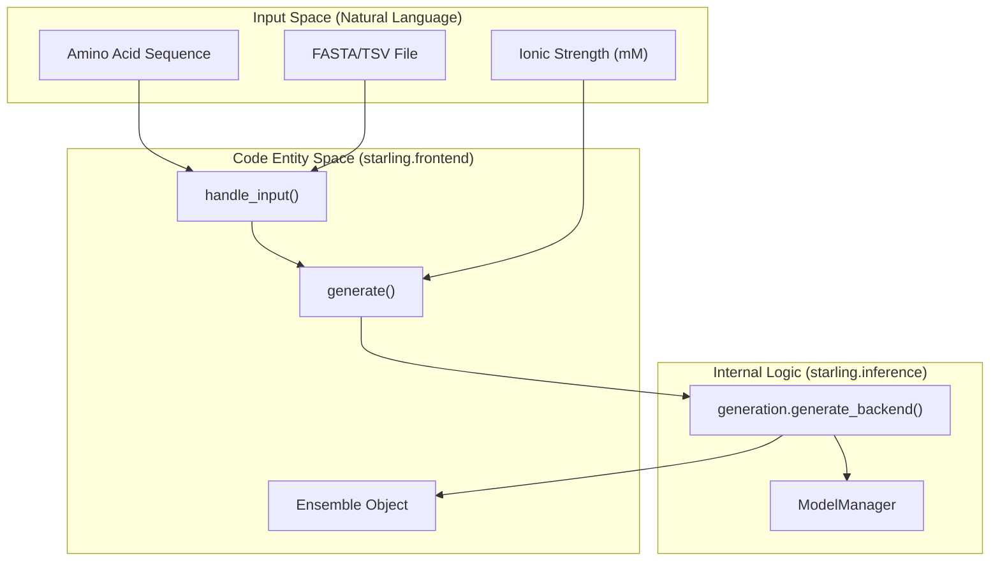
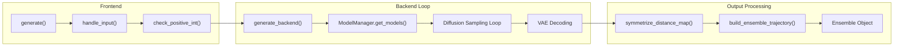

# Quick Start: Generating Ensembles

<details>
<summary>Relevant source files</summary>

The following files were used as context for generating this wiki page:

- [changelog.md](changelog.md)
- [demos/basic_usage.ipynb](demos/basic_usage.ipynb)
- [demos/constraining_ensembles.ipynb](demos/constraining_ensembles.ipynb)
- [demos/structural_ensemble.ipynb](demos/structural_ensemble.ipynb)
- [docs/autosummary/starling.structure.ensemble.Ensemble.rst](docs/autosummary/starling.structure.ensemble.Ensemble.rst)
- [docs/getting_started.rst](docs/getting_started.rst)
- [docs/usage/cli.rst](docs/usage/cli.rst)
- [docs/usage/ensemble_generation.rst](docs/usage/ensemble_generation.rst)
- [starling/frontend/ensemble_generation.py](starling/frontend/ensemble_generation.py)
- [starling/scripts/starling_main_cli.py](starling/scripts/starling_main_cli.py)

</details>


This page provides a practical guide for generating protein structural ensembles using STARLING. It covers the high-level `generate()` interface available via both the Python API and the Command Line Interface (CLI), detailing input/output formats and key sampling parameters.

### Overview of Ensemble Generation

The core entry point for ensemble generation is the `generate()` function. It orchestrates a two-stage generative pipeline: a Latent Diffusion Model (DDPM/DDIM) produces distance maps in a compressed latent space, which are then decoded by a Variational Autoencoder (VAE) and reconstructed into 3D coordinates using Multidimensional Scaling (MDS) [starling/frontend/ensemble_generation.py:160-182]().

#### Data Flow: Sequence to Ensemble

The following diagram maps the transition from natural language inputs (sequences) to code entities and final data structures.

**Diagram: Natural Language to Code Entity Mapping**

Sources: [starling/frontend/ensemble_generation.py:10-105](), [starling/frontend/ensemble_generation.py:160-265](), [starling/inference/generation.py:1-50]()

---

### Using the Python API

The `generate()` function is the primary high-level interface. It handles input normalization, sequence validation, and delegates to the backend sampling loops.

#### Input Formats
The `handle_input()` utility processes various formats into a standard `name: sequence` dictionary [starling/frontend/ensemble_generation.py:10-61]():
*   **String**: A single amino acid sequence.
*   **List**: A list of sequences (automatically named `sequence_1`, `sequence_2`, etc.).
*   **Dictionary**: A mapping of custom names to sequences.
*   **Files**: Path to a `.fasta`, `.tsv`, or `.in` file [starling/frontend/ensemble_generation.py:79-105]().

#### Basic Usage Example
```python
import starling

# Single sequence generation
sequence = "MDVFMKGLSKAKEGVVAAAEKTKQGVAEAAGKTKEGVLYVGSKTKEGVVHGVATVAEKTKEQVTNVGGAVVTGVTAVAQKTVEGAGSIAAATGFVKKDQLGKNEEGAPQEGILEDMPVDPDNEAYEMPSEEGYQDYEPEA"
ensemble = starling.generate(sequence, conformations=100, return_single_ensemble=True)

# Accessing properties
print(f"Mean Rg: {ensemble.radius_of_gyration(return_mean=True)} Å")
ensemble.save("my_ensemble.starling")
```
Sources: [starling/frontend/ensemble_generation.py:160-182](), [demos/basic_usage.ipynb:59-63](), [docs/getting_started.rst:58-69]()

#### Key Parameters
| Parameter | Default | Description |
| :--- | :--- | :--- |
| `conformations` | 400 | Number of structures to generate in the ensemble. |
| `steps` | 30 | Number of diffusion refinement steps. |
| `ionic_strength`| 150 | Solvent condition in mM (supports 20, 150, 300). |
| `sampler` | "ddim" | Sampling algorithm ("ddpm", "ddim", "plms"). |
| `device` | None | Hardware target (e.g., "cuda:0", "cpu", "mps"). |
| `return_structures`| False | If True, triggers 3D coordinate reconstruction (MDS). |

Sources: [starling/frontend/ensemble_generation.py:160-182](), [starling/configs.py:1-50]()

---

### Using the Command Line Interface (CLI)

STARLING provides a `starling` command for shell-based generation. It mirrors the Python `generate()` function arguments [starling/scripts/starling_main_cli.py:45-156]().

#### CLI Examples
**Generate from a string:**
```bash
starling "ACDEFGHIKLMNPQRSTVWY" -c 100 --outname my_prot -r
```

**Generate from a FASTA file with specific ionic strength:**
```bash
starling input.fasta --ionic_strength 20 --output_directory ./results
```
Sources: [starling/scripts/starling_main_cli.py:50-132](), [docs/usage/cli.rst:9-23]()

#### Benchmarking
The `starling-benchmark` tool allows users to profile performance on their specific hardware [starling/scripts/starling_main_cli.py:211-230]():
```bash
starling-benchmark --device cuda:0 --batch_size 64 --steps 25
```
Sources: [starling/scripts/starling_main_cli.py:211-230](), [docs/usage/cli.rst:40-51]()

---

### Implementation Details

The `generate()` function performs several validation steps before invoking the `generate_backend()` [starling/frontend/ensemble_generation.py:240-330]():
1.  **Sequence Validation**: Checks for non-canonical amino acids and enforces a maximum length of 380 residues [starling/frontend/ensemble_generation.py:66-74]().
2.  **Device Setup**: Auto-detects available accelerators (CUDA, MPS) if `device` is not specified [starling/scripts/starling_main_cli.py:36]().
3.  **Batching**: Organizes sequences into batches based on `batch_size` to optimize GPU memory utilization [starling/frontend/ensemble_generation.py:260-280]().
4.  **Reconstruction**: If `return_structures` is True, it invokes the MDS-based coordinate builder [starling/frontend/ensemble_generation.py:285-300]().

**Diagram: Internal Execution Flow**

Sources: [starling/frontend/ensemble_generation.py:10-182](), [starling/inference/generation.py:1-100](), [starling/structure/ensemble.py:1-50]()

---

### Output Formats

STARLING generates several output types depending on the parameters:
*   **`.starling`**: A serialized `Ensemble` object containing metadata and distance maps [starling/structure/ensemble.py:30-35]().
*   **`.pdb` / `.xtc`**: 3D coordinate trajectories, generated only if `return_structures=True` or requested via conversion tools [docs/usage/cli.rst:29-38]().
*   **`.npy`**: Raw distance maps exported as NumPy arrays [docs/usage/cli.rst:72]().

#### Removing Unphysical Frames
When generating trajectories, the `--remove-errors` flag (or `Ensemble.check_for_errors_trajectory(remove_errors=True)`) can be used to filter out frames where residues are separated by distances exceeding physical bond length limits [changelog.md:19-24](), [starling/utilities.py:11-17]().

Sources: [docs/usage/cli.rst:53-82](), [changelog.md:19-24](), [starling/structure/ensemble.py:21]()

---