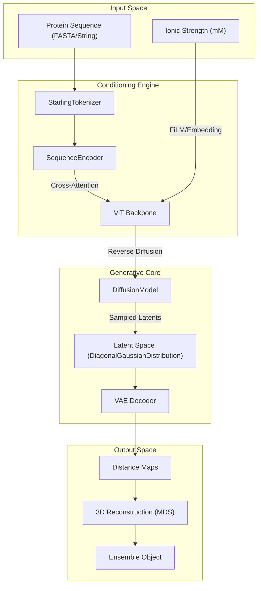
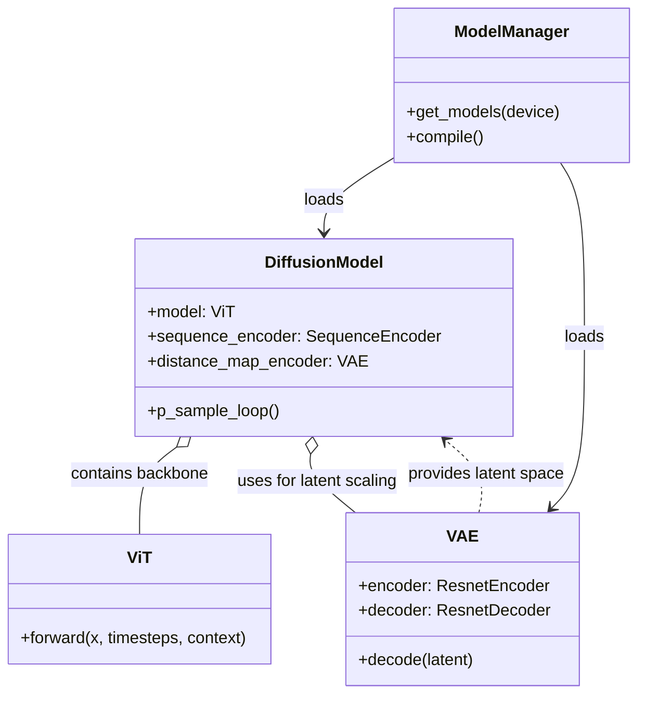

# Core Architecture

Relevant source files

The following files were used as context for generating this wiki page:

- [hubconf.py](hubconf.py)
- [starling/configs/vae_model/model.yaml](starling/configs/vae_model/model.yaml)
- [starling/data/ddpm_loader_tar.py](starling/data/ddpm_loader_tar.py)
- [starling/inference/model_loading.py](starling/inference/model_loading.py)
- [starling/models/diffusion.py](starling/models/diffusion.py)
- [starling/models/vae.py](starling/models/vae.py)
- [starling/training/diffusion_train.py](starling/training/diffusion_train.py)

STARLING employs a two-stage generative pipeline to transform amino acid sequences into structural ensembles. The architecture decouples the learning of the protein conformational manifold from the sequence-specific conditioning logic. 

1.  **Stage 1: Variational Autoencoder (VAE)** — Compresses high-dimensional inter-residue distance maps into a low-dimensional latent space.
2.  **Stage 2: Latent Diffusion Model (DDPM)** — Learns to generate these latent representations conditioned on protein sequences and environmental factors like ionic strength.

### System Overview and Data Flow

The following diagram illustrates the flow from a sequence input to the final ensemble generation, mapping high-level concepts to the internal code entities.

**Pipeline Data Flow**

**Sources:** [starling/models/diffusion.py:55-188](), [starling/models/vae.py:86-151](), [starling/inference/model_loading.py:48-61]()

---

### 1. Variational Autoencoder (VAE)
The VAE serves as the foundation of the pipeline, responsible for manifold learning. It encodes inter-residue distance maps into a compressed latent representation, significantly reducing the dimensionality for the diffusion process.

*   **Architecture:** Built using a ResNet-based encoder and decoder [starling/models/vae.py:157-166]().
*   **Latent Space:** Parameterized via a `DiagonalGaussianDistribution` [starling/models/vae.py:15]().
*   **Loss Function:** Optimized using the Evidence Lower Bound (ELBO), combining reconstruction loss (MSE or NLL) with KLD regularization [starling/models/vae.py:108-114]().
*   **Scheduling:** Features a `KLDWeightScheduler` to manage KLD warmup and cyclical annealing during training [starling/models/vae.py:21-84]().

For a detailed breakdown of the ResNet components and masking strategies, see [Variational Autoencoder (VAE)](#2.1).

**Sources:** [starling/models/vae.py:86-151](), [starling/configs/vae_model/model.yaml:1-17]()

---

### 2. Diffusion Model (DDPM)
The `DiffusionModel` performs the generative task within the VAE's latent space. It is a discrete-time denoising probabilistic model that learns to reverse a Gaussian noise process.

*   **Backbone:** Uses a Vision Transformer (`ViT`) to predict noise at each timestep [starling/models/diffusion.py:135]().
*   **Conditioning:** Integrates sequence information via a `SequenceEncoder` and environmental variables (ionic strength) [starling/models/diffusion.py:136-137]().
*   **Training Objective:** Implements standard diffusion loss with optional Min-SNR weighting for improved convergence [starling/models/diffusion.py:79-80]().
*   **Scaling:** Automatically calculates a `latent_space_scaling_factor` to normalize the VAE latent space to unit variance, ensuring stable diffusion training [starling/models/diffusion.py:158-160]().

For details on the forward/reverse process and transformer conditioning, see [Diffusion Model (DDPM)](#2.2).

**Sources:** [starling/models/diffusion.py:55-188](), [starling/training/diffusion_train.py:81-112]()

---

### 3. Model Loading and Infrastructure
The system uses a centralized management approach to handle the complexities of multi-model inference and hardware acceleration.

*   **ModelManager:** A singleton class that handles lazy loading of weights from local paths or remote URLs [starling/inference/model_loading.py:16-100]().
*   **Torch Compilation:** Supports `torch.compile` for both the `DiffusionModel` backbone and the `VAE` decoder to accelerate inference [starling/inference/model_loading.py:102-130]().
*   **PyTorch Hub:** Provides a standard entrypoint in `hubconf.py` for easy integration into external workflows [hubconf.py:6-18]().

For information on weight management and compilation settings, see [Model Loading and Inference Infrastructure](#2.3).

**Sources:** [starling/inference/model_loading.py:1-130](), [hubconf.py:1-18]()

---

### Model Relationship Diagram
This diagram shows how the core classes interact during the inference lifecycle.

**Sources:** [starling/inference/model_loading.py:48-61](), [starling/models/diffusion.py:135-144](), [starling/models/vae.py:157-166]()

---