# Variational Autoencoder (VAE)

Relevant source files

The following files were used as context for generating this wiki page:

- [starling/configs/vae_model/model.yaml](starling/configs/vae_model/model.yaml)
- [starling/data/data_wrangler.py](starling/data/data_wrangler.py)
- [starling/data/distributions.py](starling/data/distributions.py)
- [starling/data/positional_encodings.py](starling/data/positional_encodings.py)
- [starling/models/attention.py](starling/models/attention.py)
- [starling/models/blocks.py](starling/models/blocks.py)
- [starling/models/normalization.py](starling/models/normalization.py)
- [starling/models/transformer.py](starling/models/transformer.py)
- [starling/models/vae.py](starling/models/vae.py)
- [starling/models/vae_components.py](starling/models/vae_components.py)

The Variational Autoencoder (VAE) in STARLING serves as the foundational generative component that learns a compressed latent representation of protein distance maps. By encoding high-dimensional distance matrices into a low-dimensional, regularized latent space, the VAE enables the subsequent diffusion process to operate efficiently on latents rather than raw pixel-space coordinates [starling/models/vae.py:106-114]().

## Architecture Overview

The VAE architecture is based on a symmetric ResNet design, supporting both **ResNet-18** and **ResNet-34** backbones [starling/models/vae.py:157-166](). It processes input distance maps (typically $384 \times 384$) through an encoder to produce distribution parameters, which are then sampled and passed through a decoder to reconstruct the original map [starling/models/vae.py:125-132]().

### Data Flow and Component Mapping

The following diagram illustrates the transformation from raw distance map data to the latent space and back, mapping logical stages to specific code entities.

**Diagram: VAE Data Flow and Code Mapping**

```mermaid
graph LR
    subgraph "Input Space"
        Input["Distance Map (B, 1, 384, 384)"]
    end

    subgraph "Encoder Architecture"
        Enc["VAE.encoder (ResNet_Encoder)"]
        ResEnc["ResBlockEncBasic"]
        Dist["DiagonalGaussianDistribution"]
    end

    subgraph "Latent Space"
        Latent["Latent Vector (B, latent_dim, H', W')"]
    end

    subgraph "Decoder Architecture"
        Dec["VAE.decoder (ResNet_Decoder)"]
        ResDec["ResBlockDecBasic"]
        Out["ResizeConv2d"]
    end

    Input --> Enc
    Enc --> ResEnc
    ResEnc --> Dist
    Dist -- "sample()" --> Latent
    Latent --> Dec
    Dec --> ResDec
    ResDec --> Out
    Out --> Recon["Reconstructed Map"]

    style Dist stroke-dasharray: 5 5
```

**Sources:** [starling/models/vae.py:157-166](), [starling/models/vae_components.py:13-21](), [starling/models/vae_components.py:108-117](), [starling/data/distributions.py:5-30]()

## Latent Space Parameterization

The latent space is parameterized using the `DiagonalGaussianDistribution` class. The encoder outputs a tensor that is split into `mean` and `logvar` components [starling/data/distributions.py:20-21]().

*   **Numerical Stability**: Log-variance is clamped between -30.0 and 20.0 to prevent gradient explosion [starling/data/distributions.py:25]().
*   **Sampling**: Uses the reparameterization trick ($z = \mu + \sigma \odot \epsilon$) via the `sample()` method [starling/data/distributions.py:47-48]().
*   **Deterministic Mode**: Supports returning the `mode` (mean) for inference tasks where stochasticity is not desired [starling/data/distributions.py:78-87]().

**Sources:** [starling/data/distributions.py:5-87]()

## ELBO Loss and KLD Scheduling

The model is trained using the Evidence Lower Bound (ELBO), combining a reconstruction loss with a Kullback-Leibler Divergence (KLD) regularization term [starling/models/vae.py:108-112]().

| Loss Component | Implementation | Description |
| :--- | :--- | :--- |
| **Reconstruction** | `mse` or `nll` | Measures how well the decoder recovers the input map [starling/models/vae.py:133-134](). |
| **KLD** | `DiagonalGaussianDistribution.kl` | Penalizes deviation of the latent distribution from a standard normal prior [starling/data/distributions.py:50-67](). |
| **Weighting** | `KLDWeightScheduler` | Manages the trade-off between reconstruction and regularization [starling/models/vae.py:21-27](). |

### KLD Scheduling Strategies
To avoid "posterior collapse" (where the model ignores the latent space), STARLING implements a `KLDWeightScheduler` with two primary modes:
1.  **Linear**: Gradually increases the KLD weight from 0 to `max_weight` over a warmup period [starling/models/vae.py:50-54]().
2.  **Cyclical**: Periodically resets and ramps up the weight to encourage the model to utilize the latent space more effectively across multiple phases of training [starling/models/vae.py:55-67]().

**Sources:** [starling/models/vae.py:21-84](), [starling/data/distributions.py:50-76]()

## Implementation Details

### Masking and Symmetrization
Distance maps represent pairwise distances between residues. Since protein sequences vary in length, inputs are padded to a fixed dimension (e.g., 384) using `MaxPad` [starling/data/data_wrangler.py:58-80](). The VAE logic ensures that reconstruction loss is only calculated on the valid (non-padded) regions. Post-generation, the `symmetrize` utility is used to ensure the predicted distance maps maintain physical consistency ($d_{ij} = d_{ji}$) [starling/data/data_wrangler.py:128-141]().

### Torch.compile Support
The VAE is designed for high-performance inference and training. It supports `torch.compile` via the `compile_mode` parameter, typically set to `max-autotune` [starling/models/vae.py:102](). Precision is further optimized using `torch.set_float32_matmul_precision("high")` [starling/models/vae.py:18]().

### Building Blocks
The VAE relies on specialized convolutional blocks to manage spatial dimensions:
*   **Encoder**: Uses `ResBlockEncBasic` with strided convolutions for downsampling [starling/models/blocks.py:131-166]().
*   **Decoder**: Uses `ResBlockDecBasic` combined with `ResizeConv2d` (interpolation + convolution) to avoid checkerboard artifacts common in standard transposed convolutions [starling/models/blocks.py:65-128]().

For a deep dive into these primitives, see [VAE Building Blocks: ResNet Components and Attention](#2.1.1).

**Sources:** [starling/models/vae.py:18-102](), [starling/data/data_wrangler.py:58-141](), [starling/models/blocks.py:65-166]()

---