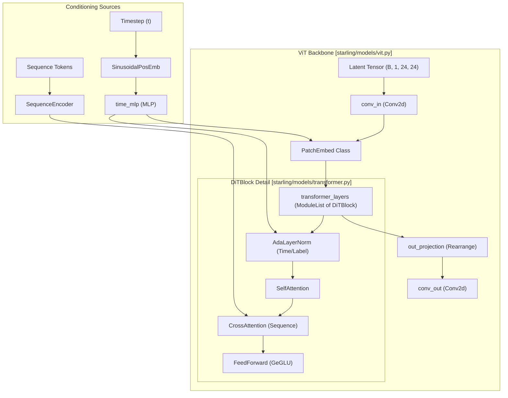
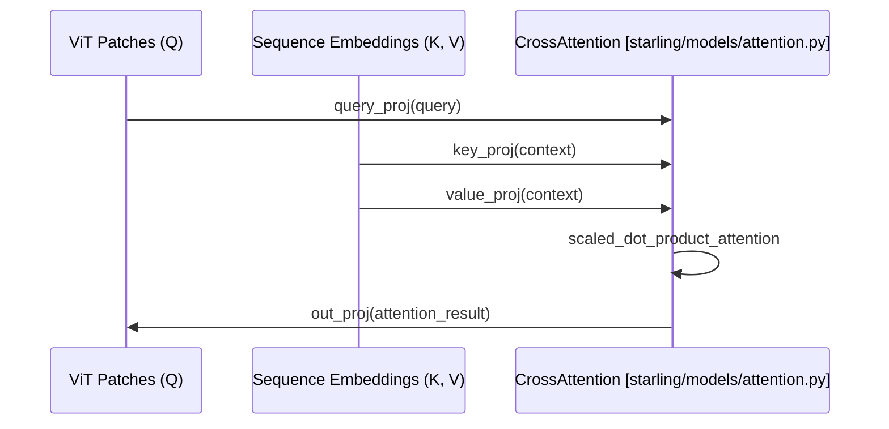

# Vision Transformer (ViT) Backbone and Transformer Blocks

Relevant source files

The following files were used as context for generating this wiki page:

- [starling/configs/configs.yaml](starling/configs/configs.yaml)
- [starling/configs/sequence_encoder/sequence_encoder.yaml](starling/configs/sequence_encoder/sequence_encoder.yaml)
- [starling/data/data_wrangler.py](starling/data/data_wrangler.py)
- [starling/data/distributions.py](starling/data/distributions.py)
- [starling/data/positional_encodings.py](starling/data/positional_encodings.py)
- [starling/models/attention.py](starling/models/attention.py)
- [starling/models/blocks.py](starling/models/blocks.py)
- [starling/models/transformer.py](starling/models/transformer.py)
- [starling/models/vae_components.py](starling/models/vae_components.py)
- [starling/models/vit.py](starling/models/vit.py)

The Vision Transformer (ViT) serves as the primary denoising backbone for the STARLING Latent Diffusion Model (LDM). It is designed to process compressed distance map latents produced by the VAE and is conditioned on protein sequence embeddings and ionic strength via cross-attention and adaptive normalization.

## ViT Architecture Overview

The ViT backbone in STARLING operates on latent tensors (typically of spatial dimension $24 \times 24$) by "patchifying" them into discrete tokens before processing them through a series of Transformer blocks.

### Data Flow in ViT
1.  **Input Projection**: The latent tensor $(B, 1, 24, 24)$ is first expanded by `conv_in` to a base dimension (64) [starling/models/vit.py:70-70]().
2.  **Patch Embedding**: The `PatchEmbed` module divides the image into $p \times p$ patches (default $p=3$), projects them to `embed_dim`, and adds learnable positional embeddings [starling/models/vit.py:9-29]().
3.  **Conditioning Injection**: Timestep and ionic strength information are injected via an MLP and applied as a scale/shift to the patch tokens [starling/models/vit.py:63-68](), [starling/models/vit.py:109-110]().
4.  **Transformer Processing**: A series of `DiTBlock` (Diffusion Transformer) layers perform self-attention and cross-attention against the protein sequence [starling/models/vit.py:76-78]().
5.  **Output Projection**: The tokens are projected back to the original latent spatial dimensions using `out_projection` (incorporating `Rearrange`) and a final convolution [starling/models/vit.py:80-94]().

### ViT to Code Entity Mapping
The following diagram bridges the mathematical concept of the ViT backbone to the specific classes implemented in the codebase.

**Sources:** [starling/models/vit.py:31-122](), [starling/models/transformer.py:103-136](), [starling/models/transformer.py:228-285]()

---

## Transformer Building Blocks

The ViT backbone relies on specialized Transformer components optimized for diffusion conditioning.

### DiTBlock (Diffusion Transformer Block)
The `DiTBlock` is the fundamental unit of the ViT backbone. Unlike standard Transformer blocks, it incorporates adaptive layer normalization (`AdaLayerNorm`) to modulate token activations based on the diffusion timestep [starling/models/transformer.py:228-285]().

*   **Adaptive Normalization**: Uses `AdaLayerNorm` to map the conditioning vector (time + ionic strength) to scale ($\gamma$) and shift ($\beta$) parameters [starling/models/transformer.py:103-136]().
*   **Self-Attention**: Standard multi-head self-attention between patches [starling/models/attention.py:162-210]().
*   **Cross-Attention**: Attends to the protein sequence embeddings provided by the `SequenceEncoder` [starling/models/attention.py:82-160]().

### Sinusoidal Positional Embeddings
Timestep information is encoded using `SinusoidalPosEmb`, which generates fixed sine and cosine frequencies [starling/models/transformer.py:15-58](). These are further processed by a `time_mlp` before being used in adaptive normalization [starling/models/vit.py:63-68]().

### Feed-Forward Networks (FFN)
The FFN within each block uses the `GeGLU` activation function, which combines a linear gate with GELU non-linearity [starling/models/transformer.py:139-166]().

| Component | Class Name | File Reference |
| :--- | :--- | :--- |
| Adaptive Norm | `AdaLayerNorm` | [starling/models/transformer.py:103]() |
| Diffusion Block | `DiTBlock` | [starling/models/transformer.py:228]() |
| Time Embedding | `SinusoidalPosEmb` | [starling/models/transformer.py:15]() |
| Attention Logic | `MultiHeadAttention` | [starling/models/attention.py:11]() |
| Gated Activation | `GeGLU` | [starling/models/transformer.py:139]() |

**Sources:** [starling/models/transformer.py:1-285](), [starling/models/attention.py:1-210]()

---

## Sequence Conditioning and SequenceEncoder

The ViT backbone is conditioned on the protein sequence through a dedicated `SequenceEncoder`.

### Sequence Encoding Process
The `SequenceEncoder` (often a `TransformerEncoder`) processes the one-hot encoded amino acid sequence [starling/data/data_wrangler.py:9-55](). 
1.  **Positional Encoding**: `PositionalEncoding1D` adds sequence-order information [starling/data/positional_encodings.py:8-101]().
2.  **Transformer Layers**: Multiple layers of `TransformerEncoder` (Self-Attention + FeedForward) extract high-level features [starling/models/transformer.py:194-225]().
3.  **Ionic Strength Dropout**: During training, ionic strength conditioning can be dropped out to ensure the model remains robust to sequence-only generation.

### Cross-Attention Mechanism
The `CrossAttention` module allows the ViT patches (Query) to look at the sequence embeddings (Key/Value).

**Sources:** [starling/models/attention.py:82-160](), [starling/models/vit.py:113-114]()

---

## Patching and Spatial Reconstruction

Because the diffusion process happens in a $24 \times 24$ latent space, the ViT must transition between spatial maps and token sequences.

### PatchEmbed
The `PatchEmbed` class uses a `Conv2d` with a kernel and stride equal to the `patch_size` to flatten spatial regions into tokens [starling/models/vit.py:12-14](). 
*   Input: $(B, 64, 24, 24)$
*   Output: $(B, 64, 512)$ (assuming 64 patches of 512-dim tokens) [starling/models/vit.py:22-24]().

### Rearrange and OutProjection
To return to the spatial domain, the `out_projection` uses `einops.Rearrange` to un-patchify the tokens [starling/models/vit.py:80-92]().
*   **Rearrange Pattern**: `"b (h w) (p1 p2 c) -> b c (h p1) (w p2)"` [starling/models/vit.py:84-91]().
*   This ensures that the spatial relationships between distance map pixels are preserved through the latent bottleneck.

**Sources:** [starling/models/vit.py:9-29](), [starling/models/vit.py:80-92]()

---