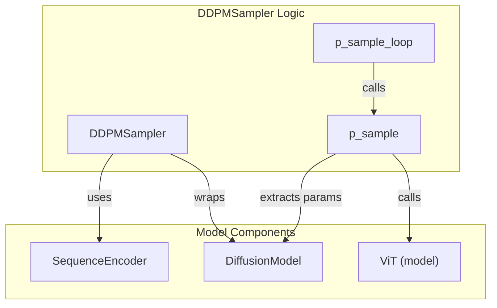
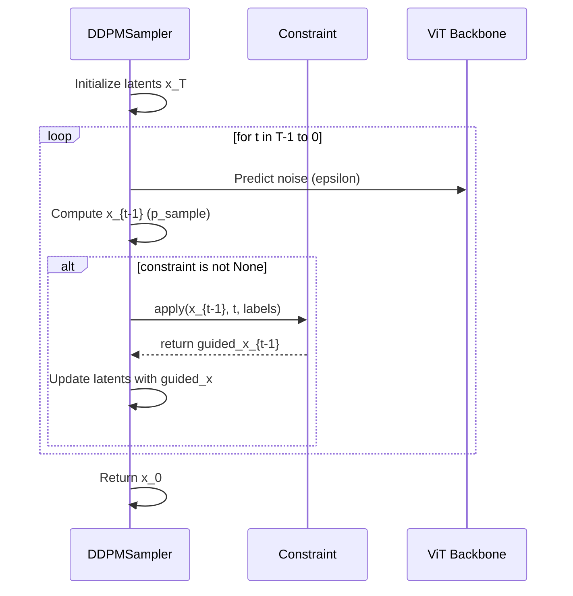

# DDPM Sampler

Relevant source files

The following files were used as context for generating this wiki page:

- [starling/models/diffusion.py](starling/models/diffusion.py)
- [starling/samplers/ddpm_sampler.py](starling/samplers/ddpm_sampler.py)
- [starling/tests/test_sequence_encoder_backend.py](starling/tests/test_sequence_encoder_backend.py)
- [starling/tests/test_sequence_encoder_backend_integration.py](starling/tests/test_sequence_encoder_backend_integration.py)
- [starling/training/diffusion_train.py](starling/training/diffusion_train.py)

The **DDPM Sampler** is the implementation of the Denoising Diffusion Probabilistic Model sampling algorithm within STARLING. It performs the reverse diffusion process to transform Gaussian noise into structured latent representations of protein distance maps, conditioned on primary sequences and ionic strength.

## Overview

The `DDPMSampler` class facilitates the iterative denoising process. It interacts with the `DiffusionModel` to retrieve pre-calculated noise schedules and the `ViT` backbone to predict noise at each timestep. The sampler is designed to handle both standard generation and guided generation through a constraint integration hook.

### Key Components and Data Flow

The sampling process begins with a primary sequence, which is tokenized and encoded into a condition embedding. A latent tensor of pure noise is then iteratively refined over $T$ timesteps (default $T=1000$).

**Sequence-to-Code Mapping**
| Concept | Code Entity | File Path |
| :--- | :--- | :--- |
| **Sampler Class** | `DDPMSampler` | [starling/samplers/ddpm_sampler.py:44-45]() |
| **Conditioning** | `generate_labels` | [starling/samplers/ddpm_sampler.py:67-68]() |
| **Step Logic** | `p_sample` | [starling/samplers/ddpm_sampler.py:92-93]() |
| **Loop Logic** | `p_sample_loop` | [starling/samplers/ddpm_sampler.py:150-151]() |
| **Tokenization** | `StarlingTokenizer` | [starling/samplers/ddpm_sampler.py:65-65]() |

**Sources:** [starling/samplers/ddpm_sampler.py:44-151](), [starling/models/diffusion.py:55-82]()

## Sampling Loop Logic

The core of the generation process is `p_sample_loop`. This function orchestrates the transition from $x_T \sim \mathcal{N}(0, \mathbf{I})$ to $x_0$ (the clean latent).

### `p_sample_loop` Execution Flow
1. **Label Generation**: The input sequence string is passed to `generate_labels`, which uses the `StarlingTokenizer` and `ddpm_model.sequence2labels` to create conditioning embeddings [starling/samplers/ddpm_sampler.py:182-188]().
2. **Noise Initialization**: A latent tensor is initialized using `torch.randn` [starling/samplers/ddpm_sampler.py:188-188]().
3. **Constraint Initialization**: If a constraint object is provided, it is initialized with the VAE decoder and scaling factors [starling/samplers/ddpm_sampler.py:203-208]().
4. **Reverse Iteration**: The loop runs from $t = T-1$ down to $0$. In each step, it calls `p_sample` [starling/samplers/ddpm_sampler.py:211-224]().

**Sources:** [starling/samplers/ddpm_sampler.py:150-224]()

### Denoising Step (`p_sample`)
The `p_sample` function implements the stochastic denoising step:
$$x_{t-1} = \frac{1}{\sqrt{\alpha_t}} \left( x_t - \frac{\beta_t}{\sqrt{1-\bar{\alpha}_t}} \epsilon_\theta(x_t, t, c) \right) + \sigma_t z$$
where $z \sim \mathcal{N}(0, \mathbf{I})$ for $t > 0$, and $z=0$ for $t=0$ [starling/samplers/ddpm_sampler.py:135-148]().

**Sources:** [starling/samplers/ddpm_sampler.py:92-149]()

## Technical Architecture

The following diagram illustrates the relationship between the Sampler, the Diffusion Model, and the underlying Transformer backbone.

### Entity Relationship Diagram

**Sources:** [starling/samplers/ddpm_sampler.py:44-54](), [starling/models/diffusion.py:135-137]()

## Stochastic Noise Injection

Stochasticity is maintained during the reverse process by adding noise scaled by the `posterior_variance` at every step except $t=0$ [starling/samplers/ddpm_sampler.py:141-148](). The variance values are pre-calculated in the `DiffusionModel` constructor and registered as buffers [starling/models/diffusion.py:167-183]().

**Sources:** [starling/samplers/ddpm_sampler.py:141-148](), [starling/models/diffusion.py:167-183]()

## Constraint Integration Hooks

The `DDPMSampler` supports guided diffusion by integrating with the `Constraint` framework. Within the `p_sample_loop`, the sampler provides hooks to modify the latents based on gradients from structural constraints.

### Constraint Application Sequence

**Sources:** [starling/samplers/ddpm_sampler.py:196-224]()

## Latent-to-Distance-Map Decoding

Once the denoising loop reaches $t=0$, the resulting latent tensor is scaled back using the `latent_space_scaling_factor` [starling/samplers/ddpm_sampler.py:63-63](). This factor is crucial as it reverses the normalization applied during training to ensure the latent space has unit variance [starling/models/diffusion.py:158-160]().

The final latents are decoded into distance maps using the VAE's `decode` method. The `DDPMSampler` stores a reference to the `encoder_model` (which is a VAE instance) specifically for this purpose and for calculating constraint gradients in latent space [starling/samplers/ddpm_sampler.py:54-54]().

**Sources:** [starling/samplers/ddpm_sampler.py:54-63](), [starling/models/diffusion.py:158-160]()

---