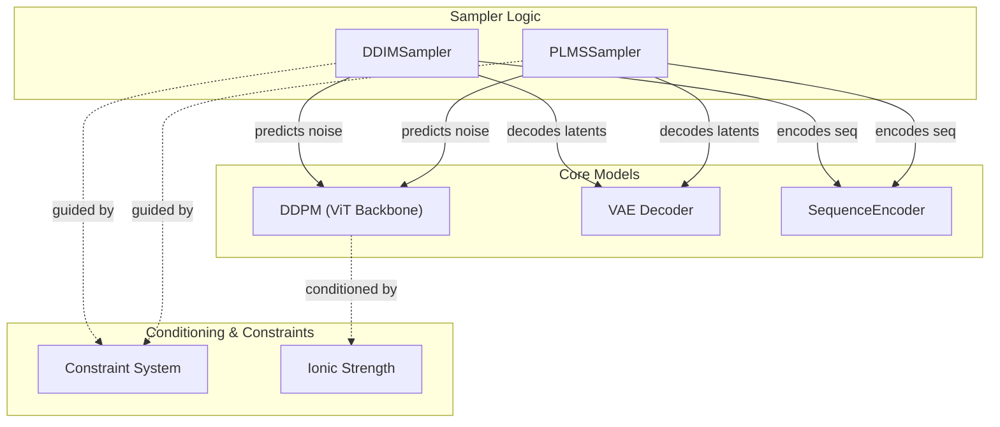
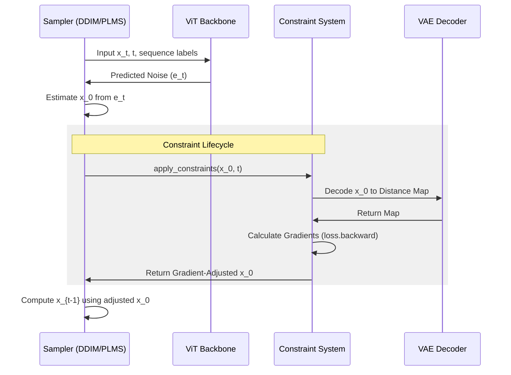

# Accelerated Samplers: DDIM and PLMS

Relevant source files

The following files were used as context for generating this wiki page:

- [starling/samplers/ddim_sampler.py](starling/samplers/ddim_sampler.py)
- [starling/samplers/plms_sampler.py](starling/samplers/plms_sampler.py)

STARLING provides two accelerated sampling algorithms, **DDIM** (Denoising Diffusion Implicit Models) and **PLMS** (Pseudo Linear Multi-Step), designed to significantly reduce the number of inference steps required to generate high-quality protein ensembles. While standard DDPM typically requires 1000 steps, these samplers can produce comparable results in 25–100 steps [starling/samplers/ddim_sampler.py:30-33]().

## Overview of Accelerated Sampling

Both samplers operate by discretizing the diffusion process into a smaller subset of timesteps than those used during training [starling/samplers/ddim_sampler.py:44-45](). They leverage the `ddpm_model` for noise prediction and the `encoder_model` (VAE) for decoding latents back into distance maps [starling/samplers/ddim_sampler.py:20-23]().

### Discretization Schedules
The samplers support two primary methods for selecting the subset of timesteps $t$:
*   **Uniform**: Steps are spaced evenly across the training range [starling/samplers/ddim_sampler.py:73-75]().
*   **Quad**: Steps are spaced quadratically, placing more density near $t=0$ to refine structural details [starling/samplers/ddim_sampler.py:76-79]().

### Component Interaction Diagram
The following diagram illustrates how the sampler classes interact with the core model components and the constraint system.

**Sampler-Model Interaction**

**Sources:** [starling/samplers/ddim_sampler.py:19-28](), [starling/samplers/plms_sampler.py:62-72]()

---

## DDIM: Denoising Diffusion Implicit Models

`DDIMSampler` implements a non-Markovian forward process that allows for deterministic sampling when `ddim_eta` is set to 0.0 [starling/samplers/ddim_sampler.py:48-52]().

### Key Parameters
*   **ddim_eta**: Interpolates between deterministic (0.0) and stochastic (1.0) processes [starling/samplers/ddim_sampler.py:48-52]().
*   **temperature**: Scales the noise injected during stochastic sampling [starling/samplers/ddim_sampler.py:152-153]().

### Implementation Details
The sampler pre-calculates the variance schedule ($\sigma$) and cumulative products ($\alpha$) based on the chosen discretization [starling/samplers/ddim_sampler.py:83-100](). During each step, it predicts the noise $\epsilon_\theta$, estimates the original latent $x_0$, and computes the next latent $x_{t-1}$ using the DDIM update rule [starling/samplers/ddim_sampler.py:246-276]().

**Sources:** [starling/samplers/ddim_sampler.py:19-100](), [starling/samplers/ddim_sampler.py:246-276]()

---

## PLMS: Pseudo Linear Multi-Step Sampler

`PLMSSampler` uses an Adams-Bashforth multi-step method to improve the accuracy of the ODE trajectory. It maintains a history of noise predictions to calculate a higher-order update [starling/samplers/plms_sampler.py:265-275]().

### Multi-Step Logic
For the first three steps, the sampler uses a standard DDIM update to populate the prediction history [starling/samplers/plms_sampler.py:255-263](). From the fourth step onwards, it uses a linear combination of the current and previous three noise estimates to compute the "Pseudo-Improved" noise [starling/samplers/plms_sampler.py:265-275]().

### Dynamic Thresholding
PLMS utilizes `dynamic_thresholding_fn` to stabilize the generation of VAE latents. It calculates a per-sample quantile threshold (default $p=0.995$) to clamp and rescale predicted $x_0$ values, preventing numerical instability in the latent space [starling/samplers/plms_sampler.py:26-46]().

**Sources:** [starling/samplers/plms_sampler.py:26-46](), [starling/samplers/plms_sampler.py:255-275]()

---

## Constraint Application Lifecycle

Both samplers support guided diffusion via the `Constraint` framework. Constraints are applied to the predicted $x_0$ at every timestep to steer the generation toward specific physical properties (e.g., $R_g$, helicity) [starling/samplers/ddim_sampler.py:228-244]().

**Constraint Data Flow**

### Lifecycle Steps:
1.  **Initialization**: Before sampling, `constraint.initialize` is called to set up the encoder and scaling factors [starling/samplers/ddim_sampler.py:201-206]().
2.  **Prediction**: The model predicts noise $\epsilon$ and derives the latent $x_0$ [starling/samplers/ddim_sampler.py:220-226]().
3.  **Guidance**: If constraints are present, `constraint.apply_constraints` is called. This typically involves decoding the latent to a distance map, calculating a loss against the target constraint, and updating the latent via the gradient of that loss [starling/samplers/ddim_sampler.py:228-244]().
4.  **Logging**: `ConstraintLogger` tracks the satisfaction of constraints across the denoising trajectory [starling/samplers/ddim_sampler.py:195-199]().

**Sources:** [starling/samplers/ddim_sampler.py:194-207](), [starling/samplers/ddim_sampler.py:228-244](), [starling/samplers/plms_sampler.py:217-230]()

---