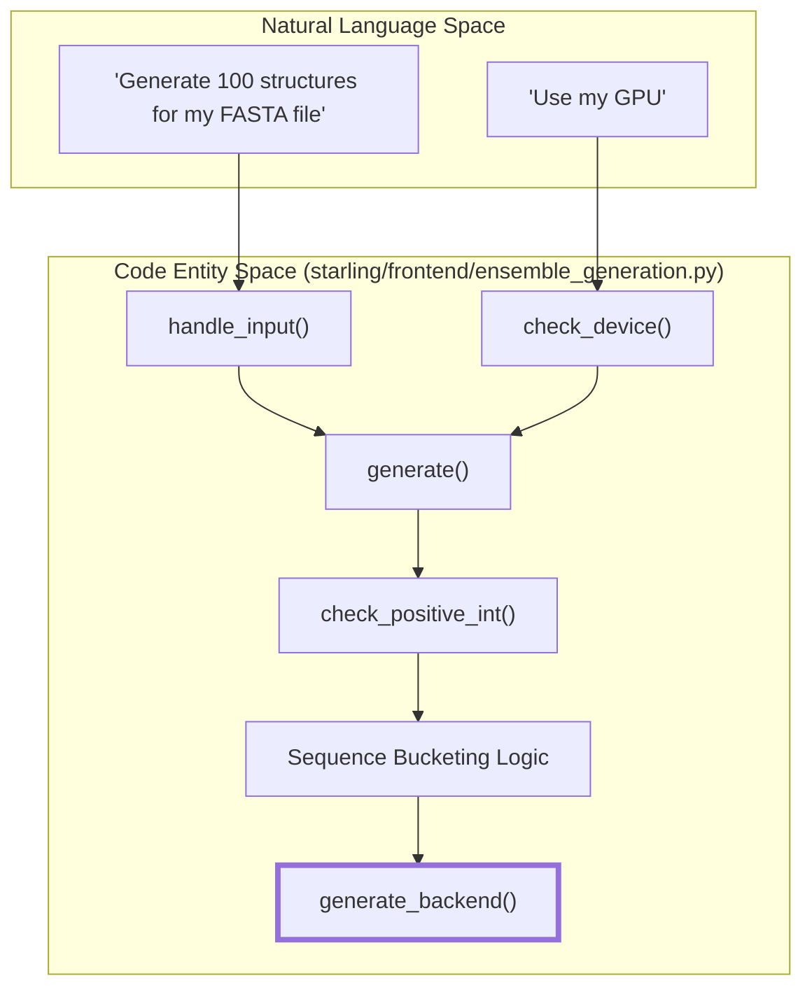
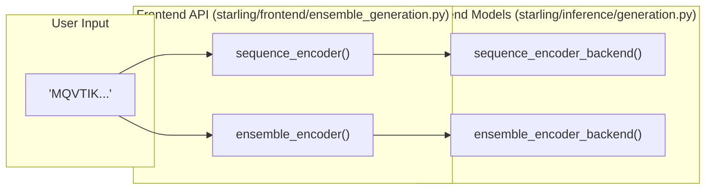
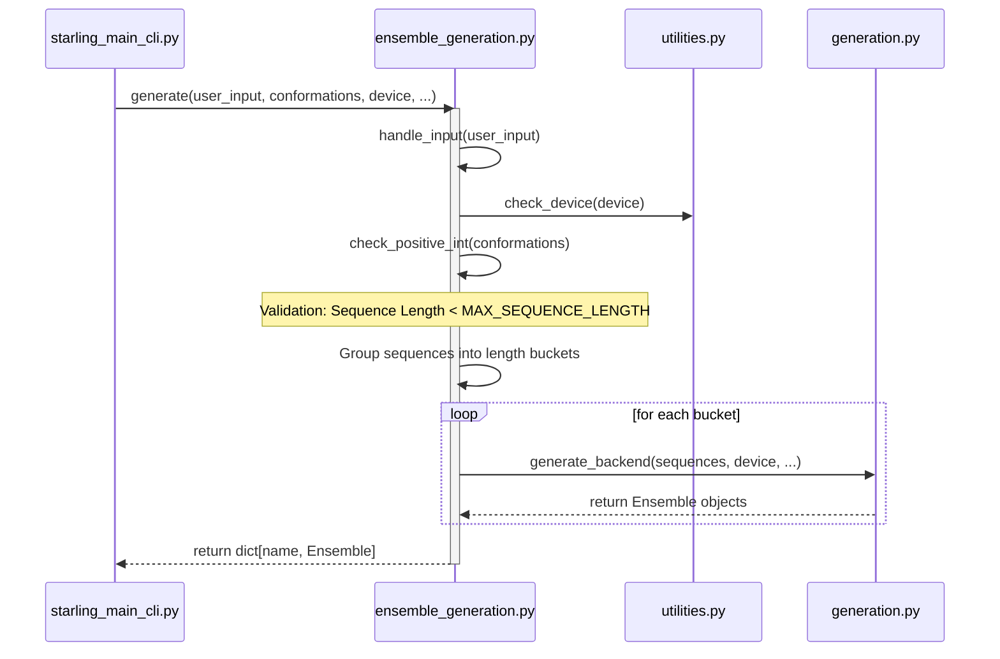

# Frontend API: generate(), sequence_encoder(), and ensemble_encoder()

Relevant source files

The following files were used as context for generating this wiki page:

- [starling/frontend/ensemble_generation.py](starling/frontend/ensemble_generation.py)
- [starling/scripts/starling_main_cli.py](starling/scripts/starling_main_cli.py)
- [starling/utilities.py](starling/utilities.py)

The STARLING frontend API serves as the primary entry point for users to interact with the generative models. It is designed to handle the complexity of input normalization, validation, and optimization before delegating to the backend generation logic. This layer ensures that all inputs conform to the physical and architectural constraints of the underlying neural networks.

## Input Normalization: `handle_input`

The `handle_input` function is the gatekeeper for all sequence data entering the pipeline. It supports a wide variety of formats and ensures that sequences are cleaned and validated.

### Data Flow and Transformation
`handle_input` transforms various input types into a standardized dictionary format (`{name: sequence}`).

| Input Type | Handling Logic |
| :--- | :--- |
| **FASTA File** | Parsed using `protfasta.read_fasta`. Supports `invalid_sequence_action`. [starling/frontend/ensemble_generation.py:85-90]() |
| **TSV / .in File** | Parsed as tab-separated `name\tsequence`. Validates against duplicate names. [starling/frontend/ensemble_generation.py:91-104]() |
| **String** | Interpreted as a single amino acid sequence. [starling/frontend/ensemble_generation.py:106-120]() |
| **List** | Sequences are indexed automatically (e.g., `sequence_1`, `sequence_2`). [starling/frontend/ensemble_generation.py:123-128]() |
| **Dict** | Validated to ensure all values are clean amino acid sequences. [starling/frontend/ensemble_generation.py:129-134]() |

### Sequence Validation
The internal `clean_sequence` function enforces the following:
1.  **Standard Residues Only**: Only the 20 canonical amino acids (`ACDEFGHIKLMNPQRSTVWY`) are permitted. [starling/frontend/ensemble_generation.py:68-69]()
2.  **Case Normalization**: All sequences are converted to uppercase. [starling/frontend/ensemble_generation.py:67]()
3.  **Strict Length Matching**: If the cleaned sequence length differs from the input length (due to invalid characters), a `ValueError` is raised. [starling/frontend/ensemble_generation.py:71-72]()

**Sources:**
- `starling/frontend/ensemble_generation.py:10-139]()`

---

## The `generate()` Function

The `generate()` function is the primary user-facing API. It implements a **Validate-then-Delegate** pattern: it performs exhaustive sanity checks on parameters and hardware availability before calling `generate_backend`.

### Parameter Sanity Checks
`generate()` validates several key parameters to prevent runtime failures in the diffusion loop:
*   **Positive Integers**: `conformations`, `steps`, and `batch_size` must be positive integers. [starling/frontend/ensemble_generation.py:228-251]()
*   **Device Selection**: Uses `utilities.check_device` to resolve `None`, `cpu`, `cuda`, or `mps`. [starling/frontend/ensemble_generation.py:253-254]()
*   **Sequence Length**: Enforces `configs.MAX_SEQUENCE_LENGTH`. Any sequence exceeding this limit is flagged, and the function raises a `ValueError`. [starling/frontend/ensemble_generation.py:276-285]()

### Bucketing Optimization
To maximize GPU throughput, `generate()` groups sequences of the same length into "buckets." This minimizes the need for excessive padding during the diffusion sampling process.
1.  Sequences are analyzed and grouped by length. [starling/frontend/ensemble_generation.py:287-293]()
2.  Each bucket is processed independently by the backend. [starling/frontend/ensemble_generation.py:302-334]()

### Bridge: Natural Language to Code Space (Generation)
This diagram maps the user's conceptual request to the specific code entities involved in the `generate` workflow.

**Sources:**
- `starling/frontend/ensemble_generation.py:160-334]()`
- `starling/utilities.py:148-241]()`

---

## Sequence and Ensemble Encoders

Beyond generating distance maps and 3D structures, the frontend provides specialized encoders for sequence-to-latent and sequence-to-ensemble representations.

### `sequence_encoder()`
This function wraps the `SequenceEncoder` model (a Transformer-based architecture). It converts raw amino acid sequences into high-dimensional latent embeddings.
*   **Input**: Normalized via `handle_input`. [starling/frontend/ensemble_generation.py:382]()
*   **Validation**: Checks device and sequence length limits. [starling/frontend/ensemble_generation.py:385-397]()
*   **Delegation**: Passes the validated dictionary to `sequence_encoder_backend`. [starling/frontend/ensemble_generation.py:408]()

### `ensemble_encoder()`
This function generates a latent representation of the *entire ensemble* for a given sequence. It essentially runs the diffusion model to produce latents without necessarily decoding them into 3D coordinates.
*   **Purpose**: Useful for similarity searching or latent space analysis.
*   **Flow**: Similar to `generate()`, but calls `ensemble_encoder_backend`. [starling/frontend/ensemble_generation.py:487]()

### Bridge: Natural Language to Code Space (Encoding)
This diagram illustrates how the encoding functions bridge user strings to model latents.

**Sources:**
- `starling/frontend/ensemble_generation.py:346-410]()` (sequence_encoder)
- `starling/frontend/ensemble_generation.py:413-489]()` (ensemble_encoder)

---

## Execution Flow Summary

The following sequence diagram details the interaction between the CLI, the Frontend API, and the Backend.

**Sources:**
- `starling/scripts/starling_main_cli.py:185-200]()`
- `starling/frontend/ensemble_generation.py:276-334]()`
- `starling/utilities.py:148-173]()`

---