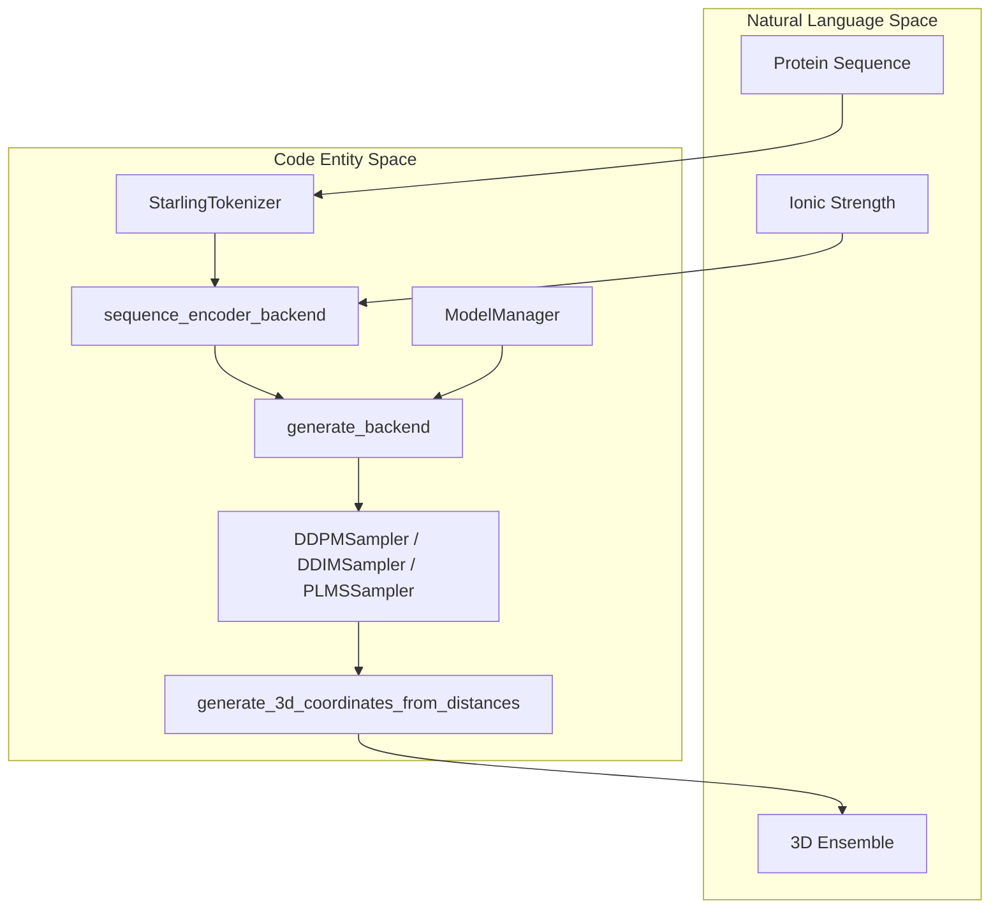
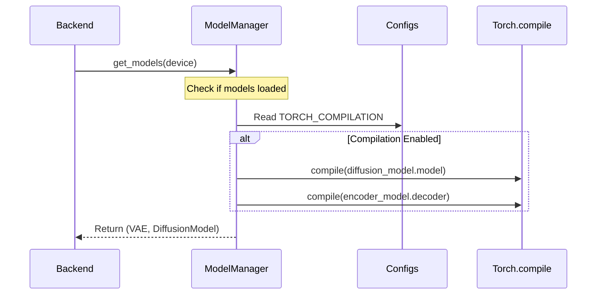

# Backend Generation: generate_backend and sequence_encoder_backend

Relevant source files

The following files were used as context for generating this wiki page:

- [hubconf.py](hubconf.py)
- [starling/data/ddpm_loader_tar.py](starling/data/ddpm_loader_tar.py)
- [starling/inference/generation.py](starling/inference/generation.py)
- [starling/inference/model_loading.py](starling/inference/model_loading.py)

The backend generation layer in STARLING serves as the bridge between the high-level API and the neural network components. It manages the lifecycle of model inference, including sequence batching, latent space diffusion, and the final 3D reconstruction of protein ensembles.

## System Overview and Data Flow

The backend logic is primarily housed in `starling/inference/generation.py`. It orchestrates the flow from raw sequences to 3D coordinates using a multi-step pipeline: tokenization, embedding generation via the `SequenceEncoder`, sampling in latent space via the `DiffusionModel`, and decoding via the `VAE` decoder.

### Sequence to Ensemble Flow

The following diagram illustrates how high-level system components map to specific code entities during the generation process.

| Diagram: Backend Generation Entity Mapping |
| :--- |

**Sources:** [starling/inference/generation.py:64-79](), [starling/inference/generation.py:214-239](), [starling/inference/model_loading.py:16-20]()

---

## Sequence Encoder Backend

The `sequence_encoder_backend` function is responsible for transforming protein sequences into the high-dimensional embeddings required by the diffusion model's cross-attention mechanism [starling/inference/generation.py:64-79]().

### Key Features
1.  **Bucketing:** To minimize computational waste from padding, sequences can be grouped into length buckets (defined by `bucket_size`) [starling/inference/generation.py:104-109]().
2.  **Tokenization:** Converts string sequences into integer tokens using the `StarlingTokenizer` unless `pretokenized` is set to `True` [starling/inference/generation.py:123-149]().
3.  **Conditioning:** The `ionic_strength` is injected as a conditioning variable, converted to a tensor and broadcast across the batch [starling/inference/generation.py:128-128]().
4.  **Memory Management:** If `free_cuda_cache` is enabled, `torch.cuda.empty_cache()` is called after each batch to prevent fragmentation [starling/inference/generation.py:110-111]().

**Sources:** [starling/inference/generation.py:64-122](), [starling/inference/generation.py:152-162]()

---

## Generate Backend

The `generate_backend` function is the core execution loop for ensemble generation. It coordinates the diffusion sampling process and the subsequent decoding of latent representations into distance maps [starling/inference/generation.py:214-239]().

### The Sampling Loop
The function selects a sampler (DDPM, DDIM, or PLMS) and iterates through the reverse diffusion process. The `ModelManager` provides the `DiffusionModel` and `VAE` instances [starling/inference/generation.py:261-285]().

| Stage | Action | Code Reference |
| :--- | :--- | :--- |
| **Initialization** | Load models and prepare noise tensors | [starling/inference/generation.py:261-300]() |
| **Diffusion** | Run `p_sample_loop` to generate latents | [starling/inference/generation.py:330-345]() |
| **Decoding** | Pass latents through `VAE.decoder` | [starling/inference/generation.py:375-385]() |
| **Post-processing** | Symmetrize maps and reconstruct 3D coords | [starling/inference/generation.py:400-420]() |

### Symmetrization and Reconstruction
Because the VAE decoder outputs a raw tensor, the backend applies `symmetrize_distance_map` to ensure the distance matrix is physically consistent (replacing the lower triangle with the upper triangle and zeroing the diagonal) [starling/inference/generation.py:29-61]().

Finally, the `generate_3d_coordinates_from_distances` function uses Multidimensional Scaling (MDS) to convert the predicted inter-residue distances into Cartesian coordinates [starling/inference/generation.py:17-20]().

**Sources:** [starling/inference/generation.py:214-450](), [starling/inference/generation.py:29-61]()

---

## Model Management and Compilation

The `ModelManager` singleton handles the lazy loading of weights and model compilation.

| Diagram: Model Lifecycle and Compilation |
| :--- |

**Sources:** [starling/inference/model_loading.py:63-100](), [starling/inference/model_loading.py:102-130]()

### torch.compile Integration
STARLING supports PyTorch 2.x compilation to accelerate inference. The `ModelManager.compile()` method targets the `diffusion_model.model` (the ViT backbone) and the `encoder_model.decoder` [starling/inference/model_loading.py:109-114](). This is a one-time operation that significantly reduces the runtime of the diffusion sampling loop.

**Sources:** [starling/inference/model_loading.py:102-130](), [starling/configs.py:1-20]()

---

## Memory and Resource Management

Generating large ensembles is memory-intensive. The backend implements several strategies to maintain stability:
*   **GC Collection:** Explicit calls to `gc.collect()` and `torch.cuda.empty_cache()` are made between major stages [starling/inference/generation.py:1-4]().
*   **Return Data Flag:** The `return_data` flag allows the backend to return an `Ensemble` object directly or persist results to disk to save RAM [starling/inference/generation.py:236-238]().
*   **CPU Offloading:** The `return_on_cpu` parameter in `sequence_encoder_backend` ensures that large embedding dictionaries are stored in system RAM rather than GPU VRAM [starling/inference/generation.py:112-115]().

**Sources:** [starling/inference/generation.py:110-115](), [starling/inference/generation.py:430-450]()

---