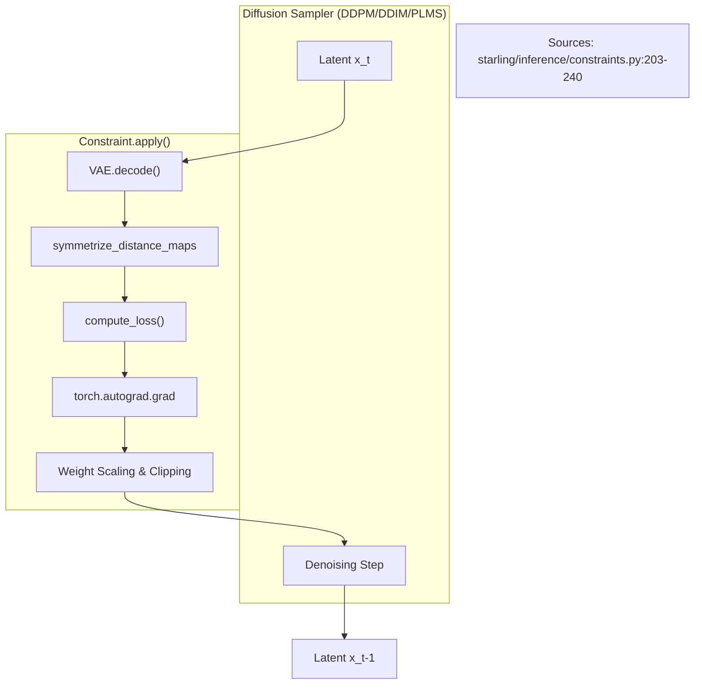
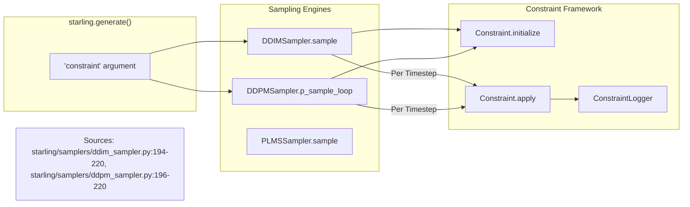

# Constrained Generation

<details>
<summary>Relevant source files</summary>

The following files were used as context for generating this wiki page:

- [demos/basic_usage.ipynb](demos/basic_usage.ipynb)
- [demos/constraining_ensembles.ipynb](demos/constraining_ensembles.ipynb)
- [demos/structural_ensemble.ipynb](demos/structural_ensemble.ipynb)
- [starling/inference/constraints.py](starling/inference/constraints.py)
- [starling/samplers/ddim_sampler.py](starling/samplers/ddim_sampler.py)
- [starling/samplers/ddpm_sampler.py](starling/samplers/ddpm_sampler.py)
- [starling/samplers/plms_sampler.py](starling/samplers/plms_sampler.py)
- [starling/tests/test_sequence_encoder_backend.py](starling/tests/test_sequence_encoder_backend.py)
- [starling/tests/test_sequence_encoder_backend_integration.py](starling/tests/test_sequence_encoder_backend_integration.py)

</details>


Constrained generation in STARLING allows for guided diffusion sampling where the generative process is steered toward specific physical or structural properties. This is achieved by injecting gradients from differentiable potential functions (constraints) into the latent space during the denoising steps of the diffusion samplers (DDPM, DDIM, or PLMS).

## Constraint Framework Architecture

The framework is built around the abstract `Constraint` base class, which defines the lifecycle and scheduling for guidance.

### Core Lifecycle
1.  **Initialization**: The sampler calls `initialize()` to provide the constraint with the VAE encoder, latent scaling factors, and sequence information [starling/inference/constraints.py:84-94]().
2.  **Scheduling**: Guidance strength is modulated by time-dependent schedules (e.g., `cosine_weight`, `bell_shaped_schedule`) [starling/inference/constraints.py:116-157]().
3.  **Application**: During each denoising step, the `apply()` method decodes the current latents into a distance map, computes a loss, calculates the gradient of that loss with respect to the latents, and updates the latents [starling/inference/constraints.py:203-240]().

### Guidance Logic Data Flow

The following diagram illustrates how a constraint interacts with the diffusion sampler and the VAE decoder to steer the generation.

**Figure 1: Guided Diffusion Data Flow**


## Available Constraints

STARLING provides several built-in constraints for common structural tasks:

| Constraint | Purpose | Key Parameters |
| :--- | :--- | :--- |
| `DistanceConstraint` | Sets target distance between two residues | `resid1`, `resid2`, `target` |
| `RgConstraint` | Guides the global Radius of Gyration | `target`, `force_constant` |
| `ReConstraint` | Guides the end-to-end distance | `target` |
| `HelicityConstraint` | Encourages alpha-helical character in a range | `start_res`, `end_res` |
| `BondConstraint` | Enforces physical peptide bond distances ($|i - (i+1)| \approx 3.8\text{\AA}$) | `force_constant` |
| `StericClashConstraint` | Penalizes distances below a threshold (flat-bottom) | `threshold`, `force_constant` |
| `MultiConstraint` | Combines multiple constraints into one | `constraints` (list) |

### Implementation Details

*   **Symmetrization**: Since the VAE produces raw maps, `symmetrize_distance_maps` is called to ensure $D_{ij} = D_{ji}$ and $D_{ii} = 0$ before loss calculation [starling/inference/constraints.py:12-38]().
*   **Adaptive Clipping**: To prevent gradient explosions, `get_adaptive_clip_threshold` provides a cosine-decaying threshold that allows larger adjustments early in the diffusion process and finer refinements later [starling/inference/constraints.py:159-183]().
*   **Flat-Bottom Potentials**: Many constraints use a flat-bottom approach where the loss is zero if the value is within a certain range (e.g., `StericClashConstraint`).

**Sources:** [starling/inference/constraints.py:41-240](), [starling/samplers/ddim_sampler.py:194-206]()

## Constraint Integration in Samplers

The constraint logic is hooked into the `sample` (DDIM/PLMS) or `p_sample_loop` (DDPM) methods.

### Sampler-to-Code Mapping

**Figure 2: Sampler Constraint Hook Association**


### Constraint Logging
The `ConstraintLogger` tracks the loss values across diffusion timesteps. If `verbose=True` is passed to the constraint, it will print step-by-step guidance metrics [starling/inference/constraints.py:195-200]().

## Usage Example

Constraints are passed directly to the `generate` function. Multiple constraints can be combined using `MultiConstraint`.

```python
from starling.inference.constraints import RgConstraint, DistanceConstraint, MultiConstraint
import starling

# Define individual constraints
rg = RgConstraint(target=35.0, force_constant=0.5)
dist = DistanceConstraint(resid1=10, resid2=50, target=20.0)

# Combine them
my_constraints = MultiConstraint([rg, dist])

# Generate
ensemble = starling.generate(
    "ACDEF...", 
    constraint=my_constraints,
    steps=25
)
```

**Sources:** [demos/constraining_ensembles.ipynb:80-98](), [starling/inference/constraints.py:532-560]()

---