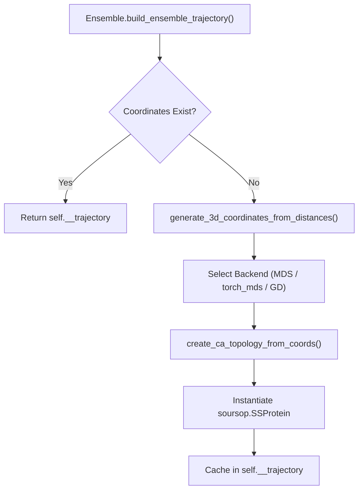
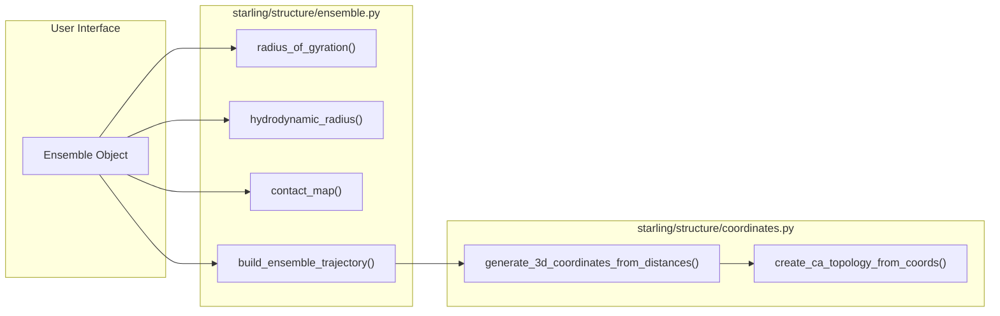

# Ensemble Analysis Methods

Relevant source files

The following files were used as context for generating this wiki page:

- [demos/basic_usage.ipynb](demos/basic_usage.ipynb)
- [demos/constraining_ensembles.ipynb](demos/constraining_ensembles.ipynb)
- [demos/structural_ensemble.ipynb](demos/structural_ensemble.ipynb)
- [starling/structure/coordinates.py](starling/structure/coordinates.py)
- [starling/structure/ensemble.py](starling/structure/ensemble.py)

The `Ensemble` class serves as the primary data container and analysis engine within STARLING [starling/structure/ensemble.py:42-75](). It is designed to store symmetrized distance maps and sequence information, providing lazy-evaluated methods for biophysical observables such as radius of gyration, hydrodynamic radius, and contact maps [starling/structure/ensemble.py:11-15]().

## Core Data Structures and Initialization

An `Ensemble` instance is typically created via the `generate()` API or by loading a `.starling` file [starling/structure/ensemble.py:19-22](). Upon initialization, it performs sanity checks to ensure distance maps are square, symmetrized, and match the provided sequence length [starling/structure/ensemble.py:151-174]().

### Ensemble Internal State
| Attribute | Type | Description |
| :--- | :--- | :--- |
| `__distance_maps` | `np.ndarray` | Shape `(n_conformations, n_res, n_res)` [starling/structure/ensemble.py:100](). |
| `sequence` | `str` | The amino acid sequence [starling/structure/ensemble.py:101](). |
| `__trajectory` | `SSProtein` | Optional `soursop` trajectory for 3D coordinates [starling/structure/ensemble.py:114-121](). |
| `__rg_vals` | `list` | Cached Radius of Gyration values [starling/structure/ensemble.py:106](). |
| `__rh_vals` | `list` | Cached Hydrodynamic Radius values [starling/structure/ensemble.py:107](). |

**Sources:** [starling/structure/ensemble.py:77-130]()

## Biophysical Analysis Methods

The `Ensemble` class implements several methods to derive structural properties directly from the distance maps.

### Radius of Gyration ($R_g$)
Calculated using the pairwise distance formula:
$$R_g = \sqrt{\frac{1}{2N^2} \sum_{i,j} r_{ij}^2}$$
The implementation in `radius_of_gyration()` computes this across all conformations [starling/structure/ensemble.py:348-378]().

### Hydrodynamic Radius ($R_h$)
STARLING supports two modes for $R_h$ calculation via `hydrodynamic_radius()` [starling/structure/ensemble.py:380-435]():
1.  **Nygaard**: Uses the empirical scaling relationship derived by Nygaard et al. [starling/structure/ensemble.py:406]().
2.  **Kirkwood-Riseman**: A more theoretical approach based on the Kirkwood-Riseman theory for polymer chains [starling/structure/ensemble.py:408]().

### Contact Maps and Pairwise Distances
*   **`contact_map(threshold=8.0)`**: Returns a boolean mask of residue pairs within the specified Angstrom threshold [starling/structure/ensemble.py:437-466]().
*   **`rij(i, j)`**: Extracts the distribution of distances between residue $i$ and residue $j$ across the ensemble [starling/structure/ensemble.py:468-500]().
*   **`end_to_end_distance()`**: A convenience wrapper for `rij(0, n-1)` [starling/structure/ensemble.py:502-523]().

**Sources:** [starling/structure/ensemble.py:348-523]()

## 3D Trajectory Reconstruction

While STARLING primarily operates in distance-map space, it can reconstruct 3D Cartesian coordinates using Multidimensional Scaling (MDS).

### Reconstruction Workflow
The `build_ensemble_trajectory()` method triggers the reconstruction process [starling/structure/ensemble.py:654-716](). It utilizes backends defined in `starling.structure.coordinates` [starling/structure/coordinates.py:1-13]().

**Trajectory Generation Logic**

### MDS Backends
1.  **Classical MDS**: Uses `sklearn.manifold.MDS` [starling/structure/coordinates.py:9]().
2.  **torch_mds**: A batched SMACOF (Scaling by Majorizing a Complicated Function) implementation for GPUs [starling/structure/coordinates.py:123-230]().
3.  **Gradient Descent**: A PyTorch-based optimizer that minimizes the MSE between target and computed distances [starling/structure/coordinates.py:233-356]().

**Sources:** [starling/structure/ensemble.py:654-716](), [starling/structure/coordinates.py:123-356]()

## Error Checking and Diagnostics

The `check_for_errors()` method scans the ensemble for physical inconsistencies [starling/structure/ensemble.py:181-267]().

*   **Logic**: It identifies frames where residue distances violate physical constraints (e.g., $C_\alpha - C_\alpha$ distances significantly deviating from ~3.8 Å for adjacent residues) [starling/structure/ensemble.py:185-187]().
*   **Filtering**: If `remove_errors=True`, the method prunes the `__distance_maps` array and invalidates the cached trajectory to ensure data integrity [starling/structure/ensemble.py:236-258]().

**Sources:** [starling/structure/ensemble.py:181-267]()

## Data Flow: Analysis to Visualization

This diagram maps the natural language request for analysis to the internal code entities.

**Analysis Data Flow**

**Sources:** [starling/structure/ensemble.py:348-716](), [starling/structure/coordinates.py:359-450]()

---